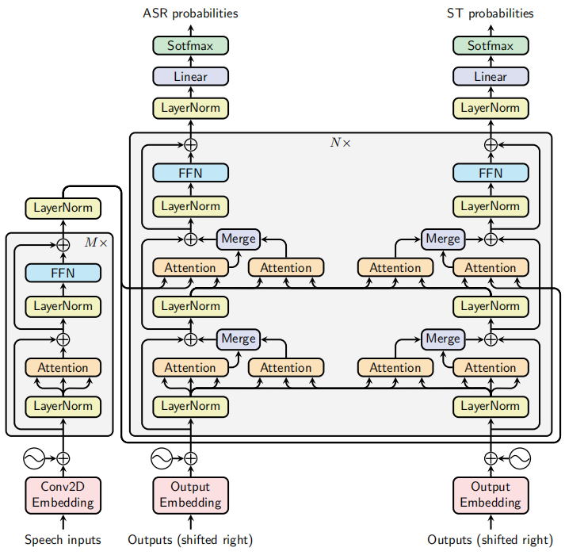
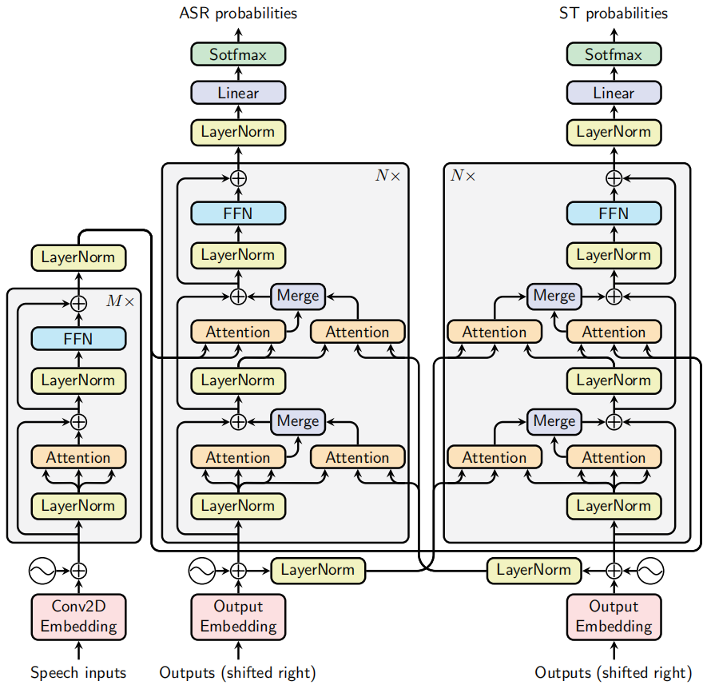
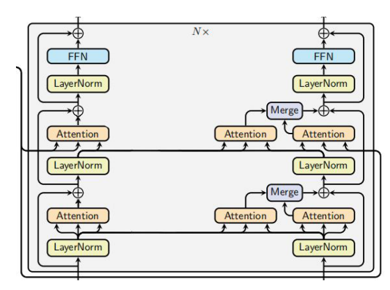
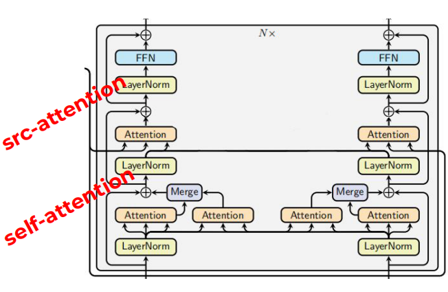
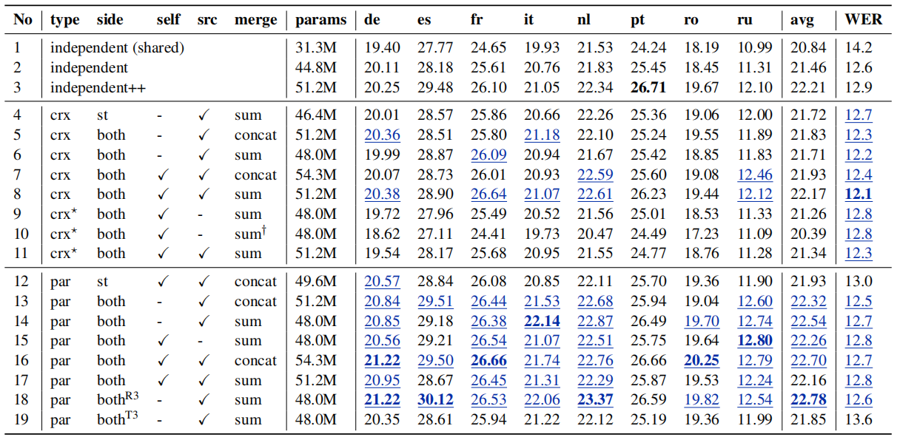
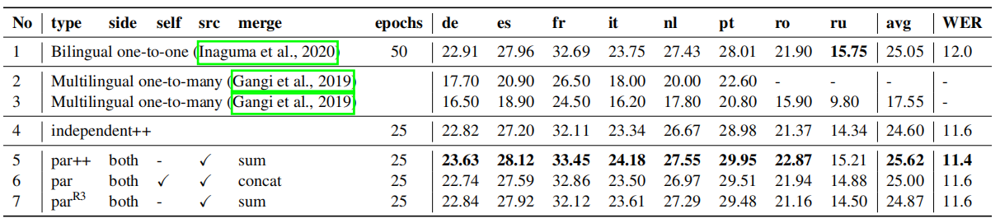

Dual-decoder Transformer is a
[Transformer](https://anwarvic.github.io/machine-translation/Transformer)
architecture that consists of two decoders; one responsible for
Automatic Speech Recognition (ASR) while the other is responsible for
Speech Translation (ST). This model was proposed by FAIR and Grenoble
Alpes University in 2020 and published in this paper: [Dual-decoder
Transformer for Joint Automatic Speech Recognition and Multilingual
Speech Translation](https://arxiv.org/pdf/2011.00747.pdf). The official
code of this paper can be found in the following GitHub repository:
[speech-translation](https://github.com/formiel/speech-translation).

The intuition behind it is that having different decoders specialized in
different tasks may produce better results. In addition, these two tasks
are complementary and can allow the decoders to help each other via a
novel <u><strong>dual-attention mechanism</strong></u> where decoders attend to each
other beside attending to the encoder.

Dual-decoder
------------

Given an input sequence of speech features
$x = \left( x_{1},\ x_{2},\ ...x_{T_{x}} \right)$ in a specific source
language, the dual-decoder model outputs a transcription
$y = \left( y_{1},\ y_{2},\ ...y_{T_{y}} \right)$ in the same language
as the input and a translation
$z = \left( z_{1},\ z_{2},\ ...z_{T_{z}} \right)$ in $M$ different
target languages. In the following equations, we are considering $M = 1$
for simplicity:

$$h_{s}^{y},\ h_{t}^{z} = \text{Decoder}_{\text{dual}}\left( y_{< s},\ z_{< t},\ \text{Encoder}\left( x \right) \right)$$

$${\widehat{y}}_{s} = \underset{y_{s}}{\arg\max}\left( p\left( y_{s} \middle| y_{< s},\ z_{< t},\ x \right) \right) = \underset{y_{s}}{\arg\max}\left( \text{softmax}\left( W^{y}h_{s}^{y} + b^{y} \right) \right)$$

$${\widehat{z}}_{t} = \underset{z_{t}}{\arg\max}\left( p\left( z_{t} \middle| y_{< s},\ z_{< t},\ x \right) \right) = \underset{z_{t}}{\arg\max}\left( \text{softmax}\left( W^{z}h_{t}^{z} + b^{z} \right) \right)$$

The dual-decoder transformer jointly predicts the transcript and
translation in an autoregressive (left-to-right) fashion according to
the following formula:

$$p\left( y,z \middle| x \right) = \prod_{t = 0}^{\max\left( T_{y},\ T_{z} \right)}{p\left( y_{t} \middle| y_{< t},\ z_{< t},\ x \right).p\left( z_{t} \middle| y_{< t},\ z_{< t},\ x \right)}$$

In the previous equation, we assumed that the two decoders start at the
same time. In practice, one might advance $k$ steps compared to the
other which is known as the <u><strong>wait-k policy</strong></u>. For example, if ST
waits for ASR to produce its first $k$ tokens, then the joint
distribution becomes:

$$p\left( y,z \middle| x \right) = p\left( y_{< k} \middle| x \right).p\left( y_{\geq k},z \middle| y_{< k},\ x \right)$$

$$= \prod_{t = 0}^{k - 1}{p\left( y_{< k} \middle| x \right)}.\prod_{t = 0}^{\max\left( T_{y} - k,\ T_{z} \right)}{p\left( y_{t + k} \middle| y_{< t + k},\ z_{< t},\ x \right)\text{.p}\left( z_{t} \middle| y_{< t + k},\ z_{< t},\ x \right)}$$

In this paper, they proposed two different architectures for the
dual-decoder: <u><strong>Parallel Dual decoder</strong></u> and <u><strong>Cross
Dual-decoder</strong></u>. Both are using a different attention mechanism
than the one used in the original transformer paper. The new mechanism
is called "dual-attention". In the next part, we are going to discuss
all these details.

### Parallel Dual-decoder

In parallel dual-decoder, each decoder uses the hidden states of the
other to compute its outputs, as illustrated in the following figure.
The encoder used is almost the same as the encoder of the original
[Transformer](https://anwarvic.github.io/machine-translation/Transformer)
except that the embedding layer; it is a small convolutional neural
network (CNN) of two layers with ReLU activations and a stride of 2,
which reduces the input length by 4.

    

The dual-attention layer receives $Q$ from the main branch and $K,\ V$
from the other decoder at the same level/depth.

### Cross Dual-decoder

In cross dual-decoder, each decoder uses the hidden states of the other
to compute its outputs, as illustrated in the following figure. The
encoder used is almost the same as the encoder of the original
[Transformer](https://anwarvic.github.io/machine-translation/Transformer)
except that the embedding layer; it is a small convolutional neural
network (CNN) of two layers with ReLU activations and a stride of 2,
which reduces the input length by 4.

    

The dual-attention layer receives $Q$ from the main branch and $K,\ V$
from the other decoder at the same lower depth.

> **Note:**\
The only difference between parallel and cross dual-decoder is how to
get $K,\ V$ vectors. Parallel uses the other decoder at the same level
while cross uses the other decoder at the lower level. Thanks to that,
each prediction step can be performed separately on the two decoders of
the cross dual-decoder which decompose the dual-decoder formula
discussed earlier to:
>
> $$h_{s}^{y} = \text{Decoder}_{\text{asr}}\left( y_{< s},\ z_{< t},\ \text{Encoder}\left( x \right) \right) \in \mathbb{R}^{d_{y}}$$
>
> $$\ h_{t}^{z} = \text{Decoder}_{\text{st}}\left( y_{< s},\ z_{< t},\ \text{Encoder}\left( x \right) \right) \in \mathbb{R}^{d_{z}}$$

### Other Variants

In this section, we are going to talk about different variants of the
dual-decoder Transformers used in the paper's experiments:

-   <u><strong>Asymmetric dual-decoder:</strong></u>\
    Instead of using all the dual-attention layers, one may want to
    allow a one-way attention: either ASR attends ST or the inverse, but
    not both. For example, ASR attends to ST in the following parallel
    decoder:

    

-   <u><strong>At-self / At-source dual-attention:</strong></u>\
    In each decoder block, there are two different attention layers,
    which we respectively call self-attention (bottom) and
    source-attention (top). They tried to use either the bottom one
    which is called "at-self dual decoder" or the top one which is
    called "at-source dual decoder". The following figure is "at-self"
    parallel dual decoder:

    

### Merge Operator

The Merge operator, shown in the previous two figures, combine the
outputs of the main attention $H_{\text{main}}$ and the dual-attention
$H_{\text{dual}}$:

$$H_{\text{out}} = \text{Merge}\left( H_{\text{main}},\ H_{\text{dual}} \right)$$

In the paper, they experimented two different merging operators:

-   <u><strong>Weighted sum:</strong></u>\
    Where $\lambda$ is a hyper-parameter that could be fixed or
    learnable.

$$H_{\text{out}} = H_{\text{main}} + \lambda H_{\text{dual}}$$

-   <u><strong>Concatenation:</strong></u>

$$H_{\text{out}} = \text{linear}\left( \left\lbrack H_{\text{main}};H_{\text{dual}} \right\rbrack \right)$$

Training & Decoding
-------------------

They trained the model using the following objective; which is a
weighted sum of the cross-entropy ASR and ST losses. They set
$\alpha = 3$ because they favor the speech translation since it's
difficult to train because of the multilinguality.

$$L\left( \widehat{y},\ \widehat{z},\ y,\ z \right) = \alpha L_{\text{asr}}\left( \widehat{y},\ y \right) + \left( 1 - \alpha \right)L_{\text{st}}\left( \widehat{z},\ z \right)$$

Training data is sorted by the length of the frame where each batch
contains roughly the same frame length from all languages. To
differentiate between languages, a language-specific token is prepended
to the target sentence.

When decoding, they use <u><strong>a single joint beam</strong></u> instead of using
one separate beam for each task. In this beam search strategy, each
hypothesis includes a tuple of ASR and ST sub-hypotheses. The two
sub-hypotheses are expanded together and the score is computed based on
the sum of log probabilities of the output token pairs.

$$s\left( y_{t},\ z_{t} \right) = \log\left( p\left( y_{t} \middle| y_{< t},\ z_{< t} \right) \right) + \log\left( p\left( z_{t} \middle| y_{< t},\ z_{< t} \right) \right)$$

> **Note:**\
One weakness of this beam approach is that it can happen that some
transcription ${\widehat{y}}_{t}$ has a dominant score that it is
selected for all the hypotheses while . In other words, we will have one
transcription with different translations.

Experiments & Results
---------------------

All the following experiments use the same model with a single12-layer
encoder and two 6-layer decoders on MuST-C dataset. Transcriptions and
translations were normalized and tokenized using the [Moses
tokenizer](https://github.com/moses-smt/mosesdecoder). The transcription
was lower-cased and the punctuation was stripped. A joint BPE with 8000
vocabulary was learned on the concatenation of the English transcription
and all target languages.

To extract features from the audio files, they used
[Kaldi](https://kaldi-asr.org/) to extract 83-dimensional features
(80-channel log Mel filter-bank coefficients and 3-dimensional pitch
features) which were normalized by the mean and standard deviation
computed on the training set. Finally, for decoding, they used a beam
size of $10$ with length penalty of $0.5$.

The following table shows the BLEU and WER scores of three main groups
on the MuST-C dev set. These three groups are **Independent** where
decoders don't share information knowing that **Independent++** uses
8-layer decoders instead of 6. **crx** is the Cross dual-decoder and
**par** is the Parallel dual-decoder. Also, the superscript **R3** means
that ASR is 3 steps ahead of ST, while **T3** means that ST is 3 steps
ahead of ASR.

    

Under the same configurations in the previous table, we can see that:

-   <u><strong>(line 5 vs. line 13) & (line 6 vs. line 14) &
(line 7 vs. line 16):</strong></u>\
    Parallel models outperform their cross counterparts in terms of
    translation. However, cross models outperform their parallel
    counterparts in terms of speech recognition.

-   <u><strong>(line 4 vs. line 6):</strong></u>\
    Symmetric cross models are the same as asymmetric cross models on
    translation but better on ASR.

-   <u><strong>(line 12 vs. line 16):</strong></u>\
    Symmetric parallel models are better than asymmetric parallel models
    on both tasks.

-   <u><strong>(line 14 vs. line 15):</strong></u>\
    At-source parallel models produces better results than the at-self
    counterparts.

-   <u><strong>(line 13 vs. line 14) & (line 16 vs. line 17):</strong></u>\
    The impact of merging operators is not consistent across
    different models. If we focus on the parallel dual-decoder, sum is
    better for models with only at-source attention. And concat is
    better for models using both at-self and at-source attention (line
    16 vs. line 17).

-   <u><strong>(line 18 vs. line 19):</strong></u>\
    Using wait-k policy on the ST is better (letting ASR ahead) is
    better than the opposite on parallel models with sum operator.

    The following table shows a comparison between this dual-decoder
    model and other existing models on MuST-C COMMON test set and we can
    see that **par++** achieves state-of-the-art results. The scores
    were calculated by averaging five checkpoints with the best
    validation accuracies on the dev sets.

    

The three variants used in the previous table are:

-   **par++**: is a parallel at-source dual-attention with sum merging
    operator where the decoder is 8 layers.

-   **par**: is both at-self and at-source dual-attentions with concat
    merging operator.

-   **par^R3^**: is a wait-k parallel model in which ASR is 3 steps
    ahead of ST
