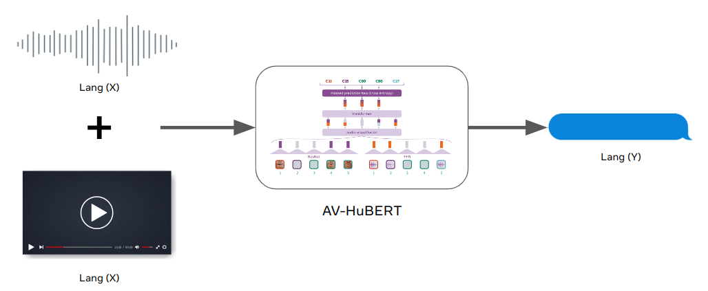
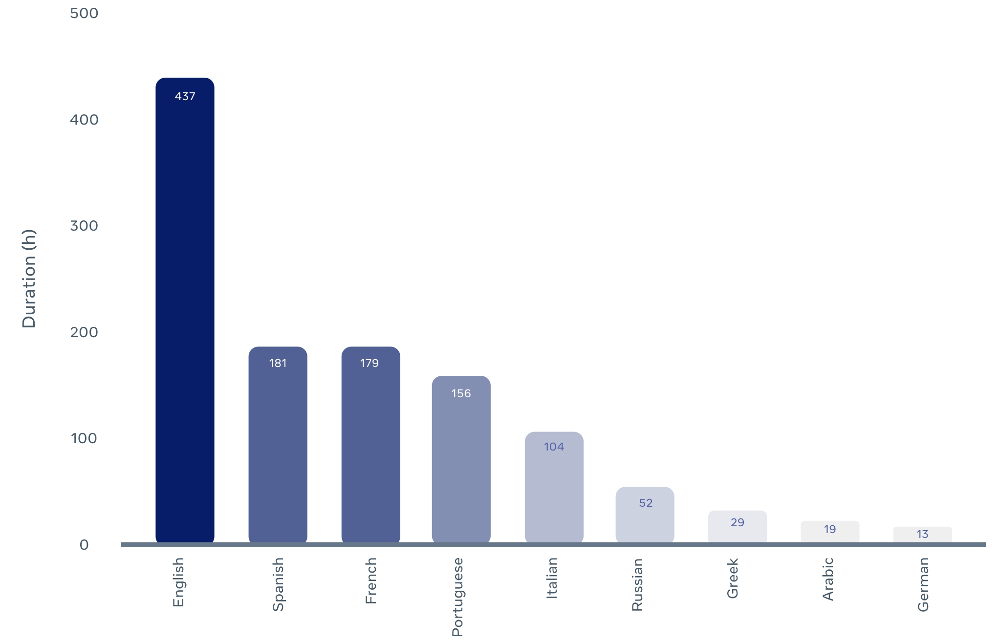
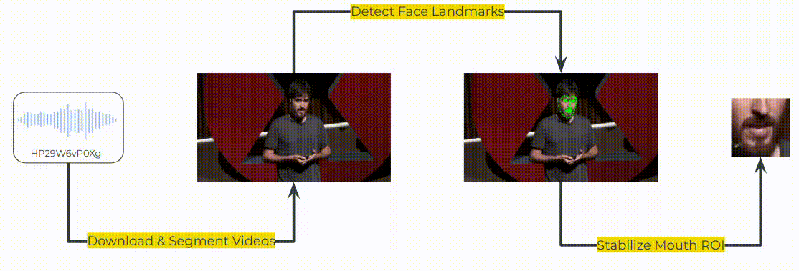

We introduce MuAViC, a multilingual audio-visual corpus for robust speech
recognition and robust speech-to-text translation providing 1200 hours of
audio-visual speech in 9 languages. It is fully transcribed and covers 6
English-to-X translation as well as 6 X-to-English translation directions. To
the best of our knowledge, this is the first open benchmark for audio-visual
speech-to-text translation and the largest open benchmark for multilingual
audio-visual speech recognition. Our baseline results show that MuAViC is
effective for building noise-robust speech recognition and translation models.
We make the corpus available at
[https://github.com/facebookresearch/muavic](https://github.com/facebookresearch/muavic).

    

## Download Dataset

    

## Demo

Try out our [interactive demo](https://github.com/facebookresearch/muavic/tree/main/demo):



## Methodology

To create en->x direction in MuAViC, we combined LRS3-TED dataset with TED2020 dataset
by matching the English transcripts in both:

    

To create x->en direction in MuAViC, we downloaded the TED talks from YouTube
based on the mTEDx talk-id:

    

## Paper Citation


