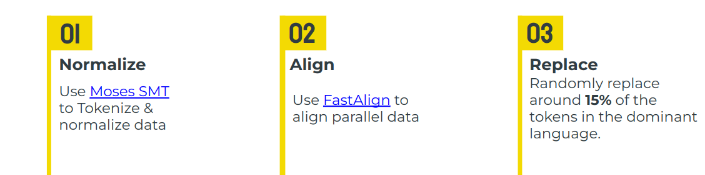
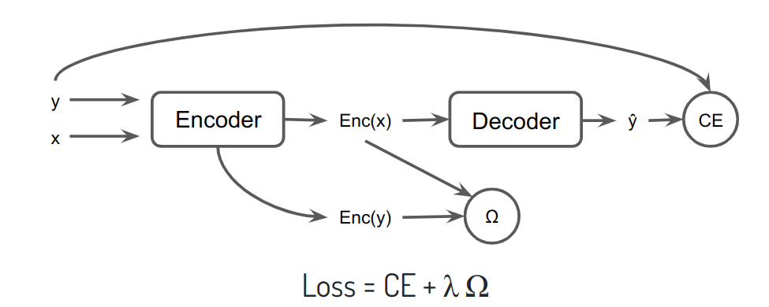

Bilingual machine translation permits training a single model that translates
monolingual sentences from one language to another. However, a model is not
truly bilingual unless it can translate back and forth in both language
directions it was trained on, along with translating code-switched sentences to
either language. We propose a true bilingual model trained on WMT14
English-French (En-Fr) dataset. For better use of parallel data, we generated
synthetic code-switched (CSW) data along with an alignment loss on the encoder
to align representations across languages. Our model strongly outperforms
bilingual baselines on CSW translation while maintaining quality for non-code
switched data. 

## Methodology

Generate realistic code-switching translation using the following method:

    

Use an alignment objective on the encoder side to create language-agnostic representations:

    

## Paper Citation


