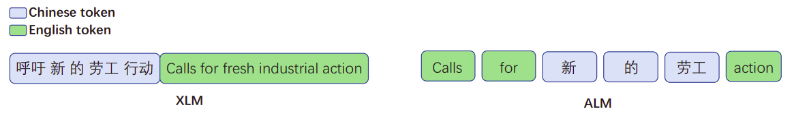
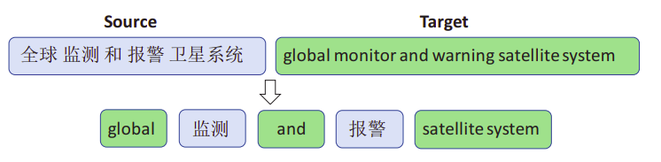
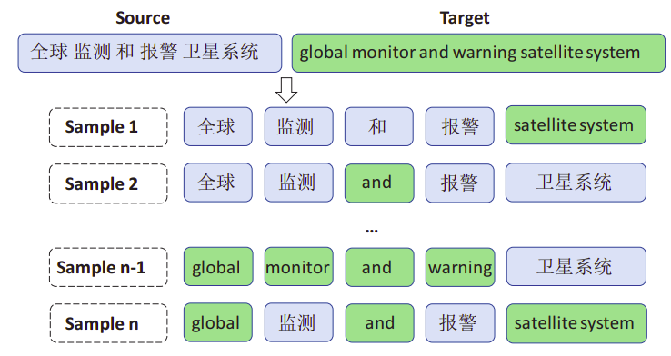
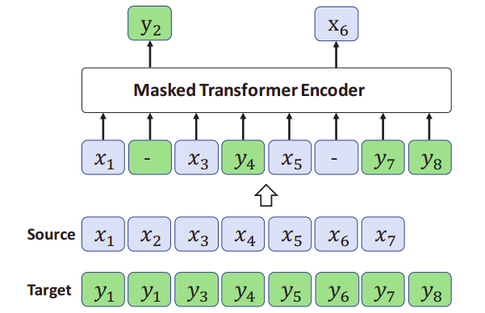
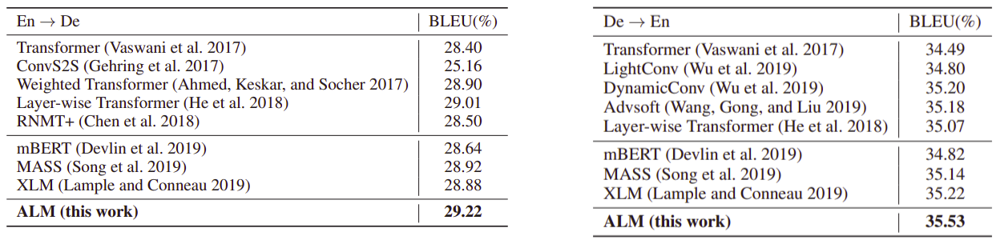

ALM stands for "Alternating Language Modeling" which is a novel
cross-lingual pre-training method proposed by Microsoft in 2021 and
published in their paper: [Alternating Language Modeling for Cross-Lingual
Pre-Training](https://ojs.aaai.org/index.php/AAAI/article/view/6480).
The official code for this paper can be found in the following
repository: [ALM]( https:/github.com/zddfunseeker/ALM).

The idea behind ALM is to predict one language conditioned on the
context of the other language which can minor the gap between the
embeddings of languages and that's very beneficial for the cross-lingual
setting. The following figure shows the difference between ALM and XLM.
In ALM, the input sequence of ALM is mixed with different languages.

    

Code-Switching
--------------

Given a bilingual sentence pair $\left( X,Y \right)$ with the source
sentence $X = \left\\{ x_{1},\ x_{2},\ ...x_{N} \right\\}$ and the target
translation $Y = \left\\{ y_{1},\ y_{2},\ ...y_{M} \right\\}$, where $N$
and $M$ are the lengths of the source and target sentences respectively,
a code-switched sentence $U = \left\\{ u_{1},\ u_{2},\ ...x_{L} \right\\}$
of length $L$ is composed of phrases from $X$ and $Y$.

For each phrase $u_{\left\lbrack i:j \right\rbrack}$, it comes from
either the source sentence
$x_{\left\lbrack a:b \right\rbrack},\ 1 \leq a \leq b \leq N$ or the
target sentence
$y_{\left\lbrack c:d \right\rbrack},\ 1 \leq c \leq d \leq N$ where the
constraint is that these two phrases are the linguistic translation
counterpart in the parallel sentence $\left( X,Y \right)$. The following
figure shows different examples of code-switched data between English
and Chinese:

    

When most of the code-switched sequence $U$ is derived from $X$, this
sample is called **major-source-language** sample. When most of the
code-switched sequence $U$ is derived from $Y$, this sample is called
**major-target-language**.

Due to the scarcity of natural code-switched sentences, the researchers
had to construct them from bilingual sentence pairs. They did that by
following these steps:

-   First, they performed word alignment with the GIZA toolkit between
    the parallel sentences, and extract a bilingual phrase table using
    statistical machine translation techniques.

-   Then, for each sentence pair in training corpus, they created the
    **major-source-language** samples by substituting some phrases in
    source sentence with the corresponding target phrases with highest
    probabilities in phrase table. And same for
    **major-target-language**, they substituted some phrases in target
    sentence with the corresponding source phrases.

-   Each phrase is limited to less than 5 words for both source language
    and target language. And the substituted words are less than 30% of
    the total words in the sentence.

-   Each bilingual sentence pair is used to create multiple alternating
    language sentences by randomly choosing the substituted phrases as
    shown in the following figure:

    

Pre-training
------------

ALM uses the encoder-part of the Transformer-base architecture with 1024
embedding and hidden units, 8 heads and learned positional embeddings.
During training, they used BPE with 95K sub-word tokens. They used Adam
optimizer with parameters of $\beta_{1} = 0.9$ and $\beta_{2} = 0.98$
accompanied with a dropout rate of $0.1$. They set the
inverse-square-root learning rate schedule with a linear warmup where
the number of warmup step is $4000$ and a learning rate of $0.0005$. The
batch size was set to $8192$ tokens. During decoding, they sued a beam
size of 8.

MLM was done like the following; Given a parallel sentence pair, they
combined two sentences from different languages into a single
code-switched sequence as described above. Then, they mask out a certain
percentage of words in the sequences and feed them into Transformer
model to learn to predict the words being masked out as shown in the
following figure:

    

Data used in pre-training was monolingual data from Wikipedia and
bilingual data from IWSLT14 German-to-English translation dataset. The
input sentences to the ALM model were $10\%$ from the source sentence
(without code-switching), $10\%$ from the target sentence (without
code-switching), and the rest $80\%$ were code-switched. MLM was applied
by randomly masking $15\%$ of the tokens using:

-   The \[MASK\] token $80\%$ of the time.

-   A random token $10\%$ of the time.

-   Keep them unchanged $10\%$ of the time.

Machine Translation
-------------------

After pre-training ALM on the MLM objective, they fine-tuned it on the
machine translation task. Using parallel data from WMT14 English-German
dataset and IWSLT14 German-English dataset, they used ALM as the encoder
of machine translation, and construct a Transformer-based decoder
initialized from the ALM. In other words, they fed the source language
into ALM, and generated the target language with decoder.

Fine-tuning was done with the Adam optimizer with a linear warmup as the
pre-training. The learning rates was tuned based on the performance on
the validation set which was $5 \times 10^{- 4}$ for IWSLT14
German-English dataset and $10^{- 3}$ for WMT14 English-German. Early
stopping was used.

The following figure shows the performance on the two datasets; the one
on the left shows the results of WMT14 and the one on the right shows
the results of IWSLT14. In both datasets, we can see that ALM
outperforms all other models:

    

