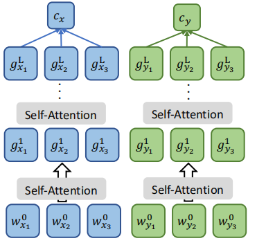
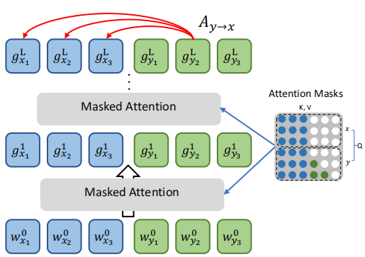
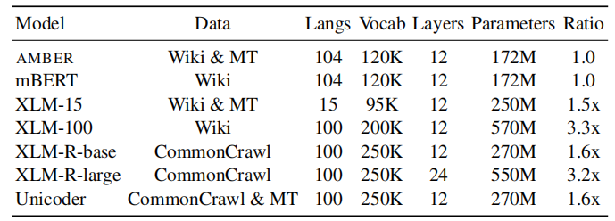
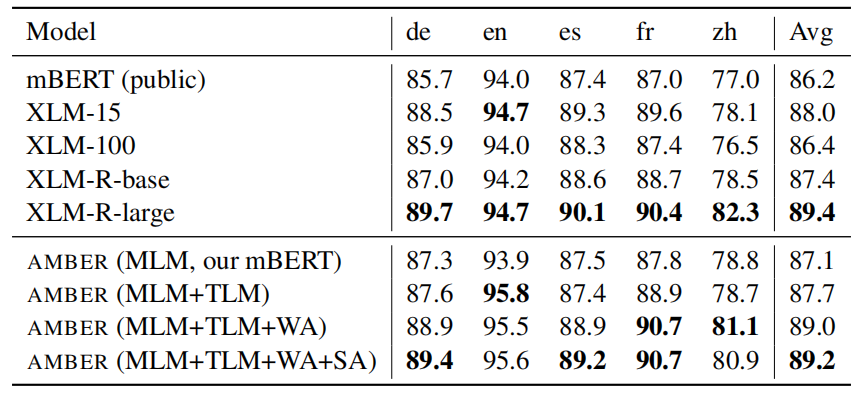
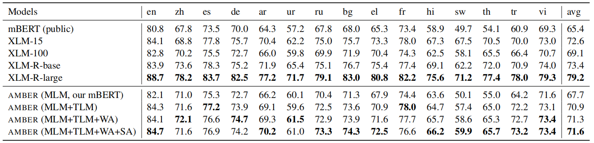
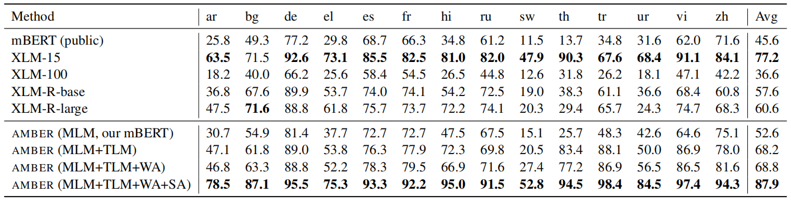
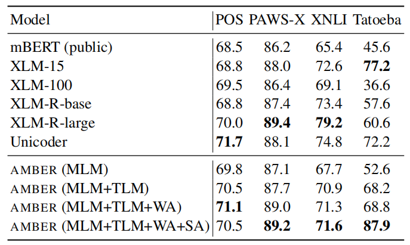

AMBER stands for "**A**ligned **M**ultilingual **B**idirectional
**E**ncode**R**" is a cross-lingual language model that adopts the same
architecture as BERT; where the contextual embeddings of words/sentences
with similar meanings across languages are aligned together in the same
space. AMBER was proposed by Google Research in collaboration with
Carnegie Mellon University in 2020 and published in their paper:
[Explicit Alignment Objectives for Multilingual Bidirectional
Encoders](https://arxiv.org/pdf/2010.07972.pdf). The official code for
this paper can be found in this GitHub repository:
[amber](https://github.com/junjiehu/amber).

Cross-lingual Alignment
-----------------------

To produce language-independent representations, AMBER was trained on
monolingual and parallel data using three alignment objectives that
align the multilingual word/sentence representations together. These
three alignment objectives are:

-   <u><strong>MLM or TLM:</strong></u>\
    This objective, proposed in
    [BERT](https://anwarvic.github.io/language-modeling/BERT), takes a
    pair of sentences $\left( x,y \right)$, and optimizes the prediction
    of randomly masked tokens in the concatenation of the sentence pair
    $\left\lbrack x;y \right\rbrack$. When $x$ and $y$ are in the same
    language, it's Masked Language Modeling (MLM). When they are in two
    different languages, it's Translation Language Modeling (TLM). This
    can be described as follows where
    $\left\lbrack x;y \right\rbrack_{s}$ is the masked tokens of the
    concatenation while $\left\lbrack x;y \right\rbrack_{\backslash s}$
    is the unmasked tokens:

$$\mathcal{L}_{\text{MLM}}\left( x,y \right) = - \mathbb{E}_{s\sim\left\lbrack 1,\left| \left\lbrack x;y \right\rbrack \right| \right\rbrack}\log\text{ P}\left( \left\lbrack x;y \right\rbrack_{s} \middle| \left\lbrack x;y \right\rbrack_{\backslash s} \right)$$

-   <u><strong>Sentence Alignment:</strong></u>\
    This objective encourages cross-lingual alignment of sentence
    representations. Given sentence pair $\left( x,y \right)$, we
    separately calculate sentence embeddings
    $\left( c_{x},\ c_{y} \right)$ where the sentence embeddings is
    calculated by averaging the embeddings in the final layer. Then the
    model tries to minimize the following loss function where $y'$ is
    any sentence in the mini-batch $\mathcal{B}$:

    

$$\mathcal{L}_{\text{SA}}\left( x,y \right) = - \log\ \frac{e^{c_{x}^{\intercal}c_{y}}}{\sum_{y' \in \mathcal{B}}^{}e^{c_{x}^{\intercal}c_{y'}}}$$

-   <u><strong>Bidirectional Word Alignment:</strong></u>\
    This objective encourages bidirectional alignment of word embeddings
    by leveraging the attention mechanism in the
    [Transformer](https://anwarvic.github.io/machine-translation/Transformer)
    model by minimizing the distance between the trace of the
    source-to-target attention $A_{x \rightarrow y}$ and
    target-to-source attention $A_{y \rightarrow x}$ matrices. Since the
    Transformer has multiple attention heads, we average the trace of
    the bidirectional attention matrices generated by all the heads as
    shown in the following formula:

    

$$\mathcal{L}_{\text{WA}}\left( x,y \right) = 1 - \frac{1}{H}\sum_{h = 1}^{H}\frac{\text{tr}\left( \left( A_{x \rightarrow y}^{h} \right)^{\intercal}\left( A_{y \rightarrow x}^{h} \right) \right)}{\min\left( \left| x \right|,\left| y \right| \right)}$$

They combined all three objectives to obtain the following total loss
function:

$$\mathcal{L}\left( x,y \right) = \mathcal{L}_{\text{MLM}}\left( x,y \right) + \mathcal{L}_{\text{SA}}\left( x,y \right) + \mathcal{L}_{\text{WA}}\left( x,y \right)$$

> **Notes:**
>
> - AMBER with just MLM objective is the same as
    [mBERT](https://anwarvic.github.io/cross-lingual-lm/mBERT).
> - Sentence Alignment objective is the same as
    [Additive Margin Softmax (AMS)](https://arxiv.org/pdf/1902.08564.pdf)
    where the margin is zero $(m=0)$.

Experiments
-----------

AMBER was pre-trained using MLM on the Wikipedia data for 1M steps first
using the default hyper-parameters as mBERT found
[here](https://github.com/google-research/bert) except that they used a
larger batch of 8,192 sentence pairs. Then, they pre-training it using
the other two objectives for another 1M steps with a batch of 2,048
sentence pairs from Wikipedia corpus and parallel corpus used to train
[XLM](https://anwarvic.github.io/cross-lingual-lm/XLM). As show in the
following table, shows the size of AMBER compared to other cross-lingual
models:

    

After pre-training, they fine-tuned AMBER on English annotations and
applied the model to predict on non-English data on the following tasks:

-   **POS:** Cross-lingual Part-Of-Speech (POS) benchmark which contains
    data in 13 languages. The following table shows that AMBER achieves
    similar results to XLM-R despite being half its size:

    

-   **PAWS-X:** is a paraphrase detection dataset in five different
    languages. The following table shows that AMBER achieving on-par
    results with XLM-R large despite the fact that AMBER is one-fifth of
    its size:

    

-   **XNLI:** is a natural language inference dataset in 15 languages.
    The following table shows that AMBER is not as good as XLM-R on this
    dataset, but achieving better results than XLM-100.

    

-   **Tatoeba:** is a sentence retrieval dataset in 14 different
    languages; where they try to find the English translation for a
    given a non-English sentence using maximum cosine similarity. The
    following table shows AMBER achieving the best results on this
    benchmark:

    

The following table summarizes the average results over all
languages for the past four benchmarks:

    

> **Note:**\
In all of the previous dataset, AMBER (MLM) is achieving better results than
mBERT despite having the same architecture because AMBER uses bigger batch
sizes which is proven to be efficient as explain in
[RoBERTa](https://anwarvic.github.io/language-modeling/RoBERTa) paper.
