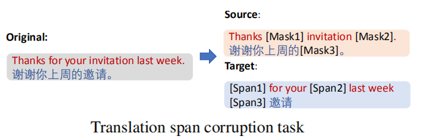

DeltaLM (∆LM) is a pre-trained multilingual encoder-decoder model whose
encoder and decoder are initialized with a pre-trained multilingual
encoder, and trained in a self-supervised way. DeltaLM was proposed by
Microsoft in 2021 and published in their paper: "[∆LM: Encoder-Decoder
Pre-training for Language Generation and Translation by Augmenting
Pretrained Multilingual
Encoders](https://arxiv.org/pdf/2106.13736.pdf)". The official code for
this paper can be found on Microsoft's GitHub repository:
[microsoft/deltalm](https://github.com/microsoft/unilm/tree/master/deltalm).

    

In the paper, they decided to use
[InfoXLM](https://anwarvic.github.io/cross-lingual-lm/InfoXLM) as the
pre-trained Multilingual encoder to take advantage of its strong
performance. InfoXLM uses the large-scale monolingual data and bilingual
data and is jointly trained with a combination of the masked language
model (MLM), translation language model (TLM), and cross-lingual
contrast (XLCO) objectives. It has a shared vocabulary of 250,000 tokens
based on the SentencePiece model.

One challenge is how to initialize the decoder since the architecture of
the decoder is different from that of the encoder. To overcome this
problem, they introduced a new architecture for the decoder and called
it "interleaved decoder". This new architect has a more consistent
structure with the encoder. In this way, the decoder can fully leverage
all weights of the pre-trained encoder.

Interleaved Decoder
-------------------

As shown at the middle of the following figure, the standard
[Transformer](https://anwarvic.github.io/machine-translation/Transformer)
decoder consists of three modules: self-attention, cross-attention, and
feed-forward network (FFN). In
[XLM](https://anwarvic.github.io/cross-lingual-lm/XLM) model, they
initialized the self-attention and the FFN with the weights of the
pre-trained encoder, while the cross-attention is initialized with
either random weights or the same weights as the self-attention.
However, to better leverage the full weights of the pre-trained encoder,
they proposed a new-yet-similar architecture as seen on the right side
of the following figure:

    

In the interleaved decoder, they interleaved the FFNs and the attention
modules, so that the structure is consistent with the pre-trained
encoder at the first part and similar to the decoder at the second part.
The residual connections and the layer normalizations were performed in
each sub-layers in the same way as vanilla Transformer layers.

Now, with the interleaved structure, the decoder can be directly
initialized with the pre-trained encoder. More specifically, the
self-attentions and the bottom FFNs can be initialized using the odd
layers of the InfoXLM pre-trained model, while the cross-attentions and
the top FFNs can be initialized with the corresponding even layers.

Pre-training
------------

∆LM was pre-trained using 6TB multilingual data, which is a combination
of CC100, CC-Net, and Wikipedia, covering 100 languages. Also, it was
pre-trained using 88GB of bilingual data from CCAligned and OPUS, which
has 77 languages. DeltaLM was pre-trained on two pre-training tasks:

-   <u><strong>Span Corruption:</strong></u>\
    As shown in the following figure, span corruption is the task of
    reconstructing the text spans based on the masked input sentence. It
    is proven to be effective for pre-training an encoder-decoder model.
    In this work, they followed
    [mT5](https://anwarvic.github.io/cross-lingual-lm/mT5) model to
    apply this pre-training task to pre-train ∆LM on large-scale
    monolingual corpora.

    

-   <u><strong>Translation Span Corruption:</strong></u>\
    As shown in the following figure, two parallel sentences are
    concatenated together, then masked. And the model will have to
    figure out the text spans based on the input masked translation
    pair. In this work, they followed
    [mT6](https://anwarvic.github.io/cross-lingual-lm/mT6) model to
    leverage large-scale bilingual corpora

    

DeltaLM was pre-trained the model for $600,000$ steps with $2,048$ samples per
batch and the input length was $512$ tokens. For the span corruption task, the
probability of corrupted tokens is $15\%$ and the average length of spans is
$3$. For the translation span corruption, the probability of corrupted tokens
is $50\%$ and the span length is $3$.

Results
-------

In this paper, they were considering the base-size Transformer model,
with $768$ hidden size, $3,072$ FFN dimension, $12$ attention heads, and
12 encoder/decoder layers. As said before, DeltaLM was initialized using
InfoXLM-BASE. They used the Adam optimizer with
$\beta_{1} = 0.9,\ \beta_{2} = 0.999$ with a linear learning rate
scheduler with $10,000$ warm-up steps. A gradient clipping of $1.0$ was
used.

-   **Machine Translation:** They evaluated the models on the
    large-scale WMT-10 benchmark dataset which is a collection of 32.5
    million parallel data in English (En), French (Fr), Czech (Cs),
    German (De), Finnish (Fi), Latvian (Lv), Estonian (Et), Romanian
    (Ro), Hindi (Hi), Turkish (Tr) and Gujarati (Gu). The evaluation was
    done on the test dataset:

    

-   **Question Generation:** this task takes an answer and the
    corresponding passage as the input and generates the related
    question. They used the Chinese XQG dataset where they split into
    135k/5k/3k samples as the training/validation/test sets.

    

-   **Abstractive Text Summarization:** this task produces the main
    points of the input documents with new brief sentences. They used
    the French XGiga where it's split ito 500k/5k/5k pairs for
    training/validation/test, respectively.

    

-   **Cross-lingual Text Summarization:** This task aims to generate the
    summary of the input document in different languages. They used
    WikiLingua dataset which is a large-scale multilingual dataset with
    about 770k article-summary pairs.

    

-   **Cross-lingual Data-to-text Generation:** This task requires an
    input of multiple triplets and generates a natural description based
    on the input data. They used WebNLG dataset which is a bilingual
    dataset of parallel DBpedia triple sets and short texts. The
    language directions are English-English and English-Russian. It
    contains about 17k triple sets and 45k short texts in English as
    well as 7k triple sets and 19k texts in Russian.

    

-   **Zero-shot Abstractive Summarization:** They trained the model on
    the English-English training set and evaluate it on the
    French-French and Chinese-Chinese test sets. They used XGiga dataset
    where the training data consists of 50k text-summary pairs, while
    both the validation and test sets have 5k samples.

    

