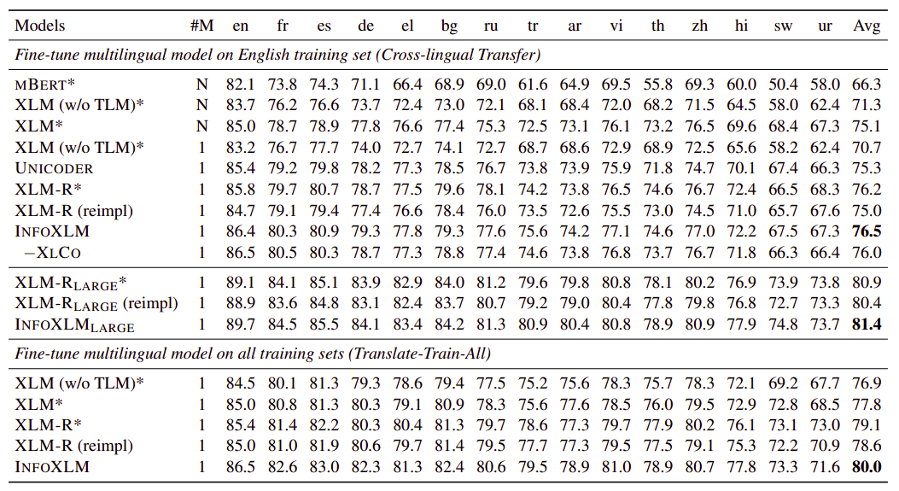

InfoXLM stands for "**Info**rmation-theoretic procedure for
Cross-Lingual Modeling" which is a cross-lingual language model proposed
by Microsoft in 2020 and published in their paper: [InfoXLM: An
Information-Theoretic Framework for Cross-Lingual Language Model
Pre-Training](https://arxiv.org/pdf/2007.07834.pdf). The official code
for this paper can be found in Microsoft's official UniLM GitHub repository:
[unilm/infoxlm](https://github.com/microsoft/unilm/tree/master/infoxlm).

State-of-the-art cross-lingual pre-trained models are typically built
using monolingual data with masked language modeling (MLM) objective
such as [BERT](https://anwarvic.github.io/language-modeling/BERT) and
[XLM-R](https://anwarvic.github.io/cross-lingual-lm/XLM-R); along side
bilingual data with Translation Language Modeling (TLM) objective such
as [XLM](https://anwarvic.github.io/cross-lingual-lm/XLM). InfoXLM
combines these two objectives with a novel objective called XLCO or
"Cross Lingual Contrast".

$$\mathcal{L} = \mathcal{L}_{\text{MLM}} + \mathcal{L}_{\text{TLM}} + \mathcal{L}_{\text{XLCO}}$$

> **Note to Reader**\
I think you should give the [XLM post](https://anwarvic.github.io/cross-lingual-lm/XLM)
a read before going on.

We know how to obtain MLM and TLM from XLM model:

$$\mathcal{L}_{\text{MLM}} = - \log\frac{\exp\left( \theta_{T}\left( c_{1} \right)^{T}\text{\ .\ }\theta_{E}\left( x_{1} \right) \right)}{\sum_{x' \in \mathcal{V}}^{}{\exp\left( \theta_{T}\left( c_{1} \right)^{T}\text{\ .\ }\theta_{E}\left( x' \right) \right)}}$$

$$\mathcal{L}_{\text{TLM}} = - \log\frac{\exp\left( \theta_{T}\left( c_{1} \right)^{T}\text{\ .\ }\theta_{E}\left( x_{1} \right) \right)}{\sum_{x' \in \mathcal{V}}^{}{\exp\left( \theta_{T}\left( c_{1} \right)^{T}\text{\ .\ }\theta_{E}\left( x' \right) \right)}}$$

$$\ \ \ \ \ \ \ \ \ \ \ \  - \log\frac{\exp\left( \theta_{T}\left( c_{2} \right)^{T}\text{\ .\ }\theta_{E}\left( x_{2} \right) \right)}{\sum_{x' \in \mathcal{V}}^{}{\exp\left( \theta_{T}\left( c_{2} \right)^{T}\text{\ .\ }\theta_{E}\left( x' \right) \right)}}$$

Where:

-   $x_{1}, x_{2}$ are the masked tokens.

-   $c_{1}, c_{2}$ are the corresponding contexts (the rest).

-   $\theta_{E}$ is a look-up function that returns the token
    embeddings.

-   $\theta_{T}$ is a Transformer that returns the final hidden vectors
    in position of $x_{1}$.

-   $\mathcal{V}$ is the vocabulary.

XLCO
----

XLCO stands for "Cross-lingual Contrast" which is a new objective for
pre-training cross-lingual language models inspired by the unified
information-theoretic framework. The goal of XLCO is to distinguish the
translation of an input sentence from a set of negative examples. The
formula of this objective is:

$$\mathcal{L}_{\text{XLCO}} = - \log\frac{\exp\left( \theta_{Q}\left( c_{1} \right)^{T}\text{\ .\ }\theta_{K}\left( c_{2} \right) \right)}{\sum_{c' \in \mathcal{N}}^{}{\exp\left( \theta_{Q}\left( c_{1} \right)^{T}\text{\ .\ }\theta_{K}\left( c' \right) \right)}}$$

Where:

-   $\theta_{Q}$ is the query encoder that encodes $c_{1}$ and is
    updated by back-propagation.

-   $\theta_{K}$ is the key encoder that encodes $\mathcal{N}$.

-   $\mathcal{N}$ is the negative examples distribution which is
    organized as a queue, where a newly encoded example is added while
    the oldest one is popped from the queue.

    The query encoder and the key encoder are initialized with the same
    parameters, and fill the queue with a set of encoded examples until
    it reaches the desired size $\left| \mathcal{N} \right|$. Notice
    that the size of the queue remains constant during training. In the
    paper, they used a queue of length equals to $131,072$.

### Mixup Contrast

Mixup Contrast is an augmentation method the researcher used when
applying XLCO task. It goes like this; for each parallel sentence
$\left\langle c_{1},\ c_{2} \right\rangle$, they concatenated it with a
randomly sampled translation pair
$\left\langle d_{1},\ d_{2} \right\rangle$ from another parallel corpus.
The two pairs are concatenated in a random order like
$\left\langle c_{1}d_{1},\ c_{2}d_{2} \right\rangle$ or
$\left\langle c_{1}d_{2},\ d_{1}c_{2} \right\rangle$. This method
encourages pre-trained models to learn sentence boundaries and to
distinguish the order of multilingual texts.

Results
-------

In this paper, the researchers followed the model configurations of
XLM-R when creating InfoXLM. InfoXLM~base~ used the Transformer
architecture with 12 layers and 768 hidden . InfoXLM~large~ used the
Transfoerm architecture with 24 layers and 1,024 hidden states.

Then, they initialized the parameters with XLM-R. The model was
optimized using Adam optimizer with a batch size of $2048$ for a total
of $150$K steps for InfoXLM~base~, and $200$K steps for InfoXLM~large~.
The learning rate is scheduled with a linear decay with $10$K warmup
steps, where the peak learning rate is set as $0.0002$ for
InfoXLM~base~, and $0.0001$ for InfoXLM~large~. The momentum coefficient
is set as $0.9999$ for InfoXLM~base~ and $0.999$ for InfoXLM~large~.
Then, they compared InfoXLM with:

-   mBERT which was pre-trained with MLM on Wikipedia in 102 languages

-   XLM which was pre-trained with both MLM and TLM tasks on Wikipedia
    in 100 languages

-   XLM-R which was pre-trained with MLM to the large CC-100 corpus in
    100 languages with much more training steps.

-   UNICODER which was initialized with XLM-R and they trained it using
    both MLM and TLM.

-   InfoXLM (without XLCO).

And the following table shows this comparison on XNLI using 15
different languages. The model number \#M=N indicates that each
language had a different model) while \#M=1 means only one model is
used for all languages. Also, results with "\*" are taken from this
[paper](https://arxiv.org/pdf/1911.02116.pdf) while "(reimpl)" means
that the researchers have re-implemented it. Results of InfoXLM and
XLM-R (reimpl) are averaged over five runs with different seeds:

    

The past results show that InfoXLM outperforms all baseline models on
the two evaluation settings of XNLI. Moreover, removing XLCO object
hurts the performance which shows that cross-lingual contrast is helpful
for zero-shot transfer in most languages.
