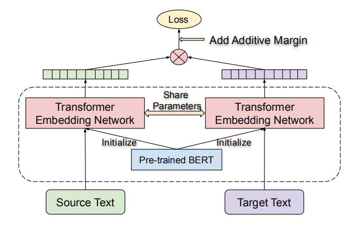
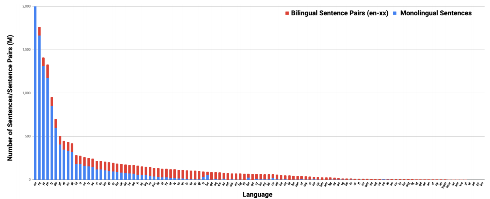
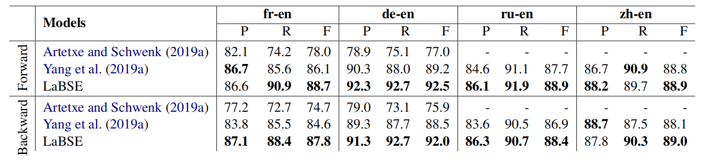
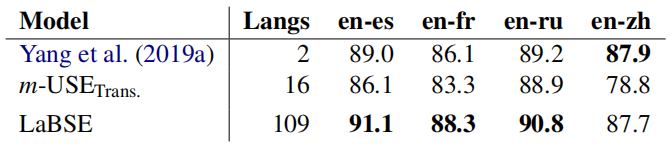
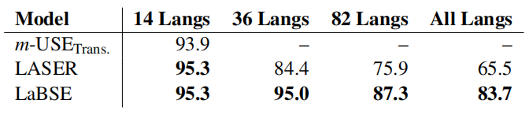

LaBSE stands for "Language-agnostic BERT Sentence Embedding" which is a
multilingual model the produces language-agnostic sentence embeddings
for 109 languages. LaBSE model was proposed by Google AI in 2020 and
published in this paper under the same name: [Language-agnostic BERT
Sentence Embedding](https://arxiv.org/pdf/2007.01852.pdf). The official
code for this paper can be found in the following TensorFlow Hub link:
[tfhub/LaBSE](https://tfhub.dev/google/LaBSE).

Mask language modeling (MLM) pre-training task, which was originally
proposed in the
[BERT](https://anwarvic.github.io/language-modeling/BERT) model, has
proven to be a powerful task for numerous NLP tasks. However, it doesn't
produce good sentence-level embeddings unless the model has been
fine-tuned on sentence-level benchmark. In this paper, the researchers
discuss combining
[mBERT](https://anwarvic.github.io/cross-lingual-lm/mBERT) with MLM and
translation language model (TLM) objectives.

LaBSE is a dual-encoder architecture initialized with BERT and
pre-trained on both MLM and TLM objectives. Source and target sentences
are encoded separately. The similarity between them is scored by the
cosine similarity. Sentence embeddings are extracted from the last
hidden state of the encoder \[CLS\] token, and additive margin softmax
loss is used for training.

    

LaBSE is trained using 3-stage [progressive stacking
algorithm](http://proceedings.mlr.press/v97/gong19a.html) where for an
$L$ layer transformer encoder, we first learn a $\frac{L}{4}$ layers
model and then $\frac{L}{2}$ layers and finally all $L$ layers. The
parameters of the models learned in the earlier stages are copied to the
models for the subsequent stages.

> **Note:**\
TLM objective was first proposed in the
[XLM](https://anwarvic.github.io/cross-lingual-lm/XLM) model. The only
difference here is that TLM doesn't use language codes to encourage
multilinguality.

Additive Margin Softmax
-----------------------

The loss function used for training the LaBSE model is the additive
margin softmax loss function which is described in the following
formula:

$$\mathcal{L} = - \frac{1}{N}\sum_{i = 1}^{N}\frac{e^{\phi\left( x_{i},\ y_{i} \right) - m}}{e^{\phi\left( x_{i},\ y_{i} \right) - m} + \sum_{n = 1,\ n \neq i}^{N}e^{\phi\left( x_{i},\ y_{n} \right)}}$$

Where $N$ is the number of sentences in the batch,
$\phi\left( x,\ y \right)$ is the embedding similarity of $x$ and $y$
which is set to $\text{cosine}\left( x,\ y \right)$, and $m$ is the
discount margin. What this loss function tries to achieve is to rank the
true translation $y_{i}$ of the input $x_{i}$ over all other $N - 1$
other alternatives in the batch even after discounting $m$ value from
the similarity.

Notice that this function is asymmetric and depends on whether the
softmax is over the source or the target. In bi-directional ranking, the
final loss function sums the source to target $\mathcal{L}$, and target
to source $\mathcal{L}'$ losses:

$$\overline{\mathcal{L}} = \mathcal{L} + \mathcal{L}'$$

Data
----

Regarding monolingual data, they used the 2019-35 version of
[CommonCrawl](https://commoncrawl.org) after removing lines \< 10
characters and those \> 5000 characters. Also, they used data from
Wikipedia extracted from the 05-21-2020 dump using
[WikiExtractor](https://github.com/attardi/wikiextractor). Finally, they
classified the monolingual sentences using an in-house quality
classifier which filters out any useless data. At the end, they had
around 17 billion monolingual sentences.

Regarding bilingual data, they mined the web pages using a bitext mining
system similar to the one used in this
[paper](https://dl.acm.org/citation.cfm?id=1873781.1873905). A small
subset from the extracted sentence pairs were evaluated by human
annotators where they marked the pairs as either GOOD or BAD
translations. Then, the extracted sentences were filtered by a
pre-trained contrastive-data-selection (CDS) scoring model similar to
the one used in this [paper](http://aclweb.org/anthology/W18-6314) where
threshold is chosen such that 80% of the retrained pairs from the manual
evaluation are rated as GOOD. The final corpus contains 6 billion
translation pairs.

The distribution of monolingual & bilingual sentences for each language
is shown in the following figure:

    

Experiments & Results
---------------------

In all of this paper experiments, they employed the [wordpiece
model](https://github.com/tensorflow/textblob/master/tools/wordpiece_vocab/generate_vocab.py)
where a new cased vocabulary is built of $501,153$ subwords from the all
data sources. The language smoothing exponent from the vocab generation
tool is set to $0.3$, as the distribution of data size for each language
is imbalanced.

The encoder architecture follows the BERT-Base model which uses 12
layers transformer with 12 heads and 768 hidden size. The encoder
parameters were shared for all languages. Sentence embeddings were taken
from the \[CLS\] token representation of the last layer, The final
embeddings were l2 normalized. Each encoder was initialized using a
pre-trained BERT model that was trained using a batch size of $8192$.
The max sequence length is set to $512$ and $20\%$ of tokens (or $80$
tokens at most) per sequence were masked the MLM and TLM predictions.

LaBSE was trained using the 3-stage [progressive stacking
algorithm](http://proceedings.mlr.press/v97/gong19a.html) that we talked
about earlier where the training steps for each stage were 400k, 800k,
1.8M steps. It used a batch size of 2048 with max sequence length 64 for
both of the source and target. The final models were trained 50K steps
(less than 1 epoch) using AdamW optimizer with initial learning rate
$1e^{- 5}$ and linear weight decay.

The following table shows the \[P\]recision, \[R\]ecall and \[F\]-score
of BUCC mining task. Following the original previous work, they
performed both of the forward search and backward search. Where forward
search treats English as the target and the other language as source,
backward is vice versa. As seen from the table, the LaBSE outperforms
the previous models in all languages. It is worth to note that the
previous state-of-the-art (Yang et al., 2019a) are bilingual models,
while LaBSE covers 109 languages.

    

The following table shows precision@1 (P@1) for the experimented
models on the United Nation parallel sentence retrieval task. They
compared LaBSE with the current state-of-the-art bilingual models from
Yang et al. (2019a) and public multilingual universal sentence encoder
(m-USE) model with the transformer architecture. Again, LaBSE shows the
new state-of-the-art performance on 3 of the 4 languages:

    

The following table shows the macro-average accuracy of different
language groups of the Tatoeba datasets. LaBSE outperforms all previous
models on all combination of languages.

    

