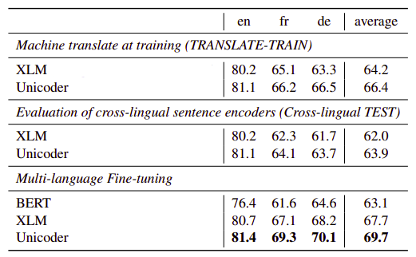

Unicoder is an abbreviation of "Universal Encoder" which is a language
encoder that is universal across different number of languages. The
Unicoder model was proposed by Microsoft in 2019 and published in this
paper: [Unicoder: A Universal Language Encoder by Pre-training with
Multiple Cross-lingual Tasks](https://aclanthology.org/D19-1252.pdf).
The official code for this paper can be found on Microsoft's official
GitHub repository:
[microsoft/Unicoder](https://github.com/microsoft/Unicoder).

A universal language encoder, or Unicoder, is a model that is able to
generate a sentence representation embedding independent on the input
language. From the name of the paper, we can see that they were able to
create this universal language encoder by using pre-training of
cross-lingual tasks. These cross-lingual tasks help Unicoder to learn
the mappings of different languages. And that's what we are going to
talk about next.

Pre-training Objectives
-----------------------

In this part, we are going to discuss the five language modeling
objectives used for the language modeling pre-training in the Unicoder.
Since the XLM model outperformed mBERT in cross-lingual tasks, Unicoder
uses the same structure as XLM and uses the same pre-training tasks
along with three more novel pre-training tasks; all listed below:

### MLM

MLM stands for "Masked Language Modeling" which is the first objective
out of the five objectives used for learning the Unicoder. MLM is the
same objective used for BERT where we randomly sample $15\%$ of the BPE
tokens from the text streams, replace them by a $\lbrack MASK\rbrack$
token $80\%$ of the time, by a random token $10\%$ of the time, and we
keep them unchanged $10\%$ of the time.

    

In fact, there are two differences between this approach and the one
used with BERT:

-   Here, they used text streams of an arbitrary number of sentences
    (truncated at 256 tokens) instead of pairs of sentences.

-   To counter the imbalance between frequent tokens (e.g. punctuations
    or stop words) and rare tokens, they sub-sampled the frequent
    outputs according to a multinomial distribution, whose weights are
    proportional to the square root of their invert frequencies.

### TLM

TLM stands for "Translation Language Modeling" which is the second
objective used for pre-training the Unicoder. MLM objective is
unsupervised and only requires monolingual data and cannot be used to
leverage parallel data when it is available. So, this objective is used
to leverage the existence of parallel data to improve cross-lingual
pre-training.

TLM is an extension of MLM objective, where instead of considering
monolingual text streams, we concatenate parallel sentences and perform
MLM over this concatenation. For example, let's assume that we have a
parallel entry of two languages English and French as shown below:

    

To predict a word masked in an English sentence, the model can either
attend to surrounding English words or to the French translation,
encouraging the model to align the English and French representations.
In particular, the model can leverage the French context if the English
one is not sufficient to infer the masked English words. To facilitate
the alignment, we also reset the positions of target sentences.

### Word Recovery

This task aims to let the pre-trained model learn the underlying word
alignments between two languages. This task is mainly motivated by the
attention matrix used in the neural machine translation models. So,
let's first recap how that attention mechanism worked:

Given a bilingual sentence pair $\left( X,\ Y \right)$ of two languages
$\left( s,\ t \right)$ of lengths $n$ and $m$ respectively, we obtain
word embeddings $\left( X^{s},\ Y^{t} \right)$. The XLM way of doing
that is by adding the language and position embeddings over this pair to
obtain word embeddings:

$$X^{s} = \left\{ x_{1}^{s},...x_{n}^{s} \right\},\ \ \ \ \ \ \ Y^{t} = \left\{ y_{1}^{t},...y_{m}^{t} \right\}$$

Now that we have word embeddings, let's apply the attention mechanism to
obtain attentive embeddings
$X^{t} = \left\\{ x_{1}^{t},...x_{n}^{t} \right\\}$. Using a trainable
weight $W \in \mathbb{R}^{3 \times h}$ where $h$ is the word embedding
dimension, the attention matrix
$A_{\text{ij}} \in \mathbb{R}^{m \times n}$ will be:

$$A_{\text{ij}} = W\left\lbrack x_{i}^{s},\ y_{j}^{t},\ x_{i}^{s}\bigodot y_{j}^{s} \right\rbrack$$

Where:

-   $x_{i}^{s}$ is the $i^{\text{th}}$ word embedding of the source
    sentence $s$.

-   $y_{j}^{t}$ is the $j^{\text{th}}$ word embedding of the target
    sentence $t$.

-   $\bigodot$ is element-wise multiplication.

-   $\lbrack a,\ b\rbrack$ is the concatenation of two vectors; $a$ and
    $b$.

Now, the attentive embeddings $X^{t} = \left\\{ x_{1}^{t},...x_{n}^{t} \right\\}$
will be computed as:

$$x_{i}^{t} = \sum_{j = 1}^{n}{\text{softmax}\left( A_{\text{ij}} \right)y_{j}^{t}}$$

That's how the attention mechanism works. Given that attentive embedding
$X^{t}$ to this task, the model tries to predict the original sentence
$X$ as shown in the following graph:

    

### Paraphrase Classification

This task takes the concatenation of two sentences from different
languages as input and classifies whether they are with the same meaning
or not. This task is shown below in the following figure:

    

The dataset used in this task is created from machine translation
datasets. Each bilingual sentence pair $\left( X,\ Y \right)$ servers as
a positive sample. For negative samples, the most straight forward
method is to replace $Y$ to a random sampled sentence from the target
language. But this will make the classification task too easy.

    

To make the negative samples hard, they
trained a light-weight paraphrase model with random negative samples.
Then, they used this model to select sentence with high similarity score
to $X$ but doesn't equal to $Y$ as hard negative samples. They chose
Deep Averaging Network (DAN) from this
[paper](https://aclanthology.org/P15-1162.pdf) as the light-weight
model. The dataset had $50\%$ positive samples and $50\%$ negative
samples.

### Cross-lingual Masked Language Model

Previous successful pre-training language models such as
[BERT](https://anwarvic.github.io/language-modeling/BERT) and
[GPT](https://anwarvic.github.io/language-modeling/GPT), were conducted
on document-level corpus rather than sentence-level corpus.
Cross-lingual document is a sequence of sentences, and the sentences are
written with different languages.

That's why the researchers proposed cross-lingual masked language model
task whose input come from cross-lingual document. One issue is that
people won't write cross-lingual document in most cases. To solve this
issue, they decided to construct such the cross-lingual document-level
corpus by replacing the sentences to their translation. Then, they
masked this document-level corpus the same way as MLM as shown below:

    

In the paper, they replaced sentences with even indices to their
translation in the other language separating them with
$\left\lbrack /S \right\rbrack$ token. They truncated the cross-lingual
document till it became $256$-tokens long, then fed it to the Unicoder.

### Data

Unicoder is pre-trained on 15 languages. For MLM, they used the Wikipedia of
these 15 languages. The other four tasks needed MT dataset, so they used the
same dataset as the XLM paper which were collected from MultiUN, IIT Bombay
corpus, OpenSubtitles 2018, EUbookshop corpus and GlobalVoices. The number of
parallel data they used is reported at the following table:

    

> **Note:**
>
> -   When training, all language were sampled equally.
>
> -   The max sequence length of MLM and cross-lingual language model
    is 256. For the other three tasks with two sentences as input, they
    set the max sequence length to 128 so the sum of them is 256.

Multilingual Fine-tuning
------------------------

The fine-tuning task used in this paper is **machine translation**.
There are three settings that people use when it comes to using machine
translation for fine-tuning; and they are:

-   **TRANSLATE-TRAIN:** fine-tune the model on pseudo translation of
    <u>target</u> language training set and test it on <u>target</u>
    testing set.

-   **TRANSLATE-TEST:** fine-tune the model on <u>source</u> training
    set and test it on pseudo translation of <u>source</u> testing
    set.

-   **TEST:** fine-tune the model on <u>source</u> training set and
    test it on <u>target</u> testing set.

To further understand the difference , let's assume that the source language is
English and the target language is Chinese. Each dataset has training set and
test set and the task is to evaluate on Chinese test, then the three settings
will do as the following figure:

    

> **Note:**\
The source language and the target can be more than one language; but they can
never intersect. In other words, a language can't be in the source and the
target at the same time.

Inspired by multi-task learning, the authors proposed a new fine-tuning
strategy called "Multilingual Fine-tuning" where fine-tuning is done on
training data of **source language + pseudo translation of the source language**
as shown in the following figure:

    

Results
-------

The Unicoder model is initialized from the XLM model, which means it is
a $12$-layer transformer with $1024\ $hidden units, $16\ $heads, GELU
activation. To build the vocabulary, they used BPE tokenization where
the vocabulary size is $95,000$. To train Unicoder, they used Adam
optimizer with learning rate that starts from $1e^{- 5}$ with invert
square root decay. As a regularizer, they used a dropout of $0.1$. The
batch size was set to $512$ in pre-training and $32$ in fine-tuning.

They fine-tuned Unicoder over these benchmarks:

-   **XNLI:** The following table shows test accuracy on the 15 XNLI
    languages. The source language here is English while the target
    language changes. The tables shows that Unicoder with Multilingual
    Fine-tuning achieves the best performance across all 15 languages.

    

&nbsp;&nbsp;&nbsp; Using more languages in fine-tuning leads to better
performance on the XNLI benchmark:

    

-   **XQA:** The following table shows test accuracy on the XQA. The
    average column is the average of "French (fr)" and "German (de)"
    result. And again, Unicoder with multilingual fine-tuning achieves
    the best performance across all three languages.

    

