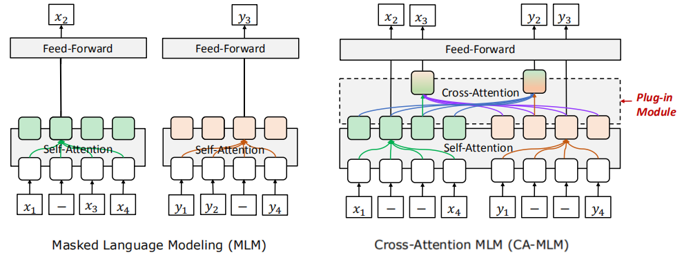
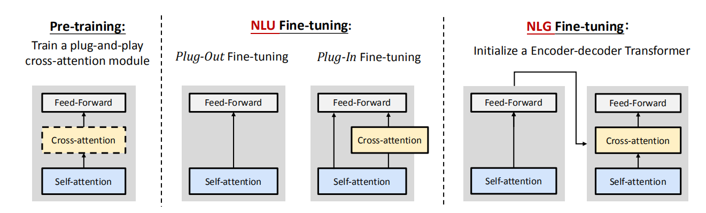
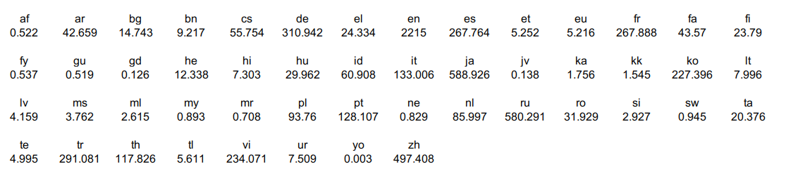
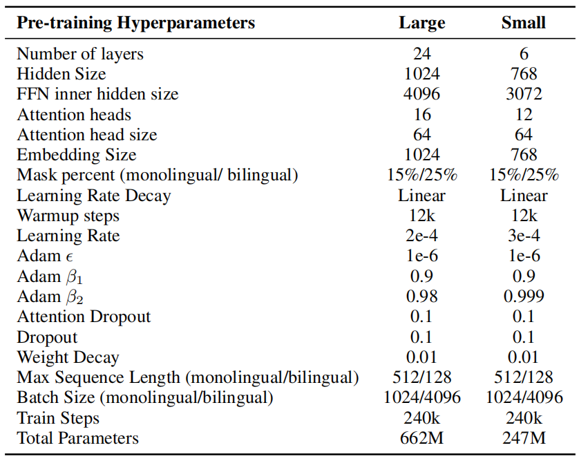
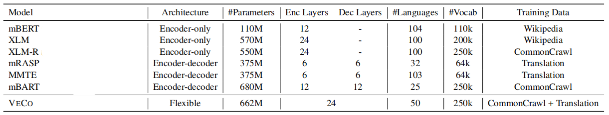
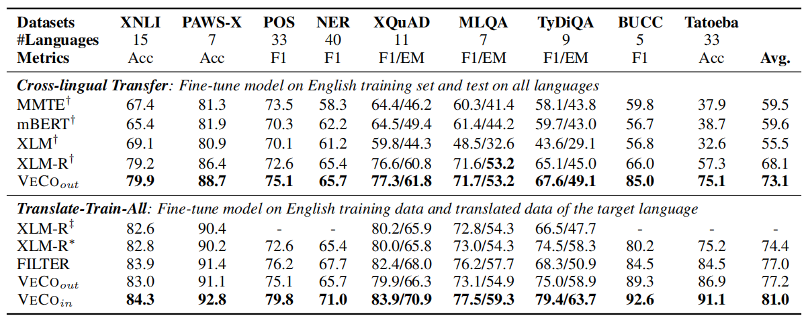
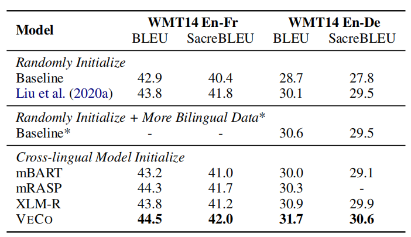
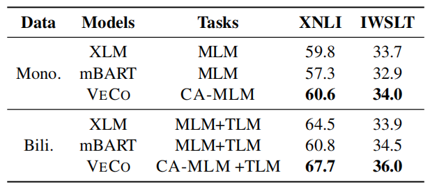

VECO stands for "**V**ariable and Fl**e**xible **C**r**o**ss-lingual
Pre-training" which is a pre-training approach for cross-lingual
language models that uses "Cross-Attention Masked Language Modeling"
(CA-MLM) objective. VECO was proposed by Alibaba Group in 2020 and
published in their "[VECO: Variable and Flexible Cross-lingual
Pre-training for Language Understanding and
Generation](https://arxiv.org/pdf/2010.16046.pdf)" paper. The official
code for this paper can be found on Alibaba's official GitHub
repository:
[alibaba/VECO](https://github.com/alibaba/AliceMind/tree/main/VECO).

CA-MLM Pre-training
-------------------

The special thing about VECO pre-training is that it plugs a
cross-attention module into the
[Transformer](https://anwarvic.github.io/machine-translation/Transformer)
architecture to explicitly build the cross-relation between languages
when pre-training using the Cross-Attention Masked Language Modeling MLM
(CA-MLM) objective. The following figure shows the difference between
MLM pre-training without plugging cross-attention module (left) and with
plugging the cross-attention module (right):

    

> **Note:**\
MLM here is different than MLM objective proposed in the
[BERT](https://anwarvic.github.io/language-modeling/BERT) paper. As we
can see, here MLM is applied on both encoder and decoder.

Given a pair of input $\left( x,\ y \right)$ and its MLM corrupted
version $\left( \widehat{x},\ \widehat{y} \right)$, the model tries to
minimize the following loss:

$$\mathcal{L}\left( x,\ y \right) = - \log P\left( x \middle| \widehat{x};\ \theta_{s} \right) - \log P\left( x \middle| \widehat{y},\ \widehat{x};\ \theta_{s},\ \theta_{c} \right)$$

$$\ \ \ \ \ \ \ \ \ \ \ \ \ \ \ \ \ \  - \log P\left( y \middle| \widehat{y};\ \theta_{s} \right) - \log P\left( y \middle| \widehat{x},\ \widehat{y};\ \theta_{s},\ \theta_{c} \right)$$

Where $\theta_{s}$ and $\theta_{c}$ are the parameters of self-attention
and cross-attention modules respectively.

> **Note:**\
In case of monolingual data, CA-MLM uses two adjacent sentences as the
$\left( x,\ y \right)$ pair.

### Cross-Attention Module

As said before, the VECO pre-training extends the
[Transformer](https://anwarvic.github.io/machine-translation/Transformer)
architecture and plugs a cross-attention module in each layer. Now, each
layer has three modules: self-attention module, a plug-and-play
cross-attention module, and a feed-forward linear module. Both
self-attention and cross-attention modules are based on the multi-head
[attention
mechanism](https://anwarvic.github.io/machine-translation/Attention).

An attention function can be described as mapping a query $Q$ and a set
of key-value $K,V$ pairs to an output. For the self-attention module,
all the queries, keys and values are the same representations from the
previous layer. Specifically, for the $l^{\text{th}}$ layer, the output
of a self-attention head $A_{l}^{s}$ is computed via:

$$Q = H^{l - 1}W_{l}^{Q},\ \ \ K = H^{l - 1}W_{l}^{K},\ \ \ V = H^{l - 1}W_{l}^{V}$$

$$A_{l}^{s} = \text{softmax}\left( \frac{QK^{T}}{\sqrt{d_{k}}} \right)V$$

Where $H^{l - 1}$ is the output of the previous layer, and
$W_{i}^{Q},W_{i}^{K},W_{i}^{V}$ are learned parameter matrices of the
self-attention.

For the cross-attention module, the queries come from the previous
layer, and the keys and values come from the last layer's
representations of paired input. Specifically, for the $l^{\text{th}}$
layer, the output of a cross-attention head $A_{l}^{c}$ is computed via:

$$Q = S^{l - 1}U_{l}^{Q},\ \ \ K = H^{L}U_{l}^{K},\ \ \ V = H^{L}U_{l}^{V}$$

$$A_{l}^{c} = \text{softmax}\left( \frac{QK^{T}}{\sqrt{d_{k}}} \right)V$$

Where $S^{l - 1}$ is the output of the previous layer,
$U_{i}^{Q},U_{i}^{K},\ U_{i}^{V}$ are learned parameter matrices of the
cross-attention, and finally $H^{L}$ is the output of the last layer.

> **Note:**\
There are two types of contextualized vector representation:
>
> - $H$: Which depends on the masked sequence:
>
> $$P\left( x \middle| \widehat{x} \right) = \text{softmax}\left( f\left( H_{x}^{L} \right) \right),\ \ \ \ \ P\left( y \middle| \widehat{y} \right) = \text{softmax}\left( f\left( H_{y}^{L} \right) \right)$$
>
> - $S$: Which depends on the masked paired sequence:
>
> $$P\left( x \middle| \widehat{x},\ \widehat{y} \right) = \text{softmax}\left( f\left( S_{x}^{L} \right) \right),\ \ \ \ \ P\left( y \middle| \widehat{x},\ \widehat{y} \right) = \text{softmax}\left( f\left( S_{y}^{L} \right) \right)$$

Furthermore, this cross-attention module can be plugged-in or
plugged-out on-demand which makes it very suitable for both
cross-lingual language understanding tasks and generation tasks as we
are going to see next.

Regrading cross-lingual understanding tasks on the XTREME benchmark,
VECO ranks first at the
[leaderboard](https://sites.research.google/xtreme) at the submission
deadline. Regrading cross-lingual generation tasks such as machine
translation, VECO outperforms existing state-of-the-art models by 1∼2
BLEU score.

Fine-tuning
-----------

As illustrated in the following figure, VECO is very flexible when
fine-tuning on various downstream tasks due to the plug-and-play
cross-attention module. It can be used for initializing the encoder-only
Transformer for natural language understanding (NLU) tasks and
encoder-decoder Transformer for natural language generation (NLG) tasks.

    

During NLU fine-tuning, there are two approaches that we can choose
from:

-   **Plug-out fine-tuning:** is to unplug the cross-attention module
    from the pre-trained model which makes the model very similar to
    [mBERT](https://anwarvic.gtihub.io/multilingual-nmt/mBERT).

-   **Plug-in fine-tuning:** is to plug the cross-attention module into
    the fine-tuned model. This can be used if the other language y is
    available in the downstream task. In this approach, the two
    representations $\left\lbrack H_{x}^{L};S_{x}^{L} \right\rbrack$ are
    concatenated to predict the label of $x$ and
    $\left\lbrack H_{y}^{L};S_{y}^{L} \right\rbrack$ are concatenated to
    predict the label of $y$.

Experiments & Results
---------------------

They collected monolingual and bilingual corpus covering 50 languages.
For monolingual training datasets, they extracted 1.36TB data in 50
languages from the
[CommonCrawl](https://github.com/facebookresearch/cc_net) Corpus, which
contains 6.5G sentences and 0.4G documents. The following table has
statistics for all 50 languages monolingual data where the values are in
million:

    

They up/down-sample the monolingual text like
[XLM](https://anwarvic.github.io/cross-lingual-lm/XLM) from each
language with a smoothing parameter $\alpha = 0.5$ where $D_{l}$ is the
number of sentences in language $l$.

$$p_{l} = \left( \frac{D_{l}}{\sum_{k}^{}D_{k}} \right)^{\alpha}$$

For bilingual data, they extracted 6.4G parallel sentences across 50
languages from the [OPUS](http://opus.nlpl.eu/) website.

In this paper, they used pre-trained two VECO models following the
[XLM-R](https://anwarvic.github.io/cross-lingual-lm/XLM-R) model. The
large one is a 24-layer model with 1024 embedding/hidden size and 4096
feed-forward size, while the small one is 6 layers with 768
embedding/hidden size and 3072 feed-forward size. Also, they used the
same 250K vocabulary that was used by
[XLM-R](https://anwarvic.github.io/cross-lingual-lm/XLM-R) . The full
list of the model can be seen in the following table:

    

The following table shows a comparison between VECO and other baselines:

    

When fine-tuning on natural language understanding tasks, VECO
outperforms previous cross-lingual models on all datasets of the XTREME
benchmark:

    

When fine-tuning on natural language generation tasks (machine
translation), VECO outperforms the randomly initialized same-sized
Transformer baseline by 2.3 BLEU points. Moreover, it even beats the
(randomly initialized) state-of-the-art Deep-Transformer, which is three
times deep as VECO.

    

And to investigate where the improvement in VECO comes from, they
trained [XLM](https://anwarvic.github.io/cross-lingual-lm/XLM),
[mBART](https://anwarvic.github.io/multilingual_nmt/XLM) and VECO model
from scratch using the same datasets and parameter settings where all of
them were pre-trained on MLM and TLM tasks and fine-tuned on XNLI
downstream task and machine translation De-En pair from the IWSLT14
dataset. The results are shown in the following table:

    

The previous table shows that:

-   When pre-training on monolingual data only, VECO outperforms XLM by
    0.8 points on the XNLI dataset and 0.3 BLEU scores on the IWSLT
    dataset which suggests that <u><strong>CA-MLM can still benefit from
    adjacent sentences in monolingual corpus</strong></u>. Remember that
    CA-MLM uses adjacent sentences as the $\left( x,y \right)$ pair.

-   When pre-training on both monolingual and bilingual data, VECO
    achieved a larger improvement compared to XLM, with 3.2 and 2.1
    points improvement on the two datasets, respectively. <u><strong>It
    reveals that CA-MLM objective of VECO can better utilize the bilingual
    corpus, compared to only optimized by TLM and MLM of XLM.</strong></u>
