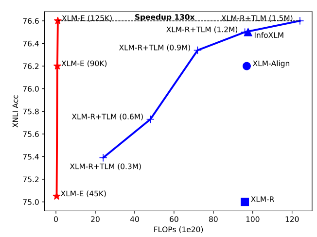
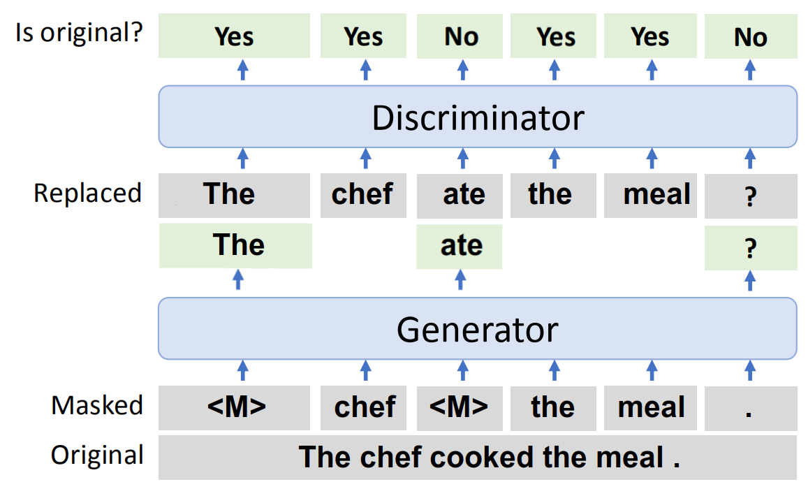
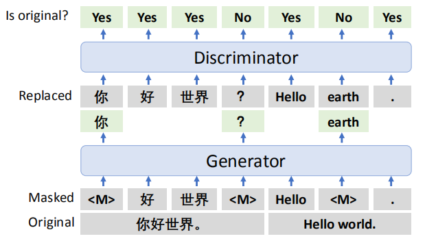
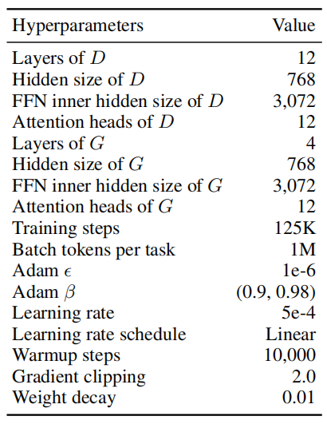
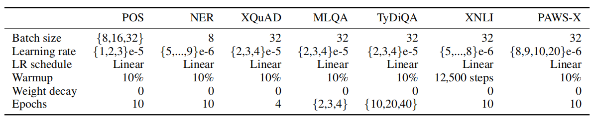
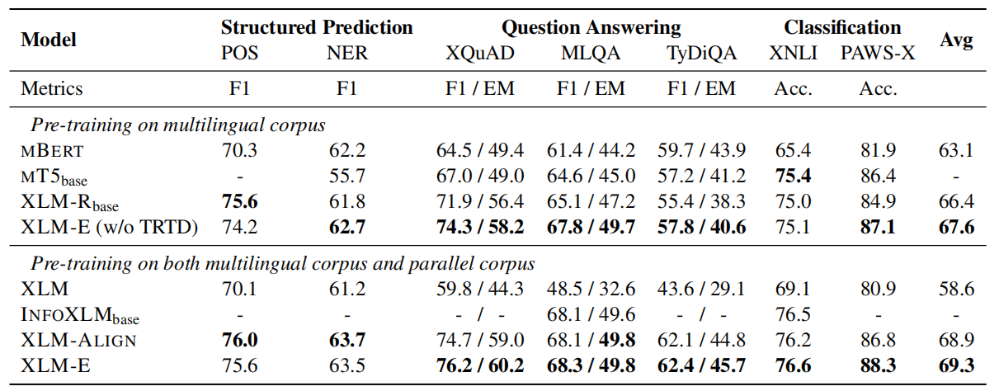
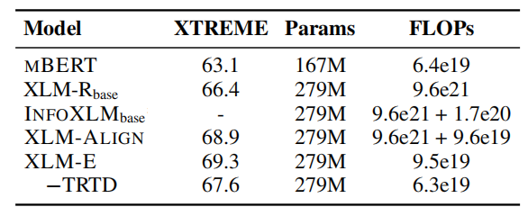

XLM-E stands for "Cross-lingual Language Modeling via Electra" which is
a cross-lingual language model that was pre-trained on two
[ELECTRA](https://anwarvic.github.io/language-modeling/ELECTRA)-style
tasks as we are going to see later. XLM-E was proposed by Microsoft in
2021 and published in their paper: [Cross-lingual Language Model
Pre-training via ELECTRA](https://arxiv.org/pdf/2106.16138.pdf). The
official code for this paper can be found on Microsoft's GitHub
repository: [microsoft/unilm](https://github.com/microsoft/unilm).

Using a pre-trained language model and then fine-tune it on downstream
tasks has become a de facto trend in the field. However, these
pre-training techniques such as (Masked Language Modeling (MLM),
Translation Masked Modeling (TLM), \...etc.) usually requires massive
computation resources. As shown in the following figure, XLM-E (red
line) achieves 130x speedup compared with XLM-R augmented with TLM and
around 100x speedup compared with
[XLM-R](https://anwarvic.github.io/cross-lingual-lm/XLM-R),
[XLM-Align](https://anwarvic.github.io/cross-lingual-lm/XLM-Align), and
[InfoXLM](https://anwarvic.github.io/cross-lingual-lm/InfoXLM):

    

Pre-training
------------

Similar to [ELECTRA](https://anwarvic.github.io/language-modeling/ELECTRA),
XLM-E has two Transformer components, i.e., generator and discriminator. The
generator predicts the masked tokens given the masked sentence or translation
pair, and the discriminator distinguishes whether the tokens are replaced by
the generator. XLM-E was pre-trained on two different pre-training tasks:
<u><strong>multilingual replaced token detection (MRTD)</strong></u>, and
<u><strong>translation replaced token detection (TRTD)</strong></u>. The
overall training objective is to minimize:

$$\mathcal{L} = \mathcal{L}_{\text{MLM}} + \lambda\mathcal{L}_{\text{MRTD}} + \mathcal{L}_{\text{TLM}} + \lambda\mathcal{L}_{\text{TRTD}}$$

### Multilingual RTD

This pre-training task is a multilingual form of the Replaced Token
Detection (RTD) task introduced in the
[ELECTRA](https://anwarvic.github.io/language-modeling/ELECTRA) model.
Here is a small recap on RTD. The RTD task requires the model to
distinguish real input tokens from corrupted multilingual sentences. The
input sentences get corrupted by the generator model, and the
discriminator should be able to classify the real tokens from the
replaced ones as shown in the following figure:

    

The multilingual RTD is exactly the same with a few differences:

-   The input text can be in various languages.

-   Both the generator and the discriminator are shared across
    languages. The vocabulary is also shared for different languages.

-   Masking is done uniformly while it was only $15\%\ $in the ELECTRA
    paper.

> **Note:**\
They also tried span masking, but it significantly weakened the generator's
prediction accuracy, which in turn harmed the pre-training.

Given a input sequence $x$ that was masked using $M_{e}$ set of random
positions; the loss function of the generator $G$ is:

$$\mathcal{L}_{\text{MLM}}\left( x;\ \theta_{G} \right) = - \sum_{i \in M_{e}}^{}{\text{log}\left(p_{G}\left( x_{i} \middle| x^{\text{masked}} \right) \right)}$$

The loss function of the discriminator $D$ is the following; knowing
that $n$ is the length of $x$ and $r_{i}$ is the label of the output (1
for "yes" and 0 for "No"):

$$\mathcal{L}_{\text{MRTD}}\left( x;\theta_{D} \right) = - \sum_{i = 1}^{n}{\log\left( p_{D}\left( r_{i} \middle| x^{\text{corrupt}} \right) \right)}$$

### Translation RTD 

Translation RTD is a novel discriminative pre-training task which aims
to distinguish real input tokens from the translation pairs concatenated
together. An input translation pair $\left( e,f \right)$ gets
concatenated together into a single sentence and then treated the same
way as MRTD as shown in the following figure:

    

Given a concatenated translation pair $\left\lbrack e;f \right\rbrack$
that was masked using $M_{e}$ and $M_{f}$ sets of random positions for
$e$ and $f$ respectively, the loss function of the generator $G$ is:

$$\mathcal{L}_{\text{TLM}}\left( e,f;\theta_{G} \right) = - \sum_{i \in M_{e}}^{}{\log\left( p_{G}\left( e_{i} \middle| \left\lbrack e;f \right\rbrack^{\text{masked}} \right) \right)}$$

$$\ \ \ \ \ \ \ \ \ \ \ \ \ \ \ \ \ \ \ \ \  - \sum_{i \in M_{f}}^{}{\log\left( p_{G}\left( f_{i} \middle| \left\lbrack e;f \right\rbrack^{\text{masked}} \right) \right)}$$

The loss function of the discriminator $D$ is the following; knowing
that $n$ is the length of the concatenation and $r_{i}$ is the label of
the output (1 for "yes" and 0 for "No"):

$$\mathcal{L}_{\text{TRTD}}\left( e,f;\theta_{D} \right) = - \sum_{i = 1}^{n}{\log\left( p_{D}\left( r_{i} \middle| \left\lbrack e;f \right\rbrack^{\text{corrupt}} \right) \right)}$$

> **Note:**\
The generators in these pre-training tasks act like language models.
That's why their loss functions were marked as
$\mathcal{L}_{\text{MLM}}$ and $\mathcal{L}_{\text{TLM}}$.

Gated Relative Position Bias
----------------------------

In this paper, they proposed to use gated relative position bias
inspired by the [GRU](https://anwarvic.github.io/language-modeling/RNN)
cells, in the self-attention mechanism. First, let's recap how the
self-attention mechanism works. Given, input tokens
$\left\\{ x_{1},\ ...x_{n} \right\\}$, the self-attention mechanism uses
$q_{i}$, $k_{i}$, and $v_{i}$ for each input to compute the head output
${\widetilde{h}}_{i}$ as shown below:

$${\widetilde{h}}_{i} = \text{softmax}\left\lbrack \frac{q_{i}W_{i}^{Q}\left( k_{i}W_{i}^{K} \right)^{T}}{\sqrt{d_{k}}} \right\rbrack v_{i}W_{i}^{V}$$

Where
$W_{i}^{Q},W_{i}^{K} \in \mathbb{R}^{d_{m} \times d_{k}},W_{i}^{V} \in \mathbb{R}^{d_{m} \times d_{v}}$
are learned matrices. In this paper, the self-attention output is
slightly different as shown below:

$${\widetilde{h}}_{i} = \text{softmax}\left\lbrack \frac{q_{i}W_{i}^{Q}\left( k_{i}W_{i}^{K} \right)^{T}}{\sqrt{d_{k}}} + b_{i - j} \right\rbrack v_{i}W_{i}^{V}$$

Where $b_{i - j}$ denotes the gated relative position bias which is
computed via:

$$g^{\left( \text{update} \right)},\ g^{\left( \text{reset} \right)} = \sigma\left( q_{i}\text{.u} \right),\ \sigma\left( q_{i}\text{.v} \right)$$

$$b_{i - j} = d_{i - j} + g^{\left( \text{update} \right)}d_{i - j} + \left( 1 - g^{\left( \text{update} \right)} \right).wg^{\left( \text{reset} \right)}d_{i - j}$$

Where $d_{i - j}$ is learnable relative position bias, the vectors
$u,\ v \in \mathbb{R}^{d_{k}}$ are parameters, σ is the sigmoid
function, and $w \in \mathbb{R}$ is a learnable value.

Results
-------

In the following experiments, they used a 12-layer Transformer as the
discriminator, with hidden size of 768, and FFN hidden size of 3,072 while they
used a 4-layer Transformer as the discriminator using the same hyper-parameters.
They used the same vocabulary with
[XLM-R](https://anwarvic.github.io/cross-lingual-lm/XLM-R) that consists of
250K subwords tokenized by SentencePiece.

    

They jointly pre-trained the generator and the discriminator using Adam
optimizer for 125K training steps with a dynamic batching of
approximately 1M tokens. $\lambda$ was set to $50$. Check the following
table for the full list of pre-training hyper-parameters.

For pre-training, they used the CC-100 dataset for the MRTD task which
contains texts in 100 languages collected from
[CommonCrawl](https://github.com/facebookresearch/cc_net). They used
parallel corpora in 100 languages, collected from MultiUN, IIT Bombay,
OPUS, WikiMatrix, and CCAligned, for the TRTD task. For sampling, they
used temperature sampling of $T = \frac{10}{7}$.

After pre-training the XLM-E model was fine-tuned on various tasks from
the XTREME benchmark. The following table shows the hyper-parameters
used when fine-tuning. The XTREME benchmark contains seven cross-lingual
understanding tasks, namely part-of-speech tagging (POS) on the
Universal Dependencies v2.5, NER named entity recognition on the Wikiann
dataset, cross-lingual natural language inference on XNLI, cross-lingual
paraphrase adversaries from word scrambling (PAWS-X), and cross-lingual
question answering on MLQA, XQuAD, and TyDiQA-GoldP.

    

The following table shows the evaluation results on XTREME benchmark
knowing that results of XLM-E and XLM-R~base~ are averaged over five
runs.

    

As seen from the previous table, XLM-E outperforms previous models on
Question Answering and Classification problems while achieves
competitive performance of Structured Predictions. All of that while
uses substantially less computation:

    

