XLM-R stands for "Cross-lingual Language Modeling-RoBERTa" which was
created by FacebookAI in 2019 and published in this paper:
"[Unsupervised Cross-lingual Representation Learning at
Scale](https://arxiv.org/pdf/1911.02116.pdf)". The goal of paper is to
improve the XLM model's performance on both cross-lingual and
monolingual understanding tasks. XLM-R follows the XLM model
architecture with a changes that improve the performance at scale. And
these changes are:

-   **Maked Language Modeling:**\
    In XLM-R, they used the same MLM objective as the XLM model with
    only once change which is they removed the language embeddings
    <u>which allows the model to better deal with code-switching</u>.

    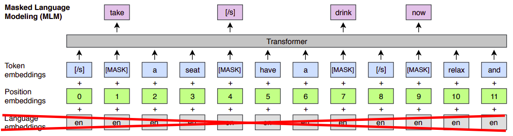

-   **Removed TLM:**\
    The focus of this paper is Unsupervised Cross-lingual Representation
    Learning. So, it made sense to remove the supervised objective in
    the XLM model which was the Translation Language Modeling objective
    or TLM for short.

-   **Scaling to 100 languages:**\
    XLM-R is trained on 100 languages unlike XLM which was trained on
    just 15 languages. And for the first time, XLM-R shows that it is
    possible to have a single large model for all languages, without
    sacrificing per-language performance.

    

-   **Bigger Vocabulary:**\
    XLM-R uses a shared vocabulary of 250k tokens while XLM uses 95k.
    The vocabulary consists of subwords encoded using Byte-Pair Encoding
    (BPE).

-   **Validation Stopping Criterion:**\
    XLM uses the perplexity as a stopping criterion for pre-training. In
    XLM-R, they used downstream tasks as a stopping criterion as they
    observed that performance on downstream tasks continues to improve
    even after validation perplexity has plateaued.

-   **Increasing the Training Data:**\
    They collected monolingual data about 100 languages using [common
    crawl](https://github.com/facebookresearch/cc_net) which was about
    2.5 Terabytes. The following figure shows the difference between
    Wikipedia (the data used to train multilingual BERT or mBERT) and
    Common Crawl (the data used to train XLM-R).

    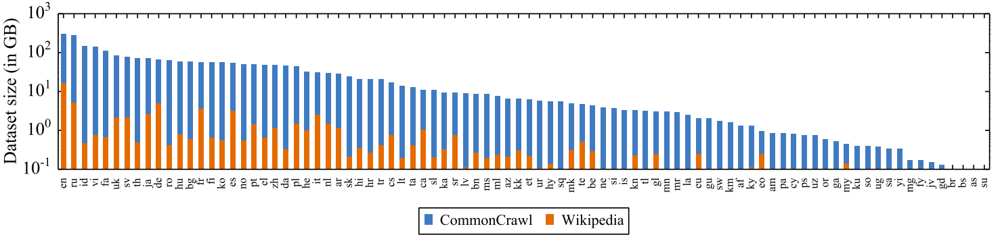

And that is basically it! There are no novel parts in this paper. However, this
paper provides a good analysis of multilingual models as we are going to see
next.

Trade-offs
----------

As I said earlier, this paper doesn't provide any novel parts but it
provides a good understanding and analysis to the multilingual models
according to various factors:

### Performance Vs # languages

In the paper, they called this the "the curse of multilinguality". For a
fixed sized model, the per-language capacity decreases as we increase
the number of languages. While low-resource language performance can be
improved by adding similar higher-resource languages. So, these two
factors have to be traded off against each other.

Using XNLI as a metric, the authors trained different fixed-size XLM-R models
in 7, 15, 30, 60 and 100 languages. And they found out that; initially, as we
go from 7 to 15 languages, the model is able to take advantage of positive
transfer which improves performance, especially on low resource languages.
Beyond this point the curse of multilinguality kicks in and degrades
performance across all languages.

    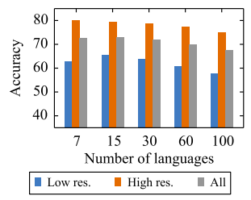

The issue is even more prominent when the capacity of the model is small. To
show this, they made the Transformer wider as they added more languages. They
trained models in 7, 30, and 100 languages with hidden size of 768, 960, and
1152 respectively. As the following figure shows, the added capacity allows
XLM-30 to be on par with XLM-7, thus overcoming the curse of multilinguality.
But the added capacity for XLM-100, however, is not enough and it still lags
behind.

    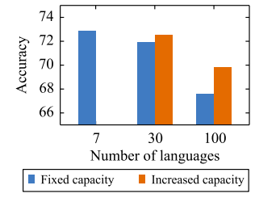

### Performance Vs Low / High-resource

Here, we study the effect of data sampling of high-resource (English and
French) and low-resource (Swahili and Urdu) languages on the
performance. Specifically, we investigate the impact of varying the
$\alpha$ parameter which controls the exponential smoothing of the
language sampling rate. Recap the [shared vocabulary part](\l) from XLM
if you can't relate.

Models trained with higher values of $\alpha$, see batches of high-resource
languages more often which increases the performance on high-resource languages.
And when we decrease the value of , the model see batches of low-resource
languages more often. So, we need to trade-off between these two factors.

    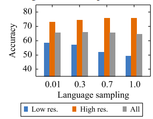

They found that $\alpha = 0.3$ is the optimal value for α if we are
considering both low-resource and high-resource languages.

### Performance Vs Vocabulary

Previously, we showed the importance of scaling the model size as we
increase the number of languages. Similarly, scaling the size of the
shared vocabulary can improve the performance.

To illustrate this effect, they trained multiple models with different
vocabulary sizes while keeping the overall number of parameters constant
by adjusting the width of the transformer. And as shown in the following
figure, we observe a 2.8% increase in XNLI average accuracy as we
increase the vocabulary size from 32K to 256K:

    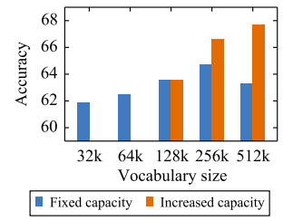

### Performance Vs Data Size

As you have probably figured out, the more data you have, the better the
cross-lingual language model will be. They compared the same model
trained on two different datasets: Wikipedia (60 Gigabytes) and Common
Crawl (2.5 Terabytes).

    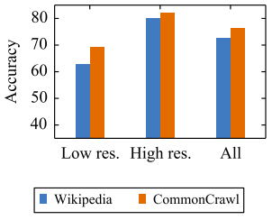

### Performance Vs Batch Size

Similarly for the batch sizes, the bigger the batch size is, the better
the cross-lingual language model will be:

    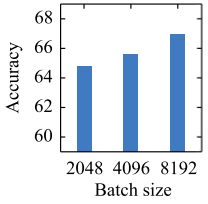

Results
-------

Here, we are going to talk about the results of XLM-R model in
comparison with all other state-of-the-art models on multiple tasks. In
the paper, they used different sizes of XLM-R which are:

<table>
    <thead>
        <tr>
            <th></th>
            <th>XLM-R BASE</th>
            <th>XLM-R</th>
        </tr>
    </thead>
    <tr>
        <td><strong>Transformer Blocks</strong></td>
        <td>12</td>
        <td>24</td>
    </tr>
    <tr>
        <td><strong>Feed-Forward hidden neurons</strong></td>
        <td>768</td>
        <td>1024</td>
    </tr>
    <tr>
        <td><strong>Attention Heads</strong></td>
        <td>12</td>
        <td>16</td>
    </tr>
    <tr>
        <td><strong>Parameters</strong></td>
        <td>270 million</td>
        <td>550 million</td>
    </tr>
</table>

### Multilingual Results

Here, we are going to compare the XLM-R model over cross-lingual
understanding tasks such as:

-   **XNLI:**\
    The following table shows the performance on the XNLI dataset
    which contains 15 different languages. In the table we can see that
    using the translate-train-all approach which leverages training sets
    from multiple languages, XLM-R obtains a new state of the art on
    XNLI of 83.6% average accuracy:

    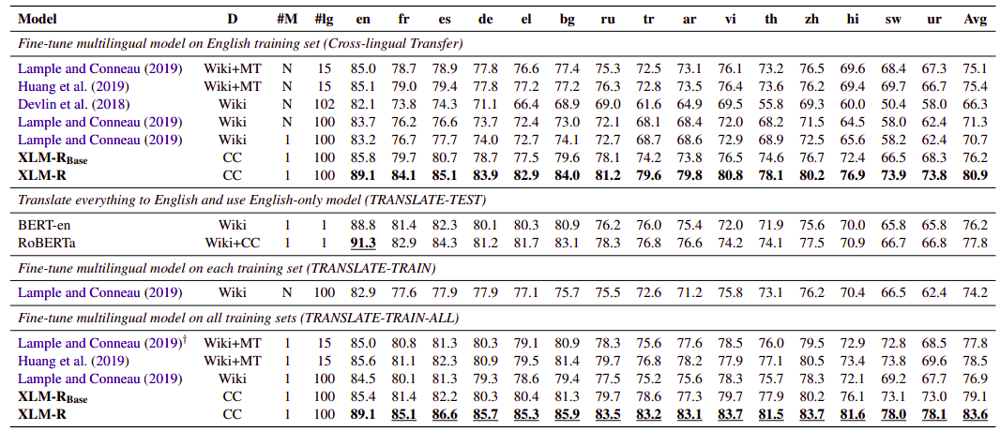

-   **NER:**\
    The following table shows the results using CoNLL2002 and CoNLL-2003
    datasets using the F1 metric:

    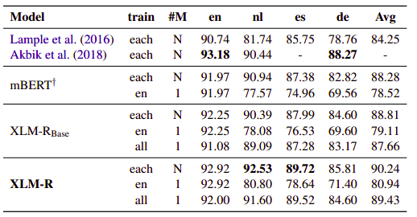

-   **Question Answering:**\
    The following table summarizes the results on MLQA question
    answering using the F1 and EM (exact match) scores for zero-shot
    classification where models are fine-tuned on the English Squad
    dataset and evaluated on the 7 languages of MLQA:

    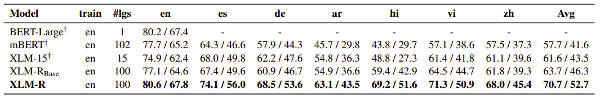

### Monolingual Results

Here, we are going to compare the XLM-R model over monolingual
understanding tasks such as:

-   **GLUE:**\
    The following table shows the XLM-R performance on the the GLUE
    benchmark:

    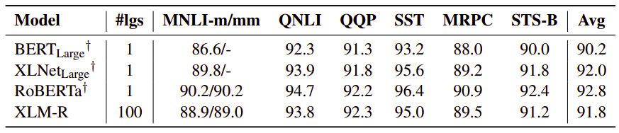

Important Finding
-----------------

In this paper, they proved that the multilingual models obtain better
performance over their monolingual counter-parts. They provided the
first comprehensive study to assess this claim on the XNLI benchmark.
For comparison, they used XLM models (called it XLM-7) and monolingual
BERT models on 7 languages and compare performance as shown in the
following table:

    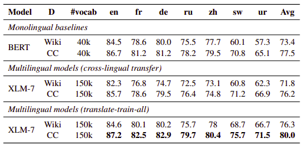

According to the former table, we can conclude the following:

-   Monolingual BERT models outperform XLM-7 for both Wikipedia and CC
    by 1.6% and 1.3% average accuracy.

-   XLM-7 outperforms BERT models when it leverages the training sets
    coming from multiple languages (translate-train-all).
