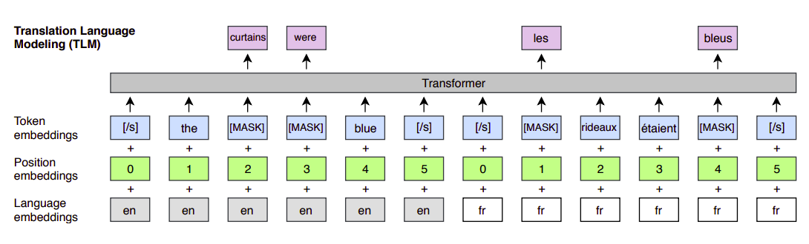
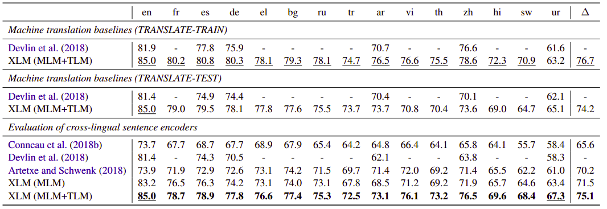
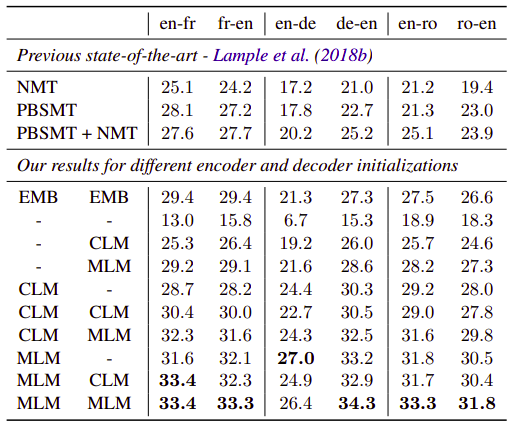
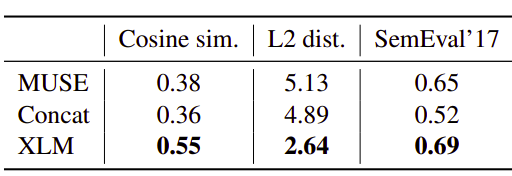

XLM stands for "Cross-lingual Language Modeling" which is a model
created by FacebookAI in 2019 and published in this paper:
"[Cross-lingual Language Model Pretraining](https://arxiv.org/pdf/1901.07291.pdf)".
XLM is an 12-layer <strong><u>encoder-transformer</u></strong> of with 1024
hidden units, 16 heads, and GELU activation.

XLM was trained on multiple languages with new pre-training objectives
that pushed the XNLI benchmark by an absolute gain of 4.9% accuracy and
obtained 34.3 BLEU on WMT'16 German-English which is 9 BELU more than
the state-of-the-art back then. The official code for this paper can be
found in the FairSeq official repository:
[fairseq/cross_lingual_language_model](https://github.com/pytorch/fairseq/tree/master/examples/cross_lingual_language_model).

In this paper, the authors presented three language modeling objectives
for the language modeling. Two of them only require monolingual data
(unsupervised), while the third one requires parallel sentences
(supervised). And these objectives are:

-   CLM (Causal Language Modeling).

-   MLM (Masked Language Modeling).

-   TLM (Translation Language Modeling).

Before getting into pre-training, let's first check the vocabulary used
for our XLM.

Shared Vocabulary
-----------------

In the paper, they processed all languages with the same shared
vocabulary created through Byte Pair Encoding (BPE). They used 80k BPE
splits and a vocabulary of 95k. This greatly improves the alignment of
embedding spaces across languages that share either the same alphabet or
other tokens such as digits or proper nouns.

They learned the BPE splits on the concatenation of sentences sampled
randomly from the monolingual corpora. Sentences are sampled according
to a multinomial distribution with probabilities
$\left[ q_i \right]\_{i = 1..N}$, where $N$ is the number of
languages and $n_{i}$ is the number of sentences in the $i^{th}$
monolingual corpora:

$$q_{i} = \frac{p_{i}^{\alpha}}{\sum_{j = 1}^{N}p_{j}^{\alpha}},\ \ \ \ \ \ \ \ \ \ \ \ \ p_{i} = \frac{n_{i}}{\sum_{k = 1}^{N}n_{k}}$$

Sampling with this distribution increases the number of tokens
associated to low-resource languages and alleviates the bias towards
high-resource languages. In particular, this prevents words of
low-resource languages from being split at the character level.

Pre-training Objectives
-----------------------

In this part, we are going to discuss the three language modeling
objectives used for the language modeling pre-training. The first two of
them only require monolingual data (unsupervised), while the third one
requires parallel sentences (supervised).

### CLM

CLM stands for "Causal Language Modeling" which is one of the three
objectives used for learning the cross-lingual language model. This
objective is used to train the model predict the probability of a word
given the previous words in a sentence
$P\left( w_{t} \middle| w_{1},\ ...\ w_{t - 1},\ \theta \right)$.
OpenAI's GPT and GPT-2 are trained on this objective. You can refer to
my articles on GPT and GPT-2 if you're interested in the details of this
objective.

### MLM

MLM stands for "Masked Language Modeling" which is the second objective
out of the three objectives used for learning the cross-lingual language
model. MLM is the same objective used for BERT where we randomly sample
15% of the BPE tokens from the text streams, replace them by a \[MASK\]
token 80% of the time, by a random token 10% of the time, and we keep
them unchanged 10% of the time.

    

In face, there are two differences between this approach and the one
used with BERT. And they are:

-   Here, they used text streams of an arbitrary number of sentences
    (truncated at 256 tokens) instead of pairs of sentences.

-   To counter the imbalance between frequent tokens (e.g. punctuations
    or stop words) and rare tokens, they sub-sampled the frequent
    outputs according to a multinomial distribution, whose weights are
    proportional to the square root of their invert frequencies.

### TLM

TLM stands for "Translation Language Modeling" which is the third and
last objective used for learning the cross-lingual language model. Both
the CLM and MLM objectives are unsupervised and only require monolingual
data. However, these objectives cannot be used to leverage parallel data
when it is available. So, this objective is used to leverage the
existence of parallel data to improve cross-lingual pre-training.

TLM is an extension of MLM, where instead of considering monolingual
text streams, we concatenate parallel sentences and perform MLM over
this concatenation. For example, let's assume that we have a parallel
entry of two languages English and French as shown below:

    

To predict a word masked in an English sentence, the model can either
attend to surrounding English words or to the French translation,
encouraging the model to align the English and French representations.
In particular, the model can leverage the French context if the English
one is not sufficient to infer the masked English words. To facilitate
the alignment, we also reset the positions of target sentences.

Fine-tuning
-----------

In the paper, the XLM model was fine-tuned on various tasks -all from
the XNLI dataset- which shows that XLM can be used for a wide variety of
cross-lingual tasks:

-   **Zero-shot Cross-lingual Classification:**\
    They fine-tuned XLMs on a cross-lingual classification by adding a
    linear classifier on top of the first hidden state of the pretrained
    Transformer, and fine-tuned all parameters on the English NLI
    training dataset and evaluated it on the other 15 XNLI languages:

    

-   **Unsupervised Machine Translation:**\
    They pretrained the entire encoder and decoder with a
    cross-lingual language model and explored various initialization
    schemes as shown below:

    

-   **Low-resource Language Modeling:**\
    Here's where "languages with the same script or similar words
    provide better mapping" comes into the picture. For example, around
    80% of Nepali tokens (low-resource language) is in common with Hindi
    (high-resource-language):

-   **Cross-lingual Word Embedding:**\
    Since we have a shared vocabulary, the lookup table (or embedding
    matrix) of the XLM model gives us the cross-lingual word embeddings.

    

