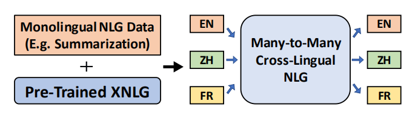
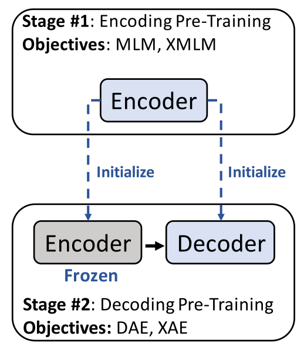
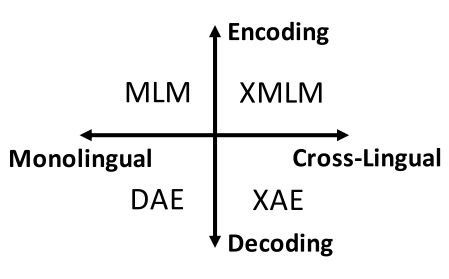
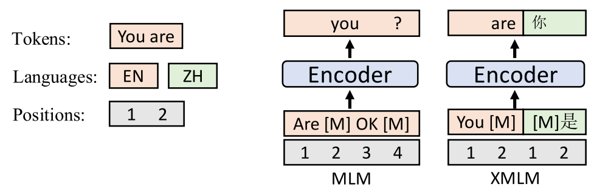
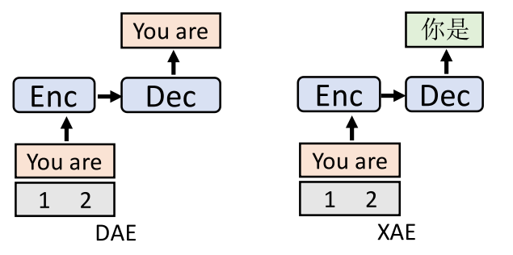
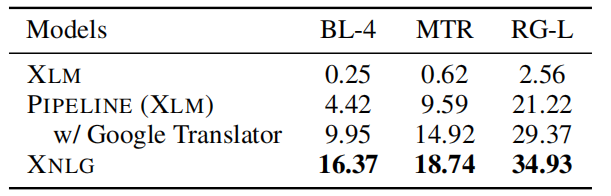
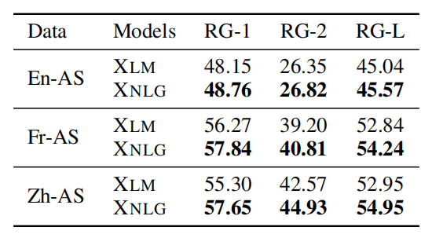
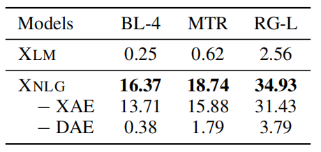

XNLG stands for "Cross-lingual Natural Language Generation" which is an
encoder-decoder cross-lingual model designed for Natural Language
Generation (NLG) tasks such as question generation and abstractive
summarization. This model was created by Microsoft in 2019 and published
in their paper: [Cross-Lingual Natural Language Generation via
Pre-Training](https://arxiv.org/pdf/1909.10481.pdf). The official code
for this paper is found in the following GitHub repository:
[xnlg](https://github.com/CZWin32768/xnlg).

As shown in the following figure, XNLG is an encoder-decoder
[Transformer](https://anwarvic.github.io/machine-translation/Transformer)
model pre-trained on on monolingual NLG training data and can be
fine-tuned later on other languages which can boost performance for the
low-resource settings.

    

Pre-training
------------

Given a parallel corpus $\mathcal{D}_{p}$ and a monolingual corpus
$\mathcal{D}_{m}$, the XNLG pre-training is done in two stages as
shown below:

-   **Stage #1:** pre-trains the encoder on two tasks: Masked Language
    Modeling (MLM) and cross-lingual Masked Language Modeling (XMLM)
    where the encoder learns to minimize:

$$\mathcal{L}_{1} = \sum_{\left( x,y \right) \in \mathcal{D}_{p}}^{}\mathcal{L}_{\text{XMLM}}^{\left( x,y \right)} + \sum_{x \in \mathcal{D}_{m}}^{}\mathcal{L}_{\text{MLM}}^{\left( x \right)}$$

-   **Stage #2:** pre-trains the model
    where the decoder parameters are updated while freezing the encoder
    parameters on two tasks: (Denoising Auto-Encoding) DAE and
    cross-lingual Auto-Encoding (XAE). Here, the model learns to
    minimize:

$$\mathcal{L}_{2} = \sum_{\left( x,y \right) \in \mathcal{D}_{p}}^{}\mathcal{L}_{\text{XAE}}^{\left( x,y \right)} + \sum_{x \in \mathcal{D}_{m}}^{}\mathcal{L}_{\text{DAE}}^{\left( x \right)}$$

    
    

These are the the two stages of pre-training in XNLG, now let's dive
deeper into pre-training tasks mentioned above:

-   <u><strong>Masked Language Modeling (MLM):</strong></u>\
    The masked language modeling (MLM) task was first proposed by the
    [BERT](https://anwarvic.github.io/language-modeling/BERT) paper.
    Given an input sequenc $x$, MLM randomly masks $15\%$ of the tokens
    in a monolingual sentence. Each masked token is substituted with a
    special token $\left\lbrack M \right\rbrack$, a random token, or the
    unchanged token with probabilities of $80\%$, $10\%$, and $10\%$,
    respectively to create a masked sequence $x_{\backslash M_{x}}$
    knowing that $M_{x}$ is the set of randomly masked positions. The
    monolingual MLM loss is defined as:

$$\mathcal{L}_{\text{MLM}}^{\left( x \right)} = - \sum_{i \in M_{x}}^{}{\log\left( p\left( x_{i} \middle| x_{\backslash M_{x}} \right) \right)}$$

-   <u><strong>Cross-lingual Masked Language Modeling (XMLM):</strong></u>\
    Similar to MLM, the masked token prediction task can be extended to
    cross-lingual settings. Given a parallel corpus, bilingual sentences
    $\left( x,\ y \right)$ can be concatenated to form one sequence
    which can be used as the input of MLM. Given $M_{x}$ and $M_{y}$ as
    the sets of masked positions of $x$ and $y$ respectively, the XMLM
    loss is defined as:

$$\mathcal{L}_{\text{XMLM}}^{\left( x,\ y \right)} = - \sum_{i \in M_{x}}^{}{\log\left( p\left( x_{i} \middle| x_{\backslash M_{x}},\ y_{\backslash M_{y}} \right) \right)} - \sum_{i \in M_{y}}^{}{\log\left( p\left( y_{i} \middle| x_{\backslash M_{x}},\ y_{\backslash M_{y}} \right) \right)}$$

    

-   <u><strong>Denoising Auto-Encoding (DAE):</strong></u>\
    Given monolingual sentence $x$, DAE applies noise functions
    over the input sentence producing perturbed sentence $\widehat{x}$.
    Its objective is to train the whole model to restore the original
    sentence. The noise functions applied here are: shuffling, randomly
    dropping tokens with a probability of $0.1$, and randomly replacing
    tokens with the special padding token \[P\] with a probability of
    $0.1$. The DAE loss function is defined as:

$$\mathcal{L}_{\text{DAE}}^{\left( x \right)} = - \sum_{i = 1}^{\left| x \right|}{\log\left( p\left( x_{i} \middle| \widehat{x},\ x_{< i} \right) \right)}$$

-   <u><strong>Cross-Lingual Auto-Encoding (XAE):</strong></u>\
    XAE is a the multilingual-version DAE which can be viewed as a
    machine translation task. The cross-lingual auto-encoding loss is:

$$\mathcal{L}_{\text{XAE}}^{\left( x,\ y \right)} = - log\left( p\left( y \middle| x \right) \right) - log\left( p\left( x \middle| y \right) \right)$$

    

Fine-tuning
-----------

In the fine-tuning procedure, there are two scenarios:

-   <u><strong>Fine-tuning for Any-to-Others NLG:</strong></u>\
    Fine-tuning any language to non-English. In this scenario,
    they observed catastrophic forgetting of target language. To
    overcome that, they keep the decoder and the word embeddings frozen
    and only update the encoder parameters during fine-tuning.

-   <u><strong>Fine-tuning for Any-to-English NLG:</strong></u>\
    Fine-tuning any language to English. In this scenario, they freeze
    the encoder parameters, and update the decoder parameters.

> **Note:**\
When the target language is the same as the language of training data,
they fine-tuned all parameters.

Experiments
-----------

They conducted experiments over two cross-lingual NLG downstream tasks:
cross-lingual question generation, and cross-lingual abstractive
summarization. They used a pre-trained XNLG with a 10-layer encoder and
a 6-layer decoder. For every Transformer layer, they used $1024$ hidden
units, $8$ attention heads, and GELU activations.

In the first pre-training stage, they directly used the pre-trained XLM
to initialize the XNLG parameters. In the second pre-training stage,
they used Wikipedia as the monolingual data for the DAE objective, and
MultiUN as the parallel data for the XAE objective. In pre-training,
they used Adam optimizer with a linear warm-up over the first $4k$ steps
and linear decay for later steps, and the learning rate is set to
$10^{- 4}$. The pre-training batch size is $64$, and the sequence length
is set to $256$.

For fine-tuning on downstream NLG tasks, they used Adam optimizer with a
learning rate of $5 \times 10^{- 6}$. They set the batch size as $16$
and $32$ for question generation and abstractive summarization,
respectively. They truncate the input sentences to the first $256$
tokens. During decoding, they used beam search with a beam size of $3$,
and limit the length of the target sequence to $80$ tokens.

The following table shows the evaluation results of monolingual
supervised question generation for English and Chinese. BL is short for
BLEU, MTR for METEOR, and RG for ROUGE.

    

The following table shows the evaluation results of zero-shot
Chinese-Chinese question generation. These results show that XNLG
consistently performs better than baselines in both zero-shot and
monolingual supervised setting.

    

The following table shows the ROUGE evaluation results of supervised
monolingual summarization. These results show that XNLG outperforms all
the baseline models on both French and Chinese AS:

    

To check the effect of pre-training techniques on the performance, they
conduct ablation studies models were evaluated on zero-shot
Chinese-Chinese question generation task. The results show that the
model benefits from the DAE objective for the zero-shot Chinese question
generation task. The results also demonstrate that combining DAE and XAE
can alleviate the spurious correlation issue and improves cross-lingual
NLG.

    

