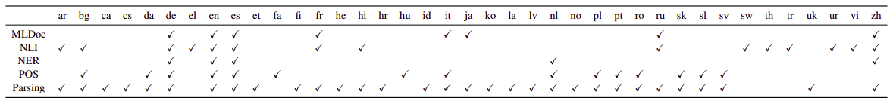
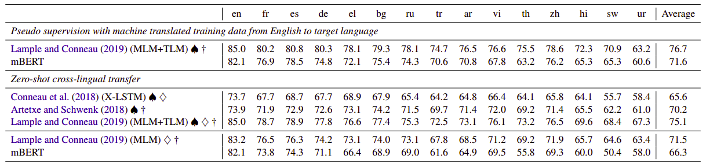
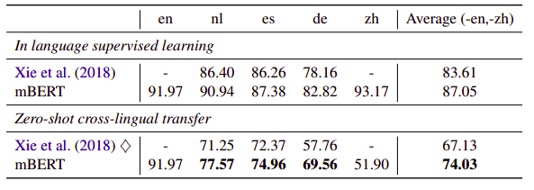
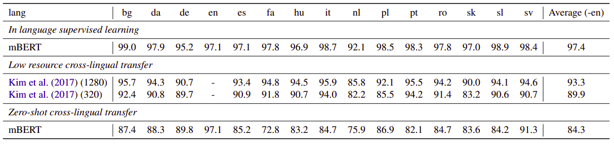
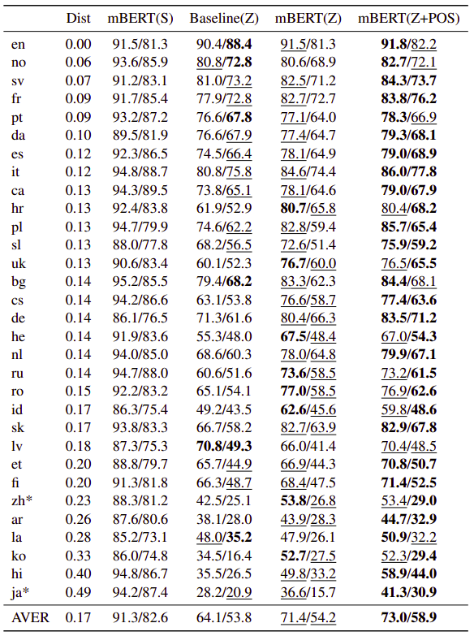

mBERT is a multilingual BERT pre-trained on 104 languages, released by the
authors of the original paper on Google Research's official GitHub repository: [google-research/bert
](https://github.com/google-research/bert/blob/master/multilingual.md) on 
November 2018. mBERT follows the same structure of BERT. The only difference is
that mBERT is pre-trained on concatenated Wikipedia data for 104 languages and
it does surprisingly well compared to cross-lingual word embeddings on zero-shot
cross-lingual transfer in XNLI dataset.

XNLI results are promising, but the question is: does mBERT learn a
cross-lingual space that supports zero-shot transfer? This paper: [Beto,
Bentz, Becas: The Surprising Cross-Lingual Effectiveness of
BERT](https://arxiv.org/pdf/1904.09077.pdf) published in 2019 by John
Hopkins University explores the cross-lingual potential of mBERT on five
different NLP tasks: NLI, NER, POS tagging, MLDoc classification, and
dependency parsing. According to the following graph, all five tasks
cover 39 languages out of the 104 languages that mBERT was pre-trained
on. The official code of this paper can be found on this GitHub repository:
[crosslingual-nlp](https://github.com/shijie-wu/crosslingual-nlp).

    

> **Note:**\
I suggest reading the
[BERT](https://anwarvic.github.io/language-modeling/BERT) part before
going on to the next part.

Results
-------

All the following results were obtained by using the mBERT~BASE~ which
$12$ transformer blocks, each has $12$ attention heads and $d_{h} = 768$
hidden dimensions forming around $179M$ parameters. mBERT uses dropout
of $0.1$ as a regularizer.

For each task, no preprocessing is performed except tokenization of
words into subwords with WordPiece. The vocabulary size for all 104
languages about $120k$ vocabulary. For fine-tuning, they used Adam for
fine-tuning with $\beta_{1} = 0.9,\ \beta_{2} = 0.999$ and L2 weight
decay of $0.01$. They warmed up the learning rate over the first $10\%$
of batches using linearly decay. Best hyper-parameters was selected by
searching a combination of batch size, learning rate and the number of
fine-tuning epochs with the following range:

-   Learning rate:
    $\left\\{ 2 \times 10^{- 5},\ 3 \times 10^{- 5},\ 5 \times 10^{- 5} \right\\}$.

-   Batch size: $\left\\{ 16,\ 32 \right\\}$.

-   Number of epochs: $\left\\{ 3,\ 4 \right\\}$.

In the following results, ♠ denotes the mBERT version trained on bitext
data found in this paper: [Massively multilingual sentence embeddings
for zeroshot cross-lingual transfer and
beyond](https://arxiv.org/pdf/1812.10464.pdf) while † denoted to XLM
model proposed by this paper: [Cross-lingual Language Model
Pretraining](https://arxiv.org/pdf/1901.07291.pdf). All results were
obtained by the model selected by development performance in English.
However, ◊ denotes model selection with target language dev set instead.
The best results are going to be **bold-faced**, while the second best
results are going to be <u>underlined</u> according to the following NLP
tasks:

-   **MLDOC classification:** On average, mBERT is the second best model
    after the XLM model with a very small margin.

    

-   **XNLI:** On average, mBERT performs relatively worse than XLM.

    

-   **NER:** On average, mBERT outperforms other models on this task.

    

-   **POS Tagging:**

    

-   **Dependency Parsing:**

    

