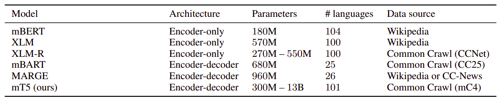
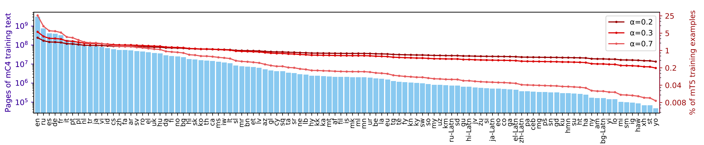
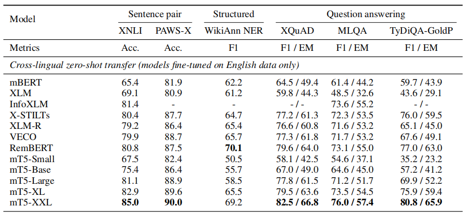
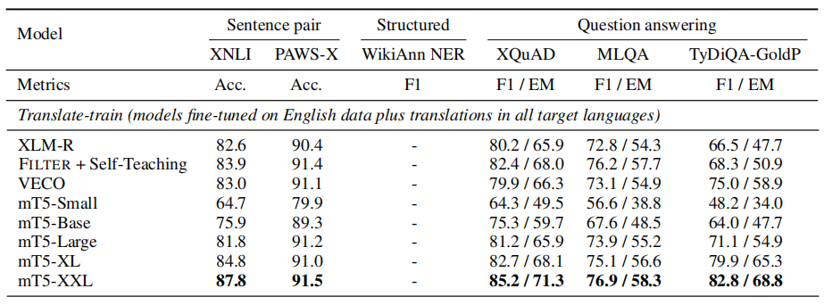
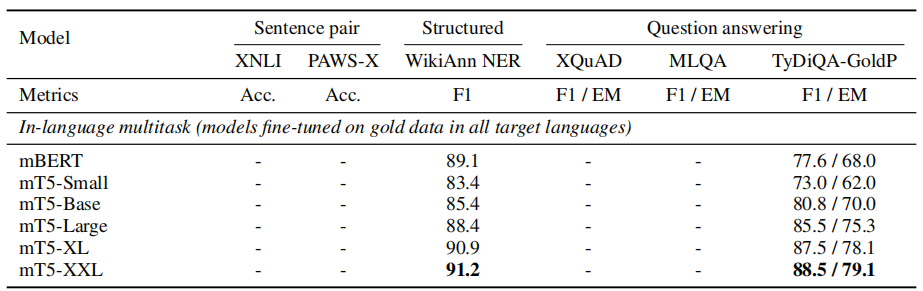
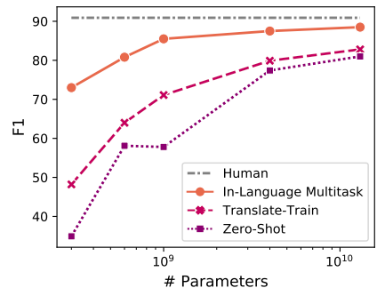
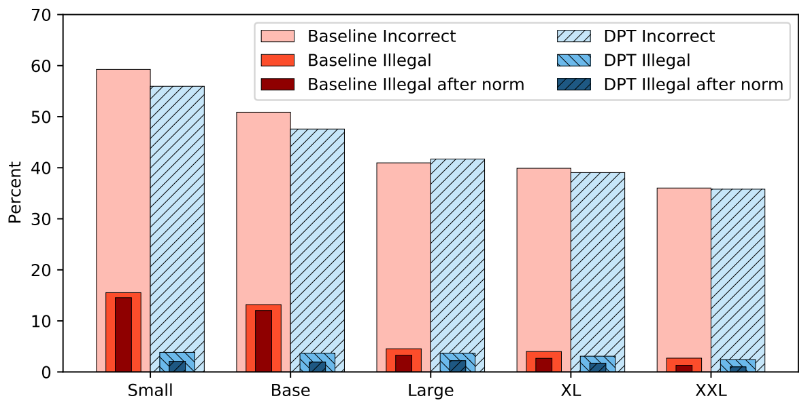

mT5 stands for "Multilingual Text-to-Text Transfer Transformer" which is
a multilingual variant of
[T5](https://anwarvic.github.io/language-modeling/T5) trained on 101
languages. mT5 was proposed by Google Research in 2020 and published in
their paper: [mT5: A Massively Multilingual Pre-trained Text-to-Text
Transformer](https://arxiv.org/pdf/2010.11934.pdf). The official code
can be found on Google Research's official GitHub repository:
[google-research/multilingual-t5](https://github.com/google-research/multilingual-t5).

The goal behind this paper and mT5 is to produce a massively
multilingual model that deviates as little as possible from the recipe
used to create T5. So, they based mT5 on the
"[T5.1.1](https://github.com/google-research/text-to-text-transfer-transformer/blob/master/released_checkpoints.md#t511)"
checkpoint which improves upon T5 architecture by using:

-   GeGLU non-linearities instead of ReLU.

-   Scaling both $d_{\text{model}}$ and $d_{\text{ff}}$ instead of just
    $d_{\text{ff}}$ in the larger models.

-   No dropout with pre-training.

    To put mT5 into perspective, the following table provides a brief
    comparison with existing cross-lingual language models such as:
    mBERT, [XLM](https://anwarvic.github.io/language-modeling/XLM),
    [XLM-R](https://anwarvic.github.io/language-modeling/XLM-R), and
    [MARGE](https://anwarvic.github.io/language-modeling/MARGE):

    

> **Note to reader:**\
Before getting deeper into this post, I suggest reading the [T5
post](https://anwarvic.github.io/language-modeling/T5) first. You
don't have to read all of it, just read the
[C4](https://anwarvic.github.io/language-modeling/T5/#C4) part and the
[baseline](https://anwarvic.github.io/language-modeling/T5/#Baseline) part.

mC4
---

To train mT5 on that many languages, they introduced a multilingual
variant of the [C4](https://www.tensorflow.org/datasets/catalog/c4)
dataset called mC4. mC4 comprises natural text in 101 languages drawn
from the public Common Crawl web scrape.

The C4 (Colossal Clean Crawled Corpus) dataset was explicitly designed
to be English only. In contrast, for mC4 they used [cld3
tool](https://github.com/google/cld3) to identify over 100 languages.
Since some of these languages are relatively scarce on the internet,
they made use of all of the 71 monthly web scrapes released so far by
[Common Crawl](http://commoncrawl.org/).

An important heuristic filtering step in C4 was the removal of lines
that did not end in an English terminal punctuation mark. Since many
languages do not use English terminal punctuation marks, they instead
applied a "line length filter" that requires pages to contain at least
three lines of text with 200 or more characters. Other than that, they
followed the C4's filtering steps which are:

-   They discarded any page with fewer than 5 sentences and only
    retained lines that contained at least 3 words.

-   They removed any page that contained any word on the "[List of
    Dirty, Naughty, Obscene or Otherwise Bad
    Words](https://github.com/LDNOOBW/List-of-Dirty-Naughty-Obscene-and-Otherwise-Bad-Words)".

-   They removed any line with the word JavaScript since it usually
    indicates an error on the web.

-   Some pages had placeholder "lorem ipsum" text; they removed any page
    where the phrase "lorem ipsum" appeared.

-   Some pages inadvertently contained code. Since the curly bracket "{"
    appears in many programming languages (such as Javascript, widely
    used on the web) but not in natural text, they removed any pages
    that contained a curly bracket.

-   To de-duplicate the dataset, they discarded all but one of any
    three-sentence span occurring more than once in the data set.

-   They detected each page's primary language using [cld3
    tool](https://github.com/google/cld3) and removed those with a
    confidence below 70%.

    After these filters are applied, they grouped the remaining pages by
    language and included in the corpus all languages with 10,000 or
    more pages. This produces text in 101 language as shown in the
    following figure which shows a histogram of the page counts for each
    language:

    

> **Note:**\
The previous histogram shows 107 languages as detected by cld3; and
that's because it handles the script variants of the same spoken
language. For example, **ru** is Russian in Cyrillic script and
**ru-Latn** is Russian in Latin script. Same applies for Japanese
(ja), Hindi (hi), Greek (el), Chinese (zh), and Bulgarian (bg).

Pre-Training Details
--------------------

Following the original T5 recipe, they considered five model sizes in
their experiments: <strong><u>mT5-Small (≈ 300M parameters)</u></strong>,
<strong><u>mT5-Base (580M)</u></strong>, <strong><u>mT5-Large (1.2B)</u></strong>,
<strong><u>mT5-XL (3.7B)</u></strong>, and <strong><u>mT5-XXL (13B)</u></strong>.
The increase in parameter counts compared to the corresponding T5 model
variants comes from the larger vocabulary used in mT5.

> **Note:**\
Because mT5 is an encoder-decoder model, it has roughly twice as many
parameters as correspondingly-sized encoder-only models such as XLM-R.
For example, the "XLM-R~Large~" has 550 million parameters whereas
mT5-Large has around 1 billion.

All mT5 variants were pre-trained for 1 million steps on batches of 1024
input sequences, corresponding to roughly 1 trillion input tokens total.
This is the same amount of pre-training as T5 and about 1/6 as much as
XLM-R. They used the same inverse square-root learning rate schedule
used by T5 during pre-training, with the learning rate set to
$\frac{1}{\sqrt{\max\left( n,k \right)}}$ where $n$ is the current
training iteration and $k = 10^{4}$ is the number of warm-up steps.

Following the
[T5.1.1](https://github.com/google-research/text-to-text-transfer-transformer/blob/master/released_checkpoints.md#t511)
recipe, they didn't apply dropout during pre-training. They used the
same self-supervised objective as T5, with $15\%$ of tokens masked and
an average noise span length of $3$.

### Sampling

A major factor in pre-training multilingual models is how to sample data
from each language. In this paper, they used temperature sampling to
boost lower-resource languages by sampling examples according to the
probability $p\left( L \right) \propto \left| L \right|^{\alpha}$, where
$p\left( L \right)$ is the probability of sampling text from a given
language $L$ during pre-training and $\left| L \right|$ is the number of
examples in the language. The hyper-parameter $\alpha$ (typically with
$\alpha < 1$) controls how much to "boost" the probability of training
on low-resource languages.

Values used by prior work include $\alpha = 0.7$ for mBERT,
$\alpha = 0.3$ for XLM-R, and $\alpha = 0.2$ for M4. They tried all
three of these values and found $\alpha = 0.3$ to give a reasonable
compromise between performance on high- and low-resource languages.

### Vocabulary

The fact that mT5 model covers over 100 languages necessitates a larger
vocabulary. Following
[XLM-R](https://anwarvic.github.io/language-modeling/XLM-R), they
increased the vocabulary size to 250,000 wordpieces. As in T5, they used
SentencePiece model trained with the language sampling rates used during
pre-training. To accommodate languages with large character sets like
Chinese, they used a character coverage of $0.99999$ and enable
SentencePiece's "byte-fallback" feature to ensure that any string can be
uniquely encoded.

Fine-tuning
-----------

To validate the performance of mT5, they evaluated it on 6 tasks from
the XTREME multilingual benchmark:

-   The XNLI entailment task covering 14 languages.

-   The XQuAD reading comprehension covering 10 languages.

-   The MLQA reading comprehension covering 7 languages.

-   The TyDi QA reading comprehension covering11 languages.

-   The Named Entity Recognition (NER) dataset of WikiAnn covering 40
    languages.

-   The PAWS-X paraphrase identification dataset covering 7 languages.

All tasks are casted into the text-to-text format. For example, if there are
multiple NER entities, then they are concatenated in the order they appear, and
if there are no entities then the target text is "None".

For fine-tuning, they used a constant learning rate of $0.001$ and dropout rate
of $0.1$ for all tasks. They used a batch size of $2^{17}$ for most tasks but
increased this up to $2^{20}$ in a few cases based on performance on the
validation set. For early stopping, they saved checkpoints every $200$ steps
and choose the checkpoint with the highest validation performance.

Regarding fine-tuning, they considered three variants:

-   **Zero-shot:** where the model is fine-tuned only on English
    data. The following table shows that mT5-XXL achieves state of the
    art results

    

-   **translate-train:** adding machine translations from English into
    each target language.

    

-   **in-language multi-task:** training on gold data in all target
    languages:

    

From the past results we can see that the model capacity is key to improving
performance on variants of the TyDi QA GoldP task in the absence of "gold"
multilingual data: For the smallest model, training on gold datasets
(in-language multitask) achieves dramatically better performance than using
weakly supervised data (translate-train) or English-only data (zero-shot),
whereas the gap between these three settings is much smaller for the largest
model. The following figure points that out clearly as it shows the average
F1 on the TyDi QA GoldP task across languages:

    

Accidental Translation
----------------------

Accidental translation is a problematic behavior with the mT5 model in
the zero-shot setting where the model start translating part or all of
the masked span into English (the language of all fine-tuning data). On
the one hand, it is remarkable that mT5 performs "spontaneous"
translation despite never seeing parallel training data. On the other,
it led to hurting the performance. This problem happens across all model
sizes and all XQuAD languages, but happens more in mT5-Small and
mT5-Base.

The researchers believe that the reason behind that is that the model
has never observed a non-English target during fine-tuning. To fix that,
they decided to use a technique called "Domain Preserving Training
(DPT)" which is to mix a unsupervised task with fine-tuning.

The unsupervised task they planned to use was the same as the mC4 task
definition as in pre-training, with just two adjustments:

-   First, they removed all "sentinel" tokens from the target sequence.

-   Second, they reduced the language sampling parameter $\alpha$ from
    $0.3$ to $0.1$. This produces a near uniform distribution of
    languages, encouraging the model to treat all languages as equally
    likely.

Then, they mixed a small amount of the unsupervised task (covering 101
languages) into XQuAD fine-tuning, at a ratio of just $1:100$. The following
figure shows the results on XQuAD zero-shot error rates. The addition of this
small amount of multilingual data has a marked effect on the mT5- Small and
mT5-Base models reducing the illegal prediction rates by more than $70%$
(relative), and contributing to an overall reduction in errors:

    

