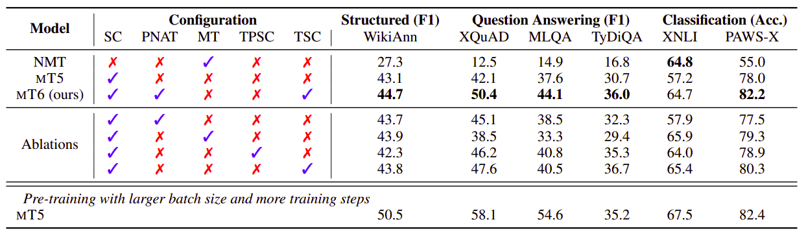

mT6 stands for "Multilingual Text-to-Text Transfer Transformer with
Translation pairs" which is an attempt to improve the performance of the
[mT5](https://anwarvic.github.io/cross-lingual-lm/mT5) model by
incorporating translation objectives into the pre-training part. This
model was proposed by Microsoft Research in 2021 and published in this
paper: [mT6: Multilingual Pretrained Text-to-Text Transformer with
Translation Pairs](https://arxiv.org/pdf/2104.08692.pdf).

A little bit of background: the mT5 model was pre-trained on mC4 dataset
(a multilingual version of the
[C4](https://www.tensorflow.org/datasets/catalog/c4) corpus) with a
masked language modeling "span-corruption" objective, where the encoder
is fed a chunk of text with random spans replaced with a mask token, and
the decoder must reconstruct the masked-out tokens. MT6 differs from MT5
in terms of both pre-training tasks and the training objective. We are
going to talk about that next.

Pre-training Tasks
------------------

One of the pre-training tasks used for T5 model and consequently mT5 was
Span Corruption which first randomly masks several spans of the input
sentence then the output is the concatenation of the original tokens of
the masked spans, each of which starts with a unique mask token to
indicate the span to be decoded as shown in the following figure:

    

In the paper, they presented three more text-to-text pre-training tasks
for improving mT5 with translation data. These pre-training tasks are:

-   <strong><u>Machine Translation (MT):</u></strong>\
    This is a typical text-to-text task with the goal of translating a
    sentence from the source language into a target language.

    

-   <strong><u>Translation Pair Span Corruption (TPSC):</u></strong>\
    Inspired by the
    [MASS](https://anwarvic.github.io/language-modeling/MASS) objective,
    this task aims to predict the masked spans from a translation pair
    instead of a monolingual sentence.

    

-   <strong><u>Translation Span Corruption (TSC):</u></strong>\
    A potential issue of TPSC is that the spans in the target sequence
    can be organized in unnatural word order. As shown in Figure 2, the
    output sequence of TPSC is organized as *"\[M1\] for your \[M2\]
    last week \[M3\] invitation \[M4\]"*. It can be found that the
    French word "invitation" is after the English word "week", which
    could harm the language model of the decoder. This motivated them to
    propose the translation span corruption (TSC) task where they only
    masked and predict the spans in one language.

    

Regarding the data, they used natural sentences from CCNet in 94 languages for
monolingual text-to-text tasks and parallel corpora of 14 English-centric
language pairs, collected from MultiUN, IIT Bombay, OPUS, and WikiMatrix.

PNAT Objective
--------------

Recall that the backbone architecture of mT5 is the simple
encoder-decoder Transformer which is trained to predict the target text
conditioned on the input source text in auto-regressive manner. Let $x$
and $y$ denote the input sequence and the output sequence respectively,
the loss function of mT5 will be:

$$\mathcal{L} = - \sum_{i = 1}^{\left| y \right|}{\log\left( p\left( y_{i} \middle| x,\ y_{< i} \right) \right)}$$

To encourage mT6 to utilize more information from the encoding side
while preserving the ability of auto-regressive decoding, they proposed
a new training objective for text-to-text training, called partially
non-auto-regressive decoding (PNAT). Let's see how PNAT works.

Given an input sequence containing $m$ spans, they divided it into
groups $n_{g}$ groups and trained the model to decode each group
separately where the prediction is only conditioned on the tokens from
the same group as shown in the following figure:

    

For the $j^{\text{th}}$ group, $l_{j}$ and $r_{j}$ are the start
position and the end position respectively. The PNAT objective is
defined as:

$$\mathcal{L}^{\text{PNAT}} = - \sum_{j = 1}^{n_{g}}{\sum_{i = l_{j}}^{r_{j}}{\log\left( p\left( y_{i} \middle| x,\ y_{l_{j}}\text{\ ...\ }y_{i - 1} \right) \right)}}$$

The mT6 model is jointly pre-trained on both monolingual and parallel
corpora using the original Span Corruption objective along with one of
the three different pre-training tasks proposed in this paper. So, the
overall pre-training objective is:

$$\mathcal{L}_{mT6} = \mathcal{L}_{\text{SC}}^{\text{PNAT}} + \mathcal{L}_{X}^{\text{PNAT}},\ \ \ \ x \in \left\{ MT,\ TPSC,\ TSC \right\}$$

Results
-------

In all of the experiments, they considered the mT5-small model, with
$d_{\text{model}} = 512$, $d_{\text{ff}} = 1024$, $6$ attention heads,
and 8 layers for both the encoder and the decoder. They used the
vocabulary provided by XLM-R, and extended it with 100 unique mask
tokens for the span corruption tasks. They pre-trained mT6 for $0.5M$
steps with batches of $256$ length-$512$ input sequences. The model was
optimized by the Adam optimizer with a linear learning rate scheduler.
All hyper-parameters needed for pre-training and fine-tuning this model
are described below:

    

And the following are the results on fine-tuning benchmarks:

-   **XTREME:** All results are averaged over five runs.

    

-   **Gigaword multilingual Abstractive summarization:** RG is short for
    ROUGE. mT5 & mT6 results are averaged over three runs:

    

-   **Wikilingua cross-lingual summarization:** All results are ROUGE-2
    scores and averaged over three runs:

    

