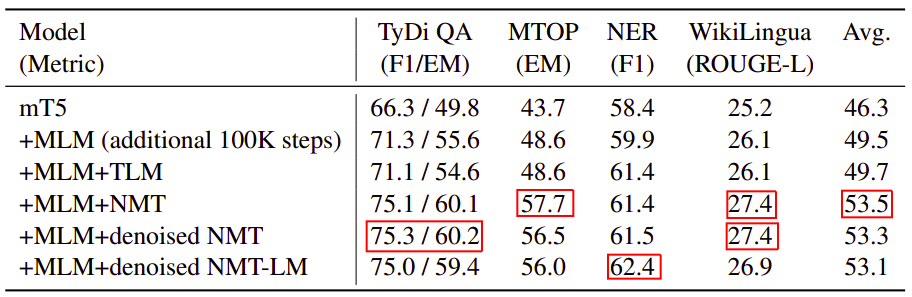
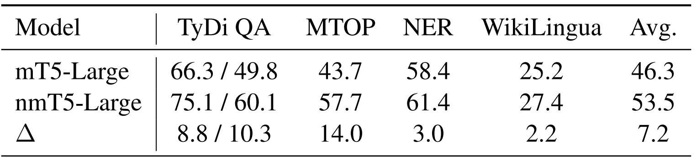
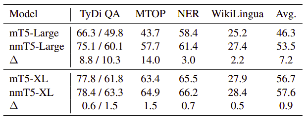

nmT5 stands for "NMT + Multilingual Text-to-Text Transfer Transformer"
which is an attempt to improve the performance of the
[mT5](https://anwarvic.github.io/cross-lingual-lm/mT5) model by
incorporating parallel data into pre-training. This model was proposed
by the same authors from Google Research as the mT5 paper. In 2021, it
was published in this paper: [nmT5 - Is parallel data still relevant for
pre-training massively multilingual language
models?](https://aclanthology.org/2021.acl-short.87.pdf).

A little bit of background: the mT5 model was pre-trained on mC4 dataset
(a multilingual version of the
[C4](https://www.tensorflow.org/datasets/catalog/c4) corpus) with a
masked language modeling "span-corruption" objective, where the encoder
is fed a chunk of text with random spans replaced with a mask token, and
the decoder must reconstruct the masked-out tokens. In this paper, they
are trying different objectives to incorporate parallel data into
pre-training:

-   <strong><u>TLM (Translation Language Modeling):</u></strong>\
    This objective was first proposed by the
    [XLM](https://anwarvic.github.io/language-modeling/XLM) model and
    was used for encoder only pre-training. In this paper, they extended
    it to the encoder-decoder setting.

    

-   <strong><u>NMT (Neural Machine Translation):</u></strong>\
    The input is the source text and the target is its translation. A
    language code is prefixed to the input to inform the model of the
    target language.

    

-   <strong><u>Denoised-NMT:</u></strong>\
    Similar to NMT, but with mask spans in the source sentence. The
    model must now learn to implicitly perform language modeling of the
    source language while translating into the target language.

    

-   <strong><u>Denoised-NMT+LM:</u></strong>\
    Similar to Denoised-NMT, but instead of implicit language modeling,
    the model must explicitly predict the source text in addition to the
    translation. The target is a concatenation of the translation and
    source sentence, while the input is the masked source sentence.

    

> **Note:**\
nmT5 is the mT5 model with the NMT objective.

Results
-------

In this paper, they used the mT5-Large model to perform the following
experiments, which is a 24 layer encoder-decoder transformer model.
Instead of training a new model from scratch, they started from the
publicly available mT5-Large checkpoint - which has been trained for
over 1 trillion tokens - and did a second stage pre-training with a mix
of monolingual and parallel data.

For pre-training, they used monolingual data from mC4 and parallel data
from OPUS-100 which contains 55M translations covering 100 languages.
The mC4 corpus consists of unlabeled web text covering 101 languages, of
which 81 overlap with the OPUS-100 languages.

Starting from publicly available mT5-Large checkpoints, they pre-trained
for 100K steps with a mix of monolingual and parallel objectives. The
parallel data is mixed into monolingual data at a $10\%$ ratio, which
amounts to roughly 4 passes over the OPUS-100 corpus. Examples from each
language pair were sampled using the same language sampling distribution
as [mT5](https://anwarvic.github.io/cross-lingual-lm/mT5) with
$\alpha = 0.3$.

Pre-training was done with a batch size of 1M tokens and fine-tuned with
$131,072$ tokens, with a constant learning rate of $0.001$. For
fine-tuning, they fine-tuned for $10,000$ steps for TyDiQA, MTOP, NER
and $25,000$ for WikiLingua, since it is a much larger dataset.
Checkpoint selection is done based on the validation set.

The following table shows the results averaged across all the languages.
Overall, adding parallel data through neural machine translation
objectives improves scores for all 4 tasks, with the NMT objective
performing the best.

    

From the past table, we can see that all NMT-based objectives shows
gains over mT5 across all tasks. Among these, NMT averages the best
among all other objectives leading to 7.2 higher scores averaging across
all four tasks:

    

Model Size
----------

Researchers of mT5 found out that cross-lingual performance of language
models increases monotonically with model size, that's why the mT5-XXL
had the highest performance across five out of six tasks.

To study the impact of model capacity here, the researchers also
experimented with larger model sizes. Using the mT5-XL size (3.7B
params, 3× larger than mT5-Large), they observed gains for all tasks
with nmT5. However, the magnitude of the gains is largely diminished,
hinting that the need for parallel data reduces as model capacity
increases.

    

This finding is particularly promising for low-resource languages, where
it is difficult to obtain high-quality parallel data. At the same time,
nmT5-Large substantially reduces the performance gap between mT5-Large
and mT5-XL, covering 70% of the headroom. Since bigger models are
expensive to train and even more expensive to deploy, this opens up
avenues for effectively using parallel data to improve performance of
smaller language models.
