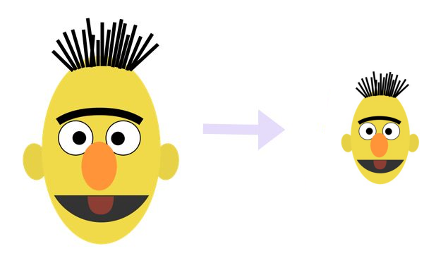
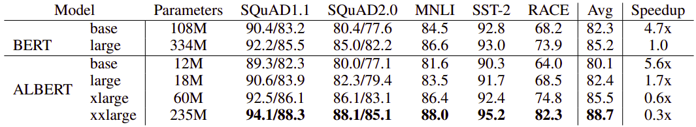
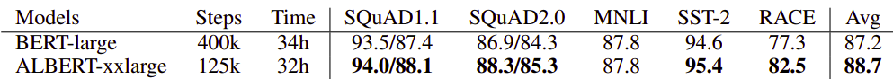
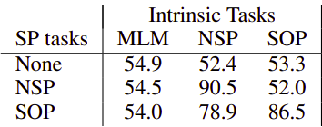
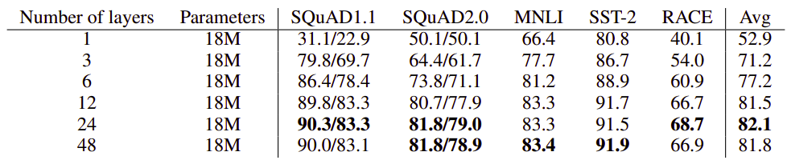
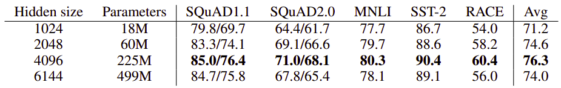
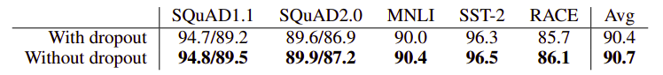
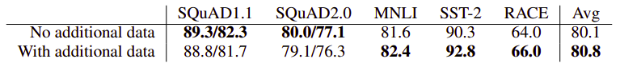

ALBERT, stands for "A Lite BERT", reduced version of BERT which is a
smaller, faster, cheaper and easier to scale. ALBERT was created by
Google & Toyota Technical Institute in February 2019 and published in
this paper: "[ALBERT: A Lite Bert For Self-Supervised Learning Of
Language Representations](https://arxiv.org/pdf/1909.11942.pdf)" and you can
fine the official code for this paper in Google Research’s official GitHub
repository: [google-research/ALBERT](https://github.com/google-research/ALBERT).

    

ALBERT incorporates two parameter reduction techniques that act as a form of
regularization that stabilizes the training and helps with generalization; and
one new loss function:

-   Factorized Embedding Parameterization

-   Cross-layer Parameter Sharing

-   Sentence-Order Prediction Loss

Also, The parameter reduction techniques also act as a form of
regularization that stabilizes the training and helps with
generalization.

These three modifications significantly reduce the number of
parameters for BERT without seriously hurting performance. An ALBERT
configuration similar to BERT-large has 18x fewer parameters and can
be trained about 1.7x faster as shown in the following table:

    

And since longer training usually leads to better performance, the
following table shows a comparison between the performance BERT and
ALBERT after the same training time which shows that ALBERT still
performs better:

    

Factorized Embedding Parameterization
-------------------------------------

In BERT, the Word embedding size $E$ is tied with the hidden layer size
$H$, i.e., $E\  \equiv \ H$. This decision appears sub-optimal for the
following reasons:

-   Word embeddings are meant to learn context-independent
    representations, whereas hidden-layer embeddings are meant to
    learn context-dependent representations. And that dictates that
    $H \gg E$.

-   NLP usually requires the vocabulary size $V$ to be large. If
    $E \equiv H$, then increasing $H$ increases the size of the
    embedding matrix, which has size $V \times E$. This can easily
    result in a model with billions of parameters, most of which are
    only updated sparsely during training.

So, instead of projecting the one-hot vectors directly into the hidden
space of size H, they first projected them into a lower dimensional
embedding space of size E, and then projected it to the hidden space. By
using this decomposition, we reduce the embedding parameters from
$O(V \times H)$ to
$O\left( \left( V \times E \right) + \left( E \times H \right) \right)$.
This parameter reduction is significant when $H \gg E$.

Cross-layer Parameter Sharing
-----------------------------

The default decision for ALBERT is to share all parameters across
layers. The following figure shows the L2 distances and cosine
similarity of the input and output embeddings for each layer. We observe
that the transitions from layer to layer are much smoother for ALBERT
than for BERT.

These results show that weight-sharing has an effect on stabilizing
network parameters. Although there is a drop for both metrics compared
to BERT, they nevertheless do not converge to 0 even after 24 layers.

    

Sentence-Order Prediction (SOP)
-------------------------------

In this paper, they proposed a new loss function called sentence-order
prediction (SOP) loss as a replacement for next sentence prediction
(NSP) used with BERT. The same as NSP, SOP loss uses two consecutive
segments from the same document as a positive example. And as negative
examples, it uses the same two consecutive segments but with their order
swapped.

This forces the model to learn finer-grained distinctions about
discourse-level coherence properties. As shown in the following table,
it turns out that NSP cannot solve the SOP task at all, while SOP can
solve the NSP task to a reasonable degree.

    

Hyper-parameters
----------------

In this part, we are going to talk about the effect of some
hyper-parameters on ALBERT:

-   **Network Depth (number of layers):**\
    If we compare a 3-layer ALBERT model with a 1-layer ALBERT model,
    although they have the same number of parameters, the performance
    increases significantly. However, there are diminishing returns
    when continuing to increase the number of layers: the results of a
    12-layer network are relatively close to the results of a 24-layer
    network, and the performance of a 48-layer network appears to
    decline.

    

-   **Network Width (hidden size):**\
    Using a 3-layers ALBERT, we can see that as we increase the hidden
    size, we get an increase in performance with diminishing returns.
    At a hidden size of 6144, the performance appears to decline
    significantly:

    

-   **Dropout:**\
    Using ALBERT-xxlarge at around 1M training steps states that
    removing dropout helps the downstream tasks which indicates that
    ALBERT models didn't overfit the data.

    

-   **Data:**\
    Adding more data improvements on the downstream tasks, except
    for the SQuAD benchmarks (which are Wikipedia-based, and therefore
    are negatively affected by out-of-domain training material).

    

