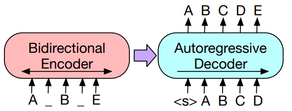
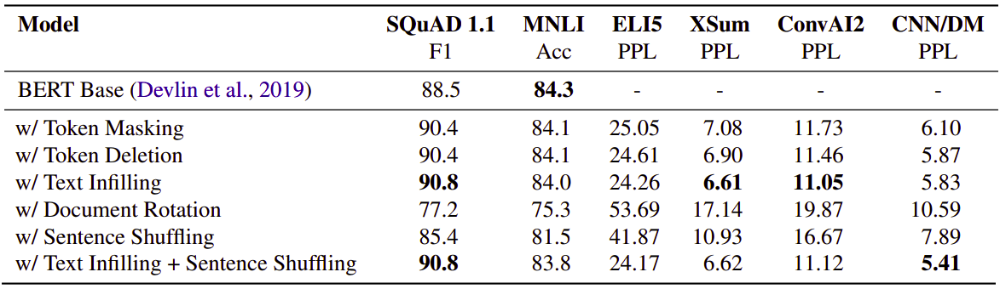
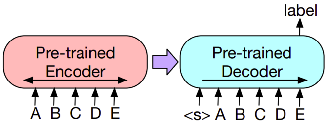
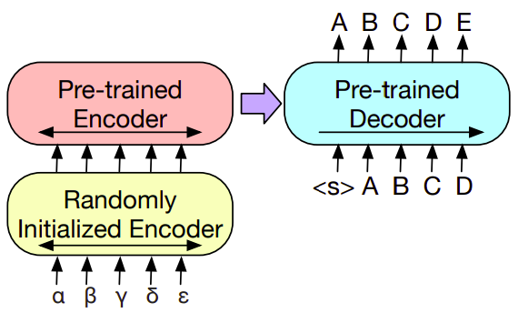

BART stands for "Bidirectional Auto-regressive Transformer" which is a
pre-training scheme for models created by Facebook AI in 2019 and
published in this paper: "[BART: Denoising Sequence-to-Sequence
Pre-training for Natural Language Generation, Translation, and
Comprehension](https://arxiv.org/pdf/1910.13461.pdf)". Pre-training is
the process of training a model with one task that is able to help it
form parameters that can be used to make other tasks easier. And this is
what we, human beings, do. We use our old knowledge of what we have
learned in the past to understand new knowledge and handle a variety of
new tasks.

BART was published in a paper under the name: "Denoising
Sequence-to-Sequence Pre-training for Natural Language Generation,
Translation, and Comprehension". From, the name of the paper, we can
conclude the following:

-   The pre-training method in BART is **denoising**; denoising is when
    you corrupt the input text with an arbitrary noising function, and
    try to reconstruct the original text.

-   BART is a sequence-to-sequence model or encoder-decoder architecture.

-   BART is for any sequence-to-sequence data such as natural language
    generation, machine translation, and machine comprehension.

Put in simple words, BART is the same as the standard transformer that
we discussed with NMT with a few differences:

-   BART uses Bi-directional encoder (same as BERT) and a
    uni-directional decoder from left to right (same as GPT).

-   BART uses GELU as an activation function instead of ReLU.

-   The parameters are initialized from a $\mathcal{N}\left( 0,\ 0.02 \right)$
    distribution.

-   BART is pre-trained.

    

Pre-training
------------

The encoder and the decoder are pre-trained in BART using different
techniques. The encoder is pre-trained by masking some of the input
tokens and trying to predict these masked tokens (same as BERT). While
the decoder is trained by giving the preceding tokens and trying to
predict the next token (same as GPT).

    

Unlike any other model, BART allows us to apply any type of document
corruption. In the paper, they experimented with several previously
proposed and novel transformations which are summarized below:

-   **Token Masking**: Following BERT random tokens are sampled and
    replaced with \[MASK\] token.

-   **Token Deletion**: Random tokens are deleted from the input. In
    contrast to token masking, the model must decide which positions
    are missing inputs.

-   **Sentence Permutation**: A document is divided into sentences based
    on full stops, and these sentences are shuffled in a random order.

-   **Document Rotation**: A token is chosen uniformly at random, and
    the document is rotated so that it begins with that token. This
    task trains the model to identify the start of the document.

-   **Text Infilling**: Following SpanBERT, a number of text spans are
    sampled, with span lengths drawn from a Poisson distribution
    ($\lambda = 3$). Each span is replaced with a single \[MASK\]
    token. 0-length spans correspond to the insertion of \[MASK\]
    tokens. Text infilling teaches the model to predict how many
    tokens are missing from a span.

And the following table summarizes which noising function perform
best at which task. All models are of comparable size and are
trained for 1M steps on a combination of books and Wikipedia data.
Performance varies considerably across tasks, but the BART models
with text infilling demonstrate the most consistently strong
performance:

    

> **Note:**\
These noising functions can be combined as seen in the last entry of
the above table.

Fine-tuning Tasks
-----------------

Same as BERT, The representations produced by BART can be used in
several ways for downstream applications.

-   **Text Classification:**\
    The same input is fed into the encoder and decoder, and the
    final hidden state of the final decoder token is fed into new
    multi-class linear classifier. This approach is related to the CLS
    token in BERT.

    

-   **Sequence Generation:**\
    Because BART has an autoregressive decoder, it can be directly
    fine tuned for sequence generation tasks such as abstractive
    question answering and summarization.

-   **Machine Translation:**\
    We replace BART's encoder embedding layer with a new randomly
    initialized encoder. The model is trained end-to-end, which trains
    the new encoder to map foreign words into an input that BART can
    de-noise to English. The encoder part is trained in two steps, in
    both cases backpropagating the cross-entropy loss from the output
    of the BART model:

    -   In the first step, we freeze BART parameters and only update the
        randomly initialized source encoder, the BART positional
        embeddings, and the self-attention input projection matrix of
        BART's encoder first layer.

    -   In the second step, we train all model parameters for a small
        number of iterations.

    

