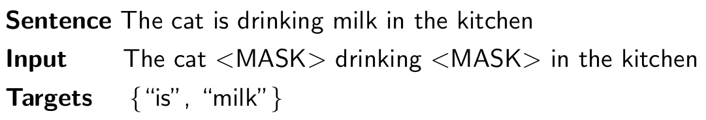
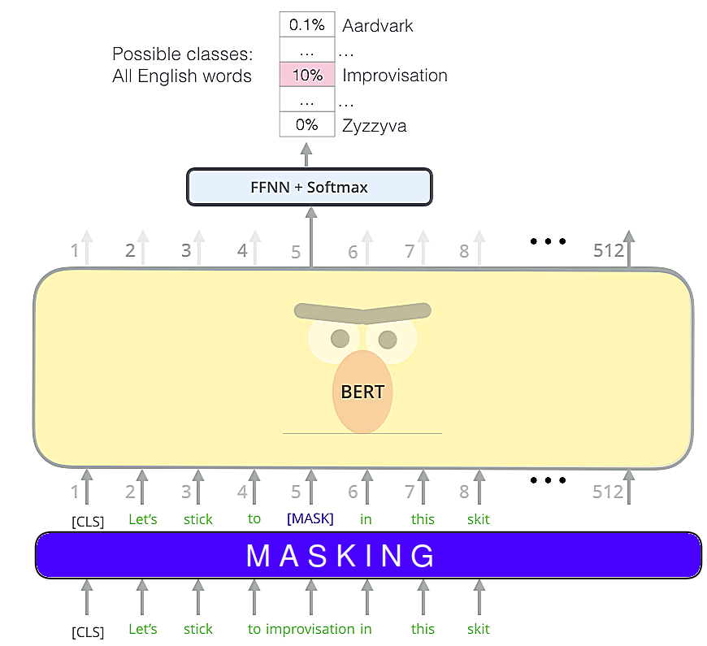
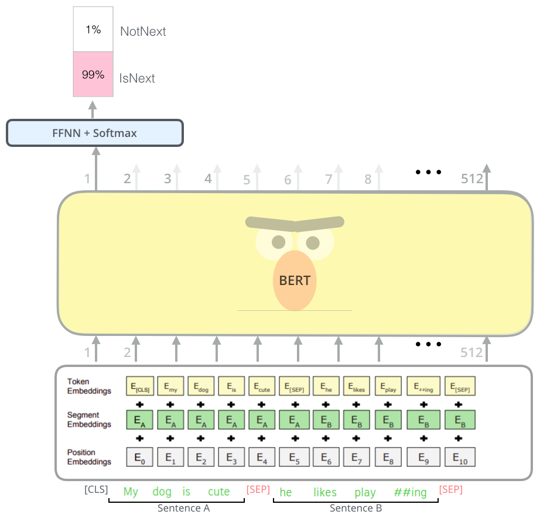
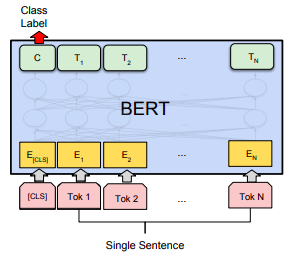
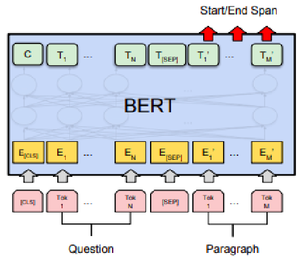
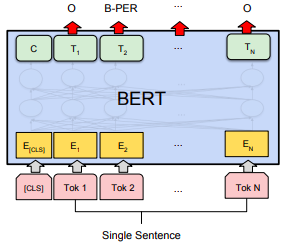
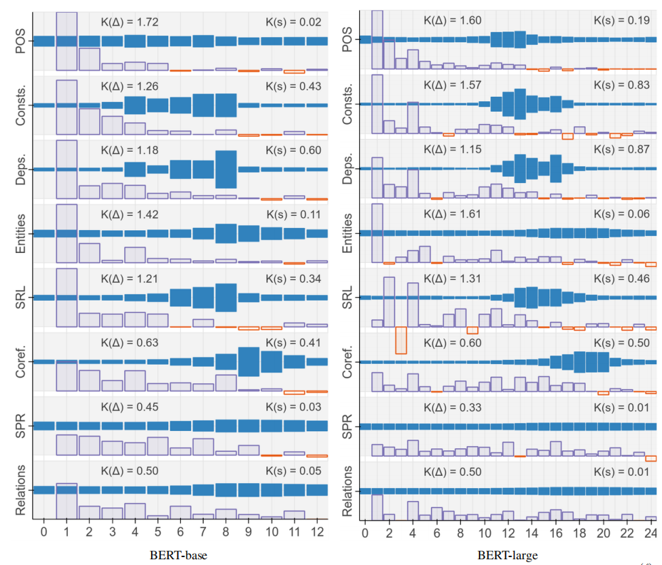

BERT stands for "Bidirectional Encoder Representations from
Transformers" which is a model published by researchers at Google in
this paper: "[BERT: Pre-training of Deep Bidirectional Transformers for
Language Understanding](https://arxiv.org/pdf/1810.04805.pdf)" in 2018.
It has caused a stir in the NLP community by presenting state-of-the-art
results in a wide variety of NLP tasks, including Question Answering
(SQuAD v1.1), Natural Language Inference (MNLI), and others.

BERT's key technical innovation is applying the bidirectional training
to the openAI Transformer. See, the openAI transformer gave us a
fine-tunable pre-trained language model based on the Transformer. But
something went missing in this transition from LSTMs to Transformers.
LSTM language model was bi-directional, but the openAI transformer only
trains a forward language model. BERT introduced a novel technique to
train the openAI transformer in bi-directional manner which is to train
BERT using two unsupervised tasks:

-   **Masked LM (MLM):** To catch the contextual relation between words.
    Very important for tasks like languge modeling, text
    classification, \...etc.

-   **Next Sentence Prediction (NSP):** To catch the contextual relation
    between sentences. Very important for tasks like Question
    Answering, Natural Language Inference\... etc.

MLM
---

Since bidirectional conditioning requires each word to indirectly see
itself and others in a multi-layered context, researchers had to find a
way to overcome this obstacle. And they did that by introducing
<u><strong>masks</strong></u>. Previously, this technique was called "Cloze
procedure" where the key idea is to remove words from the input and
predict them with the remaining input. As you've probably guessed, this
is very similar to the CBOW model for distributed word embeddings.

    

In the paper; they said that before feeding word sequences into BERT,
15% of the words in each sequence are replaced with a \[MASK\] token;
and the type of mask will be different according to the following
distribution

-   80% of the time: the mask will be \[MASK\].

-   10% of the time: the mask will be a random word.

-   10% of the time: The mask will be the original word.

    The advantage of this procedure is that the Transformer-encoder does
    not know which words it will be asked to predict or which have been
    replaced by random words, so it is forced to keep a distributional
    contextual representation of every input token. Additionally,
    because random replacement only occurs for 1.5% of all tokens (i.e.,
    10% of 15%), this does not seem to harm the model's language
    understanding capability.

    After that, the model attempts to predict the original value of the
    masked words, based on the context provided by the other,
    non-masked, words in the sequence. In technical terms, the
    prediction of the output words requires:

-   Adding a classification layer on top of the encoder output.

-   Multiplying the output vectors by the embedding matrix, transforming
    them into the vocabulary dimension.

-   Calculating the probability of each word in the vocabulary with softmax.

    

The BERT loss function takes into consideration only the prediction of
the masked values and ignores the prediction of the non-masked words. As
a consequence, the model converges slower than directional models.

> **Note:**\
There is a new token \[CLS\] added to the start of the input sentence
when passed to BERT. \[CLS\] stands for classification and this is just
a way to tell BERT we are using your architecture for classification.

Now, let’s ask a very important question: what happens if we increased the
masking percentage to more than 15%? Actually, researchers at Princeton tried
to answer this question in their paper "[Should You Mask 15% in Masked Language
Modeling?](https://arxiv.org/pdf/2202.08005.pdf)" published in 2022. And they
found out that masking up to 40% of input tokens can outperform the 15%
baseline, and even masking 80% can preserve most of the performance,
as measured by fine-tuning on downstream tasks. You can use this GitHub
repository: [princeton-nlp/dinkytrain](https://github.com/princeton-nlp/dinkytrain)
to reproduce their results.

NSP
---

Many important downstream tasks such as Question Answering and Natural
Language Inference are based on understanding the relationship between
two sentences, which is not directly captured by language modeling.

In order to make BERT better at handling relationships between multiple
sentences, the pre-training process includes an additional task called
"Next Sentence Prediction (NSP)" where the model receives pairs of
sentences as input and learns to predict if the second sentence in the
pair is the subsequent sentence in the original document.

During training, 50% of the inputs are a pair in which the second
sentence is the subsequent sentence in the original document, while in
the other 50% a random sentence from the corpus is chosen as the second
sentence. To help the model distinguish between the two sentences in
training, the input is processed in the following way before entering
the model:

-   A \[CLS\] token is inserted at the beginning of the first sentence
    and a \[SEP\] token is inserted at the end of each sentence.

-   A sentence embedding indicating Sentence A or Sentence B is added to
    each token. Sentence embeddings are similar in concept to token
    embeddings with a vocabulary of 2.

-   A positional embedding is added to each token to indicate its
    position in the sequence. The concept and implementation of
    positional embedding are presented in the Transformer paper.

And all of this information can be seen in the following figure:

    

Fine-tuning Tasks
-----------------

    

Fine-tuning in this context means <u><strong>using BERT for a specific task</strong></u>
such as QA, text classification, language inference, \...etc. BERT can be used
for a wide variety of language tasks, while only adding a small layer to the
core model as explained in:

-   **Text Classification:**\
    Classification tasks such as sentiment analysis are done
    similarly to Next Sentence classification, by adding a
    classification layer on top of the Transformer output for the
    \[CLS\] token.

    

-   **Question Answering:**\
    A question-answering model can be trained by learning two extra
    vectors that mark the beginning and the end of the answer.

    

-   **Named Entity Recognition (NER):**\
    BERT can be trained by feeding the output vector of each token
    into a classification layer that predicts the NER label.

BERT Linguistic Patterns
------------------------

According to this paper "[BERT Rediscovers the Classical NLP
Pipeline](https://arxiv.org/pdf/1905.05950.pdf)" published by Google in
2019, the authors of this paper found out that different layers of BERT
capture different linguistic semantics. For example, they found out that
lower layers of BERT encode more local syntax while higher layers
capture more complex semantics. They used a pre-trained BERT-base &
BERT-Large on eight different tasks.

The following table shows the layer-wise metrics on BERT-base (left) and
BERT-large (right) where blue bars are mixing weights that tell us
<u><strong>which layers are most relevant when a probing classifier at this
layer has access to the whole BERT model</strong></u>, while purple
bars are differential scores normalized for each task which 
<u><strong>measures how much better we do on the probing task if we observe
one additional encoder layer</strong></u>:

    

From the past figure, if we have access to the whole BERT model, we can
see the following with respect to each task:

-   **Part-of-speech (POS):** The purple bars show that the first few
    layers are the most important; and the blue bars show us that
    probing the first layers will have the same effect as the last
    layers.

-   **Constituents (Consts.):** The purple bars show that the first few
    layers are the most important; and the blue bars show us that
    probing the middle layers will have the highest effect.

-   **Dependencies (Deps.):** The purple bars show that the first few
    layers of BERT-base are the most important while the middle layers
    of BERT-large are the most important; and the blue bars show us that
    probing the middle layers will have the highest effect.

-   **Entities:** The purple bars show that the first few layers are the
    most important; and the blue bars show us that probing the
    middle-last layers will have the highest effect.

-   **Semantic role labeling (SRL):** The purple bars show that the
    first few layers are the most important; and the blue bars show us
    that probing the middle layers will have the highest effect.

-   **Coreference (Coref.):** The purple bars show that the last few
    layers are the least important; and the blue bars show us that
    probing the middle-last layers will have the highest effect.

-   **Semantic proto-roles (SPR):** The purple bars show all layers are
    important; and the blue bars show us that probing over all layers
    has the same effect.

-   **Relation classification (SemEval):** The purple bars show all
    layers are important; and the blue bars show us that probing over
    all layers has the same effect.

Base / Large BERT
-----------------

The paper presents two model sizes for BERT:

-   **BERT BASE:** Comparable in size to the OpenAI Transformer in order
    to compare performance.

-   **BERT LARGE:** A ridiculously huge model which achieved the state
    of the art results reported in the paper.

The following summarizes the difference between both models:

<table>
    <thead>
        <tr>
            <th></th>
            <th>BERT SMALL</th>
            <th>BERT BASE</th>
            <th>BERT LARGE</th>
        </tr>
    </thead>
    <tr>
        <td><strong>Transformer Blocks</strong></td>
        <td>4</td>
        <td>12</td>
        <td>24</td>
    </tr>
    <tr>
        <td><strong>Feed-Forward hidden neurons</strong></td>
        <td>312</td>
        <td>768</td>
        <td>1024</td>
    </tr>
    <tr>
        <td><strong>Attention Heads</strong></td>
        <td>12</td>
        <td>12</td>
        <td>16</td>
    </tr>
    <tr>
        <td><strong>Input Tokens</strong></td>
        <td>512</td>
        <td>512</td>
        <td>512</td>
    </tr>
    <tr>
        <td><strong>Parameters</strong></td>
        <td>14.5 million</td>
        <td>110 million</td>
        <td>345 million</td>
    </tr>
    <tr>
        <td><strong>Hardware for Training</strong></td>
        <td>-</td>
        <td>4 TPU + 4 days</td>
        <td>16 TPU + 4 days</td>
    </tr>
    <tr>
        <td><strong>Hardware for Inference</strong></td>
        <td>-</td>
        <td>1 GPU</td>
        <td>1 TPU</td>
    </tr>
</table>

BERT Vs GPT
-----------

The most comparable existing pre-training method to BERT is OpenAI GPT,
which trains a left-to-right Transformer LM on a large text corpus. In
fact, many of the design decisions in BERT were intentionally made to
make it as close to GPT as possible so that the two methods could be
minimally compared. However, there are several other differences:

-   GPT is trained on the BooksCorpus (800M words); BERT is trained on
    the BooksCorpus (800M words) and Wikipedia (2,500M words).

-   GPT uses a sentence separator (\[SEP\]) and classifier token
    (\[CLS\]) which are only introduced at fine-tuning time; BERT
    learns \[SEP\], \[CLS\] and sentence A/B embeddings during
    pre-training.

-   GPT was trained for 1M steps with a batch size of 32,000 words; BERT
    was trained for 1M steps with a batch size of 128,000 words.

-   GPT used the same learning rate of 5e-5 for all fine-tuning
    experiments; BERT chooses a task-specific fine-tuning learning
    rate which performs the best on the development set.
