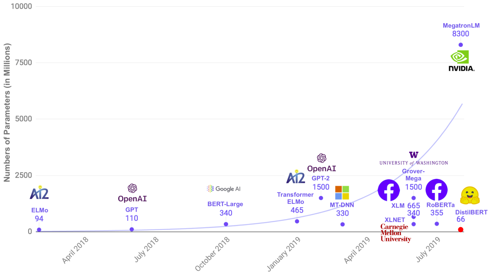
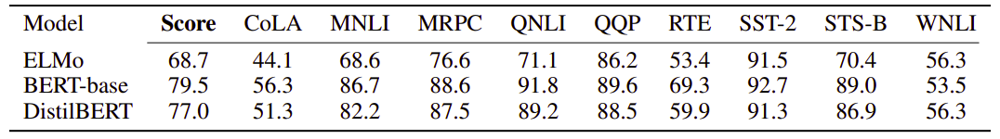
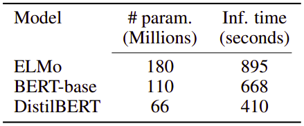

DistilBERT is a smaller, faster, cheaper and lighter version of BERT
created by Hugging Face in March 2020 and published in this paper:
"[DistilBERT, a distilled version of BERT: smaller, faster, cheaper and
lighter](https://arxiv.org/pdf/1910.01108.pdf)". In this paper, they
used knowledge distillation to reduce the size of a BERT by 40%, while
retaining 97% of its language understanding capabilities and being 60%
faster. This was possible by using a triple loss function that combines
language modeling, distillation and cosine-distance losses.

The following figure shows a simple comparison between DistilBERT and
other models with respect to the number of parameters; which shows that
DistilBERT is small enough to run on the edge, e.g. on mobile devices.

    

Knowledge Distillation
----------------------

Knowledge distillation is a compression technique in which a compact
model (the student) is trained to reproduce the behaviour of a larger
model (the teacher). The teacher is trained on the hard labels (labels
that belongs to one class) while the student is trained on soft labels
(the class probabilities) which resulted from the teacher. In other
words, the teacher is trained on the true labels from the training data
and results probabilities that will be used to teach the student.

    

Triple Loss
-----------

In this paper, the student (DistilBERT) is trained with a triple loss
which is a linear combination of three different losses which are:

-   $\mathcal{L}\_{\text{ce}}$:\
    a distillation loss over the soft target probabilities of the teacher
    (BERT) where $t_{i}$ is the probability estimated by the teacher and
    $s_{i}$ is the probability estimated by the student.

$$\mathcal{L}_{\text{ce}} = \sum_{i}^{}{t_{i}\text{.log}\left( s_{i} \right)}$$

&emsp;&emsp;&emsp;Calculating the probability ($t_{i}$ and $s_{i}$) is done using the
softmax-temperature function where T is the temperature that controls
the smoothness of the output distribution knowing that the same
temperature will be used for the student and the teacher:

$$p_{i} = \frac{\exp\left( \frac{z_{i}}{T} \right)}{\sum_{j}^{}{\exp\left( \frac{z_{j}}{T} \right)}}$$

-   $\mathcal{L}\_{\text{MLM}}$:\
    a masked language model loss; the same as BERT where ${\widehat{x}}_{i}$ is
    the predicted word and $x_{i}$ is the true word.

$$\mathcal{L}_{\text{MLM}}\left( x_{i} \right) = - \log\left( {\widehat{x}}_{i} \middle| x_{i} \right)$$

-   $\mathcal{L}_{\cos}$:\
    a cosine embedding loss which will tend to align the directions of the
    student and teacher hidden states vectors.

Architecture
------------

The student (DistilBERT) has the same general architecture as BERT with
these changes:

-   The token-type embeddings and the pooler are removed.

-   The number of layers is reduced by a factor of 2.

-   Most of the operations used in the Transformer architecture (linear
    layer and layer normalisation) are highly optimized in modern
    linear algebra frameworks.

-   Taking advantage of the common dimensionality between teacher and
    student networks, they initialized the student from the teacher by
    taking one layer out of two.

-   Following best practices, they used a very large batches (up to 4K
    examples per batch) using dynamic masking and without the next
    sentence prediction (NSP) objective.

And to show how efficient that was, let's look on a simple
comparison between DistilBERT and BERT on GLUE:

    

As we can see, DistilBERT retains 97% of BERT's performance while being
40% smaller and 60% faster as shown in the following table:

    

