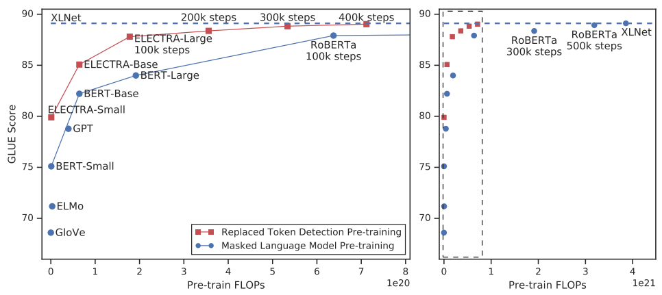
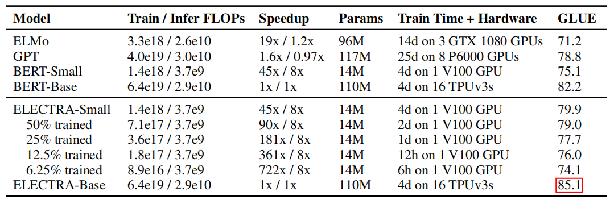
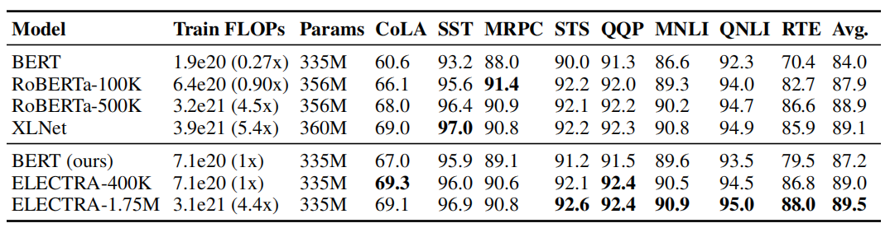
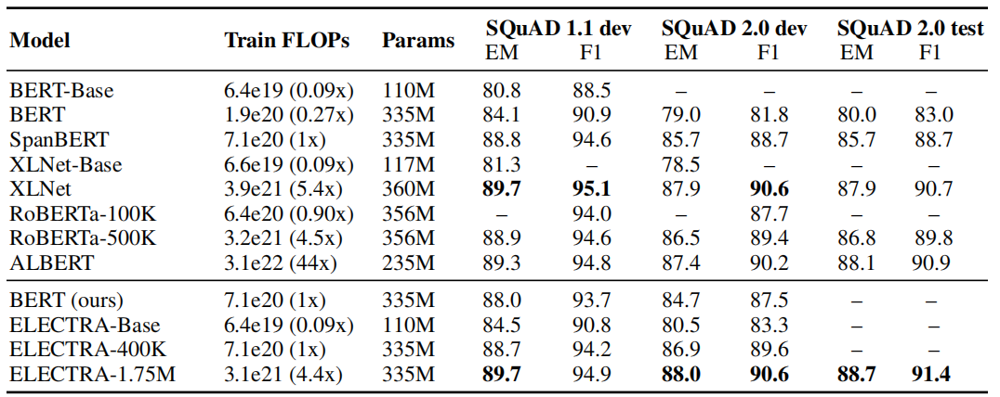
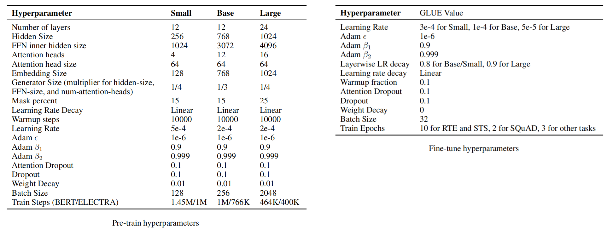

ELECTRA stands for "Efficiently Learning an Encoder that Classifies
Token Replacements Accurately" which is a <u><strong>discriminator language
model</strong></u> unlike the widely-used generative language models such as
BERT, GPT, \...etc. ELECTRA was proposed by Stanford University in
collaboration with Google Brain in 2020 and published in their paper:
[ELECTRA: Pre-training text Encoders](https://arxiv.org/pdf/2003.10555.pdf).
The official code of this paper can be found on Google Research's official
GitHub repository:
[google-research/electra](https://github.com/google-research/electra).

Generative language models such as BERT was pre-trained using MLM
objective where some tokens of the input sentence get masked, then the
model is trained to reconstruct them back. These generative models
produce good results but they require large amounts of data and
computation power to be effective.

This paper suggests an alternative pre-training task called "Replaced
Token Detection" (RTD for short) that won't require that much data or
computation power. According to the following table, the "Replaced Token
Detection" method outperforms MLM pre-training given the same model size, data,
and compute budget:

    

Replaced Token Detection (RTD)
------------------------------

Replaced Token Detection is a pre-training task that was introduced in
this paper as a replacement for MLM. Instead of masking, this method
corrupts the input by replacing some tokens with plausible alternatives
sampled from a small generator network. And the discriminator (ELECTRA)
learns to distinguish between the original tokens and the synthetically
generated ones as shown below:

    

As seen in the above figure, this task trains two neural networks; each
consists of a transformer-encoder architecture that maps a sequence of
input tokens $X = \left\lbrack x_{1},\ ...\ x_{n} \right\rbrack$ into a
sequence of vectors
$h\left( X \right) = \left\lbrack h_{1},\ ...\ h_{n} \right\rbrack$.

-   <u><strong>Generator</strong></u> $G$:\
    Given an input $X = \left\lbrack x_{1},\ ...\ x_{n} \right\rbrack$,
    MLM first selects a random set of positions (integers from 1 to n)
    with a probability of $15\%$ to mask out tokens $X^{\text{masked}}$.
    Then, the generator learns to predict the original tokens of the
    masked-out ones. For a given position $t$ where
    $x_{t} = \left\lbrack \text{MASK} \right\rbrack$, the generator
    outputs a probability for generating a particular token $x_{t}$ with
    a softmax layer where $e\left( x \right)$ is the embedding of token
    $x$:

$$p_{G}\left( x_{t} \middle| X \right) = \text{softmax}\left( {e\left( x_{t} \right)}^{T}.h_{G}\left( X \right)_{t} \right)$$

-   <u><strong>Discriminator (ELECTRA)</strong></u> $D$:\
    For a given position $t$, the discriminator predicts whether the
    token $x_{t}$ is "real" or generated $X^{\text{corrupt}}$ using a
    sigmoid layer:

$$D\left( X,t \right) = \text{sigmoid}\left( w^{T}.h_{D}\left( X \right)_{t} \right)$$

And when training the model on the Replaced Token Detection task, the
model tries to minimize the following loss function over a large corpus
$\mathcal{X}$ of raw text:

$$\mathcal{L} = \min_{\theta_{G},\ \theta_{D}}\left( \sum_{X \in \mathcal{X}}^{}{\mathcal{L}_{\text{MLM}}\left( X,\ \theta_{G} \right) + \lambda\mathcal{L}_{\text{Disc}}\left( X,\ \theta_{D} \right)} \right)$$

$$\mathcal{L}_{\text{MLM}}\left( X,\ \theta_{G} \right) = \mathbb{E}\left( \sum_{i \in m}^{}{- log\ p_{G}\left( x_{i} \middle| X^{\text{masked}} \right)} \right)$$

$$\mathcal{L}_{\text{Disc}}\left( X,\ \theta_{D} \right) = \mathbb{E}\left( \sum_{t = 1}^{n}{- \mathbb{l}\left( x_{t}^{\text{corrupt}} = x_{t} \right)\text{.log}\left( D\left( X^{\text{corrupt}},\ t \right) \right) - \mathbb{l}\left( x_{t}^{\text{corrupt}} \neq x_{t} \right)\text{.log}\left( 1 - D\left( X^{\text{corrupt}},\ t \right) \right)} \right)$$

> **Note:**\
This task looks like a GAN (General Adversarial Network) but it is not
adversarial since the generator doesn't try to fool the discriminator.
Its job is to generate replace the masked tokens with the exact tokens
that were masked.

Experiments
-----------

For most of the experiments, ELECTRA was pre-trained on the same data as
[BERT](https://anwarvic.github.io/language-modeling/BERT), which
consists of 3.3 Billion tokens from Wikipedia and BooksCorpus. However,
Large models were pre-trained on the data used for
[XLNet](https://anwarvic.github.io/language-modeling/XLNet), which
extends the BERT dataset to 33B tokens by including data from ClueWeb,
CommonCrawl, and Gigaword. For fine-tuning on GLUE, a simple linear
classifiers is added on top of ELECTRA.

The following table compares various small models on the GLUE dev set.
BERT-Small/Base use the same hyper-parameters as ELECTRA-Small/Base. The
table shows that ELECTRA performs better than BERT scoring 5 GLUE points
higher.

    

> **Note:**\
In the original
[BERT](https://anwarvic.github.io/language-modeling/BERT) paper, there
were no BERT~Small~. They created BERT~Small~ using a smaller
hyper-parameters of BERT~Base~; they reduced the sequence length (from
512 to 128), with smaller batch size (from 256 to 128), smaller hidden
dimension size (from 768 to 256), and smaller token embeddings (from 768
to 128). To provide a fair comparison, they created BERT-Small model
using the same hyper-parameters and trained it 1.5M steps, so it uses
the same training FLOPs as ELECTRA-Small, which was trained for 1M
steps.

The following table compares ELECTRA-Large with BERT~Large~ on the GLUE
dev set. ELECTRA-Large was trained for longer steps; ELECTRA-400k was
trained for 400k steps which is 25% of RoBERTa training time and
ELECTRA-1.74M was trained for 1.74M steps which is similar to RoBERTa
training time. The table shows that ELCETRA-400k performs comparably to
RoBERTa and XLNet and ELECTRA-1.75M outperforms the other models on
various tasks.

    

Same applies for SQuAD benchmark, ELECTRA-1.75M scores better than all
masked-language modelings given the same compute resources:

    

> **Note:**\
The following is the complete list of all hyper-parameters used for
ELECTRA on pre-training (left) and fine-tuning (right):

    

