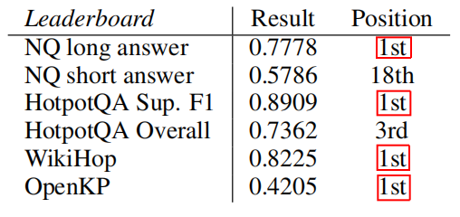
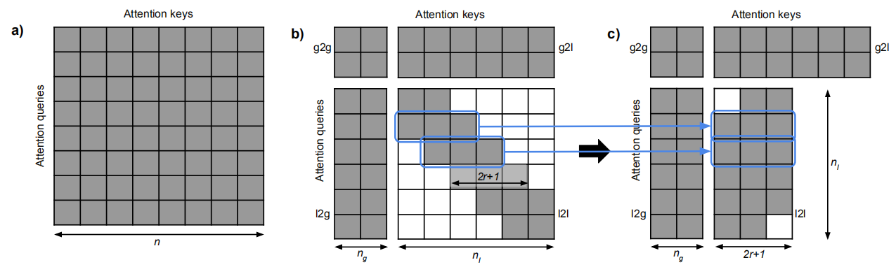
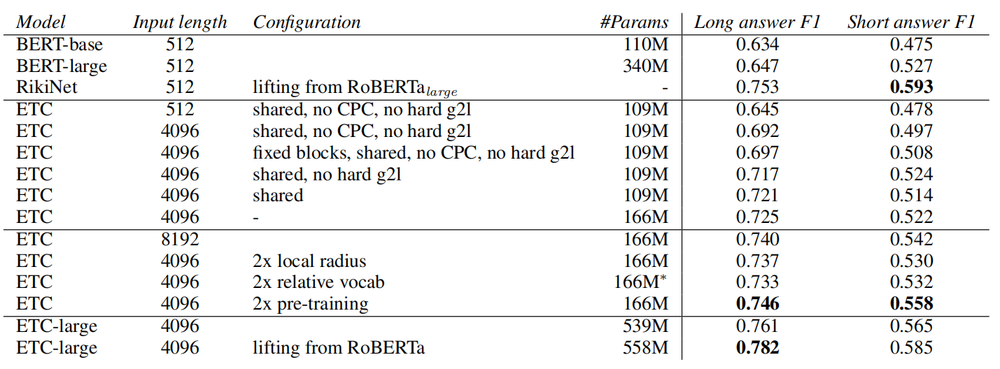
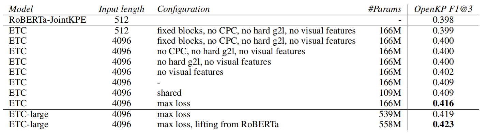
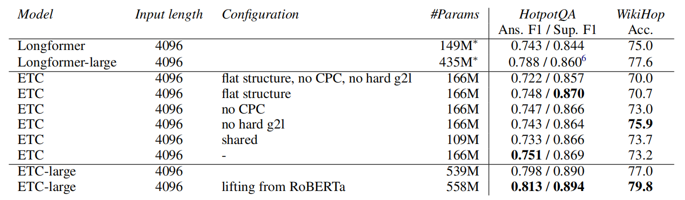

ETC stands for "Extended Transformer Construction" which is a new
Transformer architecture for language modeling over long sentences and
achieves state-of-the-art performance on various long-sentence tasks as
shown in the following table. ETC was proposed by Google in 2020 and
published in this paper: "[ETC: Encoding Long and Structured Inputs in
Transformers](https://arxiv.org/pdf/2004.08483.pdf)". The official code
for this paper can be found on Google Research's official GitHub
repository: [research-etc-model
](https://github.com/google-research/google-research/tree/master/etcmodel).

    

Many variants of the original
[Transformer](https://anwarvic.github.io/machine-translation/Transformer)
model have been proposed for language modeling such as
[BERT](https://anwarvic.github.io/language-modeling/BERT),
[RoBERTa](https://anwarvic.github.io/language-modeling/RoBERTa),
[ALBERT](https://anwarvic.github.io/language-modeling/ALBERT), or even
[T5](https://anwarvic.github.io/language-modeling/T5) limit inputs to
$n = 512$ tokens due to the $O\left( n^{2} \right)$ cost of attention.
ETC scales to longer input sentences up to $n = 8192$ tokens or more.
ETC follows the encoder-side of the original Transformer architecture
with three key modifications to tackle long inputs:

-   Relative Position Encoding

-   Global-local Attention.

-   CPC pre-training task.

Relative Position Encoding
--------------------------

Inspired by the work of this paper: [Self-attention with relative
position representations](https://arxiv.org/pdf/1803.02155.pdf), ETC
replaces absolute position encodings with relative position encodings.
There will be $2k + 1$ relative positions given a maximum clipping
distance $k$, no matter the length of the input sentence. Given the
input sequence $x = \left\\{ x_{1},\ ...\ x_{n} \right\\}$, the relative
position between two tokens $x_{i}$ and $x_{j}$ will be:

$$\left\{ \begin{matrix}
l_{j - i}\ \ \ \ \  - k < j - i < k \\
l_{- k}\ \ \ \ \ \ \ \ \ \ \ \ \ j - i \leq - k \\
l_{k}\ \ \ \ \ \ \ \ \ \ \ \ \ j - i \geq - k \\
\end{matrix} \right. $$

Each relative position then becomes a learnable vector $a_{l}^{K}$,
which modifies the attention mechanism as we are going to see later.
Now, we can clearly see that these relative position encodings are
independent of input length, so it is easy to adapt a model to greater
input lengths.

Global-local Attention
----------------------

Given the input sequence $x = \left\\{ x_{1},\ ...\ x_{n} \right\\}$, ETC
model will split it into two separate sequences:

-   **The long input** $x^{l}$: which contains the input that standard
    Transformer would get.

$$x^{l} = \left\{ x_{1}^{l},\ ...x_{n_{l}}^{l} \right\}$$

-   **The global input** $x^{g}$: which is a much smaller number of
    auxiliary tokens $\left( n_{g} \ll n_{l} \right)$:

$$x^{g} = \left\{ x_{1}^{g},\ ...x_{n_{g}}^{g} \right\}$$

Then, attention will be split into four separate pieces:
<u><strong>global-to-global (g2g)</strong></u>,
<u><strong>global-to-long (g2l)</strong></u>,
<u><strong>long-to-global (l2g)</strong></u>,
and <u><strong>long-to-long (l2l)</strong></u>.
Attention in the l2l piece is restricted to a fixed radius as we can see
in the following figure (part c); because it is the most computationally
expensive part of the whole attention mechanism.

    

Attention in ETC is
$O\left( n_{g}\left( n_{g} + n_{l} \right) + n_{l}\left( n_{g} + 2r + 1 \right) \right)$.
Since $n_{l} \gg n_{g},\ r$, then the attention mechanism becomes
$O\left( n_{g}^{2} + n_{g}n_{l} \right)$. As we can see, the attention
mechanism is linear in the size of the long input . The attention
mechanism is applied via the following steps:

-   Per-instance, four Boolean attention matrices
    $M^{g2g} \in \mathbb{R}^{n_{g} \times n_{g}}$,
    $M^{g2l} \in \mathbb{R}^{n_{g} \times n_{l}}$,
    $M^{l2g} \in \mathbb{R}^{n_{l} \times n_{g}}$, and
    $M^{l2l} \in \mathbb{R}^{n_{l} \times n_{l}}$are created with zeroes
    for those pairs of tokens that should not attend to one another and
    ones for the rest.

-   Given the global input $x^{g}$ which is a sequence of token
    representations $x_{i}^{g} \in \mathbb{R}^{d_{x}}$, a large constant
    $C = 10,000$ (in the paper), $a_{\text{ij}}^{K}$ learnable vectors
    representing the relative positions, and $W^{Q},\ W^{K}$ learnable
    weight matrices, the attention embedding between $x_{i}$ and $x_{j}$
    in the global-to-global part can be calculated as:

$$e_{\text{ij}}^{g2g} = \frac{x_{i}^{g}W^{Q}\left( x_{j}^{g}W^{K} + a_{\text{ij}}^{K} \right)^{T}}{\sqrt{d_{z}}} - \left( 1 - M_{\text{ij}}^{g2g} \right)C$$

-   A softmax is used to calculate $\alpha_{\text{ij}}^{g2g}$:

$$\alpha_{\text{ij}}^{g2g} = \frac{\exp\left( e_{\text{ij}}^{g2g} \right)}{\sum_{l = 1}^{n}{\exp\left( e_{\text{il}}^{g2g} \right)}}$$

-   The attention output of the global-to-global part is
    $z^{g} = \left\\{ z_{1}^{g},\ ...z_{n_{g}}^{g} \right\\}$ where
    $z_{i}^{g} \in \mathbb{R}^{d_{z}}$ which uses $W^{V}$ as a learnable
    weight matrix is calculated as follows:

$$z_{i}^{g} = \sum_{j = 1}^{n_{g}}{\alpha_{\text{ij}}^{g2g}.x_{j}^{g}.W^{V}}$$

-   Attention for the other 3 pieces is analogous to this one.

-   At the end, a single softmax is used to jointly calculate
    $\alpha_{\text{ij}}^{g2g}$ and $\alpha_{\text{ij}}^{g2l}$ while
    another one for $\alpha_{\text{ij}}^{l2g}$ and
    $\alpha_{\text{ij}}^{l2l}$. I DON'T KNOW HOW :(

-   Thus, the output of global-local attention is a sequence of length
    $n_{g}$ and one of length $n_{l}$. These sequences go through a
    layer normalization and feed forward layer in the same way as in the
    standard transformer.

CPC
---

ETC model uses two pre-training tasks. The first one is Masked Language
Modeling (MLM) with whole word masking which means if one word piece
token is masked, then all other tokens of the same word are masked. The
second one is Contrastive Predictive Coding (CPC). The goal of CPC is to
predict subsequent inputs in latent space, i.e., to predict internal
hidden representations of blocks of tokens. We adapted this idea in ETC
by using global input sentence summary tokens.

Given an input sequence containing $n$ sentences, we mask all the tokens
corresponding to a subset of sentences (but leave the sentence summary
tokens in the global input). Then, the model is trained to minimize the
difference between the hidden representation of the global sentence
summary tokens for the masked sentences with respect to that of a global
summary token that can see the unmasked sentence and nothing else. A
Noise Contrastive Estimation (NCE) loss is used:

Experiments
-----------

ETC model was initialized using RoBERTa parameters. This is doable since
BERT's attention is a special case of the global-local attention used in
ETC. Same as RoBERTa, they created two basic configurations:

<table>
    <thead>
        <tr>
            <th></th>
            <th>Layers</th>
            <th>Hidden Size</th>
            <th>Attention Heads</th>
            <th># Parameters</th>
            <th>$$r$$</th>
            <th>$$k$$</th>
        </tr>
    </thead>
    <tr>
        <td><strong>Base</strong></td>
        <td>12</td>
        <td>768</td>
        <td>12</td>
        <td>166 M</td>
        <td>84</td>
        <td>12</td>
    </tr>
    <tr>
        <td><strong>Large</strong></td>
        <td>24</td>
        <td>1024</td>
        <td>16</td>
        <td>558 M</td>
        <td>169</td>
        <td>24</td>
    </tr>
</table>

For pre-training; they used original BERT datasets, except that
documents with fewer than 7 sentences were filtered out with WordPiece
vocabulary of 30k uncased wordpieces . ETC-base was pre-trained with the
same total number of tokens as the original BERT, while ETC-large was
pre-trained with twice as many. As an optimizer, they used LAMB
optimizer with learning rate set to $\sqrt{8} \times 10^{- 3}$.

The following are the results obtained by ETC in various benchmarks; the
defaulted configuration is marked with "-":

-   **Natural Questions (NQ):**

    

-   **OpenKP:**

    

-   **HotpotQA and WikiHop:**

    

