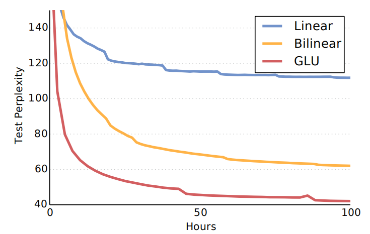

One of the major defects of Seq2Seq models is that it can't process
words in parallel. For a large corpus of text, this increases the time
spent translating the text. CNNs can help us solve this problem. In this
paper: "[Language Modeling with Gated Convolutional
Networks](https://arxiv.org/pdf/1612.08083v3.pdf)", proposed by FAIR
(Facebook AI Research) in 2017, the researchers developed a new
architecture that uses gating mechanism over stacked convolution layers
that outperforms the
[Seq2Seq](https://anwarvic.github.io/machine-translation/Seq2Seq) model.

    

Using stacked convolutions layers is more efficient since it allows
parallelization over sequential tokens. Using a kernel size of $k$ over
a context of size $N$, this new architecture will perform
$O\left( \frac{N}{k} \right)$ operations unlike recurrent networks which
will perform a linear number $O\left( N \right)$ of operations. The
former figure illustrates the model architecture; where:

-   The input to the model is a sequence of words $w_{0},\ ...w_{N}$.

-   Each word is represented by a vector embedding stored in a lookup
    table $D^{\left| V \right| \times e}$ where $\left| V \right|$ is
    the vocabulary and $e$ is the embedding size.

-   After the lookup table, the input will be represented as word
    embeddings:

$$E = \left\lbrack D_{w_{0}},\ ...\ D_{w_{N}} \right\rbrack$$

-   The hidden layers $h_{0},\ ...h_{L}$, where $L$ is the number of
    layers, are computed as:

$$h_{l}\left( X \right) = \left( X*W + b \right) \otimes \sigma\left( X*V + c \right)$$

Where $X \in \mathbb{R}^{N \times m}$ is the input of layer $h_{l}$
(either word embeddings or the outputs of previous layers),
$W \in \mathbb{R}^{k \times m \times n}$, $b \in \mathbb{R}^{n}$,
$V \in \mathbb{R}^{k \times m \times n}$, and $c \in \mathbb{R}^{n}$ are
learned parameters, $m$ and $n$ are respectively the number of input and
output feature maps, $\sigma$ is the sigmoid function and $\otimes$ is
the element-wise product between matrices.

> **Note:**\
When convolving inputs, they made sure that $h_{i}$ does not contain
information from future words by shifting the convolutional inputs to
prevent the kernels from seeing future context.

Adaptive Softmax
----------------

The simplest choice to To obtain model's predictions at the last layer
is to use a softmax layer, but this choice is often computationally
inefficient for large vocabularies. A better choice could be
hierarchical softmax ([Morin & Bengio, 2005](Hierarchical probabilistic
neural network language model)).

In the paper, they chose an improvement of the latter known as adaptive
softmax which assigns higher capacity to very frequent words and lower
capacity to rare words. This results in lower memory requirements as
well as faster computation at both training and test time. You can find
an efficient implementation of Adaptive Softmax in Facebook Research's
official GitHub repository:
[facebookresearch/adaptive-softmax](https://github.com/facebookresearch/adaptive-softmax).

Experiments
-----------

All experiments in this paper were using two public large-scale language
modeling datasets: [Google's Billion
word](https://code.google.com/archive/p/1-billion-word-language-modeling-benchmark/)
dataset (one billion token) and
[WikiText-103](https://www.salesforce.com/products/einstein/ai-research/the-wikitext-dependency-language-modeling-dataset/)
dataset (100M tokens). For both datasets, $\left\langle S \right\rangle$
and $\left\langle /S \right\rangle$ tokens were added at the start and
end of each line respectively. In terms of optimization, they
initialized the layers of the model with the He initialization with the
learning rate sampled uniformly in the interval
$\lbrack 1.,\ 2.\rbrack$, the momentum was set to $0.99$, and gradient
clipping was set to $0.1$ to prevent gradient explosion. Also, weight
normalization was used to make training faster as seen in the following
figure:

    

For model architecture, they selected the number of residual blocks
between $\left\{ 1,\ ...10 \right\}$, the size of the embeddings with
$\left\{ 128,\ ...256 \right\}$, the number of units between
$\left\{ 128,\ ...2048 \right\}$, and the kernel width between
$\left\{ 3,\ ...5 \right\}$ as shown in the following table:

    

The following table shows the test perplexity over Google's Billion word
dataset; as we can see, GCNN outperforms all LSTMs with the same output
approximation while only requiring a fraction of the operations:

    

Same thing happens with WikiText-103 dataset; GCNN outperforms LSTM
models:

    

The following figure shows a comparison between GCNN and the
[state-of-the-art LSTM model](https://arxiv.org/pdf/1602.02410.pdf) back
in 2016 which uses the full softmax, the adaptive softmax approximation
greatly reduces the number of operations required to reach a given
perplexity:

    

Gating Mechanism (GLU)
----------------------

Gating mechanisms control the path through which information flows in
the network. [LSTMs](https://anwarvic.github.io/language-modeling/RNN)
enable long-term memory via a separate cell controlled by different
gates (forget, update, output gates). This allows information to flow
through potentially many timesteps and without these gates, information
could easily vanish.

In contrast, convolutional networks do not suffer from the same kind of
vanishing gradient and we find experimentally that they do not require
forget gates. Therefore, they considered using only <u><strong>output
gates</strong></u>, which allow the network to control what information
should be propagated through the hierarchy of layers.

In this paper, they tried four different output gating mechanisms on the
[WikiText-103
benchmark](https://www.salesforce.com/products/einstein/ai-research/the-wikitext-dependency-language-modeling-dataset/):

-   **Tanh (not gating mechanism):**

$$h_{l}\left( X \right) = \tanh\left( X*W + b \right)$$

-   **ReLU (not gating mechanism):**

$$h_{l}\left( X \right) = \text{ReLU}\left( X*W + b \right)$$

-   **Gated Tanh Unit (GTU):**

$$h_{l}\left( X \right) = \tanh\left( X*W + b \right) \otimes \sigma\left( X*V + c \right)$$

-   **Gated Linear Unit (GLU):**

$$h_{l}\left( X \right) = \left( X*W + b \right) \otimes \sigma\left( X*V + c \right)$$

And the results show that GLU achieves the best perplexity over the data
as seen in the following figure. There is a gap of about 5 perplexity
points between the GLU and ReLU which is similar to the difference
between the LSTM and RNN models on the same dataset.

    

**Note:**\
The difference between GTU and $\text{Tanh}$ models shows us the effect
of gating mechanism since the $\text{Tanh}$ model can be thought of as a
GTU network with the sigmoid gating units removed:

The experiments so far have shown that the GLU benefits from the linear
path the unit provides compared to other non-linearities such as GTU.
That's why they decided to compare GLU to purely linear networks in
order to measure the impact of the nonlinear path provided by the gates
of the GLU. In the paper, they compared GLU to:

-   **Linear (not gating mechanism):**

$$h_{l}\left( X \right) = \left( X*W + b \right)$$

-   **Bi-linear:**

$$h_{l}\left( X \right) = \left( X*W + b \right) \otimes \left( X*V + c \right)$$

The following figure shows the performance of the three mechanisms on
Google's [Billion word
benchmark](https://code.google.com/archive/p/1-billion-word-language-modeling-benchmark/).
As we can see, GLU still outperforms other methods

    

Context Size $k$
----------------

The following figure shows the impact of context size for GCNN on
Google's Billion word dataset (left graph) and WikiText-103 dataset
(right graph). Generally, larger contexts improve accuracy but returns
drastically diminish with windows larger than 40 words:

    

The previous figure Figure 4 also shows that WikiText-103 benefits much
more from larger context size than Google Billion Word as the
performance degrades more sharply with smaller contexts.
