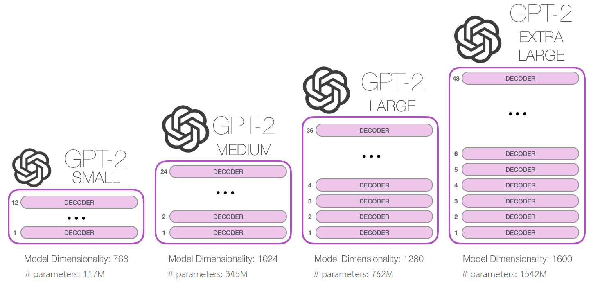
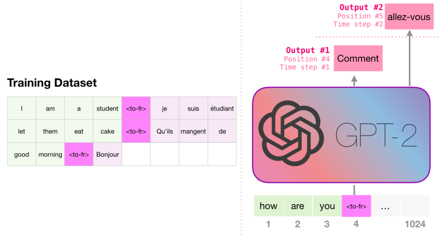

GPT-2 stands for "Generative Pre-trained Transformer" which is a
language model published in this paper: "[Language Models are
Unsupervised Multitask
Learners](https://cdn.openai.com/better-language-models/language_models_are_unsupervised_multitask_learners.pdf)"
by OpenAI in 2019. In the paper, they tried to demonstrate that language
models can perform down-stream tasks such as (question answering,
machine translation, reading comprehension, and summarization) in a
zero-shot setting -- without any parameter or architecture modification.

One great way to experiment with GPT-2 is using the [AllenAI GPT-2
Explorer](https://demo.allennlp.org/next-token-lm). It uses GPT-2 to
display ten possible predictions for the next word (alongside their
probability score). You can select a word then see the next list of
predictions to continue writing the passage.

WebText
-------

Most prior work trained language models on a single domain of text, such
as news articles, Wikipedia, or fiction books. Their approach is to
build as large and diverse a dataset as possible in order to collect
natural language demonstrations of tasks in as varied of domains and
contexts as possible.

A promising source of that kind of data is web scrapes such as [Common
Crawl](https://commoncrawl.org/), but they have significant data quality
issues which is that a large amount of documents content are mostly
unintelligible. That's why in this paper, they created a new dataset
called WebText. This data contains text subset of around 45 million
links from Reddit where each link received at least 3 karma which
indicates whether other users found the link interesting or not. Also,
all Wikipedia links were removed since it's a common data source.

Model
-----

The model in this paper is the same as the one in GPT with a few
modifications:

-   Layer normalization was moved to the input of each sub-block. And an
    additional layer normalization was added after the final
    self-attention block.

-   A modified initialization, which accounts for the accumulation on
    the residual path with model depth, is used. They scaled the
    weights of residual layers at initialization by a factor of
    $\frac{1}{\sqrt{N}}$ where $N$ is the number of residual layers.

-   The vocabulary is expanded to 50,257 instead of 40,000.

-   The context size is increased to 1024 instead of 512.

-   The batch size is increased to 512 instead of 64.

    Also, they trained different versions of GPT-2 models: The smallest
    model is equivalent to the original GPT, and the second smallest
    equivalent to the largest model from BERT.The learning rate of each
    model was manually tuned for the best perplexity on a 5% held-out
    sample of WebText.

    

Fine-Tuning
-----------

As we said earlier, the purpose of this paper is to demonstrate that
language models can perform down-stream tasks such as (question
answering, machine translation, reading comprehension, and
summarization) in a zero-shot setting -- without any parameter or
architecture modification.

Now, let's see how they did that with different tasks:

-   Machine Translation:

    

-   Summarization:

    

Result Search
-------------

In order to produce good results when using our model, there are
multiple ways that we can search for the best result and they are:

-   Exhaustive Search: Considering the whole vocabulary

-   Greedy Search: Considering the top option at each time-step.

-   Beam Serach: Considering the top N options at each time-step.
