GPT-3 is an enormous model built on the transformer-decoder architecture
published in 2020 by OpenAI in this paper: "[Language Models are
Few-Shot Learners](https://arxiv.org/pdf/2005.14165.pdf)" whose title is
very indicative of what the paper wanted to show. The paper didn't
provide any new architecture, they used the same architecture as GPT-2.
They just made it way bigger and trained over more data.

The whole purpose of this paper is to show that GPT-3 can be used with a
variety of tasks using either zero-shot, or one-shot or a few-shots
learning schemes and even reaching competitiveness with prior
state-of-the-art fine-tuned models. Before getting into more details
about the model, let's first discuss what do I mean by these learning
schemes and how they are different from fine-tuning:

-   <u><strong>Few-shot (FS):</strong></u>\
    It's the setting where the model is given K (usually from 10
    to 100) examples of the task at inference time as conditioning,
    but no weight updates are allowed. As we can see in the following
    figure, GPT-3 was given <u>three</u> different examples along with
    the task description:

    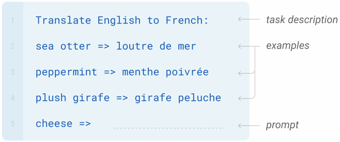

-   <u><strong>One-shot (1S):</strong></u>\
    It's the same as few-shot except that only one
    demonstration is allowed, in addition to the task description. The
    reason to distinguish one-shot from few-shot is that it most
    closely matches the way in which some tasks are communicated to
    humans:

    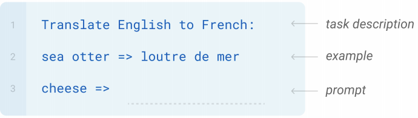

-   <u><strong>Zero-shot (0S):</strong></u>\
    It's the same as one-shot except that no demonstrations are
    allowed, just the task description. This method provides maximum
    potential for robustness but is also the most challenging setting
    even for humans.

    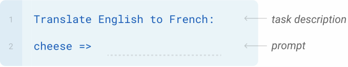

-   <u><strong>Fine-Tuning (FT):</strong></u>\
    It has been the most common approach in recent years, and involves
    updating the weights of a pre-trained model by training on a
    supervised dataset specific to the desired task. This setting
    lacks from poor generalization out-of-distribution:

    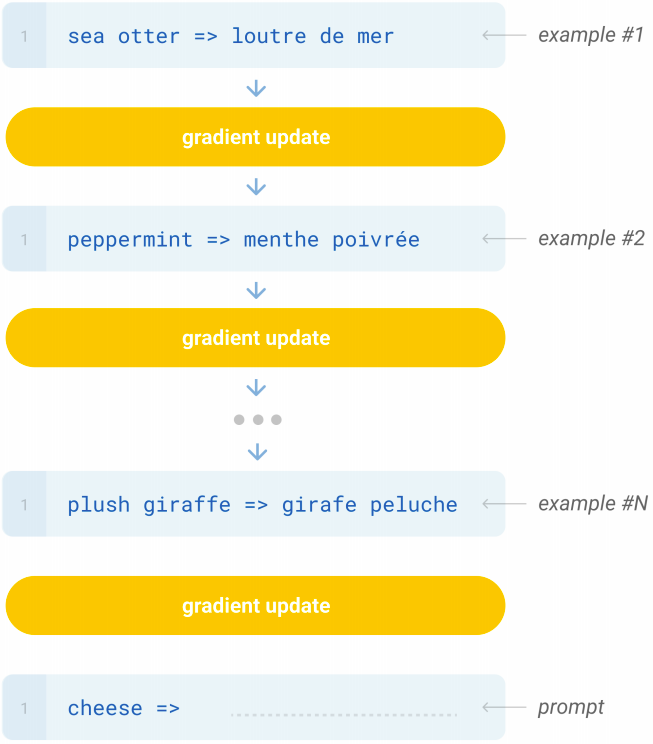

Model
-----

As said earlier, they used the same model and architecture as GPT-2. To
study the dependence of performance on model size, they trained 8
different sizes of model as shown in the following table

    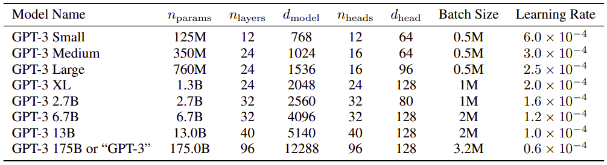

Where:

-   $n_{\text{params}}$: is the total number of trainable parameters.

-   $n_{\text{layers}}$: is the total number of layers.

-   $d_{\text{model}}$: is the number of units in each bottleneck layer
    (we always have the feed-forward layer four times the size of the
    bottleneck layer,
    $d_{\text{feedforward}} = 4 \times d_{\text{model}}$).

-   $n_{\text{heads}}$: is the number of attention heads/layers, since
    each layer has just one attention head.

-   $d_{head}$: is the dimension of each attention head.

As you can see, GPT3 is massive as its context-widow
$n_{\text{ctx}} = 2048$ tokens wide with about 175 billion learnable
parameters spread over 96 transformer-decoder layers.

    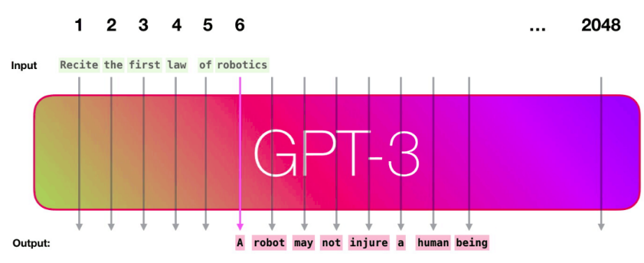

The data used for this models are according to the following table

    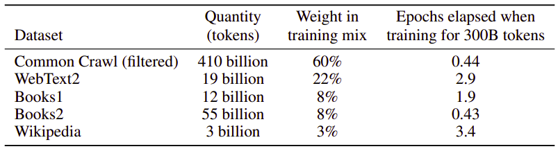

And the following is a comparison between the training time taken to
train BERT, RoBERTa, T5 and GPT-3. As we can see from the graph, it took
almost 5000 days to train GPT-3.

    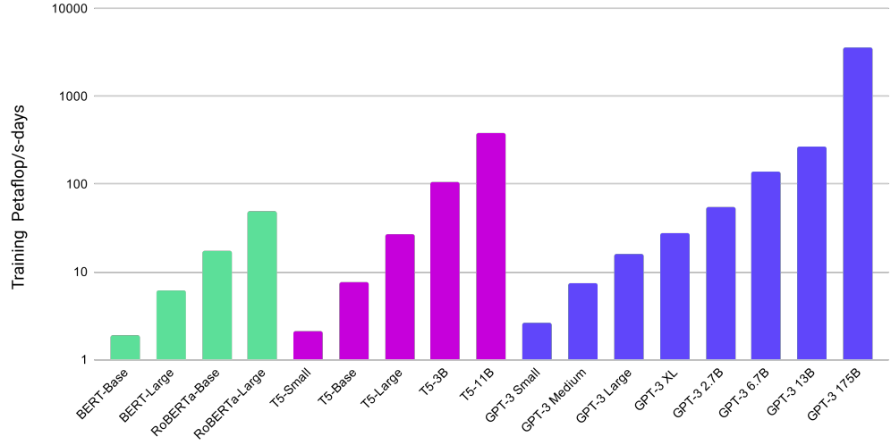

Results
-------

The following is a comparison among the different learning schemes used
with GPT-3 and the state or the art (fine-tuned) model on various tasks:

-   <u><strong>Language Modeling:</strong></u>

    -   **Dataset:** Penn Tree Bank

    -   **Evaluation Metric:** perplexity

    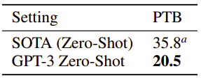

-   <u><strong>Long-Range Language Modeling:</strong></u>

    -   **Dataset:** LAMBADA

    -   **Evaluation Metric:** perplexity / Accuracy

    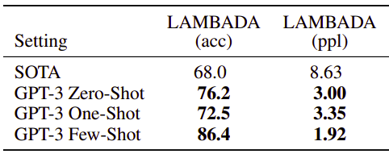

-   <u><strong>Story Completion:</strong></u>

    -   **Dataset:** StoryCloze & HellaSwag

    -   **Evaluation Metric:** Accuracy

    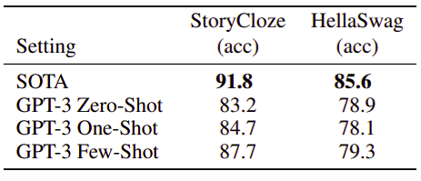

-   <u><strong>Question Answering:</strong></u>

    -   **Dataset:** NaturalQS, WebQS & TriviaQA

    -   **Evaluation Metric:** Accuracy

    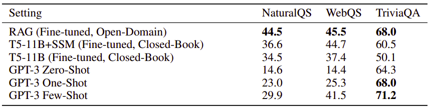

-   <u><strong>Machine Translation:</strong></u>

    -   **Dataset:** WMT'14 (Fr↔En), WMT'16 (De↔En) & WMT'16 (Ro↔En).

    -   **Evaluation Metric:** BLEU

    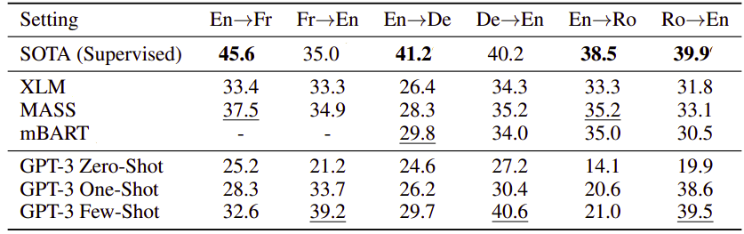

-   <u><strong>Winograd-Style Tasks:</strong></u> determining to which word a
    pronoun refers

    -   **Dataset:** Winograd & WinogradXL

    -   **Evaluation Metric:** Accuracy

    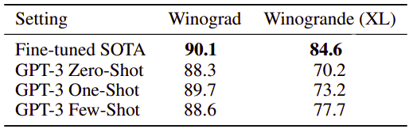

-   <u><strong>Common Sense Reasoning:</strong></u>

    -   **Dataset:** PIQA, ARC, OpenBookQA

    -   **Evaluation Metric:** Accuracy

    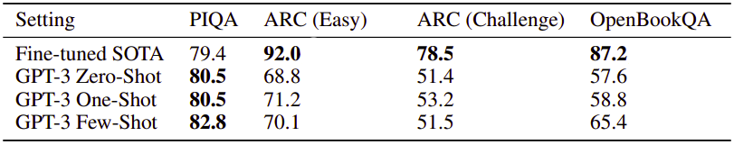

-   <u><strong>Reading Comprehension:</strong></u>

    -   **Dataset:** CoQA, DROP, QuAC, SQuADv2, RACE-h, RACE-m.

    -   **Evaluation Metric:** Accuracy for RACE-h & RACE-m, and F1 for
        the rest.

    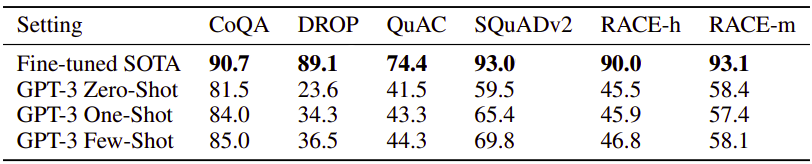

