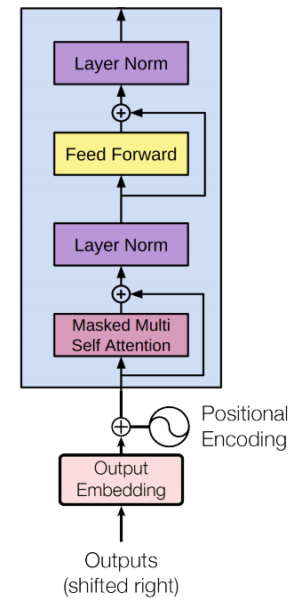
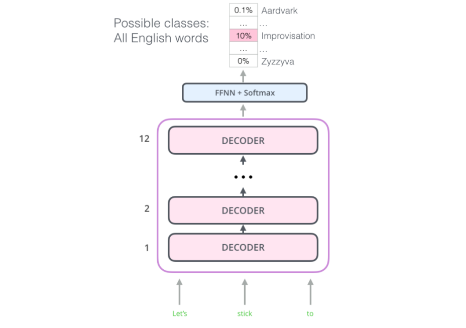
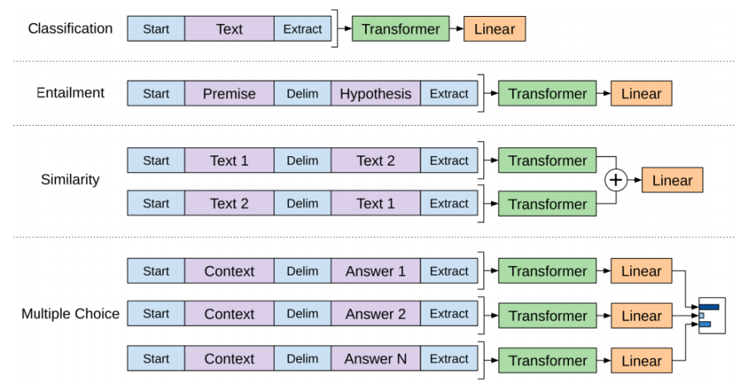
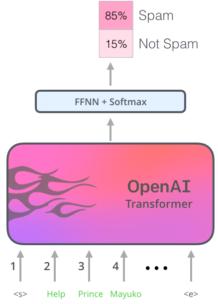

Transform is a state-of-the-art architecture for machine translation.
OpenAI tried to use this architecture for the language modeling task in
this paper "[Improving Language Understanding by Generative
Pre-Training](https://cdn.openai.com/research-covers/language-unsupervised/language_understanding_paper.pdf)"
under the name "Improving Language Understanding by Generative
Pre-Training" which was published in 2018. Pre-training is the process
of training a model with one task (language modeling in the paper) that
is able to help it form parameters that can be used to make other tasks
easier (four other tasks: natural language inference, question
answering, semantic similarity, and text classification).

The Encoder-Decoder structure of the transformer made it perfect for
machine translation. But how would you use it to pre-train a language
model that can be fine-tuned for other tasks like sentiment analysis or
text classification? The way openAI team did it was pretty smart. It
turns out that we don't need the entire transformer architecture to
adopt a language model. We can do it with just the decoder of the
transformer.

    

The decoder is a good choice because it's
a natural choice for language modeling (predicting the next word) since
it's built to mask future tokens. Since there is no encoder in this set
up, the decoder layer would not have the encoder-decoder attention
sub-layer that vanilla transformer decoder layers have. So, the decoder
architecture becomes as shown in the image on the right.

In the original paper, they stacked twelve decoder layers with a
feed-forward neural network at the end with Softmax loss function. With
this structure, we can proceed to train the model on the same language
modeling task: predict the next word using massive (unlabeled) datasets.

    

Model Specification
-------------------

The language model was trained on the BooksCorpus dataset for training
the language model. This dataset contains over 7,000 unique unpublished
books from a variety of genres. Crucially, it contains long stretches of
contiguous text, which allows the generative model to learn to condition
on long-range information.

The model, itself, has the following characteristics:

-   12-layer decoder-only transformer.

-   Masked self-attention with multi-heads (768 dimensional states and
    12 attention heads).

-   For the position-wise feed-forward networks, they used 3072 neurons.

-   They used the Adam optimization scheme.

-   The learning rate was increased linearly from zero over the first
    2000 updates and annealed to 0 using a cosine schedule with a max
    learning rate of 2.5e-4.

-   We train for 100 epochs on minibatches of 64 randomly sampled,
    contiguous sequences of 512 tokens.

-   Since layer normalization is used extensively throughout the model,
    a simple weight initialization of $\mathcal{N}(0,\ 0.02)$ was
    sufficient.

-   They used a bytepair encoding (BPE) vocabulary with 40,000 merges.

-   Residual, embedding, and attention dropouts with a rate of 0.1 for
    regularization.

-   They also employed a modified version of L2 regularization proposed
    in this paper, with w = 0.01 on all non bias or gain weights.

-   For the activation function, we used the Gaussian Error Linear Unit (GELU).

-   They used learned position embeddings instead of the sinusoidal
    version proposed in the original work.

Fine-Tuning
-----------

The OpenAI paper outlines a number of input transformations to handle
the inputs for different types of tasks. Since our language model was
trained on contiguous sequences of text, we require some modifications
to apply it to the different NLP tasks.

Previous [work](https://arxiv.org/pdf/1802.05365.pdf) proposed learning
task-specific architectures on top of transferred representations. We
use a traversal-style approach where we convert structured inputs into
an ordered sequence that our pre-trained model can process which allows
us to avoid making extensive changes to the architecture across
different tasks.

The following image shows the structures of the model and the input
transformations to carry out different tasks. In these transformations,
we are using the following special tokens;
$\left\langle s \right\rangle$ for start token,
$\left\langle e \right\rangle$ for extract token, and
$\left\langle \\$ \right\rangle$ for delimiter token:

    

So, for example the classification model will look like this:

    

