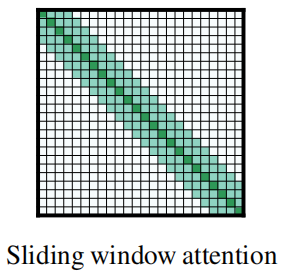
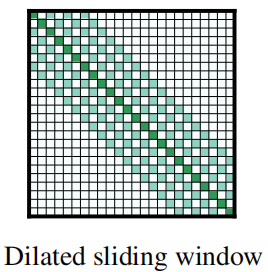
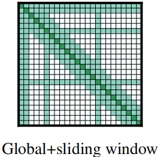
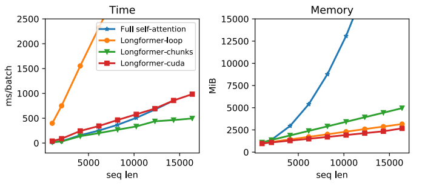
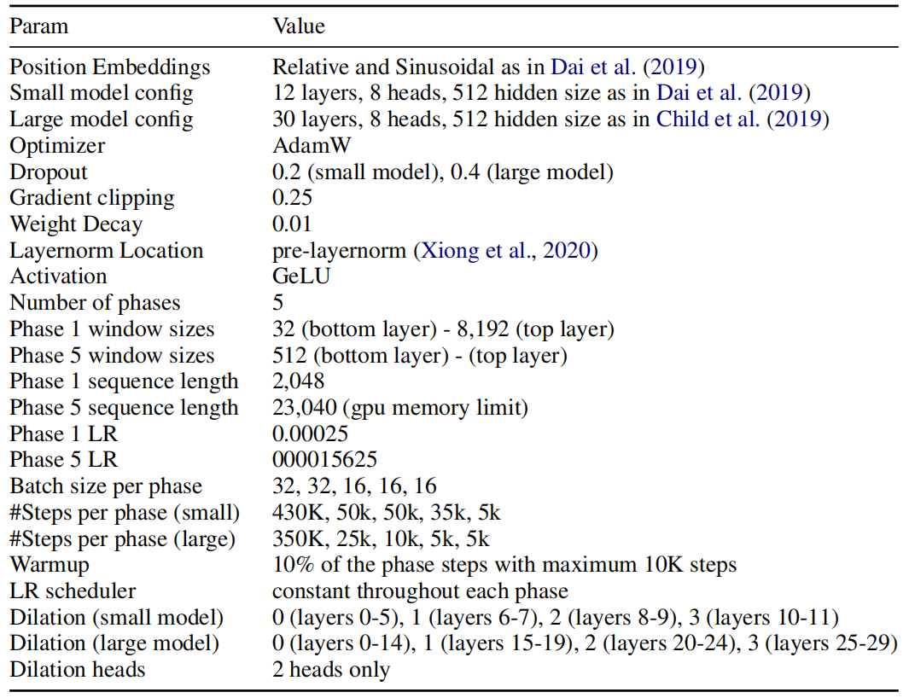
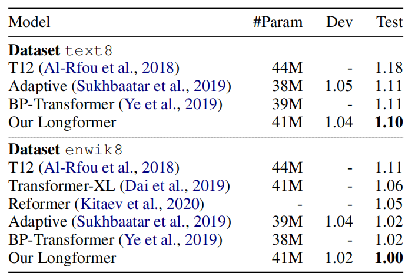
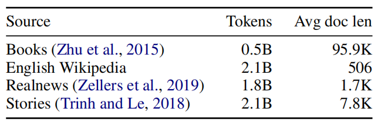
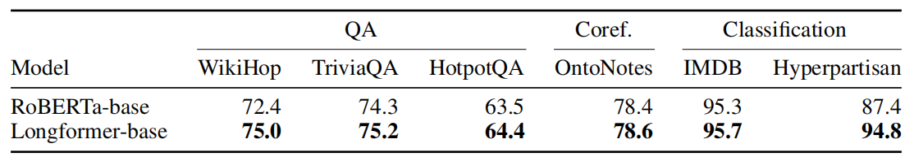
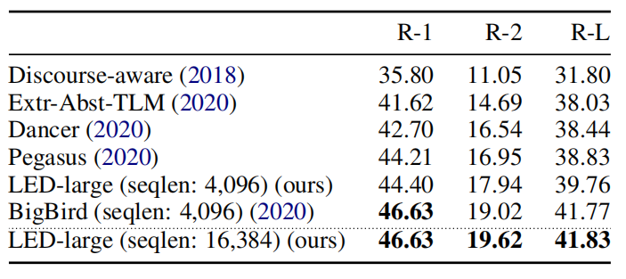

Transformer-based models are unable to process long sequences due to
their self-attention operation, which has a time complexity of
$O\left( n^{2} \right)$ where $n$ is the input length. Longformer stands
for "Long Transformer" which is a encoder-side transformer with a novel
attention mechanism that scales linearly with sequence length making it
easy to process documents of thousands of tokens or longer. Longformer
was proposed by Allen Institute in 2020 and published in their paper:
[Longformer: The Long-Document
Transformer](https://arxiv.org/pdf/2004.05150.pdf). The official code
for this paper can be found in the official GitHub page of Allen
Institute: [allenai/longformer](https://github.com/allenai/longformer).

Attention Patterns
------------------

Longformer sparsifies the full-attention mechanism matrix according to
an "attention pattern" specifying pairs of input locations attending to
one another. According to the paper, there are four different patterns
considered as shown below:

-   <u><strong>Sliding Window:</strong></u>\
    This is a fixed-window attention surrounding each token. Using
    multiple stacked layers of such windowed attention results in a
    large receptive field. Given a fixed window size $w$, each token
    attends to $\frac{1}{2}w$ tokens on each side. The computation
    complexity of this pattern is $O\left( n \times w \right)$. In a
    transformer with $l$ layers, the receptive field size at the top
    layer is $l \times w$ (assuming $w$ is fixed for all layers).

    

-   <u><strong>Dilated Sliding Window:</strong></u>\
    To further increase the receptive field without increasing
    computation, the sliding window can be "dilated" where the window
    has gaps of size dilation $d$. Assuming a fixed $d$ and $w$ for all
    layers, the receptive field is $l \times d \times w$, which can
    reach tens of thousands of tokens even for small values of $d$.

    

-   <u><strong>Global Attention:</strong></u>\
    The windowed and dilated attention attend to subset of the
    sequence. That's why they decided to add "global attention" on few
    pre-selected input tokens. This figure shows an example of a sliding
    window attention with global attention at a few tokens at custom
    locations.

    

> **Note:**
>
> - In multi-headed setup of dialted window attention, using different
    dilation configurations per head improves performance by allowing
    some heads without dilation to focus on local context, while others
    with dilation focus on longer context.
>
> - Implementing Longformer's dilated sliding widow attention requires a
    form of banded matrix multiplication (matrix multiplication where
    the output is all zero except certain diagonals) that is not
    directly supported in existing deep learning libraries like
    PyTorch/Tensorflow. So, they tried to implement it in three
    different ways:
>
>    -  **Longformer-loop:** Naive implementation using for-loops in PyTorch.
>
>    -  **Longformer-chunks:** Chunks $Q$ and $K$ into overlapping blocks of
        size $w$ and overlap of size $\frac{1}{2}w$, multiplies the blocks,
        then mask out the diagonals.
>
>    -  **Longformer-cuda:** is a custom CUDA kernel that they implemented
        using TVM (Tensor Virtual Machine).
>
>   They compared these different implementations according to time and memory
and found out that **longformer-chunks** is the fastest.
>
>   

>       
>   

>
> - They used small window sizes for the lower layers and increase window
    sizes as they moved to higher layers.
>
> - Also, they didn't use dilated sliding windows for lower layers to
    maximize their capacity to learn and utilize the immediate local
    context. For the higher layers, they used a small amount of
    increasing dilation only on $2$ heads. This gives the model the
    ability to directly attend to distant tokens without sacrificing
    local context.

Character-level LM
------------------

Training Longformer is done over 5 phases where they started with a
short sequence length of 2,048 and small window size, then the attention
window size and sequence length across multiple is doubled on each
subsequent phase while halving the learning rate till they ended with a
length of 23,040 on the last phase.

Longformer implementation is based on the
[Transformer-XL](https://anwarvic.github.io/language-modeling/Transformer-XL)
found [here](https://github.com/kimiyoung/transformer-xl) with the
memory mechanism disabled. They used relative position embeddings with
sinusoidal weights. They used two different model sizes; each with a
different set of hyper-parameters:

    

To compare longformer with previous character-level language modeling,
they trained it on text8 & enwik8 benchmark, both contain 100M
characters from Wikipedia split into 90M, 5M, 5M for train, dev, test
respectively. Longformer outperforms all other models and achieves
state-of-the-art results on both datasets:

    

Pre-training & Fine-tuning
--------------------------

Longformer was pre-trained using masked language modeling (MLM), where
the goal is to recover randomly masked tokens in a sequence. Since MLM
pre-training is expensive, they continued pre-training from the
[RoBERTa](https://anwarvic.github.io/language-modeling/RoBERTa) released
checkpoint, and only making the minimal changes necessary to support
Longformer's attention mechanism. And since RoBERTa's input is limited
to $512$, they decided to copy them till it matches the input to
longformer. After that, longformer was pre-trained on the following
data:

    

**Very Important Note:**\
Longformer's attention pattern can be plugged into any pre-trained
transformer model without the need to change the model architecture.

After pre-training, longformer was fine-tuned on on six tasks resulting
in a model that can process sequences up to 4,096 tokens long (8 times
longer than BERT). These six tasks are QA (WikiHop, TriviaQA, HotpotQA),
Coreference Resolution () and document classification (IMDB,
Hyperpartisan):

    

LED
---

LED stands for "Longformer Encoder Decoder" which is a variant of the
Longformer model that follows an encoder-decoder architecture similar to
the original
[Transformer](https://anwarvic.github.io/machine-translation/Transformer)
model; instead of an encoder-only Transformer architecture as the
Longformer model. LED is intended for long sequence-to-sequence tasks
such as text summarization.

Since pre-training LED is expensive, they initialized LED parameters
from the [BART](https://anwarvic.github.io/language-modeling/BART)
following BART's exact architecture in terms of number of layers and
hidden sizes. The only difference is that they extend position embedding
to 16K tokens (BART has only 1K tokens). Also, they initialized the new
position embedding matrix by repeatedly copying BART's 1K position
embeddings 16 times.

Following BART, they released two model sizes, LED-base and LED-large,
which respectively have 6 and 12 layers in both encoder and decoder
stacks. LED was evaluated on the summarization task using the arXiv
summarization dataset which focuses on long document summarization in
the scientific domain. The following table shows that LED-large achieves
state-of-the-art results, slightly outperforming
[BigBird](https://anwarvic.github.io/language-modeling/BigBird).

