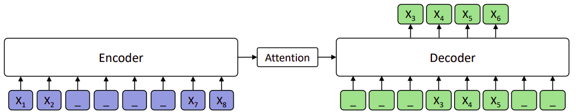
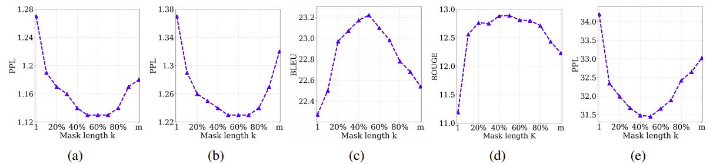
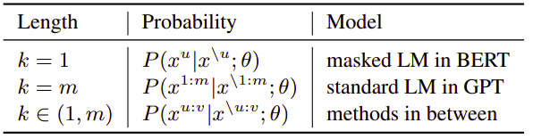
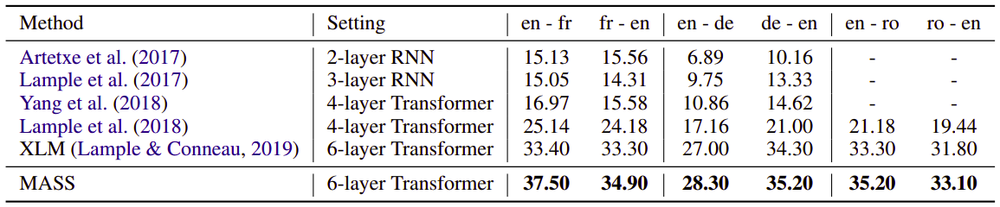
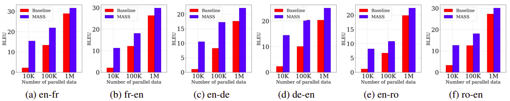
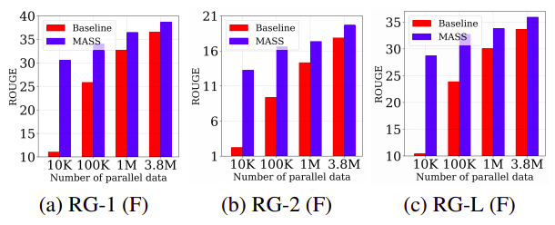
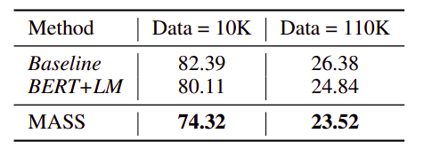

MASS, stands for "**Ma**sked **S**equence to **S**equence", is a
pre-training scheme proposed by Microsoft in 2019 and published in this
paper: "[MASS: Masked Sequence to Sequence Pre-training for Language
Generation](https://arxiv.org/pdf/1905.02450.pdf)" and the code is
publicly available on Microsoft's official account on
[GitHub](https://github.com/microsoft/MASS). Inspired by BERT, MASS
encoder takes a sentence with a masked fragment as input, and its
decoder predicts this masked fragment.

    

Unlike BERT which pre-trains only the encoder or decoder, MASS is
carefully designed to pre-train the encoder and decoder jointly in two
steps:

-   By predicting the fragment of the sentence that is masked on the
    encoder side, MASS can force the encoder to understand the meaning
    of the unmasked tokens, in order to predict the masked tokens in the
    decoder side.

-   By masking the input tokens of the decoder that are unmasked in the
    encoder side, MASS can force the decoder rely more on the source
    representation other than the previous tokens in the target side for
    next token prediction, better facilitating the joint training
    between encoder and decoder.

> **Note:**\
While this method works for any neural network based encoder-decoder
frameworks, they chose Transformer considering that it achieves
state-of-theart performances in multiple sequence to sequence learning
tasks.

Masked Sequence
---------------

In the paper, they introduced a novel unsupervised prediction task where
they mask $k$ consecutive tokens in the source sentence. Given an
unpaired source sentence $x \in \mathcal{X}$ , they denote $x^{u:v}$ as
a modified version of $x$ where the tokens from position $u$ to $v$ are
masked using the special symbol $\left\lbrack \mathbb{M} \right\rbrack$
where $0 < u < v < \text{len}\left( x \right)$. They denote the unmasked
part of $x$ as $x^{\backslash u:v}$ In this case, the log likelihood is
used as the objective function:

$$L\left( \theta;\mathcal{X} \right) = \frac{1}{\left| \mathcal{X} \right|}\sum_{x \in \mathcal{X}}^{}{\log\left( P\left( x^{u:v} \middle| x^{\backslash u:v};\theta \right) \right)}$$

For example in the following figure, we can see that the input sequence
has 8 tokens with the fragment
$x^{3:6} = \left\\{ x_{3},\ x_{4},\ x_{5},\ x_{6} \right\\}$ being masked.
Note that the model only predicts the masked fragment, given only
$\left\\{ x_{3},\ x_{4},\ x_{5} \right\\}$ as the decoder input for
position $4:6$, and the decoder takes the special mask symbol
$\left[ \mathbb{M} \right]$ as inputs for the other
positions (e.g., position $1:3$ and $7:8$.

    

The start position $u$ is chosen randomly. The same as BERT, the masked
tokens in the encoder will be replaced by:

-   The $\left\lbrack \mathbb{M} \right\rbrack$ token about 80% of the
    time.

-   A random token 10% of the time.

-   Remains unchanged 10% of the time.

### Study of Different k

The length of the masked fragment $k$ is an important hyper-parameter of
MASS and they explored different values of $k$ from 10% to 90%
percentage of the sentence length $m$ with a step size of 10%. They
found out that the best value for k is around 50% of the sentence length
$m$ in multiple pre-training and fine-tuning tasks.

    

Actually, the masked language modeling in BERT and the standard language
modeling in GPT can be viewed as special cases of MASS. The following
table shows how tuning the hyper-parameter $k$ can convert MASS to
either BERT or OpenAI GPT:

    

Pre-training
------------

We choose Transformer as the basic model structure, which consists of
6-layer encoder and 6-layer decoder with 1024 embedding/hidden size and
4096 feed-forward filter size. Since MASS is a pre-training method
mainly for language generation, the pre-training method changes based on
the fine-tuning task:

-   <u><strong>For neural machine translation task:</strong></u>\
    They pre-trained MASS on the monolingual data of the source and
    target languages. They conducted experiments on three language
    pairs: English-French, English-German, and English-Romanian. To
    distinguish between the source and target languages, they added a
    language embedding to each token of the input sentence for the
    encoder and decoder, which is also learned end-to-end. Also, they
    used a vocabulary of 60,000 sub-word units with Byte-Pair Encoding
    between source and target languages

-   <u><strong>For text summarization & conversational response generation:</strong></u>\
    They pre-trained the model with only English monolingual data.

All of the monolingual data used in this pre-training are from WMT News
Crawl datasets, which covers 190M, 62M and 270M sentences from year 2007
to 2017 for English, French, German respectively. Also, they used all of
the available Romanian sentences from News Crawl dataset and augment it
with WMT16 data, which results in 2.9M sentences.

Fine-tuning
-----------

In this section, we are going to discuss the performance of MASS over
various tasks such as:

-   <u><strong>Unsupervised NMT:</strong></u>\
    For unsupervised NMT, we use only monolingual data to train
    MASS with back-translation (no bilingual data). And the following
    table shows the results of MASS (fine-tuned using Adam optimizer
    with initial learning rate $10^{- 4}$ and the batch size is set as
    2000 tokens for each GPU) on newstest2014 for English-French, and
    newstest2016 for English-German and English-Romanian:

    

-   <u><strong>Low-resource NMT:</strong></u>\
    In the low-resource NMT setting, we respectively sample 10K,
    100K, 1M paired sentence from the bilingual training data of WMT14
    English-French, WMT16 English-German and WMT16 English-Romanian. The
    following table shows the performance of MASS (fine-tuned for 20,000
    steps with Adam optimizer and the learning rate is set as 10−4) on
    the same testsets used in the unsupervised setting; The baseline
    model here is MASS but without pre-training.

    

-   <u><strong>Text Summarization:</strong></u>\
    Text summarization is the task of creating a short and fluent
    summary of a long text document, which is a typical sequence
    generation task. We fine-tune the pre-trained model on text
    summarization task with different scales (10K, 100K, 1M and 3.8M) of
    training data from the Gigaword corpus, which consists of a total of
    3.8M article-title pairs in English. We take the article as the
    encoder input and title as the decoder input for fine-tuning. We
    report the F1 score of ROUGE-1, ROUGE2 and ROUGE-L on the Gigaword
    testset during evaluation. We use beam search with a beam size of 5
    for inference. The baseline here is MASS but without pre-training:

    

-   <u><strong>Conversational Response Generation:</strong></u>\
    Conversational response generation generates a flexible response for
    the conversation. We conduct experiments on the Cornell movie dialog
    corpus that contains 140K conversation pairs. We randomly sample
    10K/20K pairs as the validation/test set and the remaining data is
    used for training. We adopt the same optimization hyper-parameters
    from the pre-training stage for fine-tuning:

    

