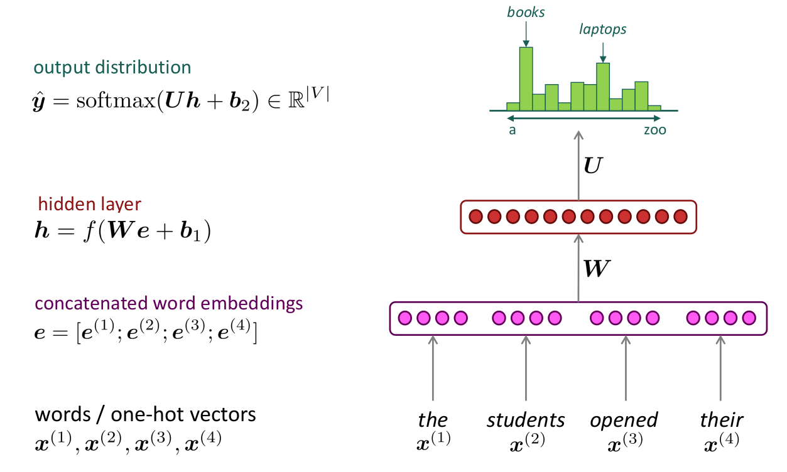
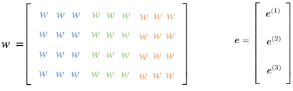

As we discussed before, the n-gram language model has a few problems
like the data sparsity and the big storage need. That's why these
problems were first tackled by Bengio et al in 2003 and published under
the name "[A Neural Probabilistic Language
Model](https://www.jmlr.org/papers/volume3/bengio03a/bengio03a.pdf)",
which introduced the first large-scale deep learning for natural
language processing model. This model learns a distributed
representation of words, along with the probability function for word
sequences expressed in terms of these representations. The idea behind
this architecture is to deal with the language model task as if it is a
classification problems where:

-   The input is a window-sized subset of the previous tokens.

-   The output is the current token which could be any token from the
    vocabulary $V$.

-   Each token is represented using a one-hot vector.

-   The loss function is the cross entropy.

The following figure shows a simplified version of the neural network
architecture that was created by Yoshua Bengio in 2003. In the original
version of the model, Bengio used the input word vectors with both the
hidden layer and the output layer. This simplified version concatenated
word embeddings for the input words:
$e = \left\lbrack e^{\left( 1 \right)};e^{\left( 2 \right)};e^{\left( 3 \right)};e^{\left( 4 \right)} \right\rbrack$,
the red layer signifies the hidden layer:
$h = f\left( We + b_{1} \right)$ , and the green output distribution is
a softmax over the vocabulary:
$ŷ = \text{softmax}\left( Uh + b_{2} \right)$.

    

And despite this model is way faster than other models and simpler to
implement, there were still some problems that need to be fixed:

-   The fixed window is still a problem since some sentences need bigger
    windows to catch the context. So, no matter how big your window
    is, it will never be enough for some sentences.

-   $e^{\left( 1 \right)},e^{\left( 2 \right)}$, ... etc. are multiplied
    by completely different weights in W which means that the weight
    learning in one section is not shared with the others and that's
    counter-intuitive. As shown in the following figure, we can see
    that $e^{\left( 1 \right)}$ will only by multiplied by the blue
    region of the weight matrix $W$, and $e^{\left( 2 \right)}$ will
    be only multiplied by the green region, and so on.

    

