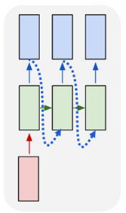
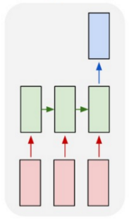
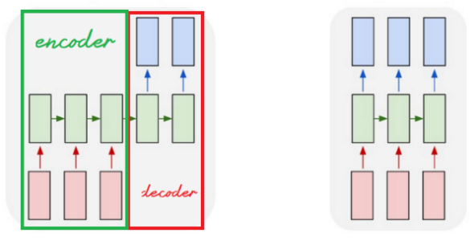
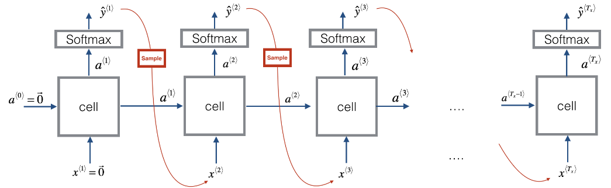
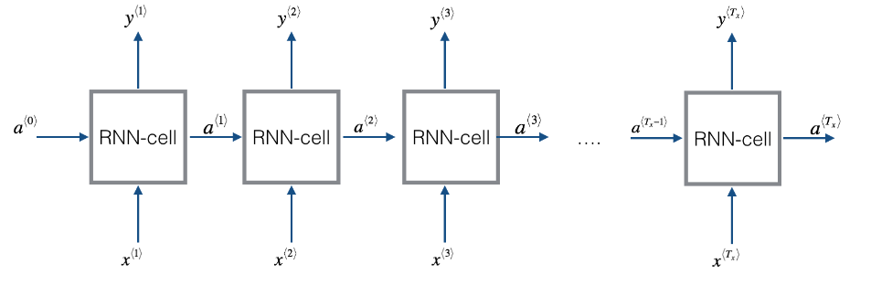
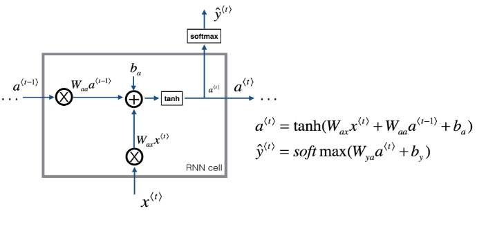
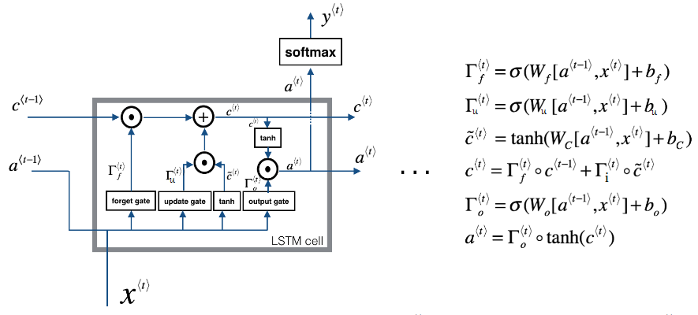
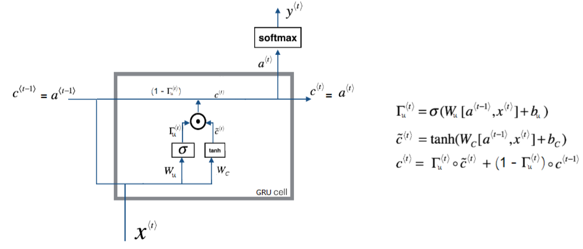
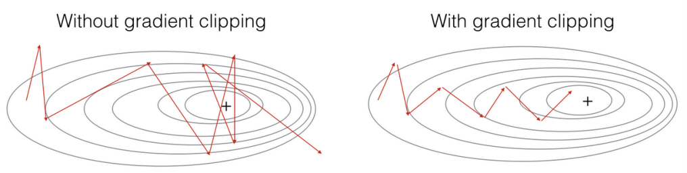
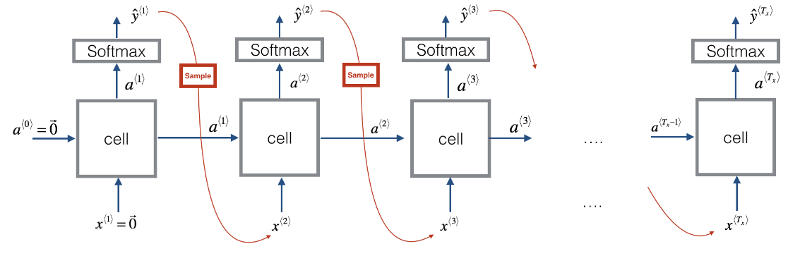

The neural n-gram language model we\'ve seen earlier was trained using
the a window-sized subset of the previous tokens. And this falls short
with long sentences as where the contextual dependencies are longer than
the window size. Now, we need a model that is able to capture
dependencies outside the window. In other words, we need a system that
has some kind of memory to save these long dependencies.

Here, we are going to talk about RNN or Recurrent Neural Network.
Recurrent Neural Networks (RNN) are very effective for Natural Language
Processing and other sequence tasks because they can read inputs (such
as words) one at a time, and remember some information/context through
the hidden layer activations that get passed from one time-step to the
next. This allows a uni-directional RNN to take information from the
past to process later inputs. A bi-direction RNN can take context from
both the past and the future.

But why we are going to use Recurrent Neural Network (RNN) and not the
vanilla feed-forward type of neural networks?

-   First, the vanilla neural network has fixed input and output. But in
    applications like the ones above, it is required to have a flexible
    neural network architecture with different inputs and outputs. For
    example, a sentiment analysis application should have a flexible
    neural network that can deal with different sentence lengths.

-   The standard neural network losses an important criterion which is
    sharing information between different layers. Unlike the RNN that
    can connect to any neuron in any layer. This criterion is called
    "Cyclical Connections".

History Background
------------------

Here, we are going to talk about how the RNN has evolved in the past few
decades. The first wave of artificial neural networks started in the
mid-1980s. After that wave, it became clear that feed-forward networks
became are limited since they are unable to capture temporal
dependencies, which are dependencies that change over time. Biological
neural networks have recurring connections, so appling recurrence to
artificial intelligence made natural sense.

The first time to add memory to neural networks were the TDNN or "Time
Delay Neural Network" in 1989. Then after one year in 1990, Jeffrey
Locke Elman created Elman's Network or (Simple RNN). Then, Michael Irwin
Jordan produces a network that is similar to Elman's Network and called
it "Jordan's Network" ... original!!

All these networks suffer from something called "Vanishing Gradients"
which means that they can't capture information with span more than 8 or
10 steps back. In the mid-1990s, Long Short-Term Memory, or LSTM for
short, were invented to address this very problem. The key idea in LSTM
was the idea that some signals can be kept fixed by using gates, and
reintroduced or not. After than GRU or Gated Recurrent Unit was invented
to optimize LSTM in 2014 by Kyunghyun Cho.

Types of RNN
------------

There are different types of RNN:

-   **One-to-many RNN:** This neural network is used when we have just
    <u>one</u> input and <u>multiple</u> outputs like Music Generation
    Application which has just one input like the genre of the music,
    and the output is a sequence of music notes.

<div align="center">
    
</div>

-   **Many-to-one RNN:** This neural network is used when we have
    <u>many</u> inputs and just <u>one</u> output like the sentiment
    analysis applications which have a sequence of sentences, and the
    output is a rate of one to five stars.

<div align="center">
    
</div>

-   **Many-to-many RNN:** This neural network is used when we have
    <u>many</u> inputs and <u>many</u> outputs. And we have two types in
    these neural network:

    -   When the input size is <u>the same as</u> the output size like
        in Word Embedding problem.

    -   When the input size is <u>different</u> than the output size
        like in Machine Translation Applications which takes a sentence
        of a certain length and returns another sentence in another
        language which probably has different length.

<div align="center">
    
</div>

> **Notes:**
>
> - At one-to-many RNNs, we take the output and insert it back as input.
    This operation is called "Sampling".
>
> <div align="center">
>     
> </div>
>
> - At machine translation RNN models, we divide the RNN into two parts,
    the first is the "encoder" part which takes the original sentence.
    The second part is the "decoder" part which returns the translated
    sentence. This architecture is called the "Autoencoding
    architecture".

RNN Cells
---------

<div align="center">
    
</div>

As you can see, a recurrent neural network can be seen as the repetition
of a single cell (RNN cell). The following figure describes the
operations for a single time-step of an RNN cell. The basic RNN cell
takes as input $x^{\left\langle t \right\rangle}$ (current input) and
$a^{\left\langle t - 1 \right\rangle}$ (previous hidden state containing
information from the past), and outputs
$a^{\left\langle t \right\rangle}$ which is given to the next RNN cell
and used to predict $y^{\left\langle t \right\rangle}$.

<div align="center">
    
</div>

The RNN forward propagation consists of several operations:

-   Initialize $a$ vector that will store all the hidden states computed
    by the RNN. Also, initialize the \"next\" hidden state as $a_{0}$
    (initial hidden state).

-   Start looping over each time step, your incremental index is $t$:

    -   Calculate the cell operations.

    -   Store the \"next\" hidden state in $a$ ($t^{th}$ position).

    -   Store the prediction in $y$.

### Pros & Cons

RNNs have several advantages:

-   They can process input sequences of any length.

-   They have some kind of memory as computation for step $t$ can (in
    theory) use information from many steps back.

-   The same weights are used for all different inputs which means that
    the number of learn-able parameters are reduced and that number
    doesn't scale with the size of the data unlike the traditional
    language models.

But they also have some disadvantages:

-   Computation is slow - because it is sequential, it cannot be parallelized.

In practice, it is difficult to access information from many steps back
due to problems like vanishing and exploding gradients.

LSTM Cell
---------

As we have mentioned before that a standard recurrent neural network
will work well for short sentences, but it suffers from **vanishing
gradient problem**. So, it works best when each output
$y^{\left\langle t \right\rangle}$ can be estimated using mainly "local"
context (meaning information from inputs
$x^{\left\langle t^{'} \right\rangle}$ where $t'$ is not too far from
$t$).

LSTM stands for Long Short-Term Memory network. It was proposed in 1997
by Sepp Hochreiter and Jürgen Schmidhuber. Here, you will build RNN
using LSTM cells which is a more complex than standard RNN model. It is
better at addressing vanishing gradients as it is better remembering a
piece of information and keep it saved for many time-steps. The
following figure shows the operations of an LSTM-cell.

<div align="center">
    
</div>

As you can see, the LSTM has a lot of modifications over RNN cell. In
RNN cell, we had just two inputs ($x^{\left\langle t \right\rangle}$,
$a^{\left\langle t - 1 \right\rangle}$) and there were no gates. In
LSTM, there are three inputs ( input $x^{\left\langle t \right\rangle}$,
cell state $c^{\left\langle t - 1 \right\rangle}$, and activation
$a^{\left\langle t - 1 \right\rangle}$). The cell state here represents
the long short-term memory of this architecture.

All these equations can be summarized into the following ones knowing
that
$\left\lbrack a^{\left\langle t - 1 \right\rangle},x^{\left\langle t \right\rangle} \right\rbrack$
means that the activating parameter of the previous time-step
$a^{\left\langle t - 1 \right\rangle}$ is concatenated with the input
vector $x^{\left\langle t \right\rangle}$:

$$c^{\left\langle t \right\rangle} = \Gamma_{f}^{\left\langle t \right\rangle} \ast c^{\left\langle t - 1 \right\rangle} + \Gamma_{u}^{\left\langle t \right\rangle} \ast tanh\left( W_{c}\left\lbrack a^{\left\langle t - 1 \right\rangle},x^{\left\langle t \right\rangle} \right\rbrack + b_{c} \right)$$

$$a^{\left\langle t \right\rangle} = \Gamma_{o}^{\left\langle t \right\rangle} \ast tanh\left( Wc^{\left\langle t \right\rangle} \right)$$

where

$\Gamma_{f}^{\left\langle t \right\rangle} = \sigma\left( W_{f}\left\lbrack a^{\left\langle t - 1 \right\rangle},x^{\left\langle t \right\rangle} \right\rbrack + b_{f} \right)$
(Forget Gate)

$\Gamma_{u}^{\left\langle t \right\rangle} = \sigma\left( W_{u}\left\lbrack a^{\left\langle t - 1 \right\rangle},x^{\left\langle t \right\rangle} \right\rbrack + b_{u} \right)$
(Update Gate)

$\Gamma_{o}^{\left\langle t \right\rangle} = \sigma\left( W_{o}\left\lbrack a^{\left\langle t - 1 \right\rangle},x^{\left\langle t \right\rangle} \right\rbrack + b_{o} \right)$
(Output Gate)

Now, let's get into these three gates in more details:

-   **Forget Gate:**

    -   This gate <u><strong>controls how much of the information of the
        previous cell state
        $c^{\left\langle t - 1 \right\rangle}$ should be forgot or
        kept while calculating the current cell state
        $c^{\left\langle t \right\rangle}$.</strong></u>

$$\Gamma_{f}^{\left\langle t \right\rangle} = \sigma\left( W_{f}\left\lbrack a^{\left\langle t - 1 \right\rangle},x^{\left\langle t \right\rangle} \right\rbrack + b_{f} \right)$$

-   $W_{f}$ are weights that govern the gate's behavior and they are
    trainable.

-   The output vector $\Gamma_{f}^{\left\langle t \right\rangle}$ has
    values from $0$ to $1$ since it uses the sigmoid activation
    function. So, if one of the features of
    $\Gamma_{f}^{\left\langle t \right\rangle}$ is $0$ (or close to
    $0$), then it means that the LSTM should <u><strong>forget</strong></u> that
    piece of information in the corresponding component of
    $c^{\left\langle t - 1 \right\rangle}$ while calculating the value
    for $c^{\left\langle t \right\rangle}$. If one of the features is
    $1$, then it will keep the information.

-   **Update Gate (Input Gate):**

    -   Similar to the forget gate, this gate <u><strong>controls how much of
        the information of the current input state
        $\left\lbrack a^{\left\langle t - 1 \right\rangle},x^{\left\langle t \right\rangle} \right\rbrack$
        should be used while calculating the current cell
        $c^{\left\langle t \right\rangle}$ state matter now.</strong></u>

$$\Gamma_{u}^{\left\langle t \right\rangle} = \sigma\left( W_{u}\left\lbrack a^{\left\langle t - 1 \right\rangle},x^{\left\langle t \right\rangle} \right\rbrack + b_{u} \right)$$

-   $W_{u}$ are weights that govern the gate's behavior and they are
    trainable.

-   The output vector $\Gamma_{u}^{\left\langle t \right\rangle}$ has
    values from $0$ to $1$ since it uses the sigmoid activation
    function. So, if one of the features of
    $\Gamma_{u}^{\left\langle t \right\rangle}$ is $1$ (or close to
    $1$), then it means that the LSTM should <u><strong>update</strong></u> that
    piece of information in the corresponding component of the input
    $\left\lbrack a^{\left\langle t - 1 \right\rangle},x^{\left\langle t \right\rangle} \right\rbrack$
    while calculating the value for $c^{\left\langle t \right\rangle}$.
    If one of the features is $0$, then it won't use this feature.

-   **Output gate:**

    -   This gate <u><strong>controls how much of the information of the current
        cell state $c^{\left\langle t \right\rangle}$ should be used for the
        output/activation.</strong></u>

$$\Gamma_{o}^{\left\langle t \right\rangle} = \sigma\left( W_{o}\left\lbrack a^{\left\langle t - 1 \right\rangle},x^{\left\langle t \right\rangle} \right\rbrack + b_{o} \right)$$

-   $W_{o}$ are weights that govern the gate's behavior and they are
    trainable.

-   The output vector $\Gamma_{o}^{\left\langle t \right\rangle}$ has
    values from $0$ to $1$ since it uses the sigmoid activation
    function. So, if one of the features of
    $\Gamma_{o}^{\left\langle t \right\rangle}$ is $1$ (or close to
    $1$), then it means that the LSTM should use that piece of
    information in the corresponding component of the cell state
    $c^{\left\langle t \right\rangle}$ while calculating the value for
    the output $a^{\left\langle t \right\rangle}$. If one of the
    features is $0$, then it won't use this feature.

> **Note:**\
Some researchers have found out that the parameter
$c^{\left\langle t - 1 \right\rangle}$ needs to be concatenated in the
forget gate. So, instead of using just
$x^{\left\langle t \right\rangle}$ and
$a^{\left\langle t \right\rangle}$ in the forget gate, we need also to
use $c^{\left\langle t - 1 \right\rangle}$ as shown in the following
equation which could increase the accuracy. This is known as the
"peephole connections":
> 
> $$\Gamma_{f}^{\left\langle t \right\rangle} = \sigma\left( W_{f}\left\lbrack c^{\left\langle t - 1 \right\rangle},a^{\left\langle t - 1 \right\rangle},x^{\left\langle t \right\rangle} \right\rbrack + b_{f} \right)$$

This [link](https://skymind.ai/wiki/lstm#long) states some interesting
facts about LSTM, give it a read!!!

GRU Cell
--------

GRU stands for Gated Recurrent Unit. GRU was introduced in 2014 by
Kyunghyun Cho as another solution to the vanishing gradient problem
beside LSTM cell. The main objective behind creating GRUs is to create a
simpler cell than LSTM without sacrificing the performance too much.

GRU\'s performance on certain tasks of music modeling and speech signal
modeling was found to be similar to that of LSTM. GRUs have been shown
to exhibit even better performance on certain smaller datasets. However,
as shown by Gail Weiss & Yoav Goldberg & Eran Yahav, the LSTM is
\"strictly stronger\" than the GRU as it can easily perform unbounded
counting, while the GRU cannot. That\'s why the GRU fails to learn
simple languages that are learnable by the LSTM.

He following The structure of GRU is like the following:

<div align="center">
    
</div>

In GRU, we don't have cell states as the one with LSTM. Here, we only
have activation (hidden state). And GRUs have two gates (Update Gate,
Reset Gate) unlike LSTM which have three gates. The main equations used
with GRU are the following ones:

$$a^{\left\langle t \right\rangle} = c^{\left\langle t \right\rangle} = \left( 1 - \Gamma_{u}^{\left\langle t \right\rangle} \right) \ast c^{\left\langle t - 1 \right\rangle} + \Gamma_{u} \ast {\overset{\sim}{c}}^{\left\langle t \right\rangle}$$

$${\overset{\sim}{c}}^{\left\langle t \right\rangle} = tanh\left( Wx^{\left\langle t - 1 \right\rangle} + U\left( \Gamma_{r} \ast c^{\left\langle t \right\rangle} \right) + b_{c} \right)$$

$\Gamma_{u}^{\left\langle t \right\rangle} = \sigma\left( W_{u}x^{\left\langle t - 1 \right\rangle} + U_{u}a^{\left\langle t - 1 \right\rangle} + b_{u} \right)$
(Update Gate)

$\Gamma_{r}^{\left\langle t \right\rangle} = \sigma\left( W_{r}x^{\left\langle t - 1 \right\rangle} + U_{r}a^{\left\langle t - 1 \right\rangle} + b_{u} \right)$
(Reset Gate)

Now, let's get into these three gates in more details:

-   **Update Gate:**

    -   This gate <u><strong>controls the what is kept from previous hidden
        state $c^{\left\langle t - 1 \right\rangle}$ and is
        updated to the new candidate update
        ${\overset{\sim}{c}}^{\left\langle t \right\rangle}$ while
        calculating the current hidden state $c^{\left\langle t \right\rangle}.</strong></u>

$$\Gamma_{u}^{\left\langle t \right\rangle} = \sigma\left( W_{u}x^{\left\langle t - 1 \right\rangle} + U_{u}a^{\left\langle t - 1 \right\rangle} + b_{u} \right)$$

-   $W_{u}$ and $U_{u}$ are weights that govern the gate's behavior and
    they are trainable.

-   The output vector $\Gamma_{u}^{\left\langle t \right\rangle}$ has
    values from $0$ to $1$ since it uses the sigmoid activation
    function. So, if one of the features of
    $\Gamma_{u}^{\left\langle t \right\rangle}$ is $1$ (or close to
    $1$), then it means that the GRU should <u><strong>update</strong></u> that
    piece of information in the corresponding component of hidden
    state $c^{\left\langle t \right\rangle}$ using the update
    candidate ${\overset{\sim}{c}}^{\left\langle t \right\rangle}$. If
    one of the features is $0$, then <u>update</u> using the old value
    of the hidden state $c^{\left\langle t - 1 \right\rangle}$.

-   **Reset Gate:**

    -   This gate <u><strong>controls what parts of the previous hidden state
        should be used to compute the new hidden state
        $c^{\left\langle t \right\rangle}$.</strong></u>

$$\Gamma_{r}^{\left\langle t \right\rangle} = \sigma\left( W_{r}x^{\left\langle t - 1 \right\rangle} + U_{r}a^{\left\langle t - 1 \right\rangle} + b_{u} \right)$$

-   $W_{r}$ and $U_{r}$ are weights that govern the gate's behavior and
    they are trainable.

-   The output vector $\Gamma_{r}^{\left\langle t \right\rangle}$ has
    values from $0$ to $1$ since it uses the sigmoid activation
    function. So, if one of the features of
    $\Gamma_{r}^{\left\langle t \right\rangle}$ is $0$ (or close to
    $0$), then it means that the GRU should <u><strong>reset</strong></u> that
    piece of information in the corresponding component of
    $c^{\left\langle t - 1 \right\rangle}$ while calculating the value
    for $c^{\left\langle t \right\rangle}$. If one of the features is
    $1$, then it will keep the information.

> **Note:**\
As a rule of thumb, use LSTM cells in your model unless you care much
about the size of the model or the memory needed. GRUs have fewer
parameters to compute

Hyper-parameters
----------------

In sequence models, there are three main choices that we need to make
when we want to build an RNN:

-   Choosing the cell type either <u>standard RNN</u>, <u>GRU</u> or
    <u>LSTM</u>. Now, it's clear that both GRU and LSTM are both much
    better than standard RNN, but which one is even better? Actually,
    that depends on the task and the type of the dataset. According to
    this paper: "[Visualizing and Understanding Recurrent
    Networks](https://arxiv.org/pdf/1506.02078.pdf)" by Andrej
    Karpathy, both LSTM and GRU were tested on two datasets: in the
    first dataset, GRU was better in all used sizes and in the second,
    GRU was better in some sizes and worse in other. So, when creating
    your own model, you should try both.

-   Choosing number of layers that we need to stack. And in the same
    paper, the number of layers stacked together is the best at two
    layers and when increasing it to three layers, it gets mixed
    results. So, when creating your own model, you should try using
    two and three layers. When creating advanced sequence models like
    CTC, we usually use five or even seven layers often with the use
    of LSTM cells.

-   And in case of using word embedding, then another hyper-parameter is
    added which is the embedding size. Experimental results in this
    paper: "[How to Generate a Good Word
    Embedding?](https://arxiv.org/pdf/1507.05523.pdf)" have shown that
    the larger the word embedding is, the better; at least we reach
    the size of $200$. So, we should try different sizes starting from
    $50$ till $200$ or $300$ as google did in this paper:
    "[Distributed Representations of Words and Phrases and their
    Compositionality](https://papers.nips.cc/paper/5021-distributed-representations-of-words-and-phrases-and-their-compositionality.pdf)"
    or even $500$.

In the following table, we are going to see different RNN architectures
on different tasks:

<div align="center" class="inline-table">
<table>
    <thead>
        <tr>
            <th>Task</th>
            <th>Cell</th>
            <th>#Layers</th>
            <th>Layer Size</th>
            <th>Embedding Size</th>
            <th>Source</th>
        </tr>
    </thead>
    <tr>
        <td>Speech Recognition (500K vocabulary)</td>
        <td>LSTM</td>
        <td>7</td>
        <td>1000</td>
        <td>-</td>
        <td><a href="https://arxiv.org/abs/1610.09975">paper</a></td>
    </tr>
    <tr>
        <td>Speech Recognition (82K vocabulary)</td>
        <td>LSTM</td>
        <td>5</td>
        <td>600</td>
        <td>-</td>
        <td><a href="https://arxiv.org/abs/1610.09975">paper</a></td>
    </tr>
    <tr>
        <td>Speech Recognition (small vocabulary)</td>
        <td>LSTM</td>
        <td>1, 3, 5</td>
        <td>250</td>
        <td>-</td>
        <td><a href="https://arxiv.org/abs/1303.5778">paper</a></td>
    </tr>
    <tr>
        <td>Seq2Seq (160K → 80k)</td>
        <td>LSTM</td>
        <td>4</td>
        <td>1000</td>
        <td>1000</td>
        <td><a href="https://arxiv.org/abs/1409.3215">paper</a></td>
    </tr>
    <tr>
        <td>Image Captioning</td>
        <td>LSTM</td>
        <td>-</td>
        <td>512</td>
        <td>-</td>
        <td><a href="https://arxiv.org/abs/1411.4555">paper</a></td>
    </tr>
    <tr>
        <td>Image Generation</td>
        <td>LSTM</td>
        <td>-</td>
        <td>256, 400, 800</td>
        <td>-</td>
        <td><a href="https://arxiv.org/abs/1502.04623">paper</a></td>
    </tr>
    <tr>
        <td>Question Answering</td>
        <td>LSTM</td>
        <td>2</td>
        <td>500</td>
        <td>300</td>
        <td><a href="http://www.aclweb.org/anthology/P15-2116">paper</a></td>
    </tr>
    <tr>
        <td>Text Summarization (119K → 68K)</td>
        <td>GRU</td>
        <td>-</td>
        <td>200</td>
        <td>100</td>
        <td><a href="https://pdfs.semanticscholar.org/3fbc/45152f20403266b02c4c2adab26fb367522d.pdf">paper</a></td>
    </tr>
</table>

</div>


Gradient Clipping
-----------------

Recall that our loop structure usually consists of a forward pass, a
cost computation, a backward pass, and a parameter update. Before
updating the parameters, we will need to perform gradient clipping when
needed to make sure that your gradients are not \"exploding" (taking on
overly large values).

<div align="center">
    
</div>

So, we will implement a function that takes in the gradients and returns
a clipped version of gradients if needed. There are different ways to
clip gradients; we will use a simple element-wise clipping procedure, in
which every element of the gradient vector is clipped to lie between
some range $\left\lbrack - N,N \right\rbrack$.

```python
def clip(gradient_lst, max_value):
... for gradient in gradient_lst:
...     np.clip(gradient, -max_value, max_value, out= gradient)
...     return gradient_lst
```

If you want to use it on our variables, we can do like so:

```python
dWax, dWaa, dWya, db, dby = clip(dWax, dWaa, dWya, db, dby, 10)
```

Here, we provided the max_value as $10$. If any component of the
gradient vector is greater than $10$, it would be set to $10$; and if
any component of the gradient vector is less than $- 10$, it would be
set to $- 10$. If it is between $- 10$ and $10$, it is left alone.

Sampling
--------

the Sampling is the process of use the output of a certain neuron as an
input to the following neurons. It's used with generative models where
you need to generate such as language models. Let's see how it's done:

-   First, we input the usual $x^{\left\langle 1 \right\rangle}$ and
    $a^{\left\langle 0 \right\rangle}$, apply the activation function
    and get the output.

-   Now our first time stamp $y^{\left\langle 1 \right\rangle}$will have
    some max probability over possible outputs, so we choose a randomly
    sample according to the probabilities of the possible outputs using,
    for example, the numpy command np.random.choice.

-   Next we then go on to the second time step which is expecting
    $y^{\left\langle 1 \right\rangle}$ as input to the next time-step.

-   And so on...

Example, let\'s say that we are creating a language model. And after we
sampled the first word, the first word happened to be "the", which is
very common choice of first word. Then we pass "the" as
$x^{\left\langle 2 \right\rangle}$. And now we're trying to figure out
what is the chance of the second word given that the first word is
"the". Then we again use this type of sampling function to sample
$y^{\left\langle 2 \right\rangle}$ and so on.

<div align="center">
    
</div>
