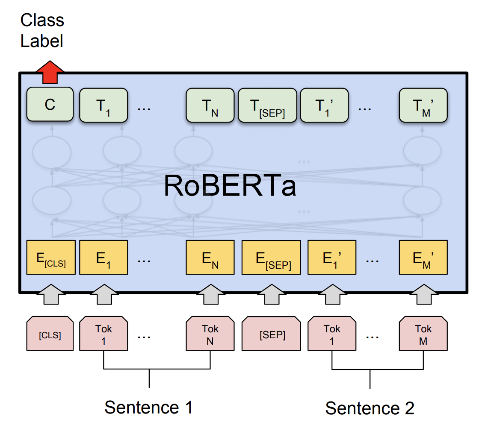
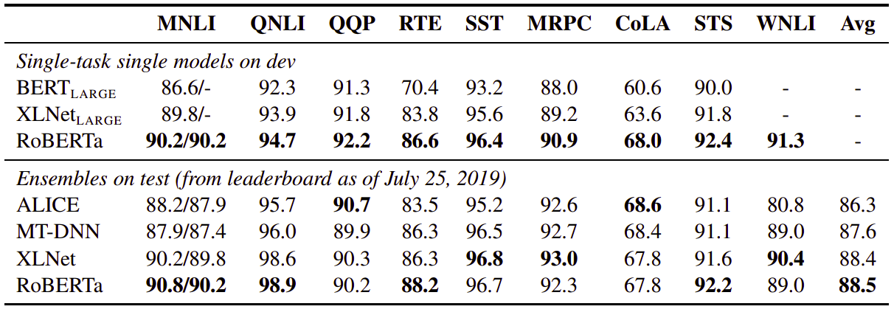
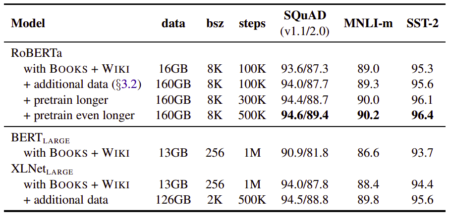
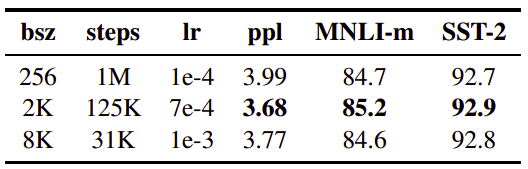
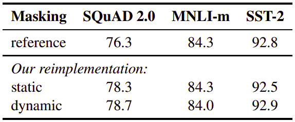
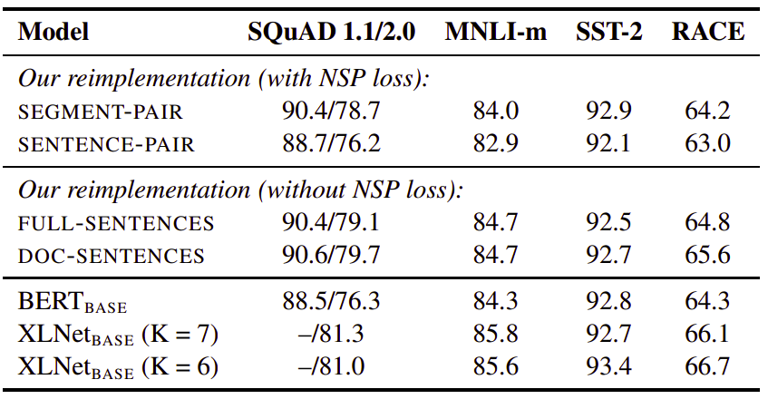
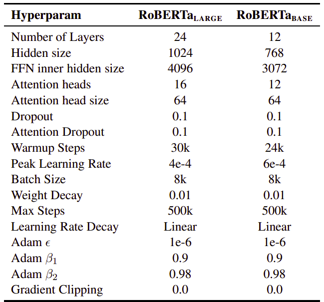

RoBERTa, stands for "**R**obustly **o**ptimized **BERT** **a**pproach",
is an approach to train BERT created by Facebook AI in 2019 and
published in this paper: "[RoBERTa: A Robustly Optimized BERT
Pretraining Approach](https://arxiv.org/pdf/1907.11692.pdf)". The official code
for this paper can be found on Facebook’s FairSeq official GitHub repository:
[fairseq/roberta](https://github.com/pytorch/fairseq/tree/master/examples/roberta).

    

The authors of this paper has found out that BERT, when published, was
significantly under-trained. So, they wrote this paper introducing an
approach with the following:

-   Training the BERT model longer, on longer sequences, with bigger
    batches, over more data which increased the character-level BPE
    vocabulary size from 30K to 50K.

-   Dynamically changing the masking pattern applied to the training data.

-   Removing the next sentence prediction (NSP) objective.

And just by doing these simple modifications, RoBERTa was able to
exceed BERT and XLNet in almost all tasks on GLUE:

    

In the following sections, we are going to discuss each modification out
of the proposed three modifications.

Data
----

BERT is trained on a combination of BooksCorpus and English Wikipedia
which totals 16GB of uncompressed text. On the other hand, RoBERTa is
trained on a combination of the following data which totals 160 GB of
uncompressed text:

-   [BooksCorpus](https://yknzhu.wixsite.com/mbweb) and English
    Wikipedia (This is the original data used to train BERT).

-   [CC-NEWS](https://commoncrawl.org/2016/10/news-dataset-available/):
    collected from the English portion of the CommonCrawl News
    dataset. The data contains 63 million English news articles
    crawled between September 2016 and February 2019. (76GB after
    filtering).

-   [OpenWebText](https://skylion007.github.io/OpenWebTextCorpus/): it's
    the web content extracted from URLs shared on Reddit with at least
    three upvotes. (38GB).

-   Stories: a dataset containing a subset of CommonCrawl data filtered
    to match the story-like style of Winograd schemas. (31GB).

The following table contains a simple comparison between RoBERTa and
BERT using different amount of data:

    

Batch Size
----------

Past work in NMT has shown that training with very large mini-batches
can both improve optimization speed and end-task performance when the
learning rate is increased appropriately. BERT is also amenable to large
batch training.

The original BERT model was trained for 1 million steps with batch size
of 256 sequences. So, in this paper the publishers increased the batch
size and compared the performance of BERT on the development set of
BooksCorpus and English Wikipedia as shown in the following table:

    

We can see that training with large batches improves perplexity for the
masked language modeling objective, as well as end-task accuracy. Large
batches are also easier to parallelize via distributed data parallel
training.

And that was the first modification in the paper which is increasing the
amount of data used for training BERT with bigger batch sizes. Now,
let's get to the second one.

Static Vs. Dynamic Masking
--------------------------

As discussed before, BERT relies on randomly masking and predicting
tokens. The original BERT implementation performed masking once during
data preprocessing, resulting in a single static mask.

In the paper, they proposed two different techniques for masking:

-   <u><strong>Static Masking:</strong></u> Where they duplicate training data
    10 times and mask each time with different mask pattern.

-   <u><strong>Dynamic Masking:</strong></u> Where they generated the masking
    pattern every time a sequence is fed to the model.

And the following table shows the result in comparison with the official
results from BERT where we can see clearly that both proposed methods before
better than the single masking:

    

NSP
---

In the original BERT paper, the model is trained to predict whether the
observed sentence is next to the previous sentence or not via an
auxiliary Next Sentence Prediction (NSP) loss. The NSP loss was
hypothesized to be an important factor in training the original BERT
model and removing it hurts the performance. However, some recent work
has questioned the necessity of the NSP loss.

So, to put this issue to rest, the publishers of the paper compared
several alternative training formats:

-   <u><strong>Segment-pair + NSP:</strong></u>\
    This follows the original input format used in BERT. Each input
    contains a pair of segments; each segment could contain multiple
    sentences.

-   <u><strong>Sentence-pair + NSP:</strong></u>\
    Each input contains a pair of sentences.

-   <u><strong>Full-sentences:</strong></u>\
    Each input is packed with full sentences, such that the
    total length is at most 512 tokens. Inputs may cross document
    boundaries. When we reach the end of one document, we begin
    sampling sentences from the next document and add an extra
    separator token between documents. The NSP loss is removed.

-   <u><strong>Doc-sentences:</strong></u>\
    Each input is packed with sentences of the same document, such
    that the total length is at most 512. The NSP loss is also
    removed.

And the following table contains a comparison of these different
training format on four different tasks.

    

And in the table, we can see the following:

-   We find that using individual sentences hurts performance, which
    they hypothesized is because the model is not able to learn
    long-range dependencies.

-   Removing the NSP loss matches or slightly improves the performance.

-   Restricting sequences to come from a single document
    (<u><strong>Doc-sentences</strong></u>) performs slightly better than packing
    sequences from multiple documents (<u><strong>full-sentences</strong></u>).

Base Vs Large RoBERTa
---------------------

The same as BERT, the published or RoBERTa created two models sizes for
it in order to compare performance:

-   **RoBERTa BASE:** Comparable in size to the BERT-base.

-   **RoBERTa LARGE:** Comparable in size to BERT-large.

The following summarizes the difference between both models:

    

