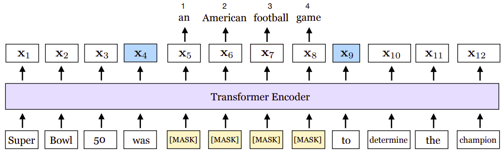
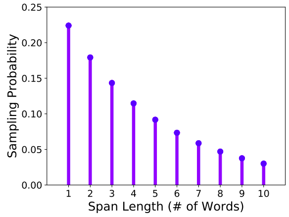
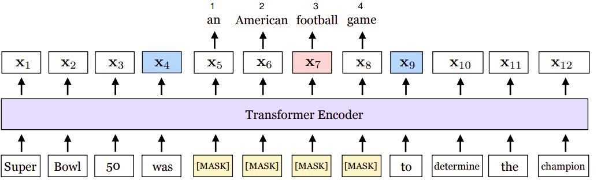

SpanBERT is a model created by Facebook AI and Allen Institute in
January 2019 and published in this paper "[SpanBERT: Improving
Pre-training by Representing and Predicting
Spans](https://arxiv.org/pdf/1907.10529.pdf)". SpanBERT is just an
extension to BERT where it better represents and predict continuous
random spans of text, rather than random tokens. This is crucial since
many NLP tasks involve spans of text rather than single tokens. SpanBERT
is different from BERT in both the masking scheme and the training
objectives:

-   <u><strong>Span Masking:</strong></u>\
    SpanBERT masks random contiguous spans, rather than random
    individual tokens which forces the model to predict entire spans
    solely using the context in which they appear.

-   <u><strong>SBO:</strong></u>\
    SpanBERT uses a novel span-boundary objective (SBO) so the
    model learns to predict the entire masked span from the observed
    tokens at its boundary which encourages the model to store this
    span-level information at the boundary tokens, which can be easily
    accessed during the fine-tuning stage.

-   <u><strong>No NSP:</strong></u>\
    SpanBERT doesn't use the NSP objective unlike BERT.

    

Span Masking
------------

Given a sequence of tokens X, they selected a subset of tokens by
iteratively sampling spans of text until the masking budget (e.g. 15% of
X) has been spent. And they following the following steps when masking a
subset of tokens:

-   They randomly sample a span length (number of words) from a
    geometric distribution
    $\ell \sim Geo(p) = p.\left( 1 - p \right)^{n - 1}$ where
    $p = 0.2$ and $\ell_{\max} = 10$ which is skewed towards shorter
    spans as shown in the following figure. :

    

-   Then, they randomly select the starting point for the span to be
    masked from a uniform distribution. They always sample a sequence
    of complete words (instead of subword tokens) and the starting
    point must be the beginning of one word.

-   As in BERT, they also masked 15% of the tokens in total: replacing
    80% of the masked tokens with \[MASK\], 10% with random tokens and
    10% with the original tokens.

SBO
---

Span selection models typically create a fixed-length representation of
a span using its boundary tokens (start and end). To support such
models, we would ideally like the representations for the end of the
span to summarize as much of the internal span content as possible. We
do so by introducing a <u><strong>S</strong></u>pan <u><strong>B</strong></u>oundary
<u><strong>O</strong></u>bjective (SBO) that involves predicting each token of a
masked span using only the representations of the observed tokens at the
boundaries.

Formally, they calculated the SBO loss function by following these
steps:

-   Given an input sequence of $X = x_{1},\ ...,\ x_{n}$ and a masked
    span of tokens $\left( x_{s},...,\ x_{e} \right) \in Y\ $, where
    $\left( s,\ e \right)$ indicates its start and end positions
    respectively.

-   They represented each token $x_{i}$ in the span using the output
    encodings of the external boundary tokens $x_{s - 1}$ and
    $x_{e + 1}$, as well as the position embedding of the target token
    $p_{i - s + 1}$:

$$h_{0} = \left\lbrack x_{s - 1};x_{e + 1};p_{i - s + 1} \right\rbrack$$

-   Then, they implemented the representation function as a 2-layer
    feed-forward network with GeLU activations and layer normalization

$$h_{1} = \text{LayerNorm}\left( \text{GeLU}\left( W_{1}.h_{0} \right) \right)$$

$$y_{i} = \text{LayerNorm}\left( \text{GeLU}\left( W_{2}.h_{1} \right) \right)$$

-   Finally, they used the vector representation $y_{i}$ to predict the
    token $x_{i}$ and compute the cross-entropy loss exactly like the
    MLM objective.

$$\mathcal{L}_{\text{SBO}}\left( x_{i} \right) = - log\ P\left( x_{i}\  \middle| \ y_{i} \right)$$

For example, given the following sequence "Super Bowl 50 was an American
football game to determine the champion" where the span "an American
football game" is masked. The span boundary objective (SBO) uses the
output representations of the boundary tokens, x4 and x9 (in blue), to
predict each token in the masked span.

    

The equation shows the MLM and SBO loss terms for predicting the token,
football (in pink), which as marked by the position embedding $p_{3}$,
is the third token from $x_{4}$.

$$\mathcal{L}\left( \text{football} \right) = \mathcal{L}_{\text{MLM}}\left( \text{football} \right) + \mathcal{L}_{\text{SBO}}\left( \text{football} \right) = - log\ P\left( \text{football} \middle| \ x_{7} \right) - log\ P\left( \text{football} \middle| \ x_{4},x_{9},p_{3} \right)$$
