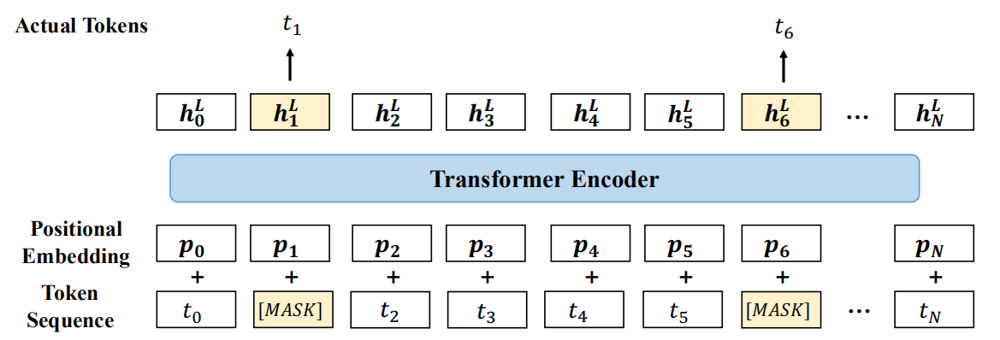
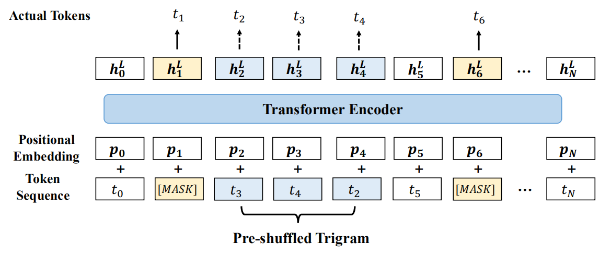
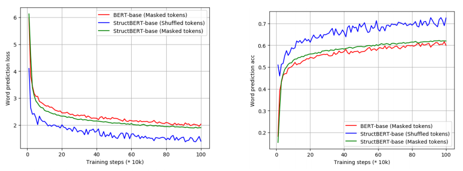
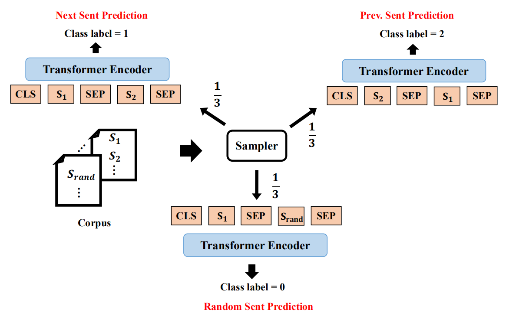
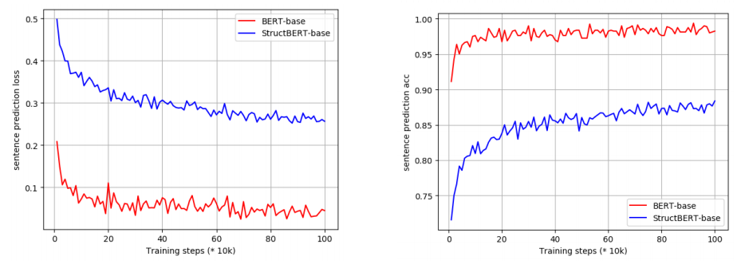
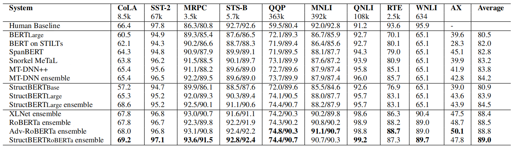
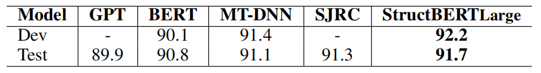
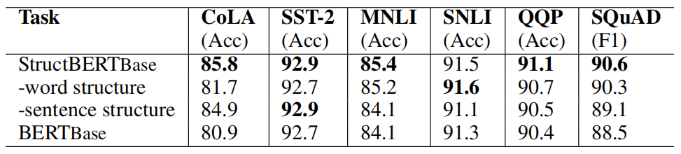

StructBERT stands for "Structural BERT" which is an extension of
[BERT](https://anwarvic.github.io/language-modeling/BERT) created by
incorporating language structures into pre-training. StructBERT was
proposed in 2019 by Alibaba Group and published in their "[StructBERT:
Incorporating Language Structures Into Pre-Training For Deep Language
Understanding](https://arxiv.org/pdf/1908.04577.pdf)" paper. The
official code for this paper can be found in the following GitHub
repository:
[alibaba/StructBERT](https://github.com/alibaba/AliceMind/tree/main/StructBERT).

StructBERT incorporates the language structures into BERT by
pre-training BERT with two tasks/objectives that make the most use of
the sequential order of words and sentences along with the Masked
Language Modeling (MLM) objective. These two objectives are:

-   Word Structural Objective.

-   Sentence Structural Objective.

MLM Recap
---------

Before getting into more details about StructBERT, let's first recap how
MLM objective worked in
[BERT](https://anwarvic.github.io/language-modeling/BERT). Given an
input sequence, 15% of the tokens in that sequence are replaced with a
\[MASK\] token; and the type of mask will be different according to the
following distribution

-   80% of the time: the mask will be \[MASK\].

-   10% of the time: the mask will be a random word.

-   10% of the time: The mask will be the original word.

Then, BERT will have to learn to predict these masked tokens correctly while
pre-training.

    

Word Structural Objective
-------------------------

This new word objective is jointly trained together with the original
MLM objective; the new objective takes the word order into
consideration. The way this objective works is that they randomly choose
$5\%$ of the unmasked trigrams to be shuffled and then StructBERT is
pre-trained to predict the original order of the tokens. As shown in the
following figure, the trigram (t2, t3, and t4) was shuffled to (t3, t4,
and t2).

    

Given a randomly shuffled span of $K$ tokens (trigram means $K = 3$),
the word structural objective is equivalent to maximizing the likelihood
of placing every shuffled token in its correct position. So, given a set
of trainable parameters $\theta$, this objective can be defined as:

$$\underset{\theta}{\text{arg}\max}{\sum_{}^{}{\log\left( P\left( \text{pos}_{1} = t_{1},\ \text{... pos}_{K} = t_{K} \middle| t_{1},\ ...t_{K}; \theta \right) \right)}}$$

They studied the effect of this objective in comparison with MLM in BERT
during self-supervised pre-training. The following figure illustrates
the loss (left) and accuracy (right) of word and sentence prediction
over the number of pre-training steps for StructBERT-Base and BERT-Base:

    

We can see that the the shuffled token prediction objective (blue line)
led to lower loss and higher accuracy more than MLM (red line).

Sentence Structural Objective
-----------------------------

The Next Sentence Prediction (NSP) task is
considered easy for the original BERT model (the prediction accuracy of
BERT can easily achieve 97%-98% in this task). Therefore, they extended
the NSP task by considering both the next sentence and the previous
sentence to make the pre-trained language model aware of the sequential
order of the sentences in a bidirectional manner.

As illustrated in the following figure, they sampled the data for this
task in pairs $\left( S_{1},\ S_{2} \right)$ where the two sentences are
concatenated together with the separator token \[SEP\] in between, as
done in BERT. Given a first sentence $S_{1}$, they sampled $S_{2}$ to
be:

-   The next sentence $\frac{1}{3}$ of the time.

-   The previous sentence $\frac{1}{3}$ of the time.

-   A random sentence from the data $\frac{1}{3}$ of the time.

    

And given the input sequence, the model has to predict whether $S_{2}$
is the next sentence that follows $S_{1}$ (class label=1), or the
previous sentence that precedes $S_{1}$ (class label=2), or a random
sentence from a different document (class label=0).

They studied the effect of this objective during self-supervised
pre-training. The following figure illustrates the loss (left) and
accuracy (right) of word and sentence prediction over the number of
pre-training steps for StructBERT-Base and BERT-Base:

    

As we can see, the new sentence structural objective in StructBERT leads
to a more challenging prediction task than that in BERT enabling
StructBERT to exploit inter-sentence structures, which benefits
sentence-pair downstream tasks.

Experiments
-----------

In this paper, they pre-trained StructBERT on documents from English
Wikipedia (2,500M words) and BookCorpus using WordPiece models. The
maximum length of input sequence was set to 512. They used Adam
optimizer ($\beta_{1} = 0.9,\ \beta_{2} = 0.999$). They used L2 weight
decay regularization of $0.01$. The learning rate was set to $1e^{- 4}$
with warm-up over the first 10% of the total steps, and linear decay at
the rest. The dropout probability was set to $0.1$ for every layer. They
used GeLU activation. They pre-trained two model sizes:

<table>
    <thead>
        <tr>
            <th></th>
            <th>$$N$$</th>
            <th>$$d_{\text{ff}}$$</th>
            <th>$$h$$</th>
            <th># parameters</th>
            <th>Hardware</th>
        </tr>
    </thead>
    <tr>
        <td><strong>Base</strong></td>
        <td>12</td>
        <td>768</td>
        <td>12</td>
        <td>110 M</td>
        <td>64 GPU V100 + 38 hours</td>
    </tr>
    <tr>
        <td><strong>Large</strong></td>
        <td>24</td>
        <td>1024</td>
        <td>16</td>
        <td>340 M</td>
        <td>64 GPU V100 + 7 days</td>
    </tr>
</table>

Now, we are going to see the performance of StructBERT over multiple
downstream tasks:

-   <u><strong>Natural Language Understanding:</strong></u>\
    The following table shows the results of StructBERT on the
    GLUE test set, which are scored by the GLUE evaluation server. The
    number below each task denotes the number of training examples. The
    state-of-the-art results are in bold. All the results are obtained
    from the [leaderboard](https://gluebenchmark.com/leaderboard)
    (StructBERT submitted under a different model name ALICE):

    

-   <u><strong>Natural Language Inference:</strong></u>\
    The following table shows the accuracy of multiple models on SNLI
    dataset. As seen from the table, StructBERT outperformed all
    existing systems on SNLI, creating new state-of-the-art results
    91.7%, which amounts to 0.4% absolute improvement over the previous
    state-of-the-art model SJRC and 0.9% absolute improvement over BERT.

    

-   <u><strong>Question Answering:</strong></u>\
    The following table shows the results of SQuAD dataset where
    we can see that StructBERT model is superior to all other models
    except
    [XLNet](https://anwarvic.github.io/language-modeling/XLNet)+DA. It
    demonstrates the effectiveness of StructBERT in modeling the
    question-paragraph relationship.

    

To study the effect of the new pre-training tasks over fine-tuning, they
performed ablation study using StructBERT-Base architecture on six
different downstream tasks as shown in the following table:

    

Based on this study, they found out the following:

-   The two structural objectives were both critical to most of the
    downstream tasks, except for the word structural objective in the
    SNLI task.

-   The StructBERT model with structural pre-training consistently
    outperformed the original BERT model, which shows the effectiveness
    of the proposed structural objectives.

-   For the sentence-pair tasks such as MNLI, SNLI, QQP and SQuAD,
    incorporating the sentence structural objective significantly
    improved the performance.

-   For the single-sentence tasks such as CoLA and SST-2, the word
    structural objective played the most important role. Especially in
    the CoLA task, which is related to the grammatical error correction,
    the improvement was over 5%. The ability of reconstructing the order
    of words in pre-training helped the model better judge the
    acceptability of a single sentence.
