T5 stands for "Text-to-Text Transfer Transformer" which is a
text-to-text framework proposed by Google in 2019 and published in this
paper: "[Exploring the Limits of Transfer Learning with a Unified
Text-to-Text Transformer](https://arxiv.org/pdf/1910.10683.pdf)". The
official code for this paper can be found on Google Research's official
GitHub repository:
[google-research/text-to-text-transfer-transformer](https://github.com/google-research/text-to-text-transfer-transformer).

From the name of the paper, we can see that this 64-pages research paper
discusses transfer learning and its limitations. Transfer learning is
where a model is first pre-trained on a data-rich task using in an
unsupervised-fashion before being fine-tuned on a downstream task.
Downstream tasks like machine translation, text classification, ..etc.
This has turned out to be as a powerful technique in natural language
processing.

And also from the name, we can see it focuses on text-to-text tasks
which are tasks that take text as an input and return text as an output
like machine translation, language generation, text summarization,
question answering \...etc. This allows us to use the same model, loss
function, hyper-parameters across diverse set of tasks.

In order to train a single model on the diverse set of tasks, they fed
the model some text for context before feeding the input text and then
asked to produce some output text. For example, to ask the model to
translate the sentence "That is good." from English to German, the model
would be fed the sequence "*translate English to German*: That is good."
and would be trained to output "Das ist gut." as shown below:

    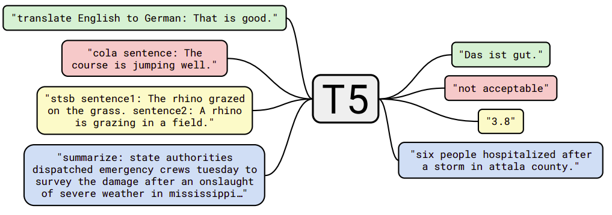

Again, this paper does not propose new methods but instead provides a
comprehensive perspective on text-to-text tasks. And to perform
experiments, it introduces the
[C4](https://www.tensorflow.org/datasets/catalog/c4) (Colossal Clean
Crawled Corpus) dataset consisting of hundreds of gigabytes of clean
English text scraped from the web.

C4
--

C4 stands for "Colossal Clean Crawled Corpus" which is a cleaned-up
version of the publicly-available [Common
Crawl](http://commoncrawl.org/) dataset. Common Crawl provides web
extracted text by crawling the internet producing around 20TB of scraped
text data each month.

To assemble the C4 dataset, they downloaded the web extracted text from
Common Crawl that was posted on April 2019, which is about 750 GB. And
then they applied the following filtering steps:

-   They only retained lines that ended in a terminal punctuation mark
    (i.e. a period, exclamation mark, question mark, or end quotation
    mark).

-   They discarded any page with fewer than 5 sentences and only
    retained lines that contained at least 3 words.

-   They removed any page that contained any word on the "[List of
    Dirty, Naughty, Obscene or Otherwise Bad
    Words](https://github.com/LDNOOBW/List-of-Dirty-Naughty-Obscene-and-Otherwise-Bad-Words)".

-   They removed any line with the word JavaScript since it usually
    indicates an error on the web.

-   Some pages had placeholder "lorem ipsum" text; they removed any page
    where the phrase "lorem ipsum" appeared.

-   Some pages inadvertently contained code. Since the curly bracket "{"
    appears in many programming languages (such as Javascript, widely
    used on the web) but not in natural text, they removed any pages
    that contained a curly bracket.

-   To de-duplicate the dataset, they discarded all but one of any
    three-sentence span occurring more than once in the data set.

-   Since most of downstream tasks are focused on English-language text,
    they used [langdetect tool](https://pypi.org/project/langdetect/) to
    filter out any pages that were not classified as English with a
    probability of at least $0.99$.

> **Note:**\
The C4 dataset is released as part of TensorFlow Datasets. You can
find it in this
[link](https://www.tensorflow.org/datasets/catalog/c4).

Models
------

All the models mentioned in this paper are based on the
[Transformer](https://anwarvic.github.io/machine-translation/Transformer)
architecture. The implemented version of the transformer used in this
paper follows closely the originally-proposed form with a few changes:

-   They used a simplified version of layer normalization where the
    activations are only re-scaled and no additive bias is applied.

-   While the original Transformer used a sinusoidal position signal or
    learned position embeddings, they used a simplified form of
    relative-position embeddings where each "embedding" is simply a
    scalar that represents the offset between the "key" and "query"
    being compared. This scalar is a number from 1 to 32 increasing
    logarithmically. So, if the offset is 4, the embedding is 1. If the
    offset is 32, the embedding is 4. If the offset is 128, the
    embedding is 32. Beyond 128, all relative positions to the same
    embedding which is 32.

-   Also, they shared the position embedding parameters across all
    layers knowing that each attention head uses a different learned
    position embedding.

    In this paper, the researchers pre-trained different variations of
    the Transformer architecture and compared their performance in
    comparison to the baseline models. First, let's talk about the
    baseline model first.

### Baseline Model

The baseline model used in this paper is a standard encoder-decoder
Transformer architecture. It is designed so that the encoder and decoder
are each similar in size and both are configured to a BERT~BASE~
configuration which means:

-   Both the encoder and decoder consist of 12 layers (each layer
    comprising self-attention, optional encoder-decoder attention, and a
    feed-forward network).

-   The feed-forward networks is a dense layer with an output
    dimensionality of $d_{\text{ff}} = 3072$ followed by a ReLU
    activation and another dense layer.

-   The "key" and "value" matrices of all attention mechanisms have an
    inner dimensionality of $d_{\text{kv}} = 64$ and all attention
    mechanisms have $12$ heads. All other sub-layers and embeddings have
    a dimensionality of $d_{\text{model}} = 768$.

-   For regularization, they used a dropout probability of 0.1
    everywhere in the model.

    In total, this results in a model with about 220 million parameters
    which is roughly twice the number of parameters of BERT~BASE~ since
    this baseline model contains an encoder and a decoder.

### Architectural Variants

Now that we have discussed the baseline model used in this paper, let's
discuss the other variations they tried. The only thing at which these
variations differ is the **self-attention mechanism**.

Recall that the self-attention operation in a Transformer takes a
sequence as input $X$ and outputs a new sequence of the same length $Y$.
Each entry of the output sequence $y_{i}$ is produced by computing a
weighted average of entries of the input sequence
$\sum_{j}^{}w_{i,j}x_{j}$ where $w_{i,j}$ is the scalar weight produced
by the self-attention mechanism as a function of $x_{i}$ and $x_{i}$.
The attention mask is then used to zero out certain weights
$w_{i,j} = 0$ in order to constrain which entries of the input can be
attended to at a given output timestep.

The different variations of masking in self-attention mechanism can be
seen in the following figure:

    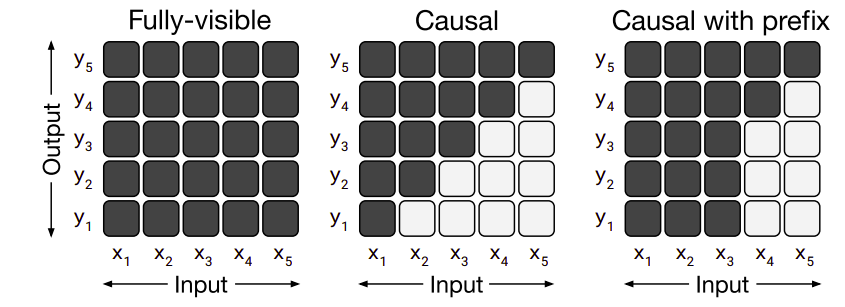

-   <u><strong>Fully-visible:</strong></u>\
    This allows a self-attention mechanism to attend to any
    entry of the input when producing each entry of its output.

-   <u><strong>Causal:</strong></u>\
    This allows a self-attention mechanism to attend to only previous
    tokens. So, when producing the $i^{\text{th}}$ entry of the output
    sequence, causal masking prevents the model from attending to the
    $j^{\text{th}}$ entry of the input sequence for $j > i$. This
    masking can be used as a language model (LM), i.e. a model trained
    solely for next-step prediction

-   <u><strong>Causal with prefix:</strong></u>\
    This is a special case of the causal masking where a fully-visible
    masking will be used during the prefix portion of the sequence and
    causal masking for the rest.

Using these three different masking techniques with the standard
encoder-decoder transformer, we will get three different variations that
will be used:

    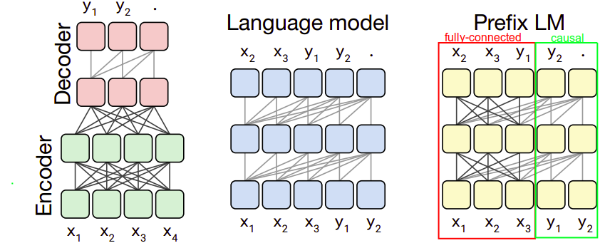

-   <u><strong>Encoder-decoder (left):</strong></u>\
    This is the same as the baseline; the encoder has no masking
    (fully-visible) while the decoder has a "causal masking".

-   <u><strong>Language Model (middle):</strong></u>\
    This architecture consists of a single Transformer layer stack and
    is fed the concatenation of the input and target using a causal mask
    throughout.

-   <u><strong>Prefix LM (right):</strong></u>\
    This architecture is similar to language model with
    prefix-parameters (red rectangle) use fully-visible masking and the
    rest (green rectangle) use causal masking. This closely resembles
    BERT

> **Note:**\
The Prefix LM is similar to an encoder-decoder model with parameters
shared across the encoder and decoder and with the encoder-decoder
attention replaced with full attention across the input and target
sequence.

Pre-training
------------

In this paper, pre-training is done by running the model for
$2^{19} = 524,288$ steps on C4 before fine-tuning. A maximum sequence
length of $512$ is used and a batch size of $128$ sequences and they
**packed** multiple sequences into one entry of the batch whenever
possible. Roughly speaking, models in this paper are pre-trained on
$2^{35} \approx 34B$ tokens which is considerably less than BERT
($137B\ $tokens) or RoBERTa ($2.2T$ tokens).

> **Note:**\
That $2^{35}$ tokens only covers a fraction of the entire C4 dataset
which means they never repeated any data during pre-training.

Also, they used an "inverse square root" learning rate schedule:
$\frac{1}{\sqrt{\max\left( n,k \right)}}$ where $n$ is the current
training iteration and $k$ is the number of warm-up steps which was set
to $10^{4}$. This sets a constant learning rate of $0.01$ for the first
$10^{4}$ steps, then exponentially decays the learning rate until
pre-training is over.

Since fine-tuning will be done on other languages other than English
like (German, French, and Romanian), they classified the pages in C4
that are either German, or French, or Romanian. Then, they trained the
SentencePiece model on a mixture of 10 parts of English C4 data with 1
part for each language forming a vocabulary of $32,000$ word-pieces.

> **Very Important Note:**\
Based on this vocabulary setup, T5 models can only process a
predetermined, fixed set of languages which are English, German, French,
and Romanian.

### Objectives

The choice of unsupervised objective is of central importance as it
provides the mechanism through which the model gains general-purpose
knowledge to apply to downstream tasks. All objectives mask one or
multiple tokens from the input to produce a (corrupted) input that the
model will learn to predict the target sequence with the maximum
likelihood. The following table summarizes all pre-training objectives
discussed in this paper and they are:

    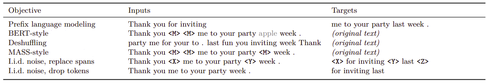

-   <u><strong>Prefix Language Modeling:</strong></u>\
    This technique splits a span of text into two components, one to use
    as inputs to the encoder and the other to use as a target sequence
    to be predicted by the decoder.

-   <u><strong>BERT-style:</strong></u>\
    BERT-MLM objective takes a span of text and corrupts $15\%$ of the
    tokens. BERT had only an encoder without a decoder. So, in this
    encoder-decoder setup, they adapted MLM from BERT by simply using
    the entire uncorrupted sequence as the target.

-   <u><strong>De-shuffling:</strong></u>\
    This approach takes a sequence of tokens, shuffles it, and
    then uses the original de-shuffled sequence as a target.

-   <u><strong>MASS-style:</strong></u>\
    This approach masks a consecutive sequence of tokens in the input
    and passes it to the encoder, then use the uncorrupted sequence as
    the target. This looks like the Masked-Sequence objective discussed
    in [MASS](https://anwarvic.github.io/language-modeling/MASS) with a
    few changes.

-   <u><strong>i.i.d. noise, replace spans:</strong></u>\
    This approach avoid predicting the whole uncorrupted text by
    masking a few tokens in the encoder. Then, the target sequence
    becomes the concatenation of the "corrupted" spans, each prefixed by
    the mask token used to replace it in the input.

-   <u><strong>i.i.d. noise, drop tokens:</strong></u>\
    It's the same as <u><strong>I.i.d. noise, replace spans</strong></u> but
    with dropping the corrupted tokens from the input sequence, then use
    these dropped tokens (in order) as the target.

> **Notes:**
>
> - $\left\langle M \right\rangle$ denotes a shared mask token (with
    same ID) while $\left\langle X \right\rangle$,
    $\left\langle Y \right\rangle$, and $\left\langle Z \right\rangle$
    denote sentinel tokens that are assigned unique token IDs.
>
> - The greyed-out word "apple" in the previous table shows that this
    token is a random token used as a replacement.
>
> - All objectives mentioned earlier except the prefix LM are called
    "denoising" objectives, since they add a noise to the input and the
    model has to de-noise it.
>
> - The **replace spans** approach later will be called "Span
    Corruption".
>
> - The "i.i.d" written before the objective name of the last two
    objectives indicates that for each input token, a decision will be
    made to either corrupt the token or leave it as it is.

Fine-Tuning
-----------

All models in this paper were fine-tuned for $2^{18} = 262,144$ steps on
all tasks. This value was chosen as a trade-off between the
high-resource tasks (i.e. those with large data sets), which benefit
from additional fine-tuning, and low-resource tasks (smaller data sets),
which overfit quickly. Like pre-training, they used batches with $128$
length-$512$ sequences. And unlike pre-training, they used a constant
learning rate of $0.001$.

They saved a checkpoint every $5,000$ steps and report results on the
checkpoint that got the highest validation performance. For models
fine-tuned on multiple tasks, they chose the best checkpoint for each
task independently.

### Benchmarks

They used a diverse set of benchmark (all sourced from [TensorFlow
datasets](https://www.tensorflow.org/datasets)) that is able to measure
the general language learning; these datasets are:

-   GLUE and SuperGLUE for text classification.

-   CNN/Daily Mail for abstractive summarization.

-   SQuAD for question answering.

-   WMT (English → German), (English → French), and (English → Romanian) for
machine translation.

Results
-------

In this part, we are going to discuss all the experiments they tried in
the paper and what we can learn from them. The results tables are all
formatted so that each row corresponds to a particular experimental
configuration with columns giving the scores for each benchmark. The
baseline configuration is marked with ★. Any score that is within two
standard deviation of the best score in a given experiment will be
**bold-faced**. Also, all results are reported on the validation set of
each benchmark dataset.

-   <u><strong>Baseline (with/without pre-training):</strong></u>\
    The following table shows the average and standard deviation
    of the baseline model with and without pre-training for the same
    number of steps:

    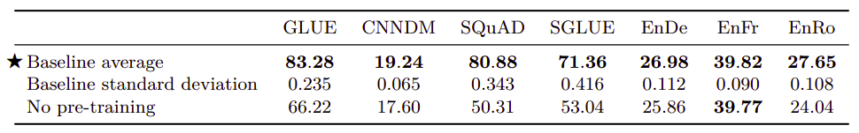

-   <u><strong>Architectural Variants:</strong></u>\
    The following table shows the performance when trying different
    architectural variants pre-trained on a certain objective and
    fine-tuned on the benchmark. To provide a reasonable means of
    comparison, they referred to the number of layers in
    BERT~BASE~-sized layer stack as $L$ and the number of parameters as
    $P$ and the number of FLOPs (Floating-point Operations) required for
    an $L + L$-layer encoder-decoder model or $L$-layer decoder-only
    model as $M$.

    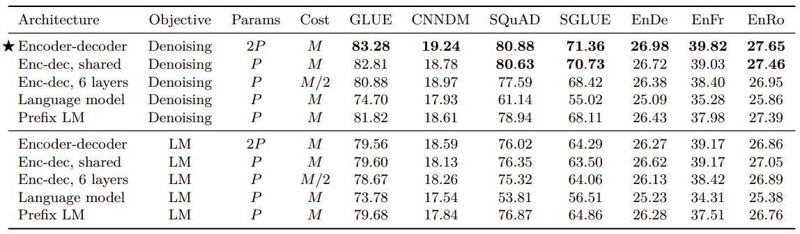

-   <u><strong>Objective Functions:</strong></u>\
    The following table shows the performance of the baseline model
    using different objective functions; from the table we can see that
    all BERT-style variants (BERT-style + the last three) perform
    similarly.

    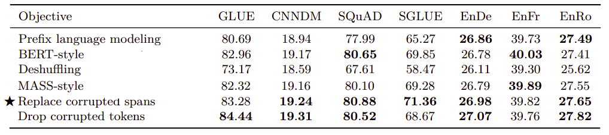

-   <u><strong>BERT-style Corruption Rate:</strong></u>\
    As you remember, BERT-style corruption rate masks 15% of the input
    sequence; 80% with the $\left\langle M \right\rangle$ token; 10%
    with a random token and 10% with the original token. In the
    following table, they tried different corruption rate. From the
    table, we can see that the corruption rate had a limited effect on
    the model's performance. The only exception is (50%), it results in
    a significant degradation of performance on GLUE and SQuAD.

    

-   <u><strong>Span Length:</strong></u>\
    Span length is the number of consecutive tokens that will be masked
    when applying the denoising objective. Using a corruption rate of
    $15\%$ in all cases, the following table compares average span
    lengths of 2, 3, 5 and 10. The baseline (i.i.d) means that for each
    input token, we will have to make a decision whether to corrupt it
    or not. Again, this shows limited difference except with an average
    span length of 10 which slightly under-performs the other values in
    some cases.

    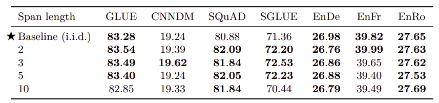

-   <u><strong>Pre-training datasets:</strong></u>\
    **The following table measures the effect of different C4 filtration
    methods (first four entries) alongside with common pre-training
    datasets (last two) on downstream tasks performance:

    -   **Unfiltered C4:** ignoring all C4 filtration steps mentioned
        earlier except the one using the langdetect tool to extract
        English data.

    -   **RealNews-like:** using standard filtration on C4 and to only
        include content from one of the domains used in the "RealNews"
        dataset.

    -   **WebText-like:** using standard filtration on C4 and to only
        use content originated from a URL that appeared in the list
        prepared by the
        [OpenWebText](https://github.com/jcpeterson/openwebtext). This
        was relatively small (around 2GB). Therefore, they used 12
        months (August 2018 to July 2019) from CommonCrawl instead of
        just one months as the original C4.

    -   **Wikipedia:** using the English Wikipedia text data from
        [TensorFlow
        Datasets](https://www.tensorflow.org/datasets/catalog/wikipedia),
        which omits any markup or reference sections from the
        articles.

    -   **Wikipedia + Toronto Books Corpus:** A drawback of using
        pre-training data from Wikipedia is that it represents only
        one possible domain of natural text (encyclopedia articles).
        To mitigate this, they combined the Wikipedia data with the
        Toronto Books Corpus (TBC). TBC contains text extracted from
        eBooks, which represents a different domain of natural
        language. This is the same pre-training data used with BERT.

    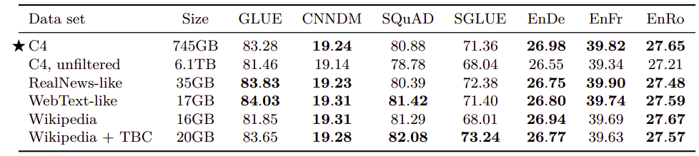

-   <u><strong>Pre-training data size:</strong></u>\
    The following table measures the effect of limited unlabeled dataset
    sizes. These results were obtained by truncating the first $2^{29}$,
    $2^{27}$, $2^{25}$, and $2^{23}$ tokens of the C4 dataset. Knowing
    that all models in this paper were trained using $2^{35}$ tokens,
    these data sizes had to be repeated to match that. From the table,
    the performance degrades as the data set size shrinks which is
    totally expected:

    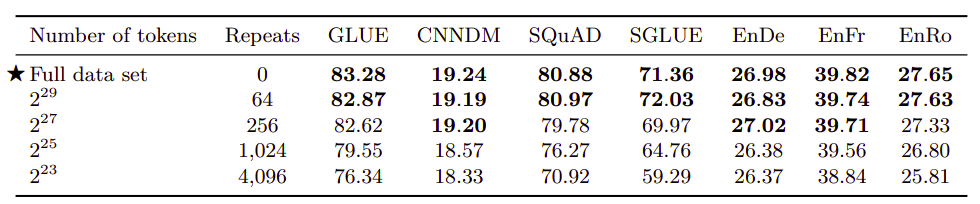

-   <u><strong>Alternative fine-tuning Methods:</strong></u>\
    The following table compares different alternative fine-tuning
    methods that only update a subset of the model's parameters. For
    adapter layers, $d$ refers to the inner dimensionality of the
    adapters. As we can see, lower-resource tasks like SQuAD work well
    with a small value of $d$ whereas higher resource tasks require a
    large dimensionality to achieve reasonable performance.

    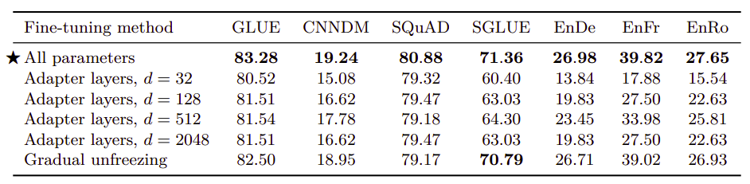

> **Note:**\
The past experiment suggests that adapter layers could be a
promising technique for fine-tuning on fewer parameters as long as
the dimensionality is scaled appropriately to the task size.

Multi-task Learning
-------------------

So far, we have been pre-training our model on a single unsupervised
learning task before fine-tuning it individually on each downstream
task. An alternative approach, called "multitask learning", is to train
the model on multiple tasks at once. In this paper, they relaxed that
goal somewhat and instead investigated methods for training on multiple
tasks at once in order to eventually produce separate parameter settings
that perform well on each individual task which makes it comparable to
the pre-train-then-fine-tune approach.

Multi-task learning is performed on the same datasets as the fine-tuning
An extremely important factor in multi-task learning is how much data
from each task the model should be trained on. In this paper, they have
tried three different mixing methods to make sure each task gets enough
data:

-   <u><strong>Equal mixing:</strong></u>\
    In this case, each example in each batch is sampled uniformly at
    random from one of the datasets.

-   <u><strong>Example-proportional Mixing:</strong></u>\
    If the number of examples in each of the $N$ task's data sets is
    $e_{n}$ where $n \in \left\\{ 1,\ ...N \right\\}$, then the
    probability of sampling an example from the $m^{\text{th}}$ task
    during training is
    $r_{m} = \frac{\min\left( e_{n},\ K \right)}{\sum_{i = 1}^{N}{\min\left( e_{i},\ K \right)}}$
    where $K$ is the artificial data set size limit.

-   <u><strong>Temperature-scaled mixing:</strong></u>\
    Temperature up-samples the relatively low-resource tasks. This is
    done by raising each task's mixing rate $r_{m}$ to the power of
    $\frac{1}{T}$.

To compare these mixing strategies on equal footing with the
pre-train-then-fine-tune results, they trained multi-task models for
the same total number of steps: $2^{19} + 2^{18} = 786,432$. The
results are shown in the following table:

    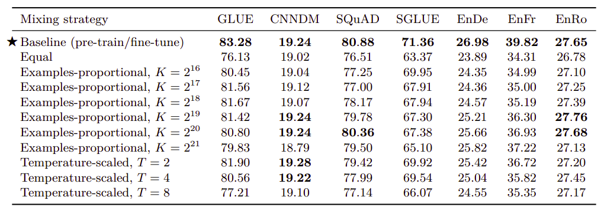

From the table, we can find out that multi-task training
under-performs pre-training followed by fine-tuning on most tasks.
The "equal" mixing strategy in particular results in dramatically
degraded performance.

Since they relaxed the multi-task learning to make it look similar
to the pre-train-then-fine-tune-approach, they decided to combine
fine-tuning with multi-task learning once and combine multi-task
learning with pre-training another time. The following table shows
that the pre-train and then fine-tune technique is still better:

    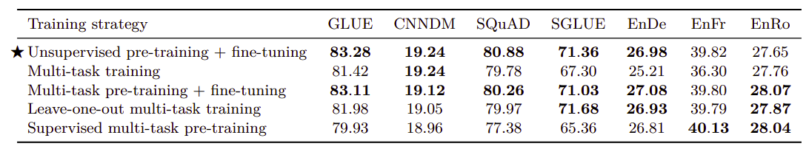

All multi-task learning performed in the previous table were mixed
using examples-proportional method (with $K = 2^{19}$).
Leave-one-out multi-task training was done by pre-training the model
on all tasks except one and then fine-tune it on the task that was
left out during pre-training.

Scaling
-------

In deep learning, there is an argument that says that scaling up models
produces improved performance. However, there are a variety of possible
ways to scale (to make model bigger) like <u><strong>using more
parameters</strong></u>, <u><strong>training the model for more steps</strong></u>,
and <u><strong>ensembling</strong></u>. In the paper, they compared these
different approaches with the baseline model.

To increase the number of parameters, they experimented with the
BERT~LARGE~ setup with $d_{\text{ff}} = 4096$,
$d_{\text{model}} = 1024$, $d_{\text{kv}} = 64$, and $16$-head attention
mechanism and $16$-layers encoder and $16$-layers decoder. This setup
produces twice ($2 \times$) the number of parameters as the baseline
model. Using $32$-layers encoder and $32$-layers decoder will produce
roughly four times ($4 \times$) the number of parameters as the baseline
model. Also, created an ensemble model by training the baseline 4
different times and averaging their results.

The performance achieved after applying these various scaling methods is
shown in the following table which shows that increasing the model size
resulted in an additional bump in performance compared to solely
increasing the training time or batch size:

    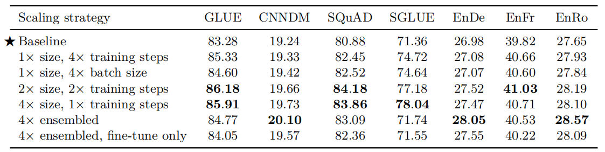

> <u><strong>Important Notes:</strong></u>
>
> - Different scaling methods have different trade-offs that are
    separate from their performance. For example, using a larger model
    can make downstream fine-tuning and inference more expensive. In
    contrast, the cost of pre-training a small model for longer is
    effectively amortized if it is applied to many downstream tasks.
>
> - Ensembling $N$ separate models has a similar cost to using a model
    that has an $N \times$ higher computational cost.
