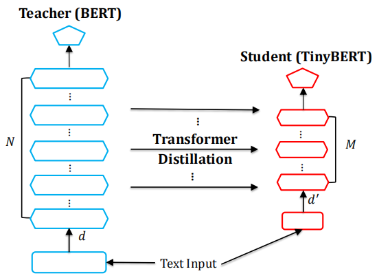
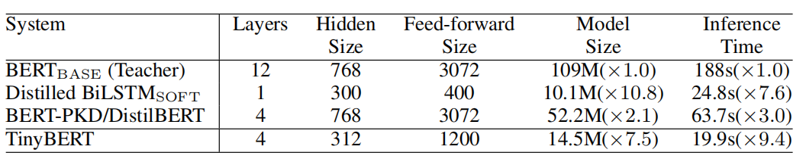
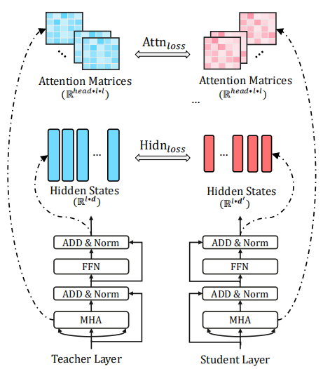
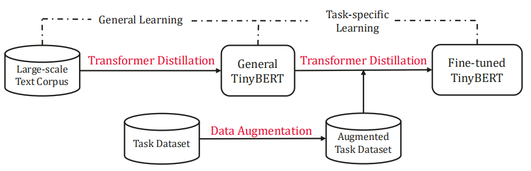
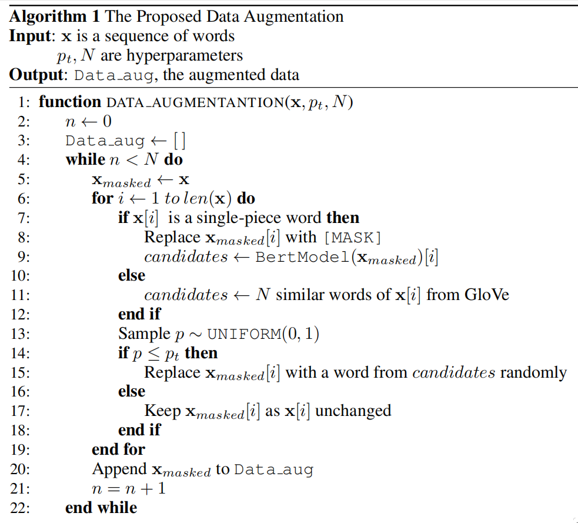
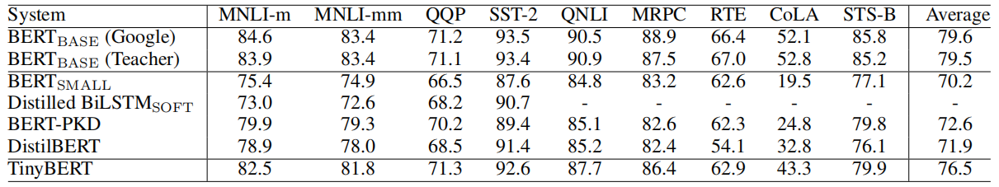
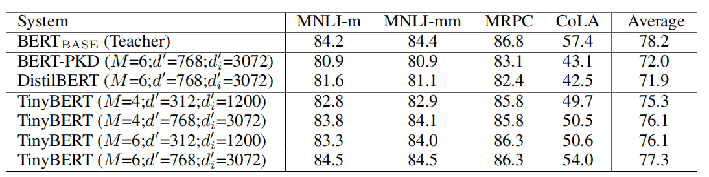

TinyBERT is a distilled version of BERT using a novel knowledge
distillation method called "Transformer distillation" that was specially
designed for Transformer models such as
[BERT](https://anwarvic.github.io/language-modeling/BERT). TinyBERT was
proposed in 2019 by Huawei Noah's Ark Lab and published in this paper
under the same name "[TinyBERT: Distilling Bert For Natural Language
Understanding](https://arxiv.org/pdf/1909.10351.pdf)". The official code
for this paper can be found in the following GitHub repository:
[TinyBERT](https://github.com/huawei-noah/Pretrained-Language-Model/tree/master/TinyBERT).

    

Knowledge distillation (KD) is a commonly used technique for reducing
the size of big deep learning models. This technique was proposed by
Geoffrey Hinton back in 2015 in this paper: [Distilling the knowledge in
a neural network](https://arxiv.org/pdf/1503.02531.pdf). KD aims to
transfer the knowledge embedded in a large network (called "teacher") to
a small network (called "student") where the student network is trained
to reproduce the behaviors of the teacher network.

The proposed Transformer Distillation method works differently based on
the type of layer to be distilled. Additionally, this method performs
the knowledge distillation at both the pre-training and fine-tuning
stages which ensures that TinyBERT can capture both the general-domain
and task-specific knowledge of the teacher BERT.

The following table shows a comparison between BERT-base,the proposed TinyBERT and other distilled variations:

    

Transformer Distillation
------------------------

As said earlier, Transformer Distillation is a novel Knowledge
Distillation technique for compressing transformer-based models and
considering all types of layers including transformer layers, the
embedding layer, and the prediction layer. Each layer will be distilled
differently as we are going to see later.

Assuming that the student model has M Transformer layers and teacher
model has N Transformer layers, the student can acquire knowledge from
the teacher by minimizing the following objective:

$$\mathcal{L}_{\text{model}} = \sum_{m = 0}^{M + 1}{\lambda_{m}\mathcal{L}_{\text{layer}}\left( S_{m},\ T_{g\left( m \right)} \right)}$$

Where:

-   $S$ and $T$ refer to the Student model and the Teacher model
    respectively.

-   $\lambda_{m}$ is the hyper-parameter that represents the importance
    of the m-th layer's distillation. In the paper, they used
    $\lambda = 1$.

-   $g\left( m \right)$ is a mapping function that maps m-th student
    layer to a certain Teacher layer. In the paper, they used
    $g\left( m \right) = 3m$; knowing that $g\left( 0 \right) = 0$ which
    is the mapping of the embedding layer and
    $g\left( M + 1 \right) = N + 1$ which is the mapping of the
    prediction layer.

-   $\mathcal{L}_{\text{layer}}$ refers to the loss function of a given
    model layer which changes based on the layer type; it can be
    described in the following formula:

$$\mathcal{L}_{\text{layer}}\left( S_{m},\ T_{g\left( m \right)} \right) = \left\{ \begin{matrix}
\mathcal{L}_{\text{embd}}\left( S_{0},\ T_{0} \right),\ \ \ \ \ \ \ \ \ \ \ \ \ \ \ \ \ \ \ \ \ \ \ \ \ \ \ \ \ \ \ \ \ \ \ \ \ \ \ \ \ \ \ m = 0 \\
\mathcal{L}_{\text{hid}}\left( S_{m},\ T_{g\left( m \right)} \right) + \mathcal{L}_{\text{attn}}\left( S_{m},\ T_{g\left( m \right)} \right),\ \ \ M \geq m > 0 \\
\mathcal{L}_{\text{pred}}\left( S_{M + 1},\ T_{N + 1} \right),\ \ \ \ \ \ \ \ \ \ \ \ \ \ \ \ \ \ \ \ \ \ \ \ \ \ m = M + 1 \\
\end{matrix} \right. $$

### Embedding-Layer Distillation

Here, the student embedding layer $E^{S} \in \mathbb{R}^{l \times d}$
has the same size as the teacher embedding layer
$E^{T} \in \mathbb{R}^{l \times d}$ and it acquires knowledge by
minimizing the following mean-squared error function where the matrix
$W_{e} \in \mathbb{R}^{d \times d}$ is a learnable linear transformation
matrix, $l$ is the length of the input text and $d$ is the model
dimension:

$$\mathcal{L}_{\text{embd}} = \text{MSE}\left( E^{S}W_{e},\ E^{T} \right)$$

### Transformer-Layer Distillation

As show in the following figure, the transformer-layer distillation
consists of two parts:

    

-   <u><strong>Attention-based distillation $\mathcal{L}_{\text{attn}}$</strong></u>:\
    That ensures that the linguistic knowledge is transferred from
    teacher BERT to student TinyBERT where the student learns to fit the
    attention matrices of multi-head attention from the teacher, and the
    objective is defined as:

$$\mathcal{L}_{\text{attn}} = \frac{1}{h}\sum_{i = 1}^{h}{\text{MSE}\left( A_{i}^{S},\ A_{i}^{T} \right)}$$

&emsp;&emsp;&emsp; Where $h$ is the number of attention heads and
$A_{i}^{S} \in \mathbb{R}^{l \times 1}$ refers to the attention matrix
corresponding to the i-th head of the student model and $l$ is the input
text.

-   <u><strong>Hidden states based distillation $\mathcal{L}_{\text{hid}}$:</strong></u>\
    Here, the student hidden layer $H^{S} \in \mathbb{R}^{l \times d'}$
    has the smaller size than the teacher embedding layer
    $H^{T} \in \mathbb{R}^{l \times d}$ and it acquires knowledge by
    minimizing the following mean-squared error function where the
    matrix $W_{f} \in \mathbb{R}^{d' \times d}$ is a learnable linear
    transformation matrix:

$$\mathcal{L}_{\text{hid}} = \text{MSE}\left( H^{S}W_{h},\ H^{T} \right)$$

### Prediction-Layer Distillation

In addition to imitating the behaviors of intermediate layers, they also
used the knowledge distillation to fit the predictions of teacher model
according to the following loss function

$$\mathcal{L}_{\text{pred}} = \text{softmax}\left( z^{T} \right).\text{log\_softmax}\left( \frac{z^{S}}{t} \right)$$

Where $z^{S}$ and $z^{T}$ are the logits vectors predicted by the
student and teacher respectively, $\text{log\_softmax}$ means the log
likelihood, and $t$ means the temperature value. According to the paper,
$t = 1$ performs well.

TinyBERT Learning
-----------------

As shown in the following figure, TinyBERT learning consist of two stages that
are complementary to each other which are <u><strong>General
Distillation</strong></u> and <u><strong>Task-specific Distillation</strong></u>.
Although there is a big gap between BERT and TinyBERT in model size, by
performing the proposed two-stage distillation, the TinyBERT can achieve
comparable performances as large BERT in various NLP tasks.

    

### General Distillation

In general distillation, the original BERT without fine-tuning is used
as the teacher model along with a large-scale text corpus as the basic
learning material. By performing the proposed Transformer distillation
on the text from general domain, we obtain a general TinyBERT that can
be fine-tuned for downstream tasks later.

> **Note:**\
Due to the big reductions in the hidden/embedding size and the layer
number, general TinyBERT performs relatively worse than the original
BERT

### Task-specific Distillation:

In the task-specific distillation, the fine-tuned BERT is used as the
teacher model along with an augmented data to extend the task-specific
training set. With learning more task-related materials, the
generalization capabilities of student model can be further improved.

To augment the task-specific training set, they used a pre-trained
language model BERT and GloVe word embeddings to do word-level
replacement as shown in the following algorithm:

    

Which can be explained in the following steps:

-   First, mask each word piece in a sentence.

-   If the selected word is a word-piece, then use BERT as a language
    model to predict $N$ most-likely words. Otherwise, use GloVe
    embeddings to get the top $N$ similar words.

-   Then, choose a random number uniformally. If the number is less than
    a certain threshold number $p_{t}$, then choose a random candidate
    from the suggested one. Otherwise, keep the word as it is.

-   In the paper, they applied this data augmentation method $N = 20$
    times to all the sentences of a downstream task while setting
    $p_{t} = 0.4$ for all our experiments.

Experiments & Results
---------------------

They evaluated TinyBERT on the General Language Understanding Evaluation
(GLUE) benchmark, which is a collection of diverse natural language
understanding tasks.The evaluation results are presented in the
following table which shows that TinyBERT is consistently better than
BERT-SMALL in all the GLUE tasks despite being same in size:

    

The following table shows a comparison among three wider and deeper
variants of TinyBERT and their evaluation results on different
development sets.

    

We can clearly see that:

-   All the three TinyBERT variants can consistently outperform the
    original smallest TinyBERT, which indicates that the proposed KD
    method works for the student models of various model sizes.

-   For the CoLA task, the improvement is slight when only increasing
    the number of layers (from 49.7 to 50.6) or hidden size (from 49.7
    to 50.5). To achieve more dramatic improvements, the student model
    should become deeper and wider (from 49.7 to 54.0).

-   Another interesting observation is that the smallest 4-layer
    TinyBERT can even outperform the 6-layers baselines, which further
    confirms the effectiveness of the proposed KD method.
