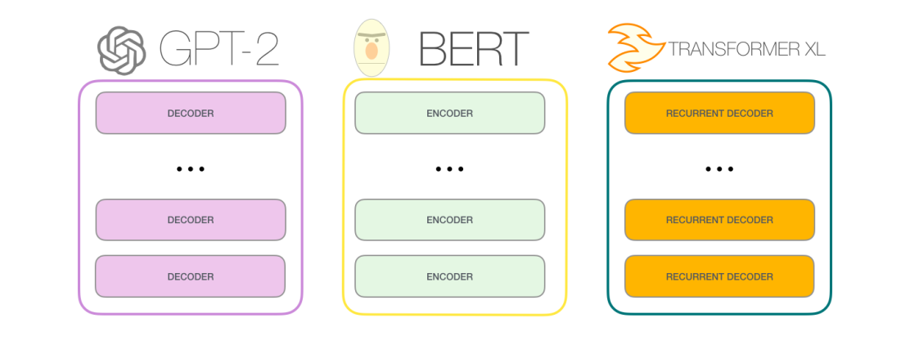
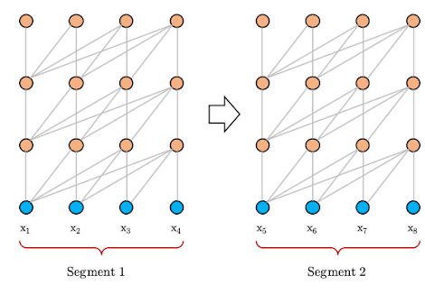
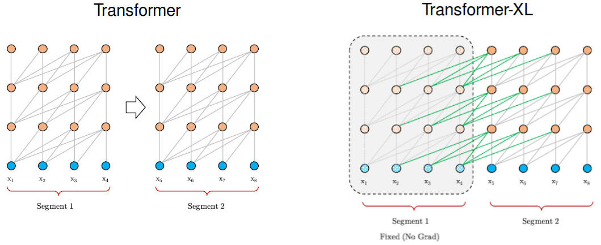
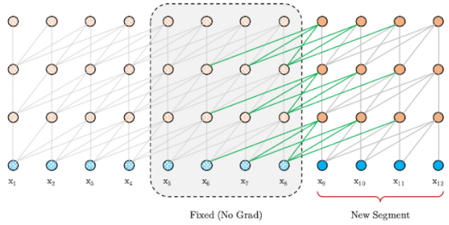
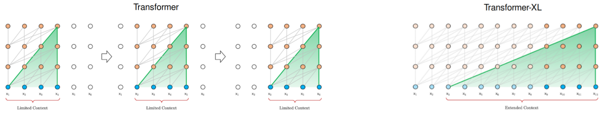
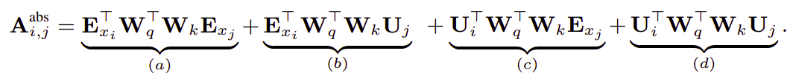
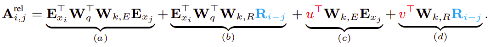

Transformer-XL, stands for "Transformer Extra Long", is a language model
published in this paper: "[Transformer-XL: Attentive Language Models
Beyond a Fixed-Length Context](https://arxiv.org/pdf/1901.02860.pdf)"
by Google Brain in 2019.The official code for this paper can be found in the
following GitHub repository: [transformer-xl
](https://github.com/kimiyoung/transformer-xl).

In this paper, the authors are trying to increase the context-dependency scope.
Hence, the name of the paper: Transformer-XL Attentive Language Models Beyond a
Fixed-Length Context. A simple comparison between Transformer-XL and GPT and
BERT can be summarized in the following figure:

    

In the transformer architecture, we split the input paragraph into
sentences, each sentence can't exceed a certain length (it's 512 in
BERT). After splitting the paragraph into sentences or "segments", then
we train our model as shown in the following image where we assume the
allowed length is just <u>four</u>:

    

As you can see, segment 2 is after segment 1 in the same paragraph. But
according to the transformer architecture, they are totally independent
which causes another problem called "context fragmentation" where the
model lacks the necessary contextual information to predict the first
few symbols due to the way the context was selected. Transformer-XL
solves this problem by providing a segment-level recurrence mechanism.
And since transformer-XL uses larger context-dependency length, the
authors decided to use a different positional encoding than the vanilla
transformer.

So, the key innovations behind this paper can be summarized into two
things:

-   Segment-level recurrence mechanism.

-   Relative positional encoding scheme.

Segment-level Recurrence
------------------------

The goal of the recurrence mechanism is to enable long-term dependencies
by using information from previous segments. Similarly to the vanilla
version, Transformer-XL processes the first segment of tokens but keeps
the outputs of the hidden layers. When the following segment is
processed, each hidden layer receives two inputs:

-   The output of the previous hidden layer of that segment, as in the
    vanilla version (the grey arrows in the chart below).

-   The output of the previous hidden layer from the previous segment
    (the green arrows) that allows the model to create long-term
    dependencies.

Technically, the two inputs are concatenated and then used to calculate
the Key and the Value matrices of the (current Head of the current layer
of the) current segment. This addition provides the network with more
information in regards to the weights (importance) of each token, but it
doesn't change the Value matrix.

    

In each segment, each hidden layer receives the output of the previous
hidden layer and the output of the previous segment. It increases the
largest possible dependency by using contextual information from several
previous segments.

    

This mechanism can be applied at the decoding step with no problem as
shown in the following figure:

    

Relative Positional Encoding
----------------------------

Naively applying recurrence introduces another technical challenge. That
is, the positional information is incoherent, and tokens from different
segments have the same positional encoding, which is referred to as
<u><strong>temporal confusion</strong></u>. To address this challenge,
Transformer-XL employs novel relative positional encodings.

In the vanilla transformer, positional encodings were depending on the
index of the tokens. This positional encoding is depending on the
relative distance between tokens, hence the name: <u>relative</u>
positional encoding. In the paper this was done by expanding the simple
query-key multiplication of the Attention Head's Score.

First, let's recap what was the query-key multiplication in the
attention mechanism of the vanilla transformer:

    

Following the idea of only relying on relative positional information,
they proposed to reparameterize the four terms as follows:

    

With the following changes:

-   The first change they made is to replace all appearances of the
    absolute positional embedding $U_{j}$ for computing key vectors in
    term $(b)$ and $(d)$ with its relative counterpart $R_{i - j}$ .
    Note that $R$ is a sinusoid encoding matrix without learnable
    parameters.

-   Secondly, we introduce a trainable parameter $u \in \mathbb{R}^{d}$
    to replace the query $U_{i}^{T}W_{q}^{T}$ in term $(c)$. In this
    case, since the query vector is the same for all query positions,
    it suggests that the attentive bias towards different words should
    remain the same regardless of the query position.

-   With a similar reasoning, a trainable parameter
    $v \in \mathbb{R}^{d}$ is added to substitute $U_{i}^{T}W_{q}^{T}$
    in term $(d)$.

-   Finally, we deliberately separate the two weight matrices $W_{k,E}$
    and $W_{k,R}$ for producing the content-based key vectors and
    location-based key vectors respectively.

Under the new parameterization, each term has an intuitive meaning:

-   **Term (a)**: represents content-based addressing.

-   **Term (b)**: captures a content-dependent positional bias.

-   **Term (c)**: governs a global content bias

-   **Term (d)**: encodes a global positional bias.
