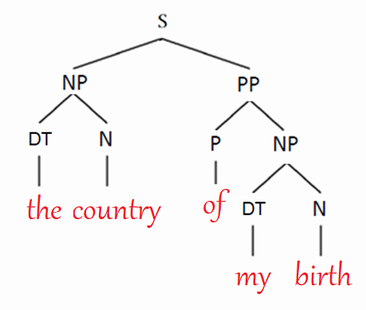
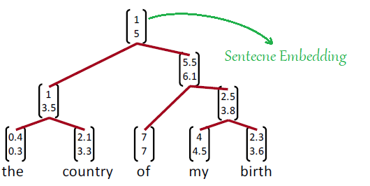
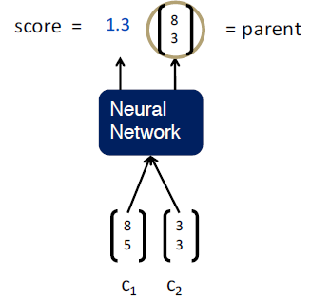
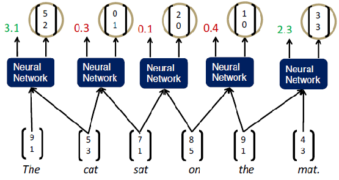
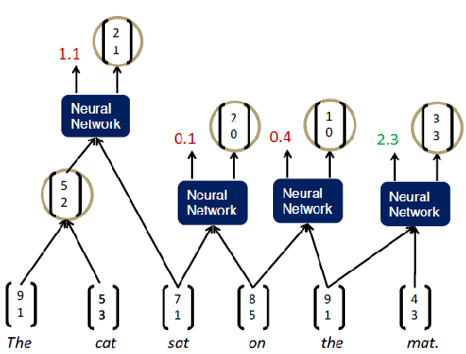
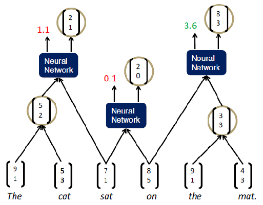
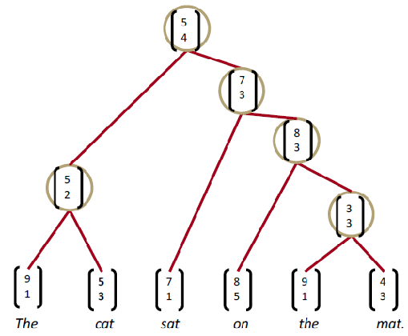

Tree Recursive Neural Network is a model created by Richard Socher et al.
and published in this paper: [Parsing Natural Scenes and Natural Language
with Recursive Neural
Networks](https://www-nlp.stanford.edu/pubs/SocherLinNgManning_ICML2011.pdf).
The main idea behind Tree Recursive Neural Network is to provide a
sentence embedding that could represent the meaning of the sentence the
same way we did with word embedding. So, two sentences that of different
words like "the country of my birth" and "the place where I was born"
will have similar vector despite having totally different words. The
meaning vector of a sentence is determined by actually two things:

-   The meaning of the words forming this sentence.

-   The rules/structure that combined these words.

Back in the old days, we used certain rules determined by linguists to
form a grammatical structure for a given sentence. The algorithm that
forms such a tree is called "CKY" and it was widely used for "parsing"
which is to form a binary tree for a given sentence that describes the
syntactic structure of the given sentence. So, given a sentence like
"the day of my birth", CKY will return a binary tree that looks like
this:

    

But now in Tree Recursive NN, we are going to use word embeddings and
RNN to from a tree of a given sentence. The same sentence will appear
like the following figure. As we can see, it has the same structure as
before but an additional information which is the "sentence embedding".
The embedding vector at the top of the structure is what makes this
model super important:

    

How are we going to calculate these sentence embedding in Tree Recursive
NN? The idea is when we want to build a representation or a larger unit,
we need to take the representation of its children and stick them to some
kind of neural network which will return two things:

    

-   A vector that is going to represent the meaning of the children.

-   The score of how reasonable the new node would be.

Now, we can use this simple neural network to parse a sentence. The
easiest way to do that is to run a greedy parser that is going to look
at what seems best and make decisions of every action and proceed along.
We can start of the sentence "the cat sat on the mat" and we are going
to take each pair of words and calculate the representation of that pair
just like so:

    

Then, we are going to take the pair that score best and merge it into a
constituent. At that point, we could repeat the same step after
considering the new pair as a new word. So, in this example, we can see
that the pair "the cat" has the highest score. Then, we need to combine
it into one constituent and recalculate the word pairs like so:

    

Now, the highest score is "the mat" word pair. So, we are going to
combine them into one constituent and recalculate the word pairs like
so:

    

We keep doing that till we form the Tree Recursive neural network:

    

Recursive NN
------------

As we can see, we will be able to form a recursive tree depending on
this neural network that could combine two word-vectors into one with
additional information which is the score of how plausible this merge
is. Now, let's talk about how to form such a neural network.

### Standard Recursive NN

The simplest way of Neural Network to use here in our Tree Recursive NN
is to form one single weight matrix Tree RNN like so:

    

Which can be represented like so putting in mind that $\begin{bmatrix}
c_{1} \\
c_{2} \\
\end{bmatrix}$ means concatenating the two word-vectors of the two
children $c_{1}$ and $c_{2}$. The weights that we need to learn in this
simple neural network are $W$ and $U$:

$$parent = tanh\left( W\begin{bmatrix}
c_{1} \\
c_{2} \\
\end{bmatrix} + b \right),score = U^{T}\text{.parent}$$

But this simple representation has a few problems:

-   This simple single matrix could capture some phenomena but not
    adequate for complex, higher order composition and long sentences.

-   There is no interaction between the input words.

-   The composition function $tanh\left( W\begin{bmatrix}
    c_{1} \\
    c_{2} \\
    \end{bmatrix} + b \right)$ is the same for all syntactic categories.
    So, we have just one weight matrix and it doesn't matter if we are
    putting (adjective and a noun) or (a verb and an object) or even (a
    word and a period). For all these cases, we are using the same
    weight matrix $W$.

### CVG

CVG or Compositional Vector Grammars is another way to make a better and
faster Recursive NN. The idea behind this method is to combine the
Probabilistic Context Free Grammar (PCFG) with the Tree Recursive NN.

TO BE CONTINUED

Max-Margin Loss Function
------------------------

Here, we will discuss a popular error metric known as the maximum margin
objective. The idea behind using this objective is to ensure that the
score computed for \"true\" labeled data points is higher than the score
computed for \"false\" labeled data points.

For example, we want the score computed for the \"true\" sentence
\"Museums in Paris are amazing\" as s and the score computed for the
\"false\" labeled window \"Not all museums in Paris\" as S~c~
(subscripted as c to signify that the window is \"corrupt\"). Then, our
objective function would be to maximize (S − S~c~) or to minimize (S~c~
− S):

However, the above optimization objective is risky in the sense that it
does not attempt to create a margin of safety. We would want the
\"true\" labeled data point to score higher than the \"false\" labeled
data point by some positive margin Δ. In other words, we would want
error to be:

$$Loss = max\left( \Delta + S_{c} - S,0 \right)$$

What we want to do is to find the best Tree which has the highest score,
and we are kind of approximated this by getting the best constituent at
every particular point in a time. So, the final thing is to set a loss
function that we need to optimize. The loss function we are going to use
here is called the "max-margin loss function":

$$s\left( x,y \right) = \sum_{n \in nodes\left( y \right)}^{}s_{n}$$

$$J = \sum_{i}^{}{s\left( x_{i},y_{i} \right)} - \max_{y \in A\left( x_{i} \right)}\left( s\left( x_{i},y \right) + \Delta\left( y,y_{i} \right) \right)$$

Where, $x$ is a sentence, $y$ is a parse tree, $A\left( x \right)$ is a
structure search for the best tree. We have used the greedy search, but
a good substitute would be a beam search. The loss
$\Delta\left( y,y_{i} \right)$ penalizes all incorrect decisions.
