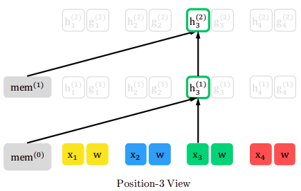
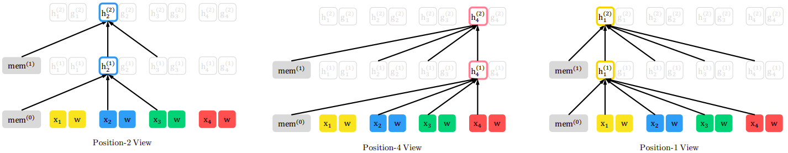
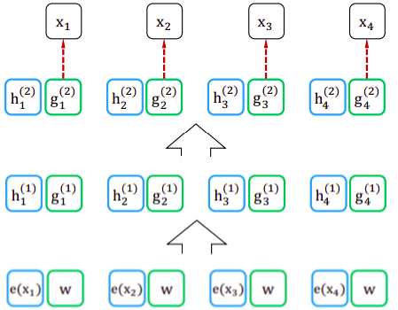
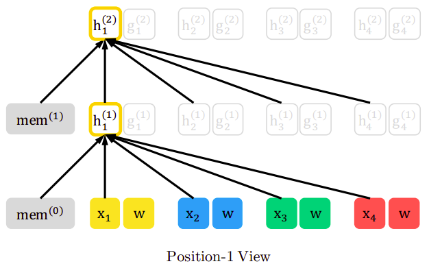
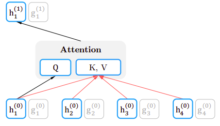
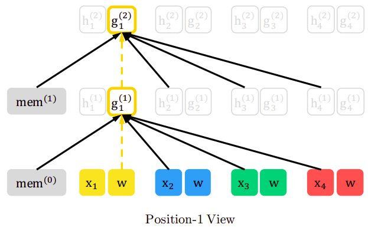
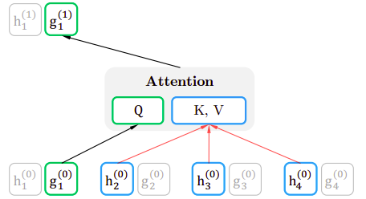

XLNet stands for "Extra-Long Net" which is a model that integrates both
GPT and BERT introduced in 2019 by Google Brain and published in this
paper: "[XLNet: Generalized Autoregressive Pretraining for Language
Understanding](https://arxiv.org/pdf/1906.08237.pdf)" by the same
authors of Transformer-XL. The official code for this paper can be found in
the following GitHub repository: [xlnet](https://github.com/zihangdai/xlnet).

In Transformer-XL, they extended the context-dependency length by
introducing the segment-level recurrence mechanism which uses the hidden
state of the former segments when predicting the current segment. In
this paper, they are trying to make the model uses the hidden state of
the former and following segments when predicting the current segment.

And that explains the meaning of the paper's name. An auto-regressive
language model is is a language model that is able to predict the next
possible word based on the before-context or predict the previous word
based on the after-context. And it's generalized because it considers
both; the before-context and the after-context. The way to do that as
proposed by the paper is by using "Permutation Language Modeling".

PLM
---

PLM stands for "Permutation Language Modeling" which is the idea of
capturing bidirectional context by training an auto-regressive model on
all possible permutation of words in a sentence. Instead of a fixed
left-right or a right-left modeling, XLNET maximizes expected log
likelihood over all possible permutations of the sequence which means
that each position will learn to utilize contextual information from all
positions thereby capturing bidirectional context.

This mechanism is better than "MLM (Masked Language Modeling)" used with
BERT. And that's because MLM corrupts the input with masks which affects
real life applications since we do not have inputs that are masked.
Also, MLM ignores the relation between masked tokens. For example, let's
consider this sentence: "She met \[mask\] and \[mask\] friends. So, if
the first *\[mask\]* is "*Adam*", then the second *\[mask\]* has to be
"*his*". And this will change when the first *\[mask\]* is "*Sara*" for
example.

So, consider a sequence
$x = \left[ "This",\ "is",\ "a",\ "sentence" \right]$ with $T = 4$
tokens. Now consider the set of all $4!$ permutations
$Z = \left\\{ z_{1},\ z_{2},\ ...z_{4!} \right\\} =
\{\lbrack 1,\ 2,\ 3,\ 4\rbrack,\ \lbrack 1,\ 2,\ 4,\ 3\rbrack,.\ .\ .,\ \lbrack 4,\ 3,\ 2,\ 1\rbrack\}$.

The XLNet model calculates the probability of token $x_{t}$ given
preceding tokens $x_{< t}$ from any order which makes the objective
function as follows:

$$\max_{\theta}\left( \mathbb{E}_{z\sim Z_{T}}\left\lbrack \sum_{t = 1}^{T}{\log\left( p_{\theta}\left( x_{z_{t}} \middle| x_{z_{< t}} \right) \right)} \right\rbrack \right)$$

So, if $t = 3$ and the current permutation is
$z = \lbrack 3,\ 2,\ 4,\ 1\rbrack$, it means XLNet will consider zero
words $x_{z_{< t}} = \lbrack\rbrack$ when predicting the probability of
the third word which corresponds to
$p_{\theta}\left( "a" \middle| \varnothing \right)$. While if the
current permutation is $z = \lbrack 2,\ 4,\ 3,\ 1\rbrack$, it means
XLNet will consider the second and the fourth words
$x_{z_{< t}} = \lbrack 2,\ 4\rbrack$ when predicting the probability of
the third word which corresponds to
$p_{\theta}\left( "a" \middle| "is",\ "sentence" \right)$.

As you have probably figured out, there is something missing from the
way the model has been presented so far: how does the model know about
word order? The model can compute
$p_{\theta}\left( "This" \middle| "a" \right)$ as well as
$p_{\theta}\left( "This" \middle| "is" \right)$. Ideally it should know
something about the relative position of "This" and "is" and also of
"a". Otherwise it would just think all tokens in the sequence are
equally likely to be next to one-another. And that's what the attention
mask does!

Attention Mask
--------------

The transformer architecture addresses this problem by adding
masking/zeroing the words that are not in the provided context. As a
concrete example, consider the following permutation
$z = \lbrack 3,\ 2,\ 4,\ 1\rbrack$. When calculating the probability of
the $1^{st}$ element in that order, the model has no context as the other
tokens have not yet been seen. So the mask would be
$\lbrack 0,\ 0,\ 0,\ 0\rbrack$ as shown below:

    

For the 2nd element (token 2), the mask is
$\lbrack 0,\ 0,\ 1,\ 0\rbrack$ as its only context is token 3. Following
that logic, the $3^{rd}$ and $4^{th}$ elements (tokens 4 and 1) have masks
$\lbrack 0,\ 1,\ 1,\ 0\rbrack$ and $\lbrack 0,\ 1,\ 1,\ 1\rbrack$
respectively as shown in the following figures:

    

Another way to look at this is that the training objective will contain
the following terms in case of the $z = \lbrack 3,\ 2,\ 4,\ 1\rbrack$
permutation; where underscores represent what has been masked:

$$p_{\theta}\left( "a" \middle| \_\_,\ \_\_,\ \_\_,\ \_\_ \right)$$

$$p_{\theta}\left( "is" \middle| \_\_,\ \_\_,\ "a",\ \_\_ \right)$$

$$p_{\theta}\left( "sentence" \middle| \_\_,\ "is",\ "a",\ \_\_ \right)$$

$$p_{\theta}\left( "This" \middle| \_\_,\ "is",\ "a",\ "sentence" \right)$$

But wait a minute! There remains one oversight to address: As you can
see, the probability of "sentence" in $4^{th}$ position the previous
permutation should be different than when "sentence" is in the $1^{st}
position. In other words, we need to use the current word position when
calculating the probability; like so:

$$p_{\theta}\left( "sentence" \middle| \_\_,\ "is",\ "a",\ 4 \right)$$

And this paper deals with problem by providing a "two-stream" self
attention mechanism.

Two-stream Self-Attention
-------------------------

The solution to this problem is a two-stream self-attention mechanism;
where the standard self-attention is divided into two parts or streams:

-   **Content Stream:** The content stream (denoted by $h$) cares about
    the context of the preceding tokens including the current token,
    in other words the "content'.

-   **Query Stream:** The query stream (denoted by $g$) cares about the
    context of the preceding tokens including the position of the
    current token.

The following figure shows just two layers of this two-stream self-attention:

    

### Content Stream

The content vector of a token at position $i$ and at self-attention
layer $m$ is denoted by $h_{i}^{m}$. All content stream vectors are
initialized with token embeddings. It's calculated according to the
following formula:

$$p_{\theta}\left( x \middle| x_{z_{< t}} \right) = \frac{\exp\left( {e(x)}^{T}.h_{\theta}\left( x_{z_{< t}} \right) \right)}{\sum_{x'}^{}{\exp\left( {e(x')}^{T} \right).h_{\theta}\left( x_{z_{< t}} \right)}}$$

Where:

-   $x$: is the current token at position $t$ in the current permutation$z$.

-   $e(x)$: is the word embedding of the current token.

-   $x_{z_{< t}}$: is the preceding tokens to the current one.

-   $h_{\theta}\left( x_{z_{< t}} \right)$: denotes the hidden
    representation of $x_{z_{< t}}$ produced by the shared Transformer
    network after proper masking.

Considering the $z = \lbrack 3,\ 2,\ 4,\ 1\rbrack$ permutation, at each
layer, the content vector $h_{i}$ is updated using the other context
vectors that remained unmasked and <u><strong>itself</strong></u>. Thus, $h_{1}$ is
updated with the knowledge of $x_{3}$, $x_{2}$ , $x_{4}$ and $x_{1}$ as
shown in the following figure:

    

And the following figure shows that all content vectors are contributing
in calculating the key-value pair in the attention mechanism, while the
current content vector is used for the query vector of the attention
mechanism.

    

> **Note:**\
The content stream is the same as the standard self-attention found in
the vanilla transformer architecture.

### Query Stream

The query vector of a token at position $i$ and at self-attention layer
$m$ is denoted by $g_{i}^{m}$. All query stream vectors are initialized
with a generic embedding vector $w$ added to positional embeddings. Note
that $w$ is the same no matter the token. It's calculated according to
the following formula:

$$p_{\theta}\left( x \middle| x_{z_{< t}} \right) = \frac{\exp\left( {e(x)}^{T}.g_{\theta}\left( x_{z_{< t}},\ z_{t} \right) \right)}{\sum_{x'}^{}{\exp\left( {e(x')}^{T} \right).g_{\theta}\left( x_{z_{< t}},\ z_{t} \right)}}$$

Where:

-   $x$: is the current token at position $t$ in the current permutation $z$.

-   $e(x)$: is the word embedding of the current token.

-   $x_{z_{< t}}$: is the preceding tokens to the current one.

-   $g_{\theta}\left( x_{z_{< t}},\ z_{t} \right)$: denotes the hidden
    representation of $x_{z_{< t}}$ produced by the shared Transformer
    network after proper masking which additionally take the target
    position $z_{t}$ as input.

Considering the same permutation in the content stream
$z = \lbrack 3,\ 2,\ 4,\ 1\rbrack$, at each layer, the query
vector $g_{i}$ is updated using the other context vectors that remained
unmasked and <u><strong>itself</strong></u>. Thus, $h_{1}$ is updated with the
knowledge of $x_{3}$, $x_{2}$ , $x_{4}$ and $w_{1}$ without considering
$x_{1}$ as shown in the following figure:

    

And the following figure shows that all content vectors (except the
current one) are contributing in calculating the key-value pair in the
attention mechanism, while the current query vector is used for the
query vector of the attention mechanism.

    

