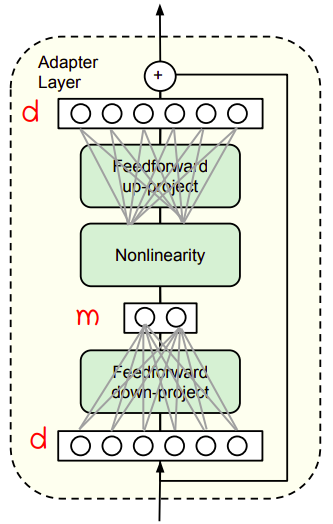

At the current moment, the norm in NLP involves downloading and
fine-tuning pre-trained models consisting of hundreds of millions, or
even billions of parameters. Modifying these models, no matter how
simple the modification is, requires re-training the whole model. And
re-training these huge models is expensive, slow, and time-consuming,
which impedes the progress in NLP. Adapters are one way to fix this
problem.

Adapters, proposed in this paper: [Parameter-efficient transfer learning
for NLP](https://arxiv.org/pdf/1902.00751.pdf) by Google Research in
20019, are small learned bottleneck layers inserted within each layer of
a pre-trained models to avoid full fine-tuning of the entire model. To
demonstrate adapter's effectiveness, researchers in the paper have
transferred BERT model to 26 diverse text classification tasks achieving
near state-of-the-art performance. The official code for this paper can
be found in Google's research official GitHub repository:
[adapter-bert](https://github.com/google-research/adapter-bert).

    

Adapter Tuning
--------------

Adapter Tuning is considered a new technique for transfer learning.
Before that, There are two common transfer learning techniques in NLP:

-   <u><strong>Feature-based Transfer Learning</strong></u>:\
    It involves pre-training real-valued embeddings vectors. These
    embeddings may be at the word, sentence, or paragraph level. The
    embeddings are then fed to custom downstream models.

-   <u><strong>Fine-tuning</strong></u>:\
    Fine-tuning involves copying the weights from a pre-trained network
    and tuning them on the downstream task. Recent work shows that
    fine-tuning often enjoys better performance than feature-based
    transfer.

Now, let's get into adapter tuning. Consider a function (neural network) with
parameters $\phi_{w}\left( x \right)$, adapter tuning defines a new function
$\phi_{w,v}\left( x \right)$ where $v$ is anew set of parameters. The initial
value of the parameters $v_{0}$ is set such that the new function resembles
the original $\phi_{w,v_{0}}\left( x \right) \approx \phi_{w}\left( x \right)$.
During training, the $w$ parameters are frozen and only $v$ is tuned.

The following figure shows the transformer layer on the left and how we are
going to set the adapter tuning to it on the right. As we can see, <u><strong>the
adapter is always applied directly to the output of the sub-layer, after the
feed-forward and before adding the skip connection back</strong></u>:

    

To sum up, adapter tuning is a transfer learning technique that attains neat to
state-of-the-art performance. During adapter tuning, we only train the adapter
layers unlike fine-tuning where we train some of the layers, usually the top
ones. The following figure shows the trade-off between accuracy and number
parameters, for adapter tuning and fine-tuning. The y-axis represents the
performance normalized in comparison with full fine-tuning on nine tasks from
the GLUE benchmark.

    

> **Note:**\
During inference, the adapter modules may be ignored if not
required. That is possible because they have near-identity
initialization with the parameters in the original neural network.

    

Adapter Layer
-------------

Here, we are going to describe the design of the adapter layer. The
adapter layer first projects the original d-dimensional features into a
smaller dimension $m$, apply a non-linearity, then project back to $d$
dimensions. The adapter module itself has a skip-connection internally.

The bottleneck dimension, $m$, is the only hyper-parameter which
provides a simple means to tradeoff performance with number of added
parameters. In practice, they use around $0.5:8\%$ of the parameters of
the original model.

The total number of parameters added per layer, including biases, is
$md + m$ in the feed-forward down-project and $md + d$ in the
feed-forward up-project. So, the total is:

$$2md + d + m$$
