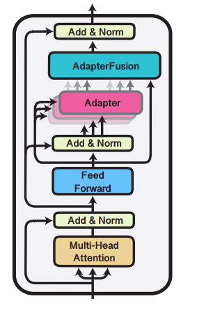
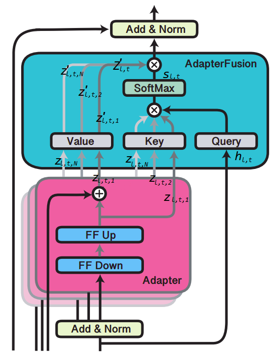

AdapterFusion is a new variant of the Adapter layers where it extends
the functionality of adapters to be multi-tasking instead of being per a
single task. AdapterFusion is proposed by researchers in UKP Lab,
Technical University of Darmstadt and New York University and
published in their paper: [AdapterFusion: Non-Destructive Task
Composition for Transfer Learning](https://arxiv.org/pdf/2005.00247.pdf)
in May 2020.

AdapterFusion is a novel two stage learning algorithm that shares knowledge
across multiple tasks while avoiding catastrophic forgetting. The AdapterFusion
architecture, illustrated in the following figure, has two components:

-   **Adapter:** trained on a task

-   **AdapterFusion layer:** combines the representations from several
    adapters in order to improve the performance on the target task.

    

Task Definition
---------------

Given a single-task model that is pre-trained on a task with training
data $D_{0}$ and a loss function $L_{0}$, the weights $\Theta_{0}$ of
this model are learned as follows:

$$\Theta_{0} = \underset{\Theta}{\arg\min}{L_{0}\left( D_{0};\Theta \right)}$$

Given a multi-task model that is pre-trained on a set of $N$ tasks
having labeled data of varying sizes and different loss functions
$C = \left\\{ \left( D_{1},L_{1} \right),\ ...\left( D_{N},L_{N} \right) \right\\}$,
the aim of the model is to leverage the set of $N$ tasks and learn a
shared representation $\Theta_{0 \rightarrow \left\\{ 1,\ ...N \right\\}}$
that will enable the model to generalize better on each task; this is
usually obtained by starting with an initial parameters $\Theta_{0}$ and
fine-tune on tasks $\left\\{ 1,\ ...N \right\\}$:

$$\Theta_{0 \rightarrow \left\{ 1,\ ...N \right\}} = \underset{\Theta}{\arg\min}\left( \sum_{n = 1}^{N}{L_{n}\left( D_{n};\Theta_{0} \right)} \right)$$

In AdapterFusion, the aim is to be able to leverage a set of $N$ tasks
to improve on a target task $m$ with
$C_{m} = \left( D_{m},L_{m} \right)$ where
$m \in \left\\{ 1,\ ...N \right\\}$. This is done in two stags:

-   <u><strong>Knowledge Extraction:</strong></u>\
    We train different adapters for each of the *N* tasks obtaining:

$$\left\{ \Phi_{1},\ ...,\ \Phi_{N} \right\}$$

-   <u><strong>Knowledge Composition:</strong></u>\
    We combine the set of $N$ adapters using AdapterFusion Layer while
    fixing both the model parameters $\Theta$ as well as all adapters
    $\Phi$ obtaining parameters $\Psi$ that learn to combine the $N$
    task adapters to solve the target task
    $C_{m} = \left( D_{m},L_{m} \right)$:

$$\Psi_{m} = \underset{\Psi}{\arg\min}{L_{m}\left( D_{m};\Theta,\ \Phi_{1},\ ...\Phi_{N},\ \Psi \right)}$$

> **Note:**\
The training dataset of the target task $m$ is used twice: once for
training the adapters $\Phi_{m}$ and again for training Fusion
parameters $\Psi_{m}$ which learns to compose the information stored in
the $N$ task adapters.

AdapterFusion Layer
-------------------

As discussed earlier, AdapterFusion learns to compose the $N$ task adapters
$\left\\{ \Phi_{1},\ ...,\ \Phi_{N} \right\\}$ and the shared pre-trained
model $\Theta$, by introducing a new set of weights $\Psi$. As
illustrated in the following figure, they defined the AdapterFusion
parameters $\Psi$ to consist of Key, Value and Query matrices at each
layer $l$, denoted by $K_{l}$ , $V_{l}$ and $Q_{l}$ respectively.

    

At each layer $l$ of the transformer and each time-step $t$, the output
of the feed-forward sub-layer of layer $l$ is taken as the query vector.
The output of each adapter $z_{l,t}$ is used as input to both the value
and key transformations. Similar to the attention mechanism, we learn a
contextual activation of each adapter $n$ using the following formula
where $n \in \left\\{ 1,\ ...N \right\\}$ , $\bigotimes$ represents dot
product, $\left\lbrack .,. \right\rbrack$ indicates the concatenation of
vectors, and $z^{T}$ is the transpose of $z$:

$$s_{l,t} = \text{softmax}\left( h_{l,t}^{T}Q_{l}\ \bigotimes\ z_{l,t,n}^{T}K_{l} \right)$$

$${z'}_{l,t,n} = z_{l,t,n}^{T}V_{l}$$

$${Z'}_{l,t} = \left\lbrack {z'}_{l,t,0},\ ...{z'}_{l,t,N} \right\rbrack$$

$$o_{l,t} = s_{l,t}^{T}{Z'}_{l,t}$$
