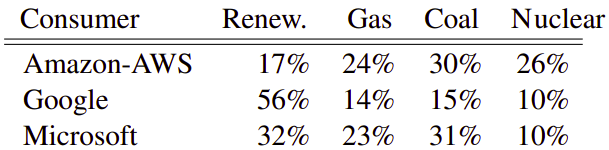
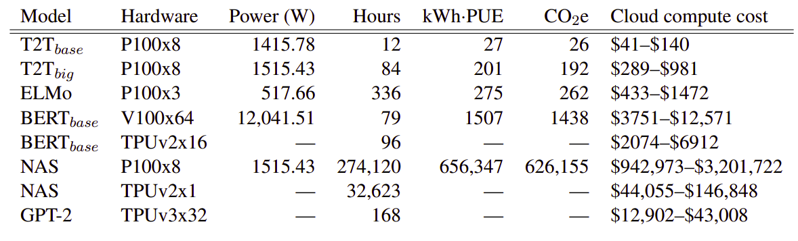

Recent progress in hardware and methodology for training neural networks
has ushered in a new generation of large networks. These models have
obtained notable gains in accuracy across many NLP tasks. However, these
accuracy improvements depend on the availability of exceptionally large
computational resources that necessitate similarly substantial energy
consumption. As a result, these models are costly to train both
financially and environmentally.

This paper: [Energy and Policy Considerations for Deep Learning in
NLP](https://aclanthology.org/P19-1355.pdf), published in 2019 by the
University of Massachusetts Amherst, is explaining that these big models
are costly environmentally due to the carbon footprint required to
generate electricity as it's the main source of electricity in the top
three cloud service providers according to the following table:

    

To heighten the awareness of the NLP community to this issue,
researchers of this paper have characterized the dollar cost and carbon
emissions that result from training popular off-the-shelf NLP models.
They have done that by estimating the kilowatts of electrical energy
generated to power the required hardware which can be calculated via the
following formula:

$$p_{t} = \frac{1.58t\left( p_{c} + p_{r} + gp_{g} \right)}{1000}$$

Where:

-   $p_{t}$: total power consumption (in watts).

-   $p_{c}$: the average power draw (in watts) from all CPU sockets
    during training.

-   $p_{r}$: the average power draw from all DRAM (main memory) sockets
    during training.

-   $p_{g}$: the average power draw of one GPU during training. For $g$
    GPUs, the average power draw will be $gp_{g}$.

-   $1.58t$: the Power Usage Effectiveness (PUE), which accounts for the
    additional energy required to support the compute infrastructure
    (mainly cooling). In 2018 (one year before the publish date of this
    paper), the global average PUE for data centers was 1.58 per hour.

-   $\frac{1}{1000}$: to convert the power to kilo watt.

According to EPA (Environmental Protection Agency) in 2018, each one kilowatt
produces 0.95 pound of CO~2~. Then, the average CO~2~emissions will be:

$$Co_{2}e = 0.95\ p_{t}$$

In the paper, they analyzed five different models as shown in the
following table. These four models were BERT, ELMO, standard Transformer
(T2T), Evolved Transformer (NAS), and finally GPT-2. The following table
shows the estimated cost of training a model in terms of CO~2~ emissions
(lbs) and cloud compute cost (USD) according to the previous equations:

    

Based on the previous table and knowing that an air travel from New York
to San Francisco emits around 1984 lbs of CO~2~, we can clearly see that
training BERT~base~ for around 90 hours will have the same effect. And
don't get me started on the fact that training NAS on 8 Tesla P100 GPUs
emits the same CO~2~ as approximately 315 flights from New York to San
Francisco.

You can use this tool:
[experiment-impact-tracker](https://github.com/Breakend/experiment-impact-tracker)
to track energy usage, carbon emissions, and compute utilization of your
system.
