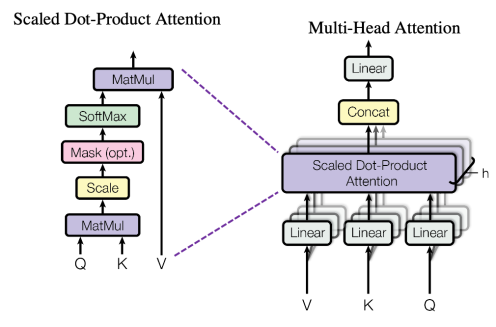
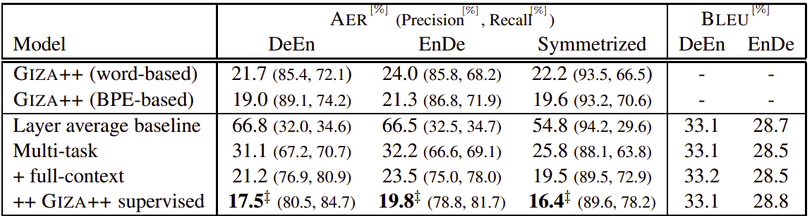

In this part, we are going to take a deep look into this paper: [Jointly
Learning to Align and Translate with Transformer
Models](https://arxiv.org/pdf/1909.02074.pdf) which was published by
Apple Inc. in 2019. The official code for this paper can be found in the
official Fairseq GitHub repository:
[fairseq/joint_alignment_translation](https://github.com/pytorch/fairseq/tree/master/examples/joint_alignment_translation).

Since translation and alignment tasks are very closely related, the
publishers of this paper presented an approach to train a Transformer
model to produce both accurate translations and alignments. The
alignments are extracted from the attention probabilities learned during
training. This approach produced competitive results compared to other
statistical alignment tools such as GIZA++ without sacrificing
translation accuracy.

Attention Matrix
----------------

    

In this part, we are going to recap how the encoder-decoder multi-head
attention sub-layer works and how the attention matrix is represented.
Let $d_{\text{emb}},\ d_{k},\ d_{v},\ H$ denote the embedding dimension,
dimensions of the key and value projections and number of heads,
respectively.

The multi-head attention between a source sentence of $M$ tokens and a
target sentence of $N$ tokens is calculated via the following equation:

$$\text{MultiHead}\left( Q,\ K,\ V \right) = Concat\left( A_{1},\ ...\ A_{H} \right)W^{O}$$

$$A_{i} = Attention\left( QW_{i}^{Q},\ KW_{i}^{K},\ VW_{i}^{V} \right) = \text{softmax}\left( \frac{QW_{i}^{Q}\left( KW_{i}^{K} \right)^{T}}{\sqrt{d_{k}}} \right)VW_{i}^{V}$$

Where:

-   $A_{i} \in \mathbb{R}^{M \times N}$ is the Attention matrix of the
    $i^{th}$ head out of $H$ heads.

-   $W_{i}^{Q} \in \mathbb{R}^{d_{\text{emb}} \times d_{k}},\ W_{i}^{K} \in \mathbb{R}^{d_{\text{emb}} \times d_{k}},\ W_{i}^{V} \in \mathbb{R}^{d_{\text{emb}} \times d_{v}},\ W^{O} \in \mathbb{R}^{Nd_{v} \times d_{\text{emb}}}$
    are projections matrices of the $i^{th}$ head. All of them are learned
    parameters.

    Each alignment matrix $A_{i}$ gives a probability distribution over
    source/target pair. This distribution is then converted to a
    discrete alignment by aligning each target word to the corresponding
    source word with the highest attention probability.

Layer Average Baseline
----------------------

As we can see from the previous sections, there are multiple heads and
multiple layers in the transformer architecture. Which alignment should
be considered the correct alignment of the input pair?

In the paper, they found out that the best results come from
**averaging all attention heads of the second-to-last layer** out
of the six decoder layers they used. They refer to this as "the layer
average baseline".

Multi-task Learning
-------------------

Multi-task learning is a subfield of machine learning in which multiple
learning tasks are solved at the same time, while exploiting
commonalities and differences across tasks. In this paper, the
publishers exploited the correlation between Translation and Alignment
tasks to create a multi-objective loss function $\mathcal{L}$:

$$\mathcal{L} = \mathcal{L}_{t} + \lambda\mathcal{L}_{a}\left( A \right)$$

Where:

-   $\lambda$ is a hyper-parameters to weigh the importance of these two
    loss functions.

-  $\mathcal{L}_{t}$ is the translation loss function given a source sentence $s = \left[ s_{1}\text{...}s_{M} \right]$ and a target sentence $t = \left[ t_{1}\text{...}t_{N} \right]$:

$$\mathcal{L}_{t} = - \frac{1}{N}\sum_{i = 1}^{N}{\log\left( p\left( t_{i} \middle| s,\ t_{< i} \right) \right)}$$

-   $\mathcal{L}_{a}$ is the alignment loss:

$$\mathcal{L}_{a}\left( A \right) = - \frac{1}{N}\sum_{i = 1}^{N}{\sum_{j = 1}^{M}G_{i,j}^{p}\text{.}\log\left( A_{i,j} \right)}$$

The alignment loss is calculated in a supervised manner using the
layer-average baseline as the true alignment. First, they converted the
true alignments into a probability distribution. Let $G_{N \times M}$
denote a 0-1 matrix such that $G_{i,j} = 1$ if the $j^{th}$ source token is
aligned to the $i^{th}$ target token. Then, they normalized the rows of $G$
to get matrix $G^{p}$.

Calculating the translation loss $\mathcal{L}_{t}$ needs a masked target
while calculating the alignment loss $\mathcal{L}_{a}$ needs the target
without masking. That's why the loss function is implemented by
executing two forward passes of the decoder model: One with the masking
of the future target tokens for computing the translation loss
$\mathcal{L}_{t}$ and the other one with no masking for computing the
alignment loss $\mathcal{L}_{a}$.

Results
-------

To achieve state-of-the-art results, they change to the big transformer
configuration with an embedding size of 1024 and 16 attention heads, 6
layers in the encoder and decoder. The total number of parameters is
213M. They trained the transformer with a batch size of 7168 tokens on
64 Volta GPUs for 30k updates and apply a learning rate of $1e^{-3}$,
$\beta_{1} = 0.9$, $\beta_{2} = 0.98$. The dropout probability is set to
$0.3$.

As we can see from this table, the multi-task learning with full context
(knowing of all target words) and with alignment generated from GIZA++
toolkit achieved the least AER while maintaining the translation BLEU
score on two different language-pairs.

    

