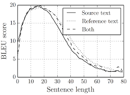
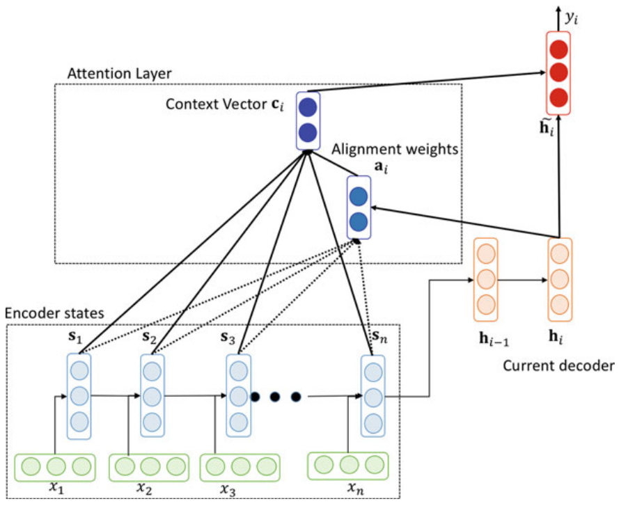
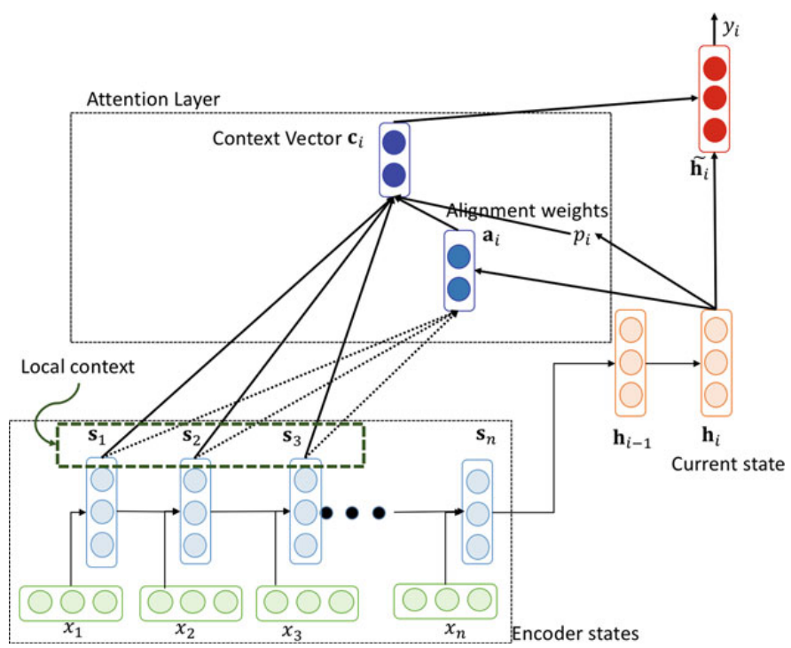
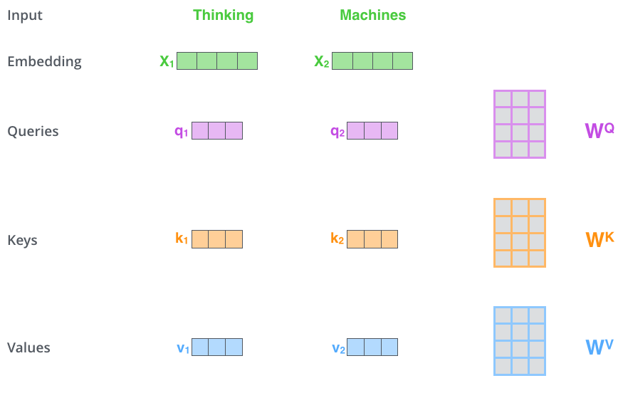
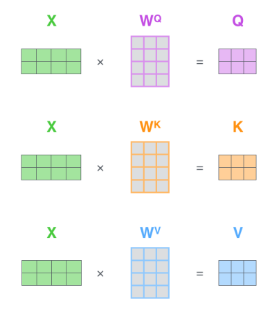
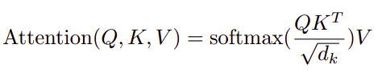
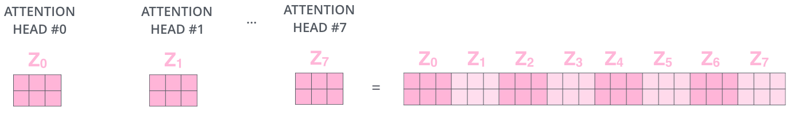
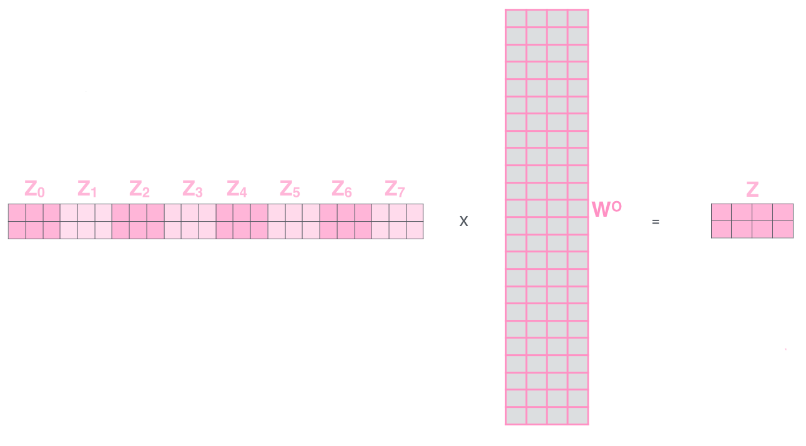

A potential issue with the Seq2Seq approach is that a neural network
needs to be able to compress all the necessary information of a source
sentence into a fixed-length vector (context vector). This may make it
difficult for the neural network to cope with long sentences, especially
those that are longer than the sentences in the training corpus. This
paper: "[On the Properties of Neural Machine Translation:
Encoder--Decoder Approaches](https://arxiv.org/pdf/1409.1259.pdf)"
showed that indeed the performance of a basic encoder--decoder
deteriorates rapidly as the length of an input sentence increases.

    

What we can see from the previous graph is that it works quite well for
short sentences, so we might achieve a relatively high BLEU score; but
for very long sentences, maybe longer than 30 or 40 words, the
performance comes down.

In order to address this issue, this paper "[Neural Machine Translation
by Jointly Learning to Align and
Translate](https://arxiv.org/pdf/1409.0473.pdf)" introduced an extension
to the encoder--decoder model called "Attention mechanism" in 2014. The
most important distinguishing feature of this approach from the basic
encoder--decoder is that it does not attempt to encode a whole input
sentence into a single fixed-length vector. Instead, it encodes the
input sentence into a sequence of vectors and chooses a subset of these
vectors adaptively while decoding the translation. This frees a neural
translation model from having to squash all the information of a source
sentence, regardless of its length, into a fixed-length vector. We show
this allows a model to cope better with long sentences.

Here, we\'ll see the Attention Model which translates maybe a bit more
like humans. The way a human translator would translate a sentence is
not to first read the whole sentence and then memorize it and then
regurgitate an English sentence from scratch. Instead, a human
translator reads the first part of the given sentence, maybe generate
part of the translation. Look at the second part, generate a few more,
and so on. We kind of work part by part through the sentence, because
it\'s just really difficult to memorize the whole long sentence like
that.

In the following parts, we will talk about the different variants of
attention mechanisms that have been used in the field so far.

Global Soft Attention
---------------------

As we said earlier, the attention mechanism was first introduced by
**Dzmitry Bahdanau**, **KyungHyun Cho** and **Yoshua Bengio** in 2014
and published in this paper: "[Neural Machine Translation by Jointly
Learning to Align and Translate](https://arxiv.org/pdf/1409.0473.pdf)"
under the name "Neural Machine Translation By Jointly Learning To Align
And Translate" which later defined as a global, soft attention. Here, we
are going to explain the attention mechanism in more details as
explained in this paper: "[Effective Approaches to Attention-based
Neural Machine Translation](https://arxiv.org/pdf/1508.04025.pdf)" looks
pretty similar to the one mentioned earlier.

To explain how the attention mechanism works, let's consider that we
have the following:

-   The source sequence which is of length $n$ given by $x = \left[ x_{1},...x_{n} \right]$.

-   The target sequence which is of length $m$ given by $y = \left[ y_{1},...y_{m} \right]$.

-   Encoder hidden states $s = \left[ s_{1},...s_{n} \right]$.

-   Decoder hidden states $y = \left[ h_{1},...h_{m} \right]$.

Now, the attention mechanism works as shown in the following figure:

    

Whose steps goes like the following:

-   First, we calculate the alignment score by using the <u> <strong>attention score function</strong> </u>
defined as $\text{score}$ between the $j^{th}$
encoder hidden state $s_{j}$ and the $i^{th}$ decoder hidden state $h_{i}$.

$$a_{i,j} = \text{softmax}\left( \text{score}\left( h_{i},\ s_{j} \right) \right)$$

In the next part, we are going to see the different variants of the
$\text{score}$ function.

-   Next, the context vector $c_{i}$ at position $i$ can be calculated as the
weighted average of previous encoder hidden states and alignment vector $a_{i,j}$.

$$c_{i} = \sum_{j = 0}^{n}{a_{i,\ j}\text{.}s_{j}}$$

-   The source side context vector $c_{i}$ and the hidden state $h_{i}$ are
concatenated $\left\lbrack c_{i}\ ;\ h_{i} \right\rbrack$ and the non-linear
$\tanh$ activation function is applied to give the <u><strong>attention hidden vector</strong></u> 
 $\widetilde{h}_i$  where $W_{c}$ weights are learned in the training process:

$${\widetilde{h}}_{i} = \tanh\left( W_{c}.\left\lbrack c_{i}\ ;\ h_{i} \right\rbrack \right)$$

-   The attention hidden vector ${\widetilde{h}}_{i}$ is passed through a
$\text{softmax}$ function to generate the probability distribution given by the
following formula where $W_{s}$ weights are learned in the training process:

$$P\left( y_{i} \middle| y_{< i},\ x \right) = \text{softmax}\left( W_{s}.{\widetilde{h}}_{i} \right)$$

### Score Functions

In this part, we are going to enumerate the different score functions
$\text{score}\left( h_{i},\ s_{j} \right)$ used in different papers
which gives different flavors of the attention mechanism where:

-   $s_{j}$: is the $j^{th}$ hidden state in the encoder architecture.

-   $h_{i}$: is the $i^{th}$ hidden state in the decoder architecture.

-   $n$: is the number of tokens in the encoder.

<table>
    <thead>
        <tr>
            <th>Name</th>
            <th>Function</th>
            <th>Parameters</th>
            <th>Reference</th>
        </tr>
    </thead>
    <tr>
        <td>Concat (additive)</td>
        <td>$$v_{a}^T.tanh\left( W_{a}\left\lbrack s_{j};h_{i} \right\rbrack \right)$$</td>
        <td>$$W_{a}$$</td>
        <td><a href="https://arxiv.org/pdf/1508.04025.pdf">Luong et al.</a></td>
    </tr>
    <tr>
        <td>Linear (additive)</td>
        <td>$$v_{a}^{T}.\tanh\left( W_{a}s_{j} + U_{a}h_{i} \right)$$</td>
        <td>$$W_{a},\ U_{a}$$</td>
        <td><a href="https://arxiv.org/pdf/1409.0473.pdf">Bahdanau et al.</a></td>
    </tr>
    <tr>
        <td>Bilinear (multiplicative)</td>
        <td>$$h_{i}^{T}.W_{a}.s_{j}$$</td>
        <td>$$W_{a}$$</td>
        <td><a href="https://arxiv.org/pdf/1508.04025.pdf">Luong et al.</a></td>
    </tr>
    <tr>
        <td>Dot (multiplicative)</td>
        <td>$$h_{i}^{T}.s_{j}$$</td>
        <td>-</td>
        <td><a href="https://arxiv.org/pdf/1508.04025.pdf">Luong et al.</a></td>
    </tr>
    <tr>
        <td>Scaled dot (multiplicative)</td>
        <td>$$\frac{1}{\sqrt{n}}\left( h_{i}^{T}.s_{j} \right)$$</td>
        <td>-</td>
        <td><a href="https://arxiv.org/pdf/1706.03762.pdf">Vaswani et al.</a></td>
    </tr>
    <tr>
        <td>Location-based</td>
        <td>$$\text{softmax}\left( W_{a}.h_{i}^{T} \right)$$</td>
        <td>$$W_{a}$$</td>
        <td><a href="https://arxiv.org/pdf/1508.04025.pdf">Luong et al.</a></td>
    </tr>
</table>

**Notes:**

-   The multiplicative and additive score functions generally give similar results.

-   The multiplicative score functions are faster in both computation and
space-efficiency since it is using efficient matrix multiplication techniques.

-   The additive score function performs much better when the input dimension is large.

Soft Vs. Hard Attention
-----------------------

The only difference between them is that hard attention picks one of the
encoder hidden states $s = \left[ s_{1},\ ...\ s_{n} \right]$ rather
than a weighted average over all the inputs as in the soft attention
does. The hard attention is given by:

$$c_{i} = \underset{a_{i,j}}{\arg\max}\left\{ s_{1},s_{2},...s_{n} \right\}$$

While the soft attention is given by:

$$a_{i,j} = \text{softmax}\left( \text{score}\left( h_{i},\ s_{j} \right) \right)$$

$$c_{i} = \sum_{j = 0}^{n}{a_{i,\ j}\text{.}s_{j}}$$

Global Vs. Local Attention
--------------------------

The global attention, discussed before, is called "global" because each
decoder hidden state takes $h_{i}$ into consideration "all" of the
encoder hidden states $s = \left[ s_{1},...s_{n} \right]$ while
computing the context vector $c_{i}$. This can be both computationally
expensive and many times impractical when the source length $n$ is
large.

Luong et al. in their paper: "[Effective Approaches to Attention-based
Neural Machine Translation](https://arxiv.org/pdf/1508.04025.pdf)"
introduced the local attention which considers a small window of size
$D$ of the encoder hidden states
$s = \left[ s_{p_{i} - D},...s_{p_{i} + D} \right]$ when computing the
context vector $c_{i}$ instead of all the hidden states.

    

Whose steps goes like the following:

-   First, the model <u><strong>predicts</strong></u> an aligned position $p_{i}$ for
    each target word in the decoder at time $i$ using the following formula:

$$p_{i} = n.\text{sigmoid}\left( v_{p}^{T}.\tanh\left( W_{p}.h_{i} \right) \right)$$

Where $W_{p}$ and $v_{p}$ are the model parameters to be learned to
predict the position and $n$ is the length of the source sequence and.
And $p_{i}$ is a number within $\lbrack 0,n\rbrack$.

-   Next, the alignment score is going to be calculated for each position $s$
    in the predefined window as before. However, to favor alignment points near
    $p_{i}$, we place a Gaussian distribution centered around $p_{i}$ and with
    standard deviation $\sigma = \frac{D}{2}$. Now, our alignment weights are\
    defined as:

$$a_{i,j} = \text{softmax}\left( \text{score}\left( h_{i},\ s_{j} \right) \right)\exp\left( - \frac{\left( s - p_{i} \right)^{2}}{2\sigma^{2}} \right)$$

-   Then, the context vector $c_{i}$ is then derived as a weighted average over
    the set of source hidden states within the window
    $\left\lbrack p_{i} - D,p_{i} + D \right\rbrack$ where $D$ is the window size.

$$c_{i} = \sum_{j = p_{i} - D}^{p_{i} + D}{a_{i,\ j}\text{.}s_{j}}$$

Key-Value Attention
-------------------

Key-value attention is first created by [Daniluk et
al.](https://arxiv.org/pdf/1702.04521.pdf) in 2017 which is another
variant of attention mechanism which splits the encoder hidden layers
into key-value pairs where the keys are used for attention distribution
and the values for context representation.

    

Now, if the attention mechanism is **self-attention**, then we will
create another vector called the "query vector". And if the attention
mechanism is not self-attention, then the query vector will be created
at the decoder network.

The Key-value attention mechanism can be calculated by following these
steps:

-   Create three vectors from word-embedding vectors. So for each word,
    we create a **Query vector**, a **Key vector**, and a **Value
    vector**. These vectors are created by multiplying the embedding by
    three matrices that can be learned.

    

We can do that using broadcasting which could make things faster like so:

    

-   Then, we apply the attention mechanism which can be summarized in
    this equation:

    

So, the calculations will look like so:

    

### Multi-head Attention

A multi-headed attention mechanism only means that we need to perform
the same attention calculation we outlined above just multiple times
with different weight matrices. By doing that, we end up with multiple
different Z matrices. So, we need to concatenate them together to get
one big matrix as shown below:

-   concatenate them together to get one big matrix as shown below:

    

-   Finally, we need to multiply this big matrix with a weight matrix
    that was trained jointly with the model to get a matrix that
    captures information from all attention heads.

    

Hierarchical Attention
----------------------

This type of architecture was proposed by Yang et al. in his paper:
[Hierarchical Attention Networks for Document
Classification](https://www.cs.cmu.edu/~./hovy/papers/16HLT-hierarchical-attention-networks.pdf)
published in 2016. So, it's an attention mechanism on the sentence
level.

\[YOU CAN READ MORE IN THE REFERENCE BOOK STARTING FROM PAGE 418 .\]
