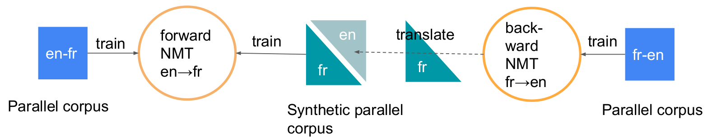
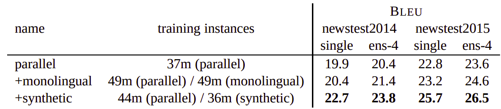
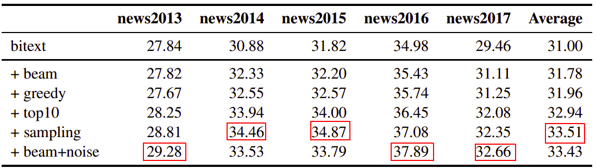
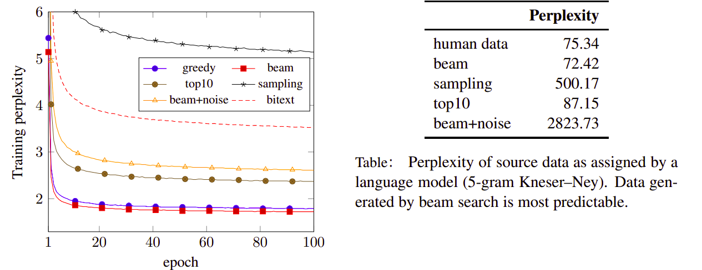

Back-translation is a semi-supervised mechanism proposed in this paper:
"[Improving Neural Machine Translation Models with Monolingual
Data](https://arxiv.org/pdf/1511.06709.pdf)" by the Rico Sennrich and
the University of Edinburgh in 2016 that uses a reverse translation
system make the best use out of target-side monolingual data.

Back-translation operates in a semi-supervised setup where both
bilingual and monolingual data in the target language are available.
Using "English-French" data as a use-case where the source is
<u><strong>English</strong></u> and the target is <u><strong>French</strong></u>,
the back-translation process can be summarized into the following steps:

-   We have "en-fr" parallel corpus that can be used to train NMT model,
    let's call it "Forward NMT en→fr".

-   We can reverse this data to get "fr-en" parallel corpus which can be
    used to train NMT model, let's call it "Backward NMT en→fr".

-   We have a corpus of just "French" data.

-   We will use the "Backward NMT en→fr" to translate this French data
    to English which will get us a "<u><strong>synthetic en-fr parallel
    corpus</strong></u>". To be able to get the best synthetic data possible,
    the paper uses beam search.

-   Then, we are going to mix the original "en-fr" data with the
    synthetic one to further train the "forward NMT en→fr" model.

    

You could either leave it at that (hopefully better than just the
original model), or you can extend it to <u><strong>dual learning</strong></u>
where you have to find some monolingual source language data and
translate it with the forward model to further train the backward
model (back-translation for the backward model). With this
strengthened backwards model, you can probably generate better
back-translations for the forward model, and train that one further
and so on.

**Notes:**

-   You can iteratively train both models forever, but that only makes sense if
you have monolingual source data as well, and it usually stops improving after
a two rounds or so.

-   In the paper, they were using the encoder-decoder architecture. However,
this technique can be used with any other NMT architecture.

-   As discussed in the paper, back-translation delays overfitting in NMT
models especially for small datasets.

-   Usually, back-translation outperforms deep fusion.

In the paper, they tried another method to use monolingual target
data hoping it will be better than the previous one. They treated
the monolingual target data as parallel examples with empty source
side. Which means that the decoder has to depend only on the
previously generated word when generating the translation. Also,
they froze the layers of the encoder.

The following are the different results obtained by each method on
English -\> German parallel corpus where:

-   <u><strong>parallel</strong></u>: means using just the NMT model

-   <u><strong>monolingual</strong></u>: means using the NMT model with
monolingual data where the source source sentence is empty.

-   <u><strong>synthetic</strong></u>: means using the NMT model with
monolingual data where the source sentence is translated using a backward NMT
model.

    

Generating Synthetic Data
-------------------------

Back-translation typically uses beam search to generate synthetic source
sentences. However, beam search can lead to less rich translations since
it focuses on the head of the model distribution which results in very
regular synthetic source sentences that do not properly cover the true
data distribution. In this paper: "[Understanding Back-Translation at
Scale](https://arxiv.org/pdf/1808.09381.pdf)", published by Facebook AI
and Google Brain in 2018, they advised that adding noise to the beam
search actually improves the generated synthetic data which improves the
translation model's performance.

In particular, we transform source sentences with three types of noise:

-   Deleting words with probability 0.1.

-   Replacing words by a filler token with probability 0.1.

-   Uniformly swapping words no further than three positions apart.

And this simple change outperforms all other sampling techniques
such as greedy search, beam search (beam size = 5), top-k sampling
(k = 10), and randomly sampling. The following table contains the
BLEU score of the same back-translation NMT model with different
synthetic data generation methods:

    

And the following table shows the perplexity of the generated
synthetic data

And the following table, they analyzed the richness of generated
synthetic outputs and train a language model on real human text and
score synthetic source sentences generated by the different methods
mentioned above:

    

The results show that beam+noise method receives the highest
perplexity which indicates that beam search outputs are not as rich
as sampling outputs or beam+noise. This lack of variability probably
explains in part why back-translations from pure beam search provide
a weaker training signal than alternatives.
