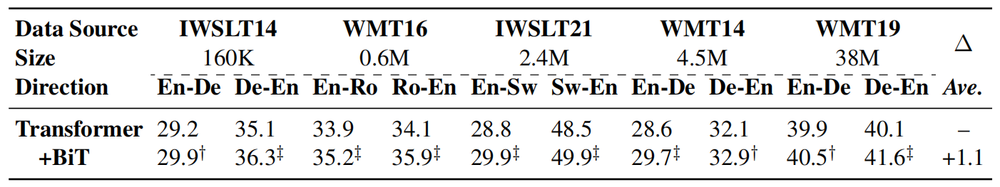

BiT stands for "Bidirectional Training" which is a simple and effective
pre-training strategy for neural machine translation. BiT was proposed
by The University of Sydney in collaboration with Peking University and
JD Explore Academy in 2021 and published in this paper: [Improving
Neural Machine Translation by Bidirectional
Training](https://arxiv.org/pdf/2109.07780.pdf).

The motivation behind this strategy is that when human learn foreign
languages, knowing both directions $x_{i} \rightarrow y_{i}$ and
$y_{i} \rightarrow x_{i}$ may help human easily master the bilingual
knowledge. Simply put, they proposed using a system trained on
bi-directional data as an initialization for a unidirectional system.

Specifically, they proposed pre-training NMT models using bilingual data
created by reconstructing the training samples from
($\overrightarrow{B}:\ \text{source} \rightarrow \text{target}$) to
($\overset{\overleftrightarrow{}}{B}:source + target \rightarrow target + source$)",
where the training data was doubled as shown in the following formula:

$$\overset{\overleftrightarrow{}}{B} = \left\{ \left( x_{i},\ y_{i} \right) \cup \left( y_{i},\ x_{i} \right) \right\}_{i = 1}^{N}$$

Where the pre-training objective is:

$$\overset{\overleftrightarrow{}}{\mathcal{L}}\left( \theta \right) = \overrightarrow{\mathcal{L}}\left( \theta \right) + \overleftarrow{\mathcal{L}}\left( \theta \right)$$

$$\overset{\overleftrightarrow{}}{\mathcal{L}}\left( \theta \right) = \underset{\theta}{\arg\max}\left( \log\left( p\left( y \middle| x;\theta \right) \right) \right) + \underset{\theta}{\arg\max}\left( \log\left( p\left( x \middle| y;\theta \right) \right) \right)$$

Pre-training lasts for 1/3 of the total training steps and fine-tuning
is performs on the required direction $\overrightarrow{B}$ with the rest
of 2/3 training steps.

Experiments
-----------

In this paper, they tried five translation datasets whose data sizes
range from 160K to 38M sentence-pairs as shown in the following table.
All language pairs were trained on Transformer-BIG except IWSLT14 En↔De
and WMT16 En↔Ro; they were trained on Transformer-BASE because of their
extremely small data size. Also, the performance was measured by
averaging the model's last 10 checkpoints to avoid stochasticity.

    

The previous table show that BiT achieves significant improvements over
strong baseline Transformer in 7 out of 10 directions, and the rest of 3
directions also show promising performance. This demonstrates the
effectiveness and universality of BiT.

To dispel the doubt that BiT works also on distant language pairs, they
trained two models on Zh↔En and Ja→En language pairs. The following
table shows that BiT significantly and incrementally improves the
translation quality in all cases.

    

