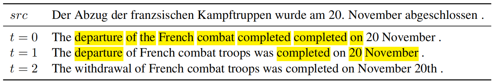
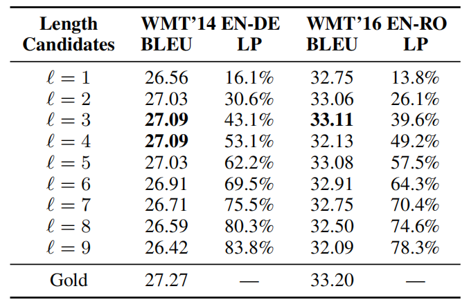
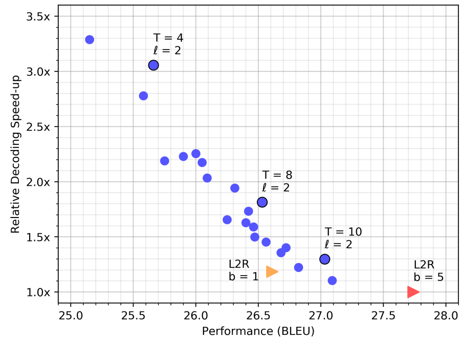
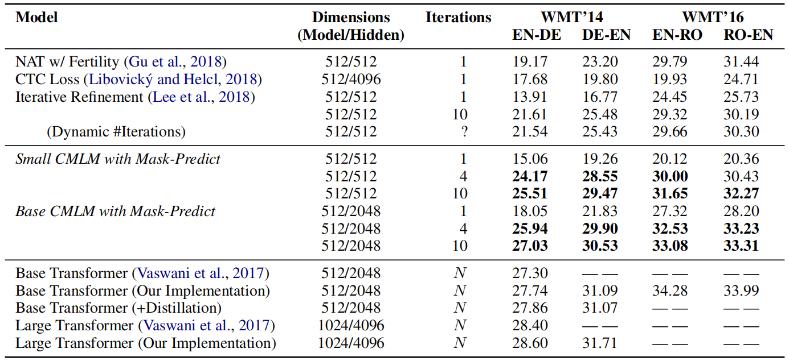
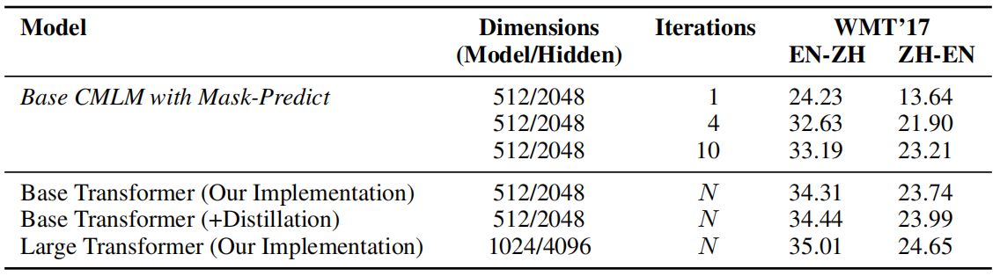
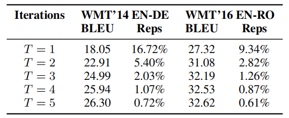
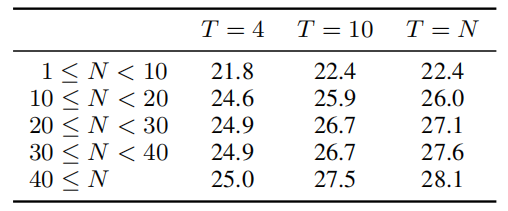
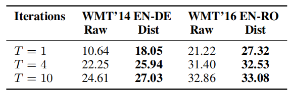

CMLM stands for "Conditional Masked Language Modeling" Transformer which
is an encoder-decoder Transformer architecture trained with a masked
language modeling (MLM) training objective and uses "masked-predict"
algorithm for decoding. This model was proposed by FAIR in 2019 and
published in their paper: [Mask-Predict: Parallel Decoding of
Conditional Masked Language
Models](https://arxiv.org/pdf/2009.14794.pdf). The official code for
this paper can be found on Facebook Research's official GitHub
repository:
[facebookresearch/Mask-Predict](https://github.com/facebookresearch/Mask-Predict).

Unlike most machine translation systems which generate translations
autoregressively from left to right, the CMLM Transformer uses a
non-autoregressive decoding algorithm called "masked-predict" that
iteratively decodes in linear time. CMLM Transformer is the same as the
[standard Transformer](https://anwarvic.github.io/machine-translation/Transformer)
with one change in the decoder; the masking of the self-attention in the
decoder was removed to make the decoder attend to both left and right
contexts when generating the output translation.

CMLM Training
-------------

A conditional masked language modeling (CMLM) predicts a set of target
tokens $Y_{\text{mask}}$ given a source text $X$ and part of the target
text $Y_{\text{obs}}$. It makes the strong assumption that the tokens
$Y_{\text{mask}}$ are conditionally independent of each other (given $X$
and $Y_{\text{obs}}$). During training, CMLM is done as follows:

-   A number of tokens that should be masked is chosen randomly from a
    uniform distribution between one and the sequence's length.

-   Then, that number of tokens get masked $Y_{\text{mask}}$. Following
    [BERT](https://anwarvic.github.io/language-modeling/BERT), masking
    is done by replacing the token with a special
    $\left\lbrack \text{MASK} \right\rbrack$ token.

-   CMLM is optimized using cross-entropy loss over every token in
    $Y_{\text{mask}}$. This can be done in parallel, since the model
    assumes that the tokens in $Y_{\text{mask}}$ are conditionally
    independent of each other.

In traditional left-to-right machine translation, where the target
length is determined by the generation of the special end of sentence
token $\left\lbrack \text{EOS} \right\rbrack$. However, for CMLMs to
predict the entire sequence in parallel, they must know its length in
advance. Here, they added a special
$\left\lbrack \text{LENGTH} \right\rbrack$ token to the encoder and then
train the model to predict the length of the target sequence. Its loss
is added to the cross-entropy loss.

Mask-Predict Decoding
---------------------

Mask-predict is a new highly-parallel decoding algorithm that predicts
any subset of the target words conditioned on the input text $X$ and a
partially masked target translation $Y_{\text{mask}}$. Decoding starts
with a completely masked target text, then the model predicts all of the
words in parallel, then repeatedly masks out and regenerates the subset
of words that the model is least confident about depending on the other
high-confidence predictions. After a few cycles, the model starts to
produce high-quality translations.

More formally; given the target sequence's length N, we define two
variables: the target sequence $\left( y_{1},\ ...y_{N} \right)$ and the
probability of each token $\left( p_{1},\ ...p_{N} \right)$. The
algorithm runs for a predetermined number of iterations $T$, which is
either a constant or a simple function of $N$. At each iteration, we
perform a mask operation, followed by predict.

-   <u><strong>Mask:</strong></u>\
    For the first iteration ($t = 0$), we mask all the tokens. For later
    iterations, we mask the $n$ tokens with the lowest probability
    scores. The number of masked tokens $n$ is a function of the
    iteration $t$; usually a linear decay $n = N.\frac{T - t}{T}$. For
    example, if $T = 10$, $90\%$ of the tokens will be masked at
    $t = 1$. $80\%$ at $t = 2$, and so forth.

$$Y_{\text{mask}}^{\left( t \right)} = \underset{i}{\text{arg }\min}\left( p_{i},\ n \right)$$

$$Y_{\text{obs}}^{\left( t \right)} = Y\backslash Y_{\text{mask}}^{\left( t \right)}$$

-   <u><strong>Predict:</strong></u>\
    After masking, the CMLM predicts the masked tokens
    $Y_{\text{mask}}^{\left( t \right)}$ mask, conditioned on the source
    text $X$ and the unmasked target tokens
    $Y_{\text{obs}}^{\left( t \right)}$. We select the prediction with
    the highest probability for each masked token $y_i ∈ Y(t)$ mask and
    unmask them by update its probability score:

$$y_{i}^{\left( t \right)} = \underset{w}{\text{arg }\text{max}}{P\left( y_{i} = w \middle| X,\ Y_{\text{obs}}^{\left( t \right)} \right)}$$

$$p_{i}^{\left( t \right)} = \underset{w}{\text{max}}{P\left( y_{i} = w \middle| X,\ Y_{\text{obs}}^{\left( t \right)} \right)}$$

The following example is from the WMT'14 German→English validation set
that illustrates how mask-predict generates text. At each iteration, the
highlighted tokens are masked and re-predicted, conditioned on the other
tokens in the sequence.

    

In the first iteration ($t = 0$), the entire target sequence is masked
($Y_{\text{mask}}^{\left( 0 \right)} = Y,\ Y_{\text{obs}}^{\left( 0 \right)} = \varnothing$),
and is thus generated by the CMLM in a purely non-autoregressive
process. This produces an ungrammatical translation with repetitions
("completed completed").

In the second iteration ($t = 1$), 8 of the 12 tokens generated in the
previous step were predicted with the lowest probabilities. That's why
they got masked with the $\left\lbrack \text{MASK} \right\rbrack$ token
and re-predicted while conditioning on the input sequence $X$ and the
four unmasked tokens
$Y_{\text{obs}}^{\left( 0 \right)} = \{``The",\ ``20",\ ``November",\ ``."\}$
which results in a more grammatical and accurate translation.

In the third iteration ($t = 2$), 4 of the 8 tokens generated in the
previous step were predicted with the lowest probabilities. Now that the
model is conditioning on 8 tokens, it is able to produce an more fluent
translation; "withdrawal" is a better fit for describing troop movement,
and "November 20th" is a more common date format in English

> **Notes:**
>
> - In the third iteration ($t = 2$), two of the four masked tokens were
    predicted at the first step ($t = 0$), and not re-predicted at the
    second step ($t = 1$). This is quite common for earlier predictions
    to be masked at later iterations because they were predicted with
    less information and thus tend to have lower probabilities.
>
> - When decoding, they unmask the highest $l$ tokens. This is a
    hyper-parameter that can be seen as the beam size for beam search of
    non-autoregressive decoders. The following table shows an experiment
    of base CMLM with $T = 10$. Surprisingly, more $l$ tokens can
    degrade performance.
>
>   

>   
>   

>
> - The following figure shows the decoding speed of CLML Transformer,
    compared to the standard base transformer on the WMT'14 EN-DE test
    set, with beam sizes $b = 1$ (orange triangle) and $b = 5$ (red
    triangle). Each blue circle represents a mask-predict decoding run
    with a different number of iterations $T = \left\\{ 4,\ ...,\ 10 \right\\}$
    and length candidates $l = \left\\{ 1,\ 2,\ 3 \right\\}$:
>
>   

>   
>   

Experiments
-----------

In this paper, they followed the standard hyper-parameters for
transformers in both small and base configuration:

<table>
    <thead>
        <tr>
            <th></th>
            <th>Layers</th>
            <th>Attention Heads</th>
            <th>Model Dimension</th>
            <th>Hidden Dimension</th>
        </tr>
    </thead>
    <tr>
        <td><strong>Small</strong></td>
        <td>6</td>
        <td>8</td>
        <td>512</td>
        <td>512</td>
    </tr>
    <tr>
        <td><strong>Base</strong></td>
        <td>6</td>
        <td>8</td>
        <td>512</td>
        <td>2048</td>
    </tr>
</table>

They followed the weight initialization scheme from
[BERT](https://anwarvic.github.io/language-modeling/BERT), which samples
weights from $\mathcal{N}\left( 0,\ 0.02 \right)$, initializes biases to
zero, and sets layer normalization parameters to
$\beta = 0,\ \gamma = 1$. For regularization, they used $0.3$ dropout,
$0.01$ L2 weight decay, and smoothed cross validation loss with
$\varepsilon = 0.1$.

They used batches of $128k$ tokens using Adam
optimizer with $\beta = (0.9,\ 0.999)$ and $\varepsilon = 10^{- 6}$. The
learning rate warms up to a peak of $5*10^{- 4}$ within $10,000$ steps,
and then decays with the inverse square-root schedule. All models were
trained for 300k steps, measured the validation loss at the end of each
epoch, and averaged the 5 best checkpoints. During decoding, they used a
beam size of $beam\ size = 5$ for autoregressive decoding, and similarly
use $l = 5$ length candidates for mask-predict decoding.

The following table shows that among the parallel decoding methods, CMLM
Transformer yields the state-of-the-art BLEU scores on WMT'14 EN-DE, in
both directions. Another striking result is that a CMLM with only 4
mask-predict iterations yields higher scores than 10 iterations of the
iterative refinement model:

    

The translations produced by CMLM Transformer also score competitively
when compared to standard transformers. In all 4 benchmarks, CMLM-base
reaches within 0.5-1.2 BLEU points from a well-tuned base transformer, a
relative decrease of less than 4% in translation quality. In many
scenarios, this is an acceptable price to pay for a significant speedup
from parallel decoding.

The following table shows that these trends also hold for
English-Chinese translation, in both directions, despite major
linguistic differences between the two languages:

    

Based on experiments run on EN-DE and EN-RO datasets, they found out
that multiple iterations $T$ is a must to solve the "multi-modality
problem" which means that the model often predict the same word $w$ with
high confidence, but at different positions. As we can see from the
following table, the proportion of repetitive tokens drops drastically
during the first 2-3 iterations:

    

During experiments they noticed that <u><strong>longer sequences need more
iterations</strong></u>; the following table shows that increasing the number
of decoding iterations ($T$) appears to mainly improve the performance
on longer sequences:

    

Having said that, the performance differences across length buckets are
not very large, and it seems that even 4 mask-predict iterations are
enough to produce decent translations for long sequences ($40 \leq N$).

Model Distillation
------------------

Following previous convention on non-autoregressive machine translation
models, they trained CMLM Transformer on translations produced by a
standard transformer model (large for EN-DE and EN-ZH, base for EN-RO).
For a fair comparison, they also trained standard left-to-right base
transformers on translations produced by large transformer models for
EN-DE and EN-ZH, in addition to the standard baselines.

To determine CMLM's dependence on knowledge distillation, they train
models on both raw and distilled data, and compared their performance.
The following table shows that in every case, training with model
distillation substantially outperforms training on raw data:

    

<u><strong>It appears as though CMLMs are heavily dependent on model
distillation.</strong></u>
