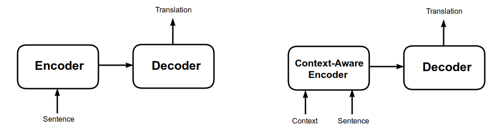
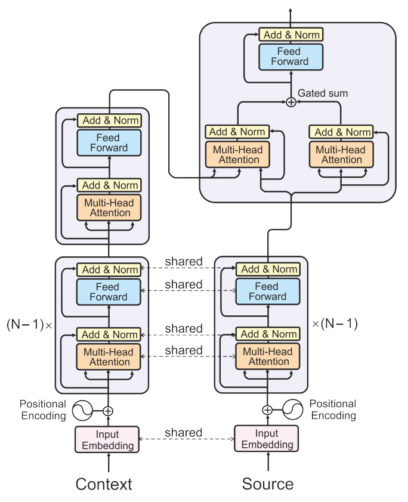
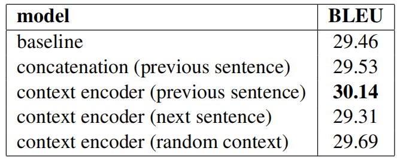
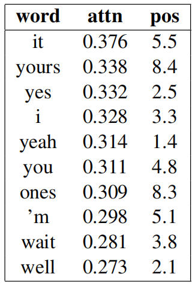

Context-Aware Transformer is a modified version of the
[Transformer](https://anwarvic.github.io/machine-translation/Transformer)
model which is designed to allow the flow of information from the
context to the decoder to provide better and more coherent results.
Context-Aware Transformer was proposed by Yandex, University of
Edinburgh, and University of Amsterdam in 2018 and published in their
paper: [Context-Aware Neural Machine Translation Learns Anaphora
Resolution](https://aclanthology.org/P18-1117.pdf).

> **Note:**\
The paper's name holds the term "anaphora" which is defined as the
"repetition of a word or phrase at the beginning of successive clauses".
We can see Anaphora clear in the words of [Langston
Hughes](https://en.m.wikipedia.org/wiki/Langston_Hughes) in his poem:
[Let America be America
again](https://en.m.wikipedia.org/wiki/Let_America_be_America_Again)
where he said: "<u><strong>I am the</strong></u> farmer, bondsman to the soil. <u><strong>I
am the</strong></u> worker sold to the machine. <u><strong>I am the</strong></u> Negro,
servant to you all...".

Standard [Transformer](https://anwarvic.github.io/machine-translation/Transformer)
encoders process sentences in isolation and ignore context information
that could prevent mistakes and improve translation coherence. On the
other hand, Context-Aware Transformer encoders process sentences along
with their contexts independently, and then a single attention layer, in
a combination with a gating function, is used to produce a context-aware
representation of the source sentence.

The following figure shows a simple comparison between standard
Transformer model and context-aware Transformer. As you can see from the
figure, context-aware encoders take two inputs: the sentence and its
context while the decoder remains unchanged.

    

Context-Aware Encoder
---------------------

As shown in the following figure, the
context-aware encoder consists of three different blocks:

    

-   <u><strong>Source Encoder:</strong></u>\
    The source encoder is composed of a stack of $N$ layers. The first
    $N - 1$ layers are identical and represent the original layers of
    the standard Transformer's encoder while the last layer incorporates
    contextual information.

-   <u><strong>Context Encoder:</strong></u>\
    The context encoder is composed of a stack of $N$ layers. The first
    $N - 1$ layers are identical and represent the original layers of
    the standard Transformer's encoder while the last layer incorporates
    contextual information.

-   <u><strong>Gated Contextual Attention:</strong></u>\
    The output of the source encoder's attention
    $c_{i}^{\left( s\_ attn \right)}$ and the output of the context
    encoder's attention $c_{i}^{\left( c\_ attn \right)}$ are combined
    via a gated sum with a sigmoid function $\sigma$ for non-linearity:

$$g_{i} = \sigma\left( W_{g}\left\lbrack c_{i}^{\left( \text{s\_attn} \right)};\ c_{i}^{\left( \text{c\_attn} \right)} \right\rbrack + b_{g} \right)$$

$$c_{i} = g_{i} \odot c_{i}^{\left( \text{s\_attn} \right)} + \left( 1 - g_{i} \right) \odot c_{i}^{\left( \text{c\_attn} \right)}$$

> **Note:**\
The parameters of the first $N - 1$ layers are shared between both
encoders.

Experiments
-----------

In the paper, they used
[OpenSubtitles2018](http:/opus.nlpl.eu/OpenSubtitles2018.php) corpus for
English and Russian. The data after cleaning was around 2 million
instances for training; and for validation and testing, they randomly
select two subsets of 10000 instances from movies not encountered in
training. The whole data used in this paper is available in the
following [link](t http:/data.statmt.org/acl18_contextnmt_data).

Sentences were encoded using byte-pair encoding with source and target
vocabularies of about 32k tokens. They used the same parameters and
optimizer as in the original Transformer paper.

The following table shows the BLEU score of multiple Transformer models;
the first two are standard Transformer models while the other three are
context-aware. From the table, we can see that the best model is the one
using a context encoder for the previous sentence.

    

In order to verify these results, they evaluated the context encoder
(previous sentence) on the same test set with shuffled context
sentences. And they found out that its performance dropped
significantly. This confirms that the model does rely on context
information to achieve the improvement in translation.

To check the top words depending on the
context, they analyzed the distribution of attention to context for
individual source words in the test set to see for which words the model
depends most on contextual history. Then, they averaged the attention
score and the word position. Then, sorted them according to the
attention score. The following table contains the top-10 words:

    

An interesting finding is that contextual attention is high for the
translation of "it", "yours", "ones", "you" and "I", which are indeed
very ambiguous out-of-context when translating into Russian. Also, the
"yes", "yeah", and "well" are ambiguous since they are used in
sentence-initial position.
