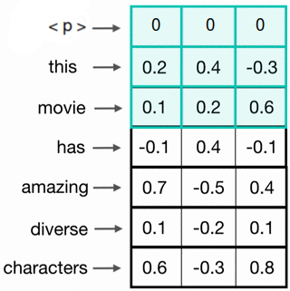
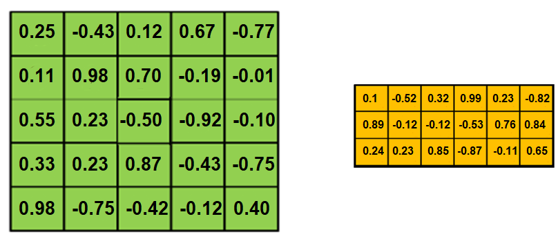
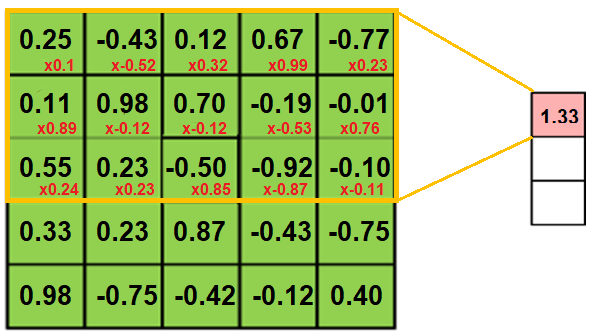
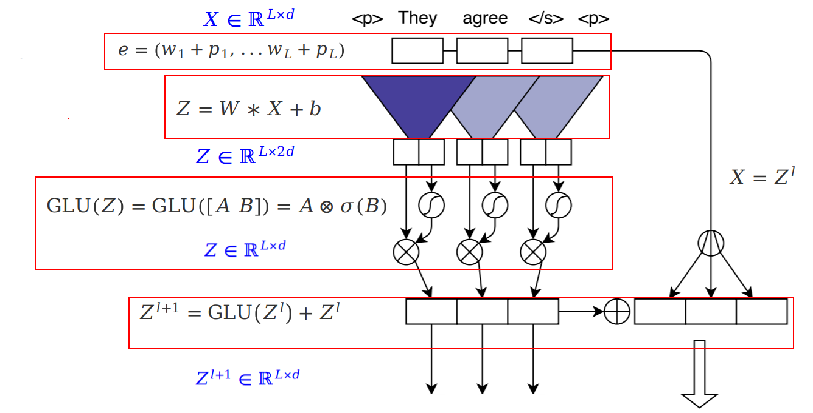
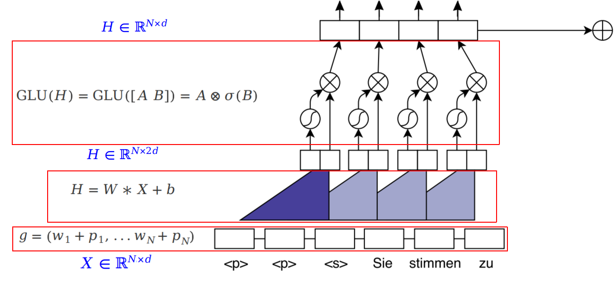
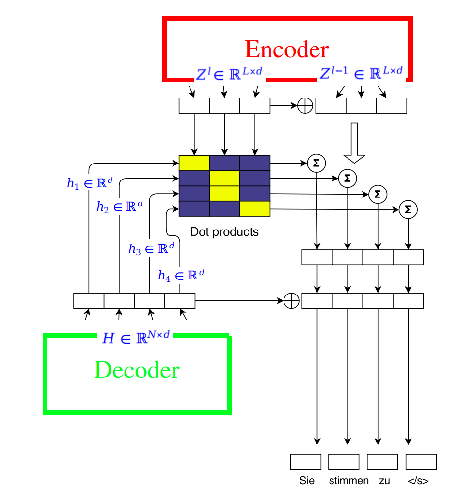

One of the major defects of Seq2Seq models is that it can't process
words in parallel. For a large corpus of text, this increases the time
spent translating the text. CNNs can help us solve this problem. In this
paper: "[Convolutional Sequence to Sequence
Learning](https://arxiv.org/pdf/1705.03122.pdf)", proposed by FAIR
(Facebook AI Research) in 2017. The official repository for this paper
can be found on [fairseq/convs2s](https://github.com/pytorch/fairseq).

In this paper, we can see that ConvS2S outperformed the Attention model
on both WMT'14 English-German and WMT'14 English-French translation
using an entirely-CNN translation model with faster results.

    

The following figure shows the whole ConvS2S architecture created by
Facebook AI Research (FAIR):

    

As we can see, this architecture seems a bit complicated and consists of
many different components that need clarification. So, let's divide this
big architecture into three main components: Encoder, Decoder and
Attention.

Encoder
-------

The encoder component consists of five different steps:

-   **Padding:** The recurrent neural nets process text from
    left-to-right while in CNNs the words that are close together get
    convoluted together. So, if we have a sentence of $L$ words and the
    representative word vector is $d$ features long, then we can
    represent the sentence as a 2D-plane
    $X \in \mathbb{R}^{L \times d}$. And to ensure that the output of
    the convolution layers matches the input length, we apply padding to
    the input at each layer based on the following formula given that
    $k$ is the kernel height (the kernel's width is always the same as
    the input's width):

$$p = \frac{k - 1}{2}$$

Padding is denoted by the \<p\> tag which is usually zero as shown in
the following image:

    

-   **Position Embedding:** Then, we use word-embedding $w$ (of size 512
    in the paper) combined with the absolute position $p$ of the words
    to obtain word-position knowing that the size of $p$ is the same as
    $w$:

$$e = \left( e_{1},\ e_{2},\ ...e_{L} \right) = \left( w_{1} + p_{1},\ w_{2} + p_{2},\ ...w_{L} + p_{L} \right)$$

-   **Convolution:** Now, we have a matrix representing the input
    sentence $X \in \mathbb{R}^{L \times d}$ where $L$ is the length of
    the sentence. Next, we are going to use convolution of $2d$
    different filters, each convolution kernel is a
    $W \in \mathbb{R}^{k \times d}$ where $k$ is the kernel size.
    Performing the convolution will result into a matrix of
    $Z \in \mathbb{R}^{L \times 2d}$.

$$Z = W*X + b$$

In the following example, we are going to use a $3 \times d$ filters
(trigram filters). When we convolve a filter with a sentence, we
multiply its values element-wise with the original matrix, then summing
them up. We keep doing that till we pass through the whole sentence with
a certain number of filters.

    
    

-   **GLU:** After applying convolution, we will have an output of
    $Z \in \mathbb{R}^{L \times 2d}$ over which we are going to apply
    GLU (Gated-Linear Unit). We are going to split $Z$ into two matrices
    $A \in \mathbb{R}^{L \times d}$ and $B \in \mathbb{R}^{L \times d}$.
    Applying GLU means applying the following formula:

$$\text{GLU}\left( Z \right) = GLU\left( \left\lbrack \text{A\ B} \right\rbrack \right) = A \otimes \sigma\left( B \right)$$

Where $\otimes$ is the point-wise multiplication and $\sigma$ is the
sigmoid function. The term $\sigma(B)$ controls which inputs $A$ of the
current context are relevant.

-   **Residual:** To enable deep layers, we add residual connections
    from the input of each convolution layer to the output from GLU
    step.

$$Z^{l + 1} = \text{GLU}\left( Z^{l} \right) + Z^{l}$$

After applying the residual connection, we multiply the sum of the input
and output of a residual block by $\sqrt{0.5}$ to halve the variance of
the sum.

Here is the encoder with input dimensions for reference:

    

Decoder
-------

The decoder is the same as the encoder after removing the <u>**residual
part**</u>:

-   **Padding:** Padding in the decoder is a little bit different than
    the encoding. Here, we pad the input using ($k - 1$) on both sides
    instead of $\frac{k - 1}{2}$ where $k$ is the kernel height:

$$p = k - 1$$

-   **Embedding:** The same as the encoder.

$$g = \left( g_{1},\ g_{2},\ ...g_{N} \right) = \left( w_{1} + p_{1},\ w_{2} + p_{2},\ ...w_{N} + p_{N} \right)$$

-   **Convolution**: The same as the encoder.

$$H = W*X + b$$

-   **GLU**: The same as the encoder.

$$\text{GLU}\left( H \right) = GLU\left( \left\lbrack \text{A\ B} \right\rbrack \right) = A \otimes \sigma\left( B \right)$$

Here is the decoder with input dimensions for reference:

    

Now, we have discussed the encoder and the decoder part of the ConvS2S
architecture. Let's get to the attention mechanism which is used in this
architecture.

Attention
---------

In the following part, we are going to discuss the attention mechanism
used in this architecture. Before getting into this, let's recap a few
terms:

-   The output matrix of the encoder is $Z \in \mathbb{R}^{L \times d}$
    where $L$ is the length of the encoder's input sequence and $d$ is
    the embedding size.

-   The output matrix of the decoder is $H \in \mathbb{R}^{N \times d}$
    where $N$ is the length of the decoder's input sequence.

-   $e = \left( e_{1},\ ...\ e_{L} \right)$ is the element embedding for
    the encoder sequence. While $g = \left( g_{1},\ ...\ g_{N} \right)$
    is the element embedding for the decoder sequence.

To compute the attention, we follow the following steps:

-   First, we combine the the decoder's current state $h_{i}^{l}$ with
    the decoder's embedding embedding $g_{i}$ to get the decoder state
    summary $d_{i}^{l}$:

$$d_{i}^{l} = h_{i}^{l} + g_{i}$$

-   For decoder layer $l$, the attention $a_{\text{ij}}^{l}$ of state
    $i$ and source element $j$ is computed as a dot-product between the
    decoder state summary $d_{i}^{l}$ and each output
    $Z^{u} = \left( z_{1}^{u},\ ...\ z_{L}^{u} \right)$ of the last
    encoder block $u$:

$$a_{i}^{l} = \text{Softmax}\left( Z^{u}.d_{i}^{l} \right) $$

$$ a_{\text{ij}}^{l} = \frac{\exp\left( d_{i}^{l}.z_{j}^{u} \right)}{\sum_{t = 1}^{L}{\exp\left( d_{i}^{l}.z_{t}^{u} \right)}}$$

-   The conditional input $c_{i}^{l}$ to the current decoder layer is a
    weighted sum of the encoder outputs $z_{j}^{u}$ as well as the input
    element embeddings $e_{j}$. The term $L\sqrt{\frac{1}{L}}$ is used
    to scale up the result.

$$c_{i}^{l} = L\sqrt{\frac{1}{L}}\sum_{j = 1}^{L}{a_{\text{ij}}^{l}\left( z_{j}^{u} + e_{j} \right)}$$

The attention mechanism can be summarized in the following image:

    

The problem is that Convolutional Neural Networks do not necessarily
help with the problem of figuring out the problem of dependencies when
translating sentences. That's why Transformers were created, they are a
combination of both CNNs with attention.

Initialization
--------------

The motivation for their initialization is to maintain the variance of
activations throughout the forward and backward passes. The following is
the different initialization for different parts of the architecture:

-   All embeddings are initialized from a normal distribution
    $\mathcal{N}\left( 0,\ 0.1 \right)$.

-   For layers whose output is not directly fed to a gated linear unit,
    they initialized the weights from the normal distribution
    $\mathcal{N}\left( 0,\ \sqrt{\frac{1}{n_{l}}} \right)$ where $n_{l}$
    is the number of input connections to each neuron at layer $l$.

-   For layers which are followed by a GLU activation, they initialized
    the weights from the normal distribution
    $\mathcal{N}\left( 0,\ \sqrt{\frac{4}{n_{l}}} \right)$.

-   They applied dropout to the input of some layers so that inputs are
    retained with a probability of $p$.

-   Biases are uniformly set to zero when the network is constructed.
